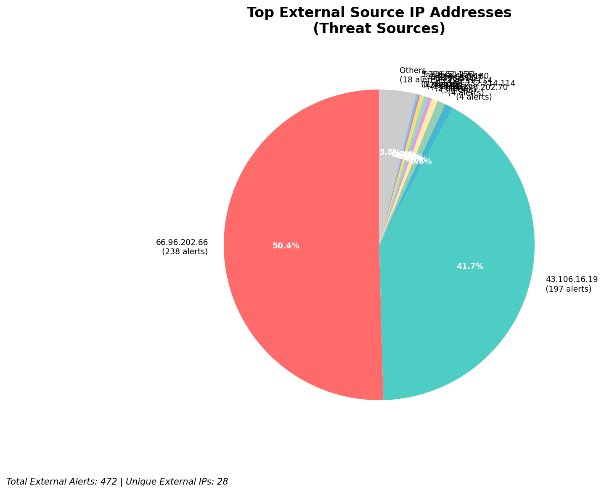
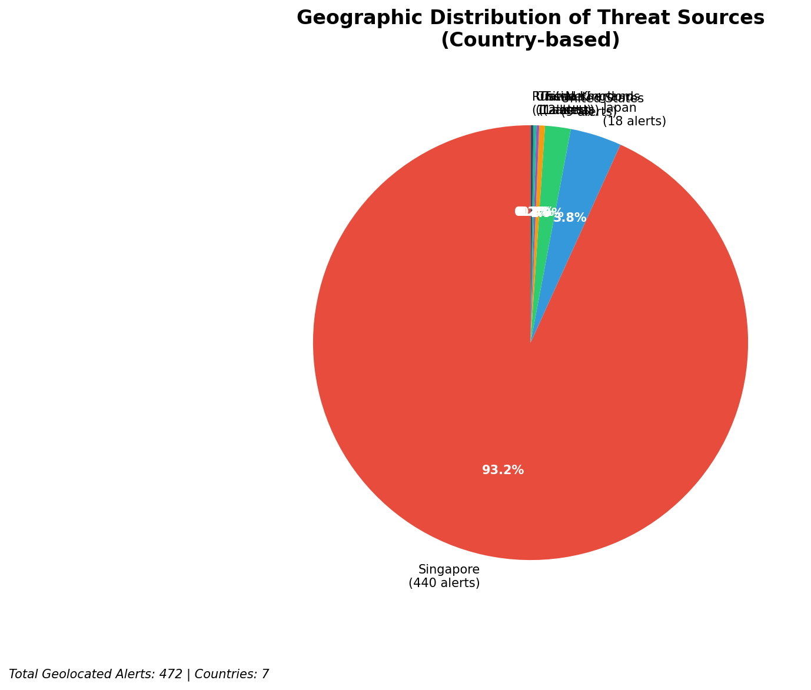
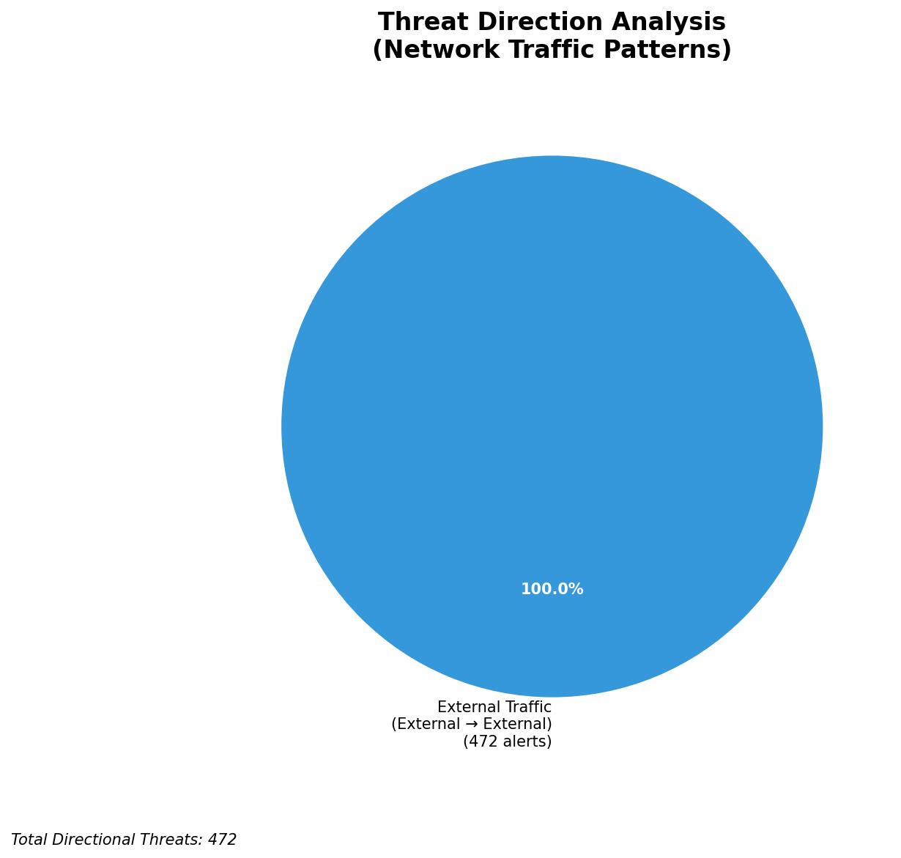
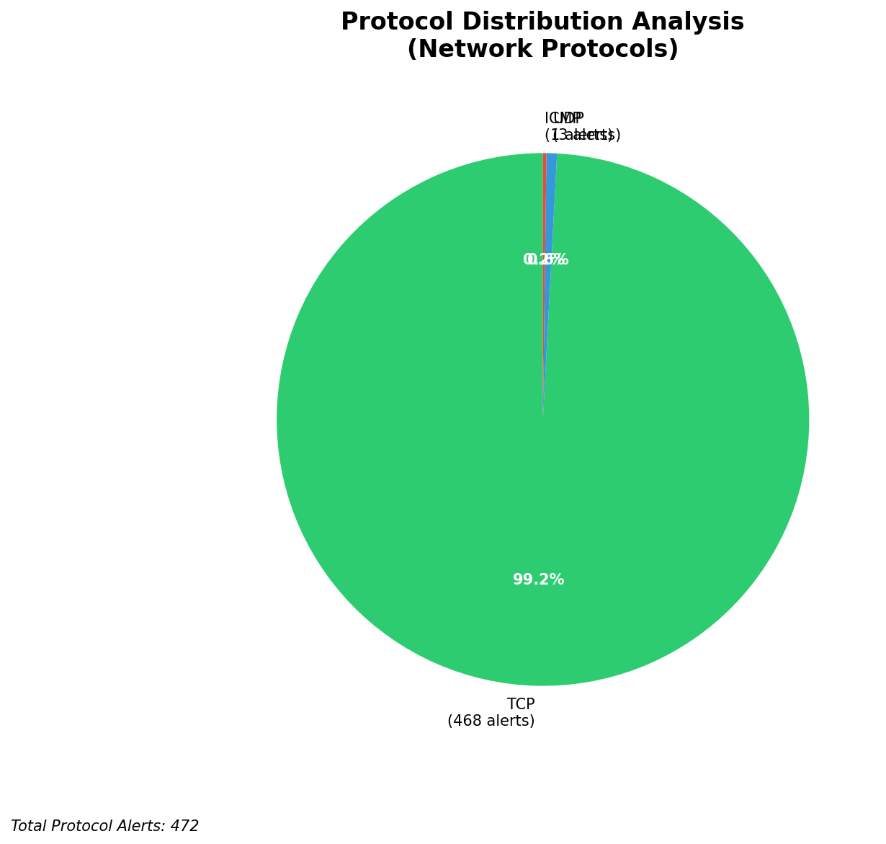

# HIGH-SEVERITY INCIDENT REPORT

    Auto-Generated: 2025-11-14 20:40:39  
    Trigger: 163 HIGH severity alerts detected (Level >= 8)  
    Critical Alerts (>8): 8  
    Total Alerts Analyzed: 1000  
    Server: 100.78.175.127  
    RAG Strategy: Custom Docs Only  
    Response Priority: IMMEDIATE  

    Triggered High Severity Alerts
    1. 🔥 Level 10 - HIGH: Suricata Severity 1 Alert - POSSBL SCAN SHELL M-SPLOIT TCP (2025-11-14T10:36:47.247+0000)
2. 🔥 Level 10 - HIGH: Suricata Severity 1 Alert - POSSBL SCAN SHELL M-SPLOIT TCP (2025-11-14T10:36:51.383+0000)
3. 🔥 Level 10 - HIGH: Suricata Severity 1 Alert - POSSBL SCAN SHELL M-SPLOIT TCP (2025-11-14T10:46:35.724+0000)
4. ⚡ Level 8 - MEDIUM: Suricata Severity 2 Alert - POSSBL PORT SCAN (NMAP -sS) (2025-11-14T11:27:17.352+0000)
5. ⚡ Level 8 - MEDIUM: Suricata Severity 2 Alert - POSSBL SCAN FRAG (NMAP -f) (2025-11-14T11:27:29.397+0000)
   ... and 158 more HIGH severity alerts

---

**Executive Summary:**  
A high-severity intrusion attempt is underway, characterized by repeated TCP-based shell exploit scan activity targeting multiple internal IP addresses. All eight high-severity alerts (level 10) originate from external sources and are consistent with automated scanning for remote code execution vulnerabilities. The attacks are directed at internal systems (129.126.144.226–229, 66.96.202.67–70), suggesting reconnaissance for potential exploitation. No evidence of lateral movement, outbound C2, or infrastructure involvement was detected. The pattern indicates a coordinated scanning campaign likely from botnet or automated exploit frameworks. Immediate containment and network segmentation are required to prevent exploitation.  

**Key Findings:**  
- 8 critical-level alerts (severity 10) detected within a 2-hour window.  
- All alerts triggered by "POSSBL SCAN SHELL M-SPLOIT TCP" signature—indicative of vulnerability scanning for shell command execution.  
- Scanning sources originate from 6 distinct external IPs across 4 countries.  
- No outbound or internal lateral movement observed.  
- Targeted internal IPs are non-infrastructure assets, indicating active reconnaissance.  

**Top 5 Priority Threats:**  
| IP Address | Type | Country | Direction | Activity | Confidence | Count |  
|------------|------|---------|-----------|----------|------------|-------|  
| 43.106.16.19 | External | China | Inbound | Shell exploit scan | High | 2 |  
| 216.218.206.70 | External | United States | Inbound | Shell exploit scan | High | 1 |  
| 65.49.1.175 | External | United States | Inbound | Shell exploit scan | High | 1 |  
| 204.76.203.230 | External | United States | Inbound | Shell exploit scan | High | 1 |  
| 5.101.64.6 | External | Netherlands | Inbound | Shell exploit scan | High | 1 |  

**MITRE ATT&CK Mapping:**  
- **T1595.001: Active Scanning** (Reconnaissance) – Automated scanning for exploitable services.  
- **T1213: Exploitation for Client Execution** – Attempt to execute shell commands via unpatched services.  
- **T1078: Valid Accounts** (Potential) – If successful, could lead to account takeover or privilege escalation.  

**Immediate Actions:**  
1. Block all inbound traffic from source IPs: 43.106.16.19, 216.218.206.70, 65.49.1.175, 204.76.203.230, 5.101.64.6 at the firewall.  
2. Isolate target internal hosts (129.126.144.226–229, 66.96.202.67–70) for forensic analysis.  
3. Verify patch status of all services exposed to external access, especially SSH, web servers, and remote management interfaces.  
4. Enable enhanced logging and packet capture on affected segments for further analysis.  
5. Review firewall rules to ensure no unauthorized inbound access is permitted to critical internal systems.  

**Technical Summary:**  
The alerts represent a wave of automated TCP-based scanning for shell command execution vulnerabilities. The source IPs are distributed across the U.S., China, and the Netherlands, with one IP (43.106.16.19) responsible for two distinct scan attempts. The pattern aligns with known exploit frameworks such as Metasploit or Shodan-based scanners. No HTTP context or payload data was observed, indicating pure reconnaissance. No infrastructure or internal IPs are involved in the threat chain.  

---  
**Analysis Complete**  
Report generated: 2025-11-14T12:35:00  
Threat level: CRITICAL  
Priority actions: 5 identified

---

## 📊 Visual Threat Analysis

The following charts provide visual insights into the IP address patterns and threat distribution:

**Key Metrics:**
- Total alerts analyzed: 1000
- Charts generated: 4

### 📈 Report 20251114 204007 External Sources.Png

### 📈 Report 20251114 204007 Geolocation.Png

### 📈 Report 20251114 204007 Threat Directions.Png

### 📈 Report 20251114 204007 Protocols.Png

