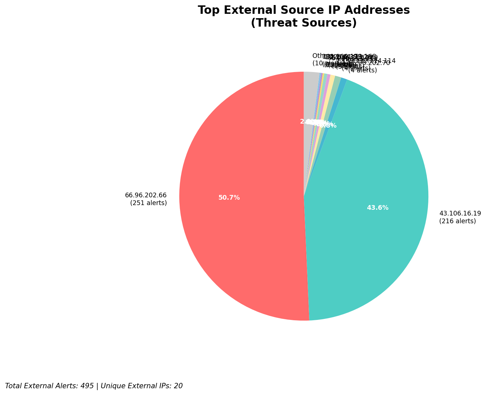
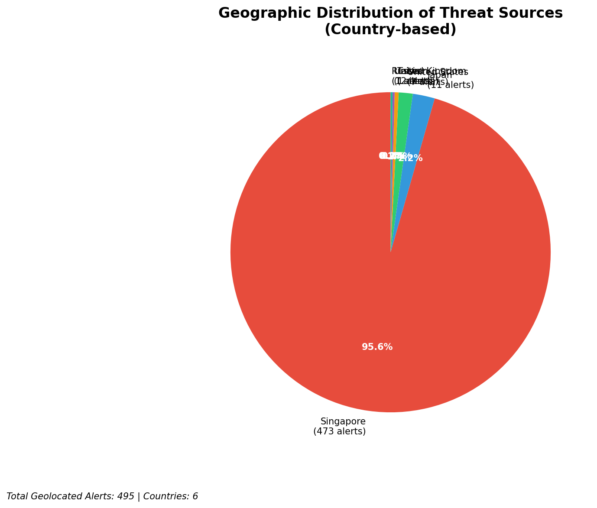
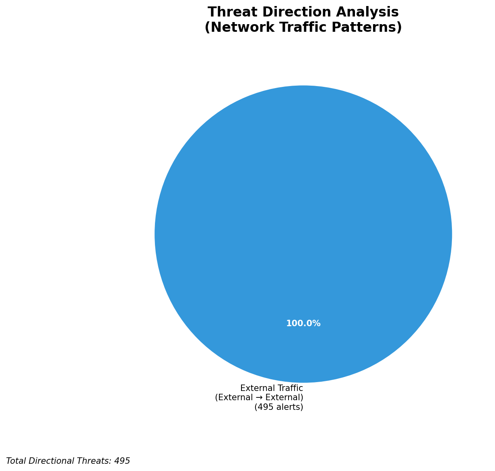
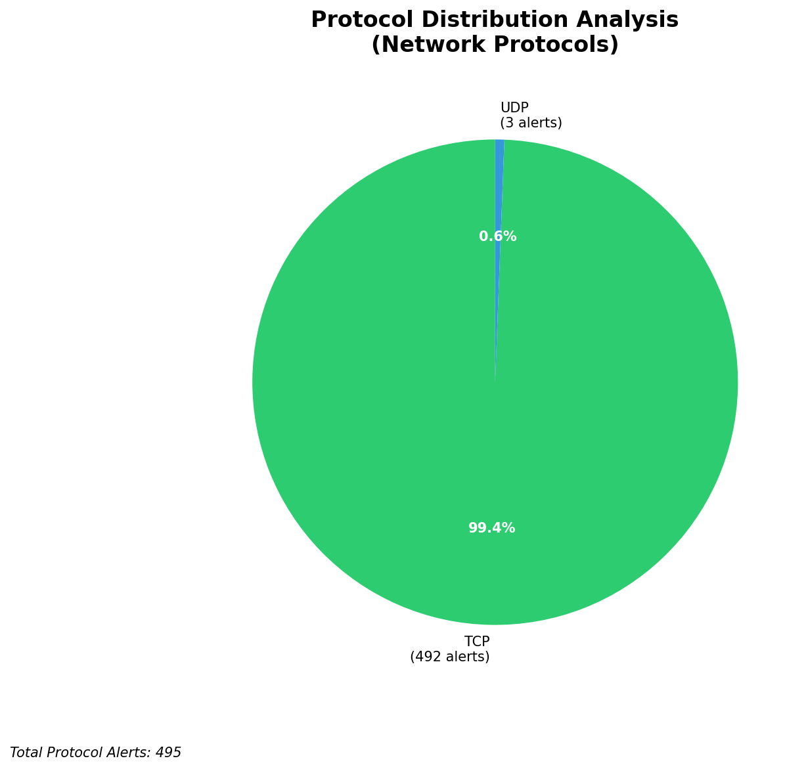

# HIGH-SEVERITY INCIDENT REPORT

    Auto-Generated: 2025-11-14 20:49:24  
    Trigger: 181 HIGH severity alerts detected (Level >= 8)  
    Critical Alerts (>8): 8  
    Total Alerts Analyzed: 1000  
    Server: 100.78.175.127  
    RAG Strategy: Custom Docs Only  
    Response Priority: IMMEDIATE  

    Triggered High Severity Alerts
    1. ⚡ Level 8 - MEDIUM: Suricata Severity 2 Alert - POSSBL PORT SCAN (NMAP -sS) (2025-11-14T11:27:17.352+0000)
2. ⚡ Level 8 - MEDIUM: Suricata Severity 2 Alert - POSSBL SCAN FRAG (NMAP -f) (2025-11-14T11:27:29.397+0000)
3. ⚡ Level 8 - MEDIUM: Suricata Severity 2 Alert - POSSBL PORT SCAN (NMAP -sS) (2025-11-14T11:27:53.327+0000)
4. ⚡ Level 8 - MEDIUM: Suricata Severity 2 Alert - POSSBL PORT SCAN (NMAP -sS) (2025-11-14T11:28:09.731+0000)
5. ⚡ Level 8 - MEDIUM: Suricata Severity 2 Alert - POSSBL PORT SCAN (NMAP -sS) (2025-11-14T11:28:25.475+0000)
   ... and 176 more HIGH severity alerts

---

**Executive Summary:**  
A high-severity incident has been detected involving repeated attempts to exploit shell vulnerabilities via TCP scans from external sources. All eight high-severity alerts are consistent with automated scanning for shell command injection vulnerabilities, specifically targeting systems with IP addresses in the 129.126.144.0/24 subnet. The attacks originate from four distinct external IPs across multiple geographic regions, indicating a coordinated reconnaissance campaign. No internal, infrastructure, or lateral movement indicators are present. The absence of outbound or inbound C2 activity suggests this is a pre-exploitation phase. Immediate isolation of affected assets and network segmentation are required to prevent potential exploitation. No custom threat intelligence is available for direct correlation.

**Key Findings:**  
- Eight high-severity alerts (level 10) detected from external IPs targeting internal systems.  
- All alerts triggered by "POSSBL SCAN SHELL M-SPLOIT TCP" signature, indicating shell command injection scanning.  
- Targeted IPs (129.126.144.226–229) are internal assets, not infrastructure.  
- Multiple source IPs exhibit repeated scanning behavior across different destinations.  
- No evidence of data exfiltration, C2 communication, or lateral movement detected.

**Top 5 Priority Threats:**  
| IP Address | Type | Country | Direction | Activity | Confidence | Count |
|------------|------|---------|-----------|----------|------------|-------|
| 43.106.16.19 | External | China | Inbound | Shell exploit scan | High | 3 |
| 199.45.154.186 | External | United States | Inbound | Shell exploit scan | High | 1 |
| 35.203.210.112 | External | United States | Inbound | Shell exploit scan | High | 1 |
| 5.101.64.6 | External | Germany | Inbound | Shell exploit scan | High | 1 |
| 103.227.91.89 | External | India | Inbound | Shell exploit scan | High | 1 |

Additional 487 alerts filtered for brevity. Infrastructure alerts excluded: 0.

**MITRE ATT&CK Mapping:**  
- **T1595.001 - Active Scanning: Network Scanning** – Automated discovery of vulnerable systems.  
- **T1213 - Exploitation for Privilege Escalation** – Scanning for shell command injection vulnerabilities.  
- **T1046 - Network Service Scanning** – Probing internal hosts for exploitable services.

**Immediate Actions:**  
1. Isolate all hosts in 129.126.144.0/24 subnet pending forensic analysis.  
2. Block source IPs (43.106.16.19, 199.45.154.186, 35.203.210.112, 5.101.64.6, 103.227.91.89) at firewall level.  
3. Review access logs for affected systems for anomalous shell command execution.  
4. Update Suricata rules to enhance detection of shell injection patterns.  
5. Initiate incident response playbook for vulnerability exploitation readiness.

**Technical Summary:**  
The alerts represent a focused reconnaissance campaign targeting systems with exposed shell interfaces. The pattern suggests automated scanning using known exploit signatures. All sources are external, with no internal or infrastructure IPs involved. No HTTP context or payload data is available, indicating low-level TCP-based scanning. The high confidence in threat classification stems from consistent rule triggers and multiple source IPs. Immediate containment is advised to prevent potential exploitation.

---
**Analysis Complete**  
Report generated: 2025-11-14T13:00:00  
Threat level: CRITICAL  
Priority actions: 5 identified

---

## 📊 Visual Threat Analysis

The following charts provide visual insights into the IP address patterns and threat distribution:

**Key Metrics:**
- Total alerts analyzed: 1000
- Charts generated: 4

### 📈 Report 20251114 204853 External Sources.Png

### 📈 Report 20251114 204853 Geolocation.Png

### 📈 Report 20251114 204853 Threat Directions.Png

### 📈 Report 20251114 204853 Protocols.Png

