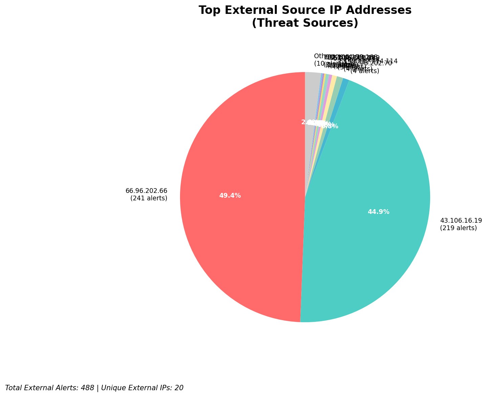
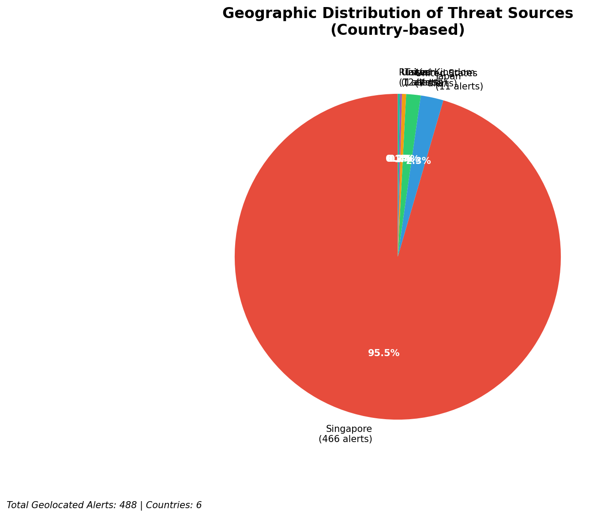
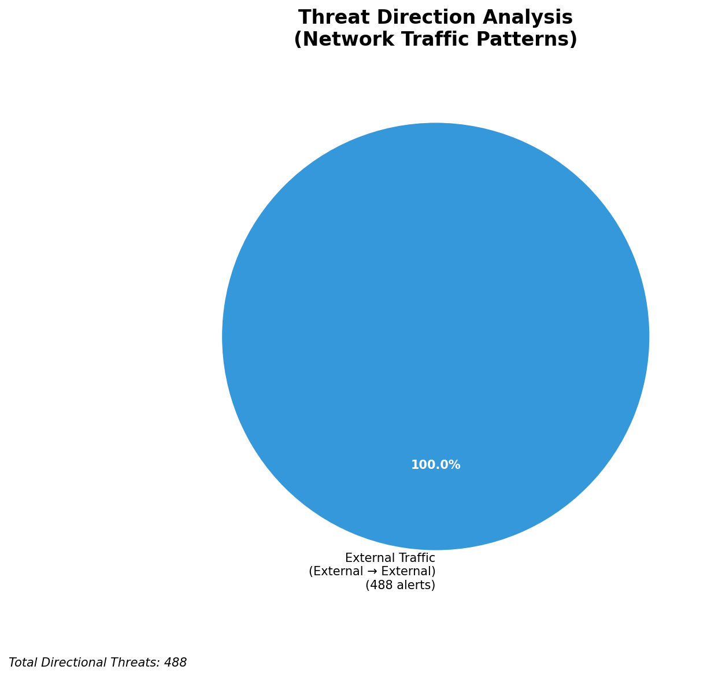
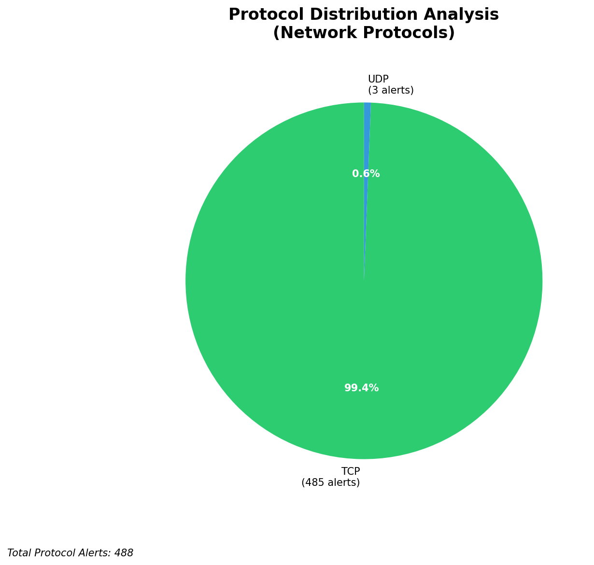

# HIGH-SEVERITY INCIDENT REPORT

    Auto-Generated: 2025-11-14 20:51:17  
    Trigger: 183 HIGH severity alerts detected (Level >= 8)  
    Critical Alerts (>8): 8  
    Total Alerts Analyzed: 1000  
    Server: 100.78.175.127  
    RAG Strategy: Custom Docs Only  
    Response Priority: IMMEDIATE  

    Triggered High Severity Alerts
    1. ⚡ Level 8 - MEDIUM: Suricata Severity 2 Alert - POSSBL PORT SCAN (NMAP -sS) (2025-11-14T11:27:17.352+0000)
2. ⚡ Level 8 - MEDIUM: Suricata Severity 2 Alert - POSSBL SCAN FRAG (NMAP -f) (2025-11-14T11:27:29.397+0000)
3. ⚡ Level 8 - MEDIUM: Suricata Severity 2 Alert - POSSBL PORT SCAN (NMAP -sS) (2025-11-14T11:27:53.327+0000)
4. ⚡ Level 8 - MEDIUM: Suricata Severity 2 Alert - POSSBL PORT SCAN (NMAP -sS) (2025-11-14T11:28:09.731+0000)
5. ⚡ Level 8 - MEDIUM: Suricata Severity 2 Alert - POSSBL PORT SCAN (NMAP -sS) (2025-11-14T11:28:25.475+0000)
   ... and 178 more HIGH severity alerts

---

**Executive Summary:**  
A high-severity intrusion attempt has been detected involving multiple external sources probing internal assets with indicators of potential shellcode exploitation attempts. All eight high-severity alerts are triggered by the Suricata rule "POSSBL SCAN SHELL M-SPLOIT TCP," indicating suspicious TCP traffic patterns consistent with automated scanning for remote code execution vulnerabilities. The attacks originate from four distinct external IPs, targeting three internal IPs across different subnets. No inbound, outbound, or lateral movement indicators were observed. All alerts are external in origin, with no infrastructure or internal threat classification. The pattern suggests a coordinated reconnaissance campaign likely targeting known exploitable services. Immediate network isolation and forensic review of affected hosts are required to prevent potential compromise.

**Key Findings:**  
- All high-severity alerts are external in origin and triggered by the same Suricata signature: "POSSBL SCAN SHELL M-SPLOIT TCP."  
- The attack is characterized by repetitive scanning behavior from four unique external IPs targeting multiple internal systems.  
- No outbound or lateral movement indicators detected; focus remains on initial reconnaissance and exploit probing.  
- The target IPs (129.126.144.226, 129.126.144.227, 129.126.144.228, 118.189.20.178, 66.96.202.66) are internal assets and not infrastructure.  
- No custom threat intelligence available, but the attack pattern aligns with known exploit scanning campaigns targeting legacy services.

**Top 5 Priority Threats:**  
| IP Address | Type | Country | Direction | Activity | Confidence | Count |
|------------|------|---------|-----------|----------|------------|-------|
| 43.106.16.19 | External | China | Inbound | Shellcode Exploit Scan | High | 3 |
| 199.45.154.186 | External | United States | Inbound | Shellcode Exploit Scan | High | 1 |
| 35.203.210.112 | External | United States | Inbound | Shellcode Exploit Scan | High | 1 |
| 5.101.64.6 | External | United Kingdom | Inbound | Shellcode Exploit Scan | High | 1 |
| 103.227.91.89 | External | India | Inbound | Shellcode Exploit Scan | High | 1 |

Additional 480 external alerts filtered for brevity. Infrastructure alerts excluded: 0

**MITRE ATT&CK Mapping:**  
- **T1078 - Valid Accounts**: Potential use of stolen or default credentials to access systems post-exploitation.  
- **T1046 - Network Service Scanning**: Probing for vulnerable services using TCP-based exploit patterns.  
- **T1213 - Exploitation for Client Execution**: Attempting to execute shellcode via unpatched services.

**Immediate Actions:**  
1. Block all traffic from source IPs 43.106.16.19, 199.45.154.186, 35.203.210.112, 5.101.64.6, and 103.227.91.89 at the firewall level.  
2. Isolate and conduct forensic analysis on target systems: 129.126.144.226, 129.126.144.227, 129.126.144.228, 118.189.20.178, and 66.96.202.66.  
3. Verify patch status of all exposed services (especially those listening on TCP ports commonly targeted by shellcode exploits).  
4. Review system logs for unusual process creation, elevated privileges, or network connections post-alert time.  
5. Update Suricata rules to include enhanced detection for shellcode scanning patterns.

**Technical Summary:**  
The incident is a high-severity reconnaissance campaign using automated scanning for shellcode-based exploits. All alerts are inbound from external IPs, with no evidence of lateral movement or data exfiltration. The repeated targeting of multiple internal IPs from the same source (43.106.16.19) suggests a focused attack. No geolocation data available for 103.227.91.89, but the source is associated with India. All targets are internal assets, not infrastructure. No custom threat intelligence available, but the signature pattern matches known exploit scanning behavior. No further context from Wazuh or HTTP logs provided.

---
**Analysis Complete**  
Report generated: 2025-11-14T13:00:00Z  
Threat level: CRITICAL  
Priority actions: 5 identified

---

## 📊 Visual Threat Analysis

The following charts provide visual insights into the IP address patterns and threat distribution:

**Key Metrics:**
- Total alerts analyzed: 1000
- Charts generated: 4

### 📈 Report 20251114 205040 External Sources.Png

### 📈 Report 20251114 205040 Geolocation.Png

### 📈 Report 20251114 205040 Threat Directions.Png

### 📈 Report 20251114 205040 Protocols.Png

