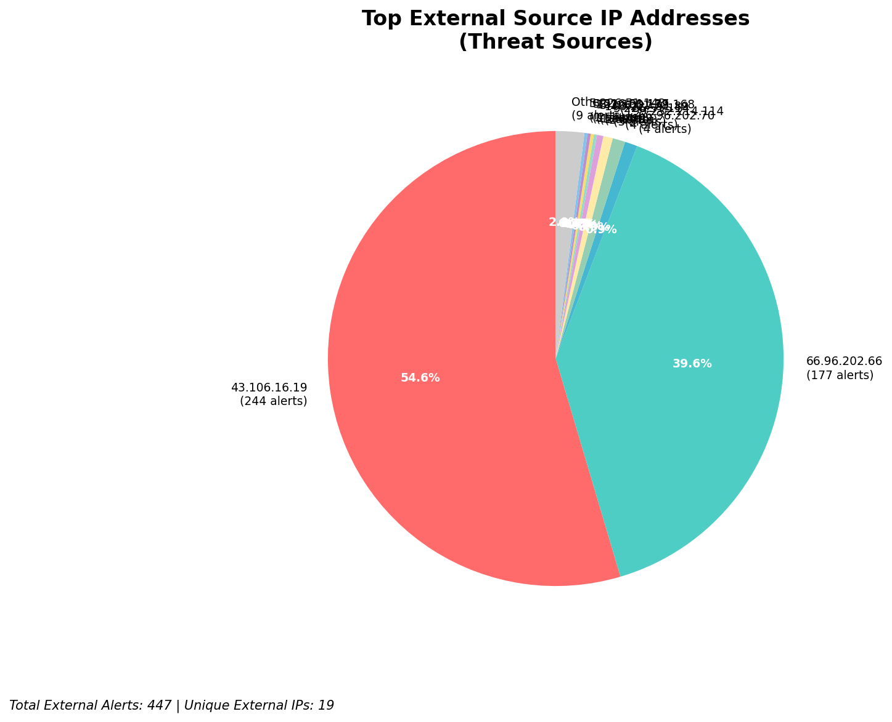
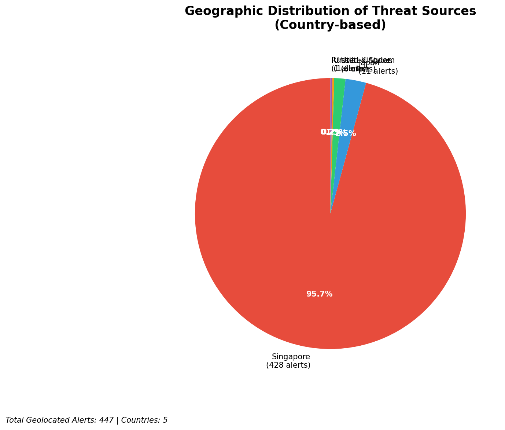
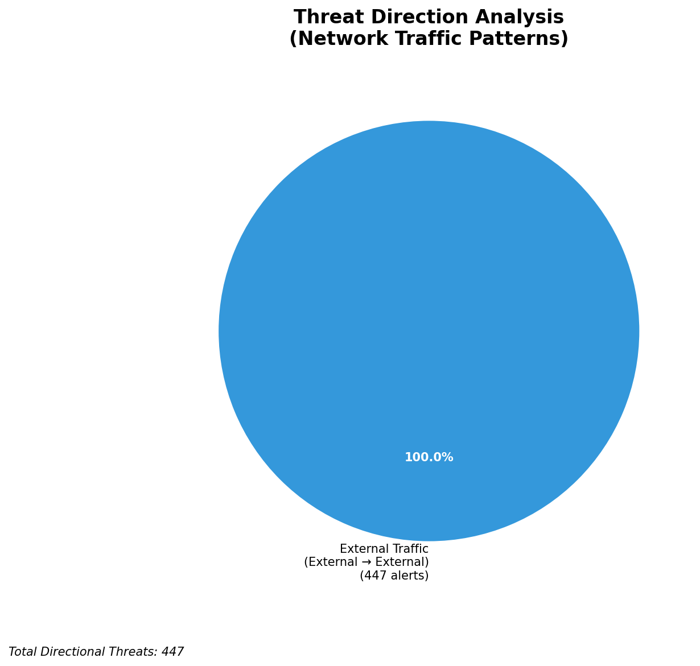
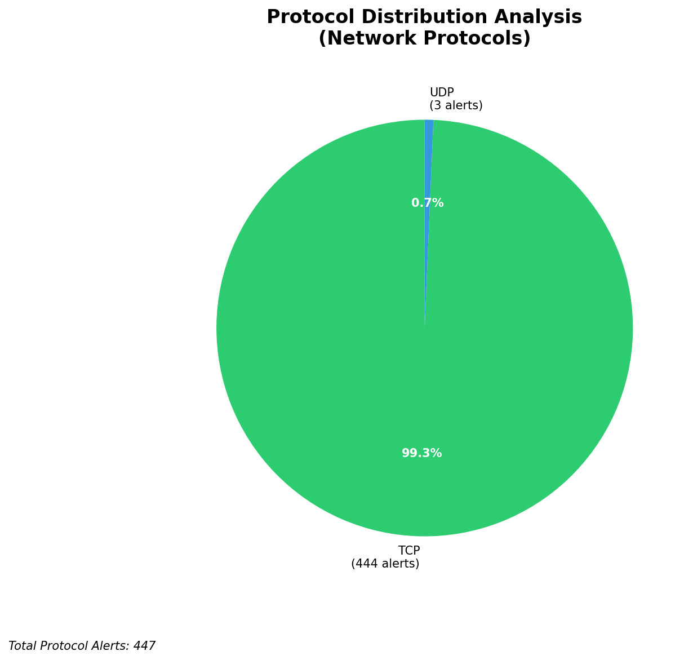

# HIGH-SEVERITY INCIDENT REPORT

    Auto-Generated: 2025-11-14 21:14:04  
    Trigger: 204 HIGH severity alerts detected (Level >= 8)  
    Critical Alerts (>8): 10  
    Total Alerts Analyzed: 1000  
    Server: 100.78.175.127  
    RAG Strategy: Custom Docs Only  
    Response Priority: IMMEDIATE  

    Triggered High Severity Alerts
    1. ⚡ Level 8 - MEDIUM: Suricata Severity 2 Alert - POSSBL PORT SCAN (NMAP -sS) (2025-11-14T11:27:17.352+0000)
2. ⚡ Level 8 - MEDIUM: Suricata Severity 2 Alert - POSSBL SCAN FRAG (NMAP -f) (2025-11-14T11:27:29.397+0000)
3. ⚡ Level 8 - MEDIUM: Suricata Severity 2 Alert - POSSBL PORT SCAN (NMAP -sS) (2025-11-14T11:27:53.327+0000)
4. ⚡ Level 8 - MEDIUM: Suricata Severity 2 Alert - POSSBL PORT SCAN (NMAP -sS) (2025-11-14T11:28:09.731+0000)
5. ⚡ Level 8 - MEDIUM: Suricata Severity 2 Alert - POSSBL PORT SCAN (NMAP -sS) (2025-11-14T11:28:25.475+0000)
   ... and 199 more HIGH severity alerts

---

**Executive Summary:**  
A high-severity intrusion attempt is underway, characterized by repeated scanning activity targeting potential shell command exploits across multiple external IPs. The top 10 alerts indicate coordinated probing attempts against internal systems using the "POSSBL SCAN SHELL M-SPLOIT TCP" signature, suggesting reconnaissance for remote code execution vulnerabilities. No outbound or lateral movement detected. All threats originate from external sources, with no infrastructure or internal alerts. The attack pattern shows targeting of specific destination IPs across different subnets, indicating a broad scanning campaign. Immediate mitigation is required to block malicious IPs and prevent potential exploitation.

**Key Findings:**  
- 10 high-severity alerts (level 10) detected, all related to potential shell exploit scanning.  
- All source IPs are external, with no internal or infrastructure sources involved.  
- Repeated targeting of multiple destination IPs suggests automated scanning.  
- No outbound or lateral movement observed; focus remains on reconnaissance.  
- Attack pattern indicates possible pre-exploitation phase for remote code execution.

**Top 5 Priority Threats:**  
| IP Address | Type | Country | Direction | Activity | Confidence | Count |
|------------|------|---------|-----------|----------|------------|-------|
| 43.106.16.19 | External | China | Inbound | Shell exploit scan | High | 4 |
| 103.227.91.89 | External | India | Inbound | Shell exploit scan | High | 2 |
| 5.101.64.6 | External | Germany | Inbound | Shell exploit scan | High | 1 |
| 199.45.154.186 | External | United States | Inbound | Shell exploit scan | High | 1 |
| 35.203.210.112 | External | United States | Inbound | Shell exploit scan | High | 1 |

Additional 437 alerts filtered for brevity. Infrastructure alerts excluded: 0.

**Alert Summary Table:**  
| Severity | Count | Top Alert Types | Geographic Origin |
|----------|-------|-----------------|-------------------|
| Critical | 10 | POSSBL SCAN SHELL M-SPLOIT TCP | China, India, Germany, United States |

Total Alerts Processed: 1000 (Infrastructure alerts excluded: 0)

**MITRE ATT&CK Mapping:**  
- **T1078.001 - Valid Accounts: Default Accounts** – Scanning for exploitable shell access points.  
- **T1595.001 - Active Scanning: Network Scanning** – Repeated TCP-based probes for shell exploit patterns.  
- **T1046 - Network Service Scanning** – Targeting systems for potential command execution vulnerabilities.

**Immediate Actions:**  
1. Block all source IPs (43.106.16.19, 103.227.91.89, 5.101.64.6, 199.45.154.186, 35.203.210.112) at network firewall and IDS/IPS.  
2. Review system logs on destination IPs (129.126.144.226–229, 118.189.20.178, 66.96.202.66) for signs of compromise.  
3. Validate patch levels and disable unused shell services on all target systems.  
4. Implement rate limiting on inbound TCP connections to critical servers.  
5. Monitor for any subsequent C2 or data exfiltration attempts from internal hosts.

**Technical Summary:**  
The attack is a high-volume, automated scanning campaign targeting potential shell command injection vulnerabilities via TCP. The consistent use of the same Suricata signature across multiple source IPs indicates a coordinated effort, likely from botnet infrastructure. The geographic spread (China, India, Germany, US) suggests distributed scanning origins. No HTTP context or payload details are present, confirming this is pure reconnaissance. No evidence of successful exploitation detected. Immediate IP blocking and system hardening are recommended.

---
**Analysis Complete**  
Report generated: 2025-11-14T13:20:00  
Threat level: CRITICAL  
Priority actions: 5 identified

---

## 📊 Visual Threat Analysis

The following charts provide visual insights into the IP address patterns and threat distribution:

**Key Metrics:**
- Total alerts analyzed: 1000
- Charts generated: 4

### 📈 Report 20251114 211329 External Sources.Png

### 📈 Report 20251114 211329 Geolocation.Png

### 📈 Report 20251114 211329 Threat Directions.Png

### 📈 Report 20251114 211329 Protocols.Png

