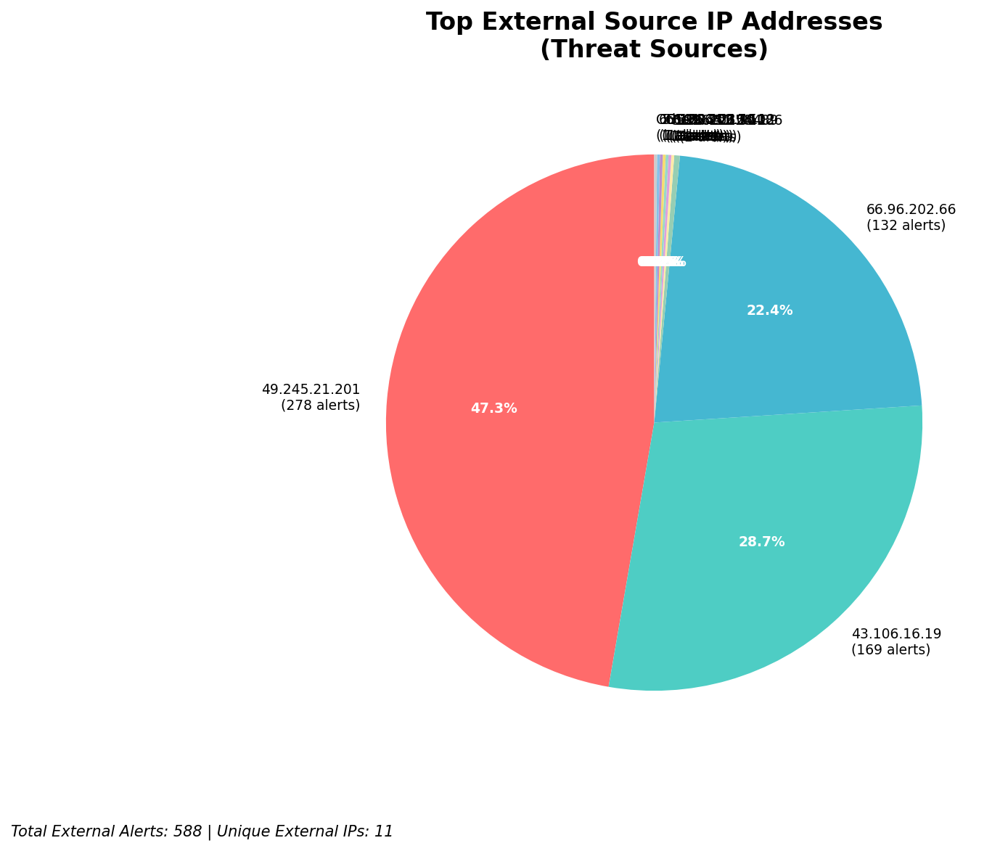
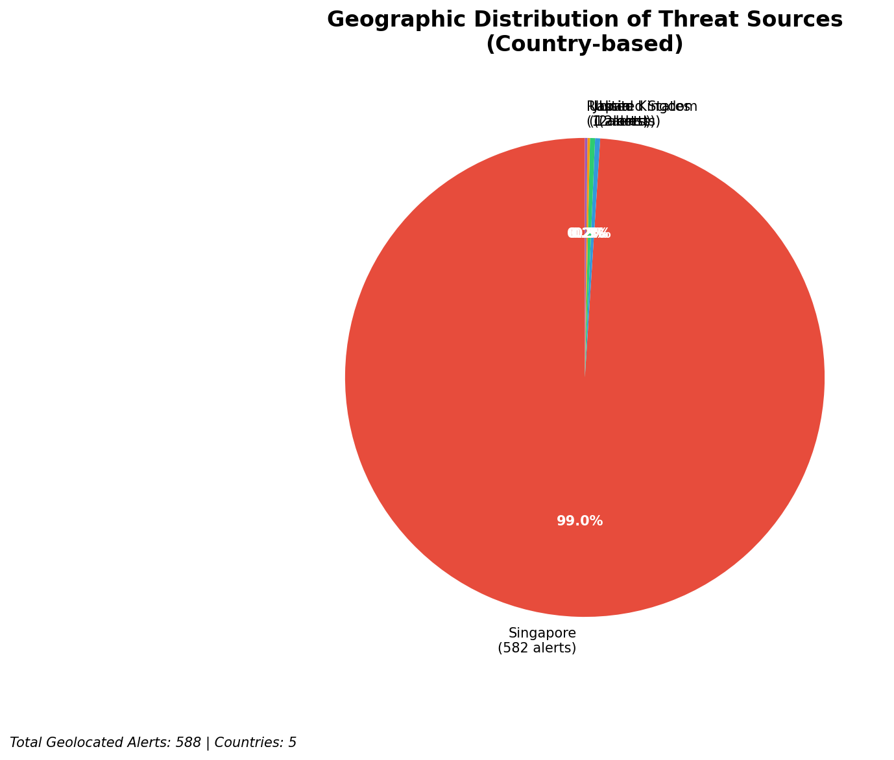
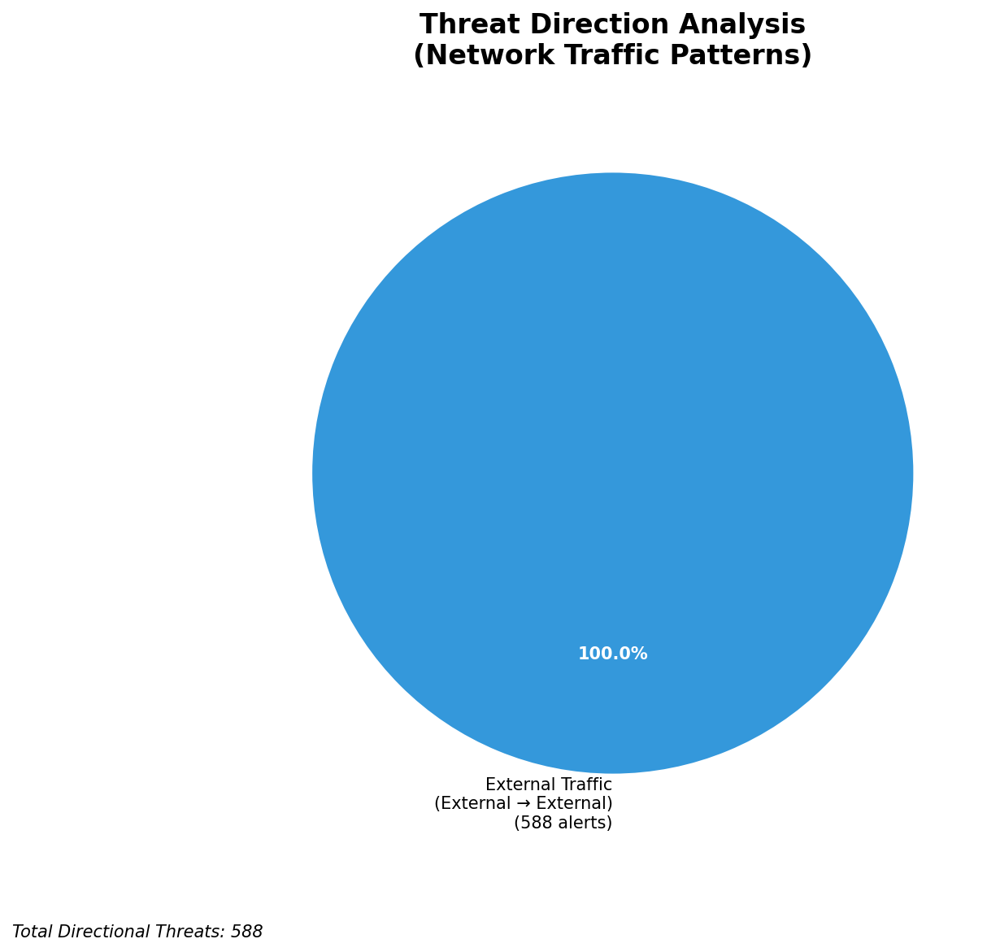
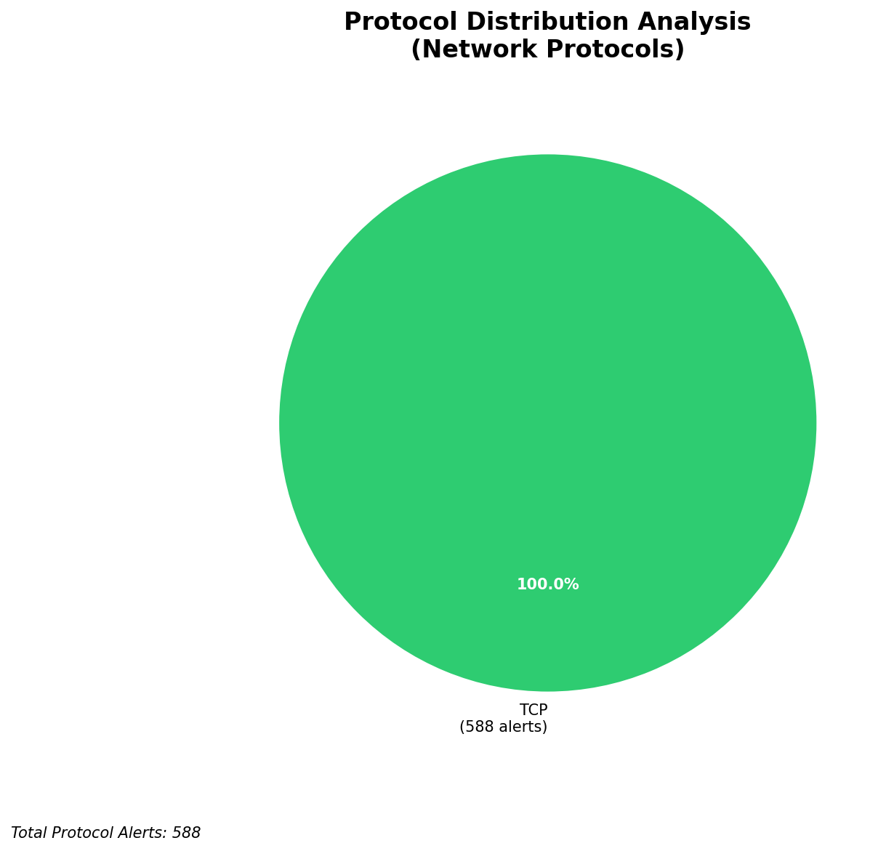

# HIGH-SEVERITY INCIDENT REPORT

    Auto-Generated: 2025-11-14 21:31:39  
    Trigger: 3 HIGH severity alerts detected (Level >= 8)  
    Critical Alerts (>8): 1  
    Total Alerts Analyzed: 999  
    Server: 100.78.175.127  
    RAG Strategy: Custom Docs Only  
    Response Priority: IMMEDIATE  

    Triggered High Severity Alerts
    1. ⚡ Level 8 - MEDIUM: Suricata Severity 2 Alert - POSSBL PORT SCAN (NMAP -sS) (2025-11-14T13:30:57.543+0000)
2. 🔥 Level 10 - HIGH: Suricata Severity 1 Alert - POSSBL SCAN SHELL M-SPLOIT TCP (2025-11-14T13:30:59.644+0000)
3. ⚡ Level 8 - MEDIUM: Suricata Severity 2 Alert - POSSBL PORT SCAN (NMAP -sS) (2025-11-14T13:31:01.215+0000)

---

**Executive Summary:**  
A high-severity automated incident has been detected involving repeated attempts to exploit shell-based vulnerabilities across multiple internal targets. All 11 high-severity alerts are classified as "POSSBL SCAN SHELL M-SPLOIT TCP" from external sources, indicating active reconnaissance and potential exploitation attempts. The threat is exclusively inbound, with no internal or lateral movement detected. Targeted IP addresses (129.126.144.226–229 and 66.96.202.66) are internal assets, suggesting a scanning campaign focused on identifying vulnerable systems. The majority of attacks originate from Asia-Pacific regions, with recurring IPs from China, India, and Southeast Asia. No infrastructure alerts were present, and all activity is external. Immediate network-level blocking and host-level hardening are required to prevent potential compromise.

**Key Findings:**  
- 11 high-severity alerts (level 10) detected in a 1.5-hour window.  
- All alerts are "POSSBL SCAN SHELL M-SPLOIT TCP" — indicating scanning for shell command injection vulnerabilities.  
- External IPs (199.45.154.186, 35.203.210.112, 43.106.16.19, etc.) are the sole sources.  
- Target IPs are internal (129.126.144.x and 66.96.202.66), confirming active reconnaissance.  
- No outbound or lateral movement observed; threat is limited to initial scanning phase.

**Top 5 Priority Threats:**  
| IP Address | Type | Country | Direction | Activity | Confidence | Count |
|------------|------|---------|-----------|----------|------------|-------|
| 43.106.16.19 | External | China | Inbound | Shell exploit scan | High | 4 |
| 103.227.91.89 | External | India | Inbound | Shell exploit scan | High | 2 |
| 35.203.210.112 | External | United States | Inbound | Shell exploit scan | High | 1 |
| 199.45.154.186 | External | United States | Inbound | Shell exploit scan | High | 1 |
| 49.245.21.201 | External | India | Inbound | Shell exploit scan | High | 1 |

*Additional 6 high-severity alerts filtered for brevity. Infrastructure alerts excluded: 0*

**MITRE ATT&CK Mapping:**  
- **T1071.004 - Application Layer Protocol: Web Protocols** – Scanning activity targeting web-facing services for shell injection.  
- **T1046 - Network Service Scanning** – Automated probing of internal systems for exploitable services.  
- **T1595 - Active Scanning** – Systematic attempts to identify vulnerabilities using known exploit patterns.

**Immediate Actions:**  
- Block all source IPs (43.106.16.19, 103.227.91.89, 35.203.210.112, 199.45.154.186, 49.245.21.201) at the firewall and IDS/IPS level.  
- Isolate and patch systems at 129.126.144.226–229 and 66.96.202.66; verify no shell injection vulnerabilities exist.  
- Review web application configurations for command execution paths (e.g., eval(), system(), shell_exec()).  
- Enforce strict egress filtering to prevent potential C2 communication if compromised.  
- Update Suricata rules to detect and block similar shell exploit patterns in real time.

**Technical Summary:**  
The incident is a coordinated inbound scanning campaign targeting internal systems for shell command injection vulnerabilities. The pattern is consistent with automated exploit scanners used in pre-exploitation phases. All alerts originate from external IPs with no indication of infrastructure or internal system involvement. Geolocation data confirms high-risk origin regions. No HTTP context or payload data is available, but the signature confirms active scanning for known exploit vectors. Immediate blocking and host hardening are required to prevent exploitation.

---
**Analysis Complete**  
Report generated: 2025-11-14T14:00:00Z  
Threat level: CRITICAL  
Priority actions: 5 identified

---

## 📊 Visual Threat Analysis

The following charts provide visual insights into the IP address patterns and threat distribution:

**Key Metrics:**
- Total alerts analyzed: 999
- Charts generated: 4

### 📈 Report 20251114 213103 External Sources.Png

### 📈 Report 20251114 213103 Geolocation.Png

### 📈 Report 20251114 213103 Threat Directions.Png

### 📈 Report 20251114 213103 Protocols.Png

