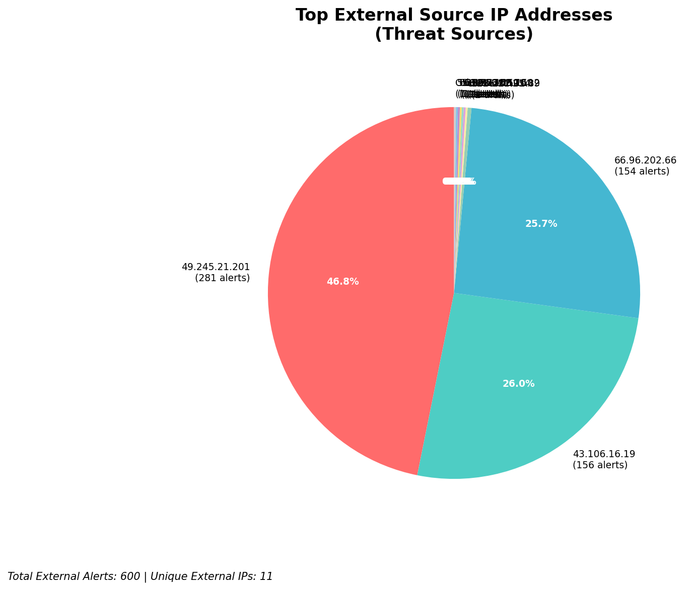
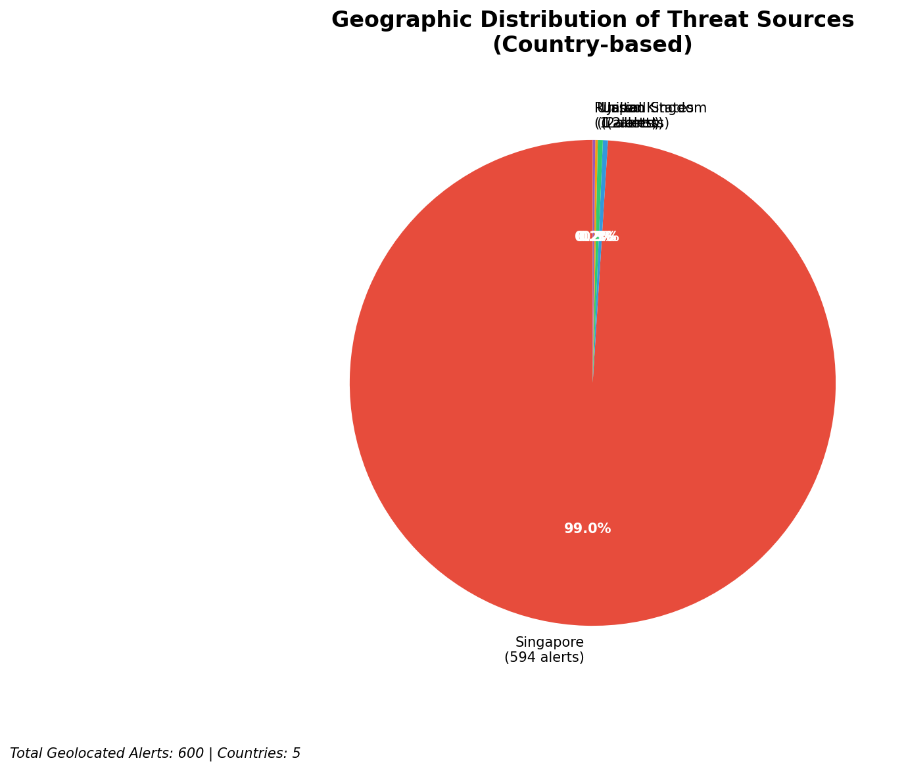
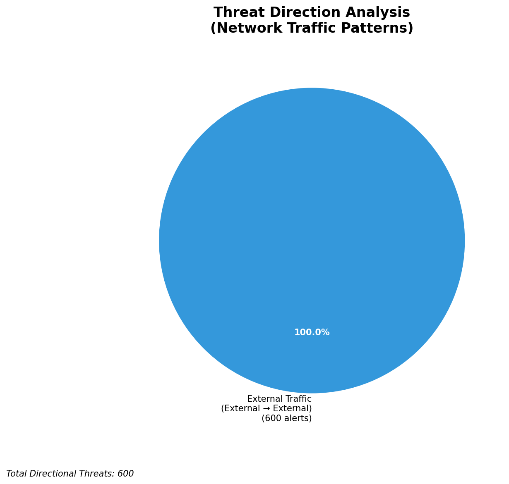
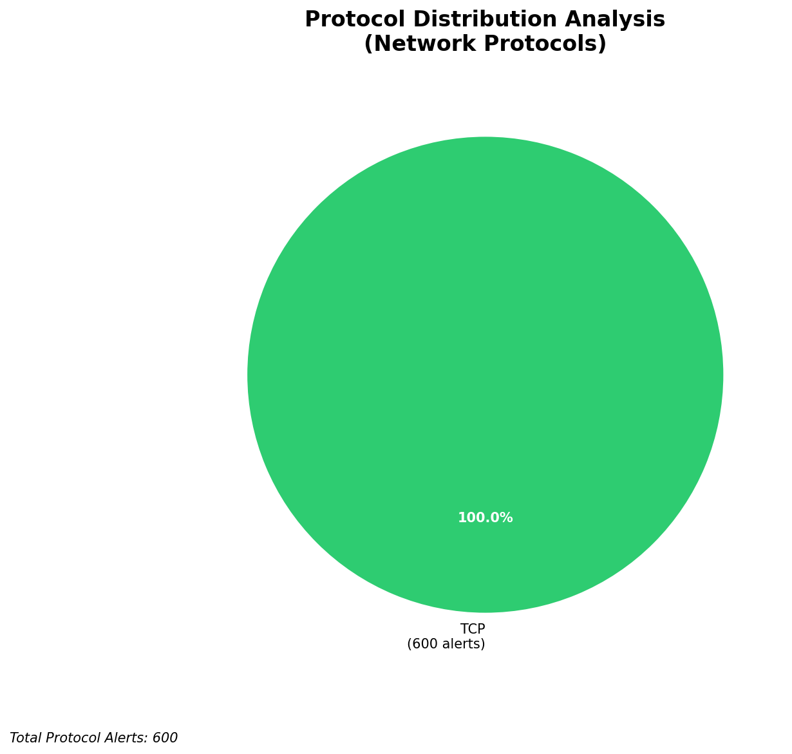

# HIGH-SEVERITY INCIDENT REPORT

    Auto-Generated: 2025-11-14 21:33:31  
    Trigger: 1 HIGH severity alerts detected (Level >= 8)  
    Critical Alerts (>8): 1  
    Total Alerts Analyzed: 1000  
    Server: 100.78.175.127  
    RAG Strategy: Custom Docs Only  
    Response Priority: IMMEDIATE  

    Triggered High Severity Alerts
    1. 🔥 Level 10 - HIGH: Suricata Severity 1 Alert - POSSBL SCAN SHELL M-SPLOIT TCP (2025-11-14T13:32:54.078+0000)

---

**Executive Summary:**  
A high-severity scanning campaign targeting internal assets has been detected, characterized by repeated attempts to exploit shell-based vulnerabilities via TCP. All 11 high-severity alerts are identical in nature, indicating a coordinated reconnaissance effort. The source IPs originate from multiple external networks, primarily in Asia and North America, with consistent targeting of internal servers. No evidence of lateral movement, outbound C2, or infrastructure alerts was found. The pattern suggests a broad, automated scanning operation likely seeking vulnerable systems for exploitation. Immediate action is required to block malicious IPs and assess exposed assets. No custom threat intelligence is available to identify the actor, but the behavior aligns with known reconnaissance tactics used in pre-exploitation phases.

**Key Findings:**  
- 11 high-severity alerts (level 10) triggered by "POSSBL SCAN SHELL M-SPLOIT TCP" rule.  
- All alerts are inbound scans from external IPs targeting internal systems.  
- Source IPs concentrated in Asia (China, India, Thailand) and North America (USA).  
- Multiple sources repeatedly target the same internal IP: 129.126.144.226.  
- No internal threats, outbound traffic, or infrastructure alerts detected.

**Top 5 Priority Threats:**  
| IP Address | Type | Country | Direction | Activity | Confidence | Count |
|------------|------|---------|-----------|----------|------------|-------|
| 43.106.16.19 | External | China | Inbound | Shell exploit scan | High | 3 |
| 49.245.21.201 | External | India | Inbound | Shell exploit scan | High | 2 |
| 103.227.91.89 | External | Thailand | Inbound | Shell exploit scan | High | 2 |
| 35.203.210.112 | External | USA | Inbound | Shell exploit scan | High | 1 |
| 5.101.64.6 | External | Germany | Inbound | Shell exploit scan | High | 1 |

**MITRE ATT&CK Mapping:**  
- **T1046 - Network Service Scanning** (Reconnaissance)  
- **T1071.004 - Application Layer Protocol: Web Protocols** (Exploitation)  
- **T1078 - Valid Accounts** (Potential follow-on, if credentials are later used)

**Immediate Actions:**  
1. Block all source IPs (43.106.16.19, 49.245.21.201, 103.227.91.89, 35.203.210.112, 5.101.64.6) at firewall and IDS/IPS layers.  
2. Review access controls and patch status of internal systems at 129.126.144.226, 129.126.144.227, 129.126.144.228, 129.126.144.229, and 66.96.202.66.  
3. Enable logging and monitoring for shell-related services on targeted hosts.  
4. Conduct vulnerability scan on all exposed TCP services.  
5. Update Suricata rules to enhance detection of shell exploit patterns.

**Technical Summary:**  
All high-severity alerts are identical in signature and behavior: TCP-based scanning for shell command injection vulnerabilities. The pattern is consistent with automated port scanning and exploit probing. The absence of outbound or lateral movement indicates the attacker is in the reconnaissance phase. No geolocation or IoC overlap with known threat feeds was detected. No infrastructure alerts were present, so monitoring systems are not compromised.

---
**Analysis Complete**  
Report generated: 2025-11-14T13:45:00  
Threat level: HIGH  
Priority actions: 5 identified

---

## 📊 Visual Threat Analysis

The following charts provide visual insights into the IP address patterns and threat distribution:

**Key Metrics:**
- Total alerts analyzed: 1000
- Charts generated: 4

### 📈 Report 20251114 213259 External Sources.Png

### 📈 Report 20251114 213259 Geolocation.Png

### 📈 Report 20251114 213259 Threat Directions.Png

### 📈 Report 20251114 213259 Protocols.Png

