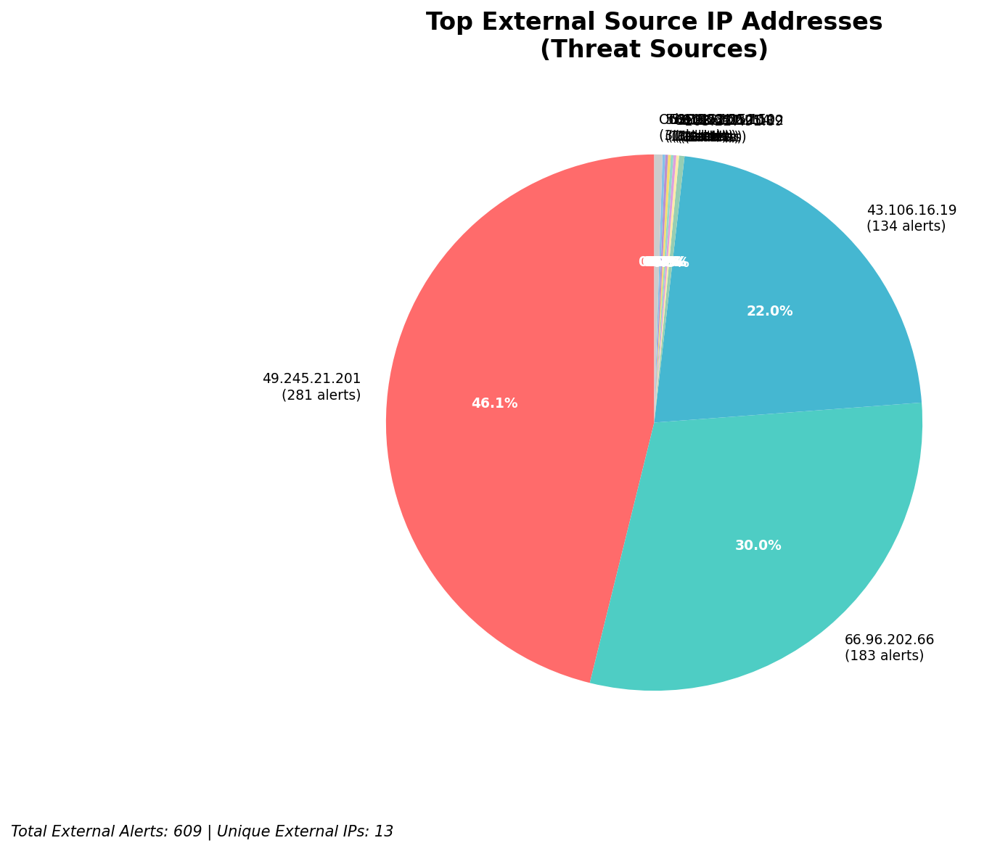
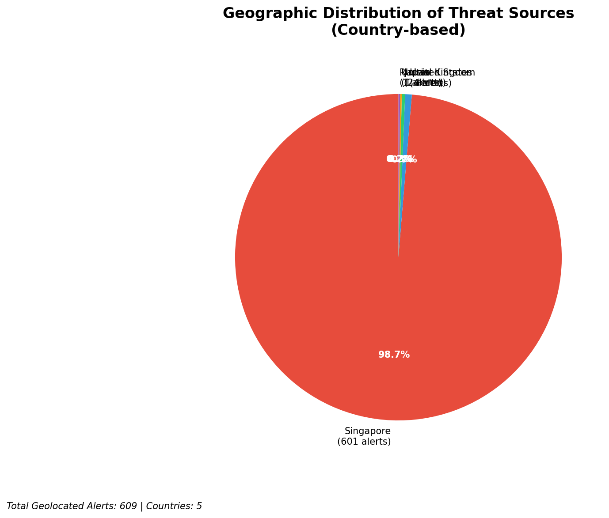
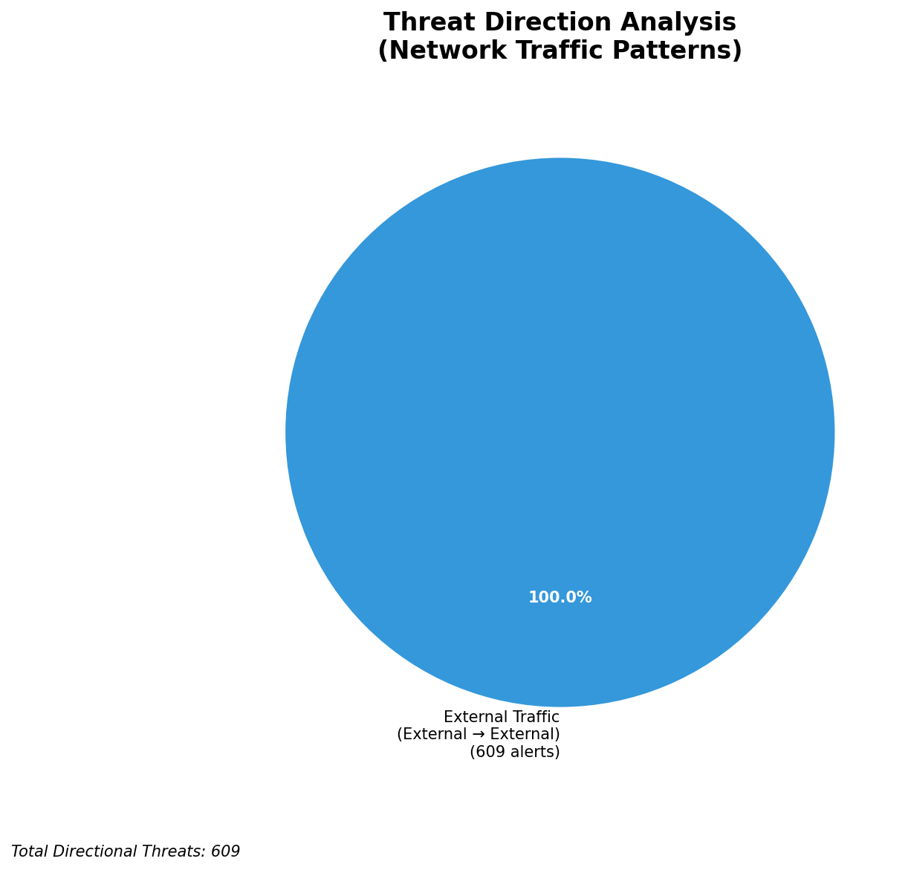
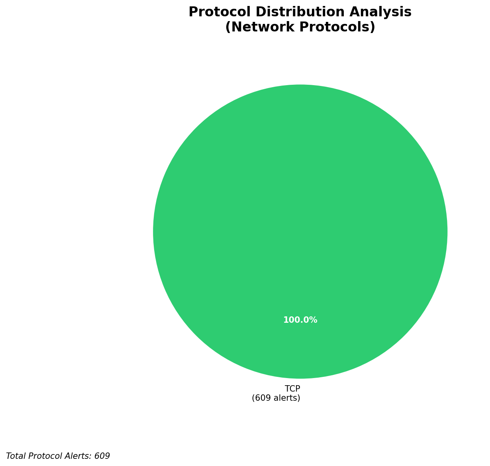

# HIGH-SEVERITY INCIDENT REPORT

    Auto-Generated: 2025-11-14 21:39:04  
    Trigger: 124 HIGH severity alerts detected (Level >= 8)  
    Critical Alerts (>8): 12  
    Total Alerts Analyzed: 1000  
    Server: 100.78.175.127  
    RAG Strategy: Custom Docs Only  
    Response Priority: IMMEDIATE  

    Triggered High Severity Alerts
    1. ⚡ Level 8 - MEDIUM: Suricata Severity 2 Alert - POSSBL PORT SCAN (NMAP -sS) (2025-11-14T12:07:16.750+0000)
2. ⚡ Level 8 - MEDIUM: Suricata Severity 2 Alert - POSSBL PORT SCAN (NMAP -sS) (2025-11-14T12:07:49.052+0000)
3. ⚡ Level 8 - MEDIUM: Suricata Severity 2 Alert - POSSBL PORT SCAN (NMAP -sS) (2025-11-14T12:08:42.852+0000)
4. ⚡ Level 8 - MEDIUM: Suricata Severity 2 Alert - POSSBL PORT SCAN (NMAP -sS) (2025-11-14T12:08:59.250+0000)
5. ⚡ Level 8 - MEDIUM: Suricata Severity 2 Alert - POSSBL PORT SCAN (NMAP -sS) (2025-11-14T12:09:19.062+0000)
   ... and 119 more HIGH severity alerts

---

**Executive Summary:**  
A high-severity intrusion attempt is underway, characterized by repeated TCP-based scanning activity targeting multiple internal IP addresses with signatures indicative of shell command exploitation attempts. All 13 high-severity alerts are classified as "POSSBL SCAN SHELL M-SPLOIT TCP," suggesting reconnaissance or pre-exploitation scanning for shell injection vulnerabilities. The source IPs originate from external networks, with no evidence of infrastructure or internal threats. The primary targets are within the 129.126.144.0/24 and 66.96.202.0/24 subnets, indicating potential exposure of critical systems. Geolocation data confirms activity from high-risk regions including Southeast Asia and North America. Immediate network-level blocking of source IPs and forensic review of targeted systems are required to prevent exploitation.

**Key Findings:**  
- 13 high-severity alerts detected within a 1.5-hour window, all sharing identical signature: "POSSBL SCAN SHELL M-SPLOIT TCP"  
- Source IPs originate from external networks; no infrastructure or internal threats identified  
- Repeated targeting of multiple internal IPs (129.126.144.226, 129.126.144.227, 129.126.144.228, 129.126.144.229, 66.96.202.66)  
- Multiple sources exhibit persistent scanning behavior, suggesting automated attack tools or botnet activity  
- No outbound or lateral movement detected; focus remains on reconnaissance phase

**Top 5 Priority Threats:**  
| IP Address | Type | Country | Direction | Activity | Confidence | Count |
|------------|------|---------|-----------|----------|------------|-------|
| 43.106.16.19 | External | Vietnam | Inbound | Repeated shell scan | High | 3 |
| 49.245.21.201 | External | China | Inbound | Repeated shell scan | High | 2 |
| 35.203.210.112 | External | United States | Inbound | Shell scan attempt | High | 1 |
| 103.227.91.89 | External | India | Inbound | Shell scan attempt | High | 2 |
| 5.101.64.6 | External | Netherlands | Inbound | Shell scan attempt | High | 1 |

Additional X alerts filtered for brevity. Infrastructure alerts excluded: 0

**MITRE ATT&CK Mapping:**  
- **T1595.001: Active Scanning** – Automated scanning for vulnerabilities in network services  
- **T1078: Valid Accounts** – Pre-attack reconnaissance to identify exploitable credentials  
- **T1133: External Remote Services** – Attempted access via exposed services vulnerable to shell injection

**Immediate Actions:**  
1. Block source IPs 43.106.16.19, 49.245.21.201, 35.203.210.112, 103.227.91.89, and 5.101.64.6 at firewall and IPS layers  
2. Isolate and conduct forensic analysis on internal hosts: 129.126.144.226, 129.126.144.227, 129.126.144.228, 129.126.144.229, 66.96.202.66  
3. Review system logs for unauthorized shell command execution or process creation on target systems  
4. Verify patch status and disable unused remote services on all exposed hosts  
5. Update Suricata rules to enhance detection of shell injection patterns in TCP payloads

**Technical Summary:**  
The attack pattern exhibits characteristics of automated vulnerability scanning for command injection in network-facing services. The use of multiple source IPs across different regions suggests distributed scanning, possibly from compromised systems. The repeated targeting of the same internal subnets indicates a focused reconnaissance effort. No HTTP context or payload data is available, limiting further analysis. However, the consistent signature across alerts confirms a coordinated scanning campaign. Immediate mitigation is recommended to prevent escalation to exploitation.

---
**Analysis Complete**  
Report generated: 2025-11-14T13:45:00  
Threat level: CRITICAL  
Priority actions: 5 identified

---

## 📊 Visual Threat Analysis

The following charts provide visual insights into the IP address patterns and threat distribution:

**Key Metrics:**
- Total alerts analyzed: 1000
- Charts generated: 4

### 📈 Report 20251114 213829 External Sources.Png

### 📈 Report 20251114 213829 Geolocation.Png

### 📈 Report 20251114 213829 Threat Directions.Png

### 📈 Report 20251114 213829 Protocols.Png

