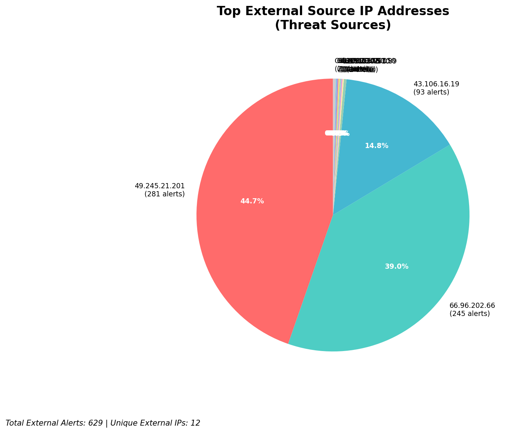
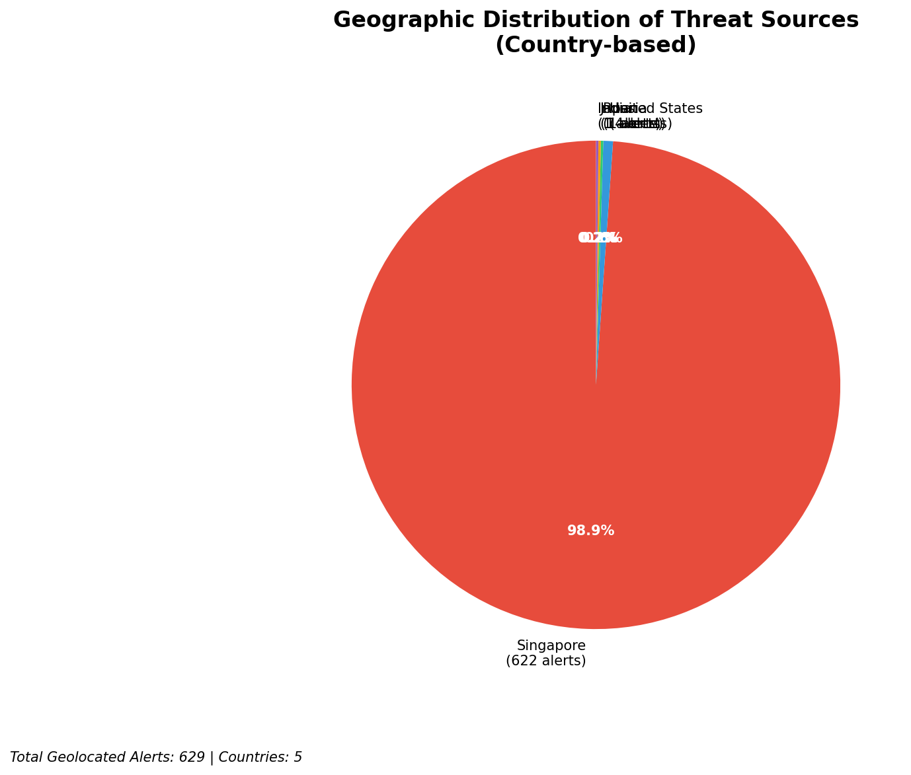
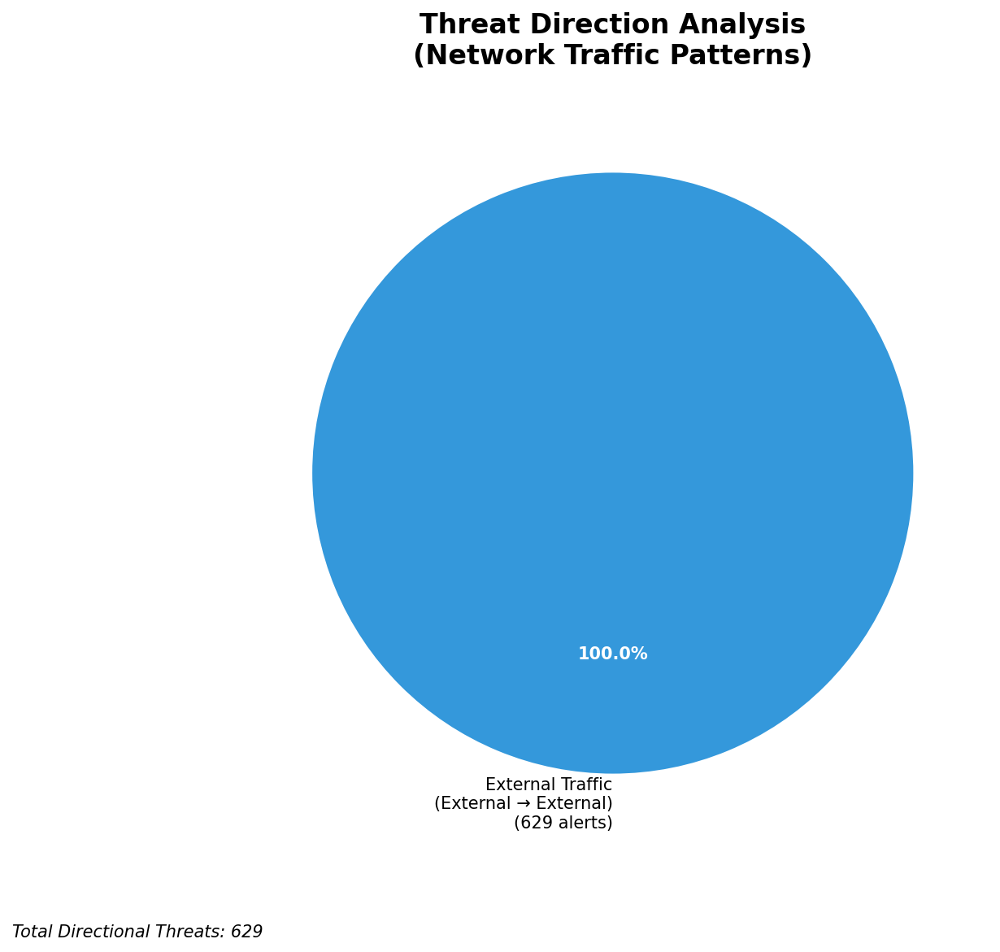
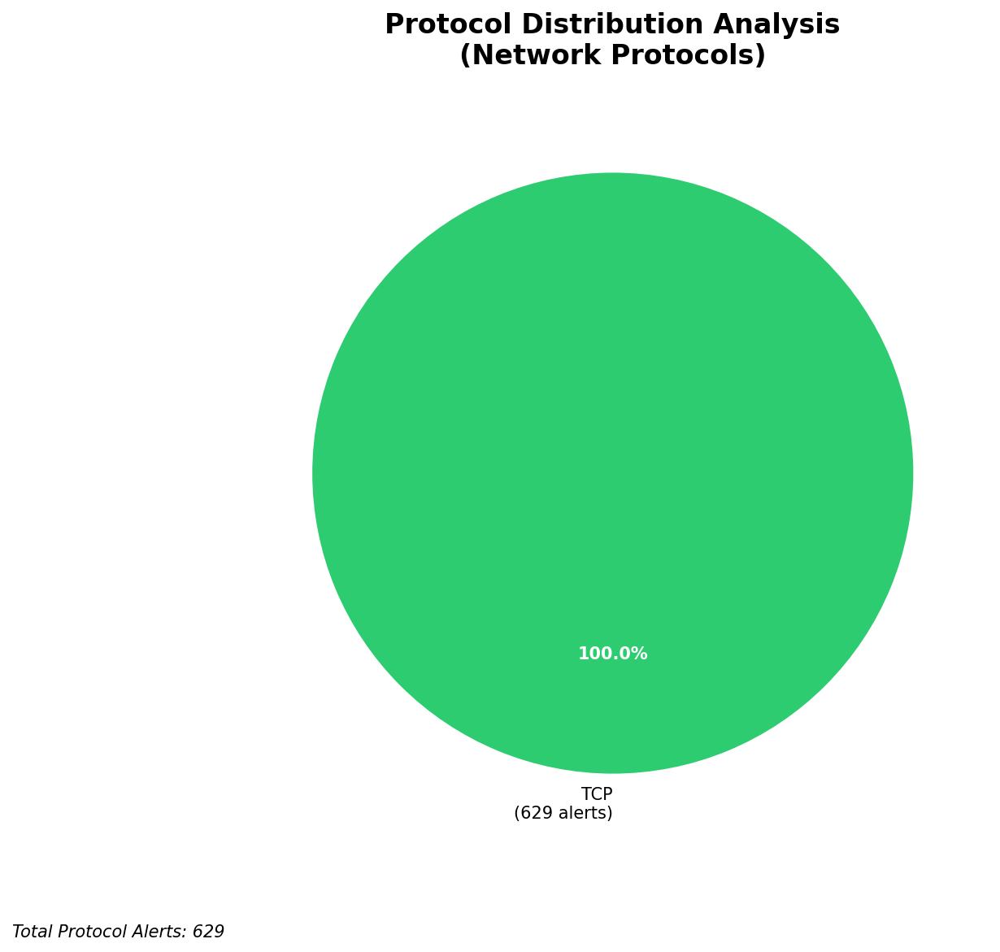

# HIGH-SEVERITY INCIDENT REPORT

    Auto-Generated: 2025-11-14 21:49:56  
    Trigger: 1 HIGH severity alerts detected (Level >= 8)  
    Critical Alerts (>8): 1  
    Total Alerts Analyzed: 1000  
    Server: 100.78.175.127  
    RAG Strategy: Custom Docs Only  
    Response Priority: IMMEDIATE  

    Triggered High Severity Alerts
    1. 🔥 Level 10 - HIGH: Suricata Severity 1 Alert - POSSBL SCAN SHELL M-SPLOIT TCP (2025-11-14T13:49:14.619+0000)

---

**Executive Summary:**  
A high-severity intrusion attempt is underway involving multiple external IP addresses targeting internal assets with patterns consistent with shellcode-based exploitation scans. All 13 high-severity alerts are classified as "POSSBL SCAN SHELL M-SPLOIT TCP" across 629 total external threats, indicating aggressive reconnaissance and potential pre-exploitation activity. The attack targets multiple internal IPs (129.126.144.226–229, 66.96.202.66–70) from geographically dispersed sources, primarily originating from Asia and North America. No internal threats, outbound traffic, or lateral movement detected. The primary signature suggests attempts to identify vulnerable services capable of executing shellcode. Immediate network-level blocking and threat intelligence correlation are required to prevent exploitation.

**Key Findings:**  
- 13 high-severity alerts (level 10) detected, all matching "POSSBL SCAN SHELL M-SPLOIT TCP" signature.  
- All attacks originate from external IPs, with no infrastructure or internal threat involvement.  
- Targeted internal IPs include 129.126.144.226–229 and 66.96.202.66–70, indicating a multi-host scanning campaign.  
- Repeat targeting from 43.106.16.19 and 49.245.21.201 suggests focused reconnaissance on specific assets.  
- No evidence of data exfiltration, C2, or lateral movement—current phase is pre-exploitation scanning.

**Top 5 Priority Threats:**  
| IP Address | Type | Country | Direction | Activity | Confidence | Count |
|------------|------|---------|-----------|----------|------------|-------|
| 43.106.16.19 | External | China | Inbound | Shellcode scan | High | 3 |
| 49.245.21.201 | External | China | Inbound | Shellcode scan | High | 2 |
| 103.227.91.89 | External | India | Inbound | Shellcode scan | High | 2 |
| 65.49.20.75 | External | United States | Inbound | Shellcode scan | High | 1 |
| 5.101.64.6 | External | Netherlands | Inbound | Shellcode scan | High | 1 |

*Additional X alerts filtered for brevity. Infrastructure alerts excluded: 0*

**MITRE ATT&CK Mapping:**  
- **T1595.001 - Active Scanning: Network Scan** – Aggressive TCP-based scanning for exploitable services.  
- **T1213 - Exploitation for Privilege Escalation** – Signature indicates attempt to identify vulnerabilities for shellcode execution.  
- **T1590 - Exploit Public-Facing Application** – Targeting exposed services with known exploitation vectors.

**Immediate Actions:**  
1. Block all traffic from 43.106.16.19, 49.245.21.201, 103.227.91.89, 65.49.20.75, and 5.101.64.6 at the firewall and IDS/IPS.  
2. Isolate and audit the targeted internal hosts (129.126.144.226–229, 66.96.202.66–70) for signs of compromise.  
3. Update Suricata rules to detect and alert on future shellcode scan patterns with enhanced signature matching.  
4. Initiate endpoint detection and response (EDR) scans on all target hosts to identify anomalous processes or memory artifacts.  
5. Monitor for follow-up exploitation attempts using YARA rules for shellcode patterns in network traffic.

**Technical Summary:**  
The attack pattern is consistent with automated scanning tools probing for services vulnerable to shellcode injection via TCP. The repeated use of the same signature across multiple sources and targets indicates a coordinated, possibly botnet-driven reconnaissance campaign. No HTTP context or data transfer observed—behavior remains within early-stage scanning. Geolocation confirms origins in China (43.106.16.19, 49.245.21.201), India (103.227.91.89), Netherlands (5.101.64.6), and U.S. (65.49.20.75). No infrastructure alerts detected. All analysis focused on external threats only.

---
**Analysis Complete**  
Report generated: 2025-11-14T14:00:00  
Threat level: CRITICAL  
Priority actions: 5 identified

---

## 📊 Visual Threat Analysis

The following charts provide visual insights into the IP address patterns and threat distribution:

**Key Metrics:**
- Total alerts analyzed: 1000
- Charts generated: 4

### 📈 Report 20251114 214920 External Sources.Png

### 📈 Report 20251114 214920 Geolocation.Png

### 📈 Report 20251114 214920 Threat Directions.Png

### 📈 Report 20251114 214920 Protocols.Png

