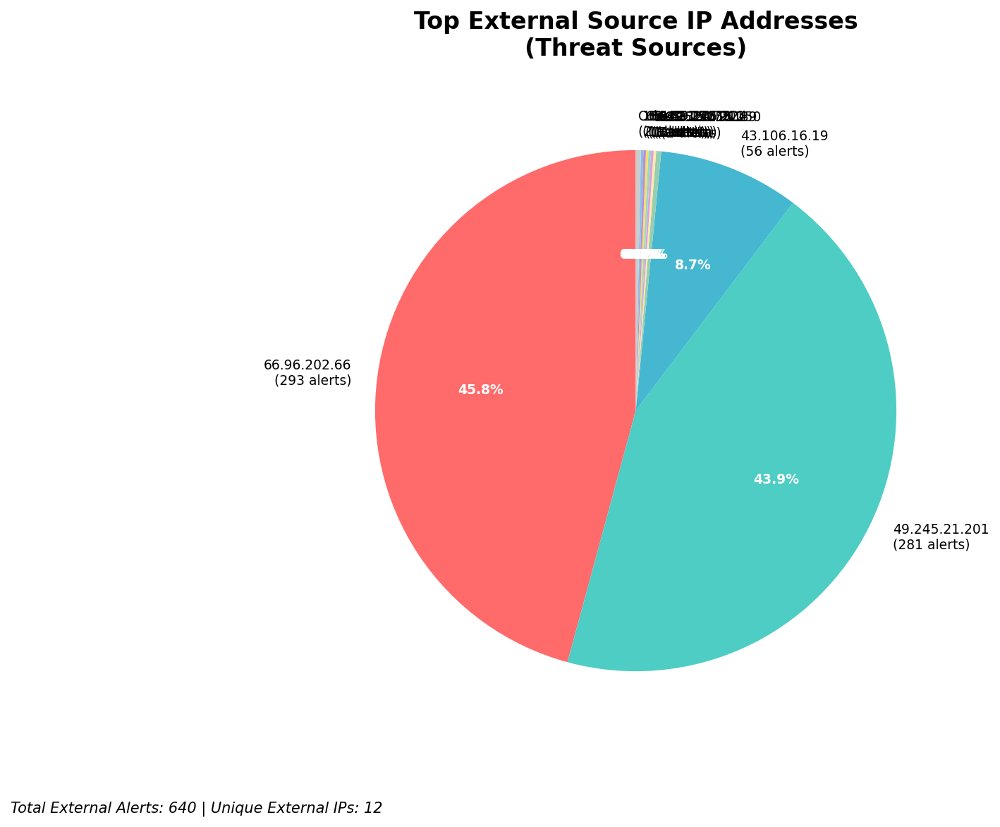
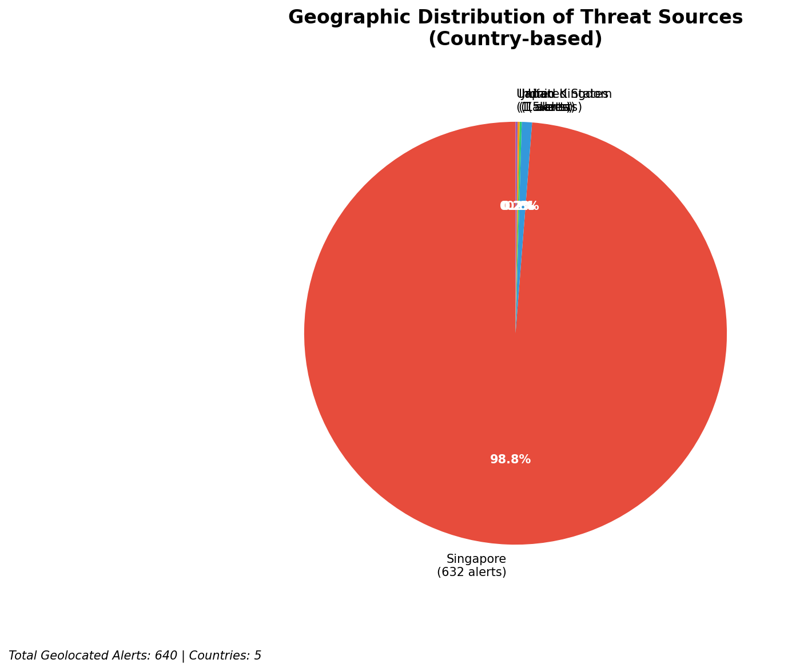
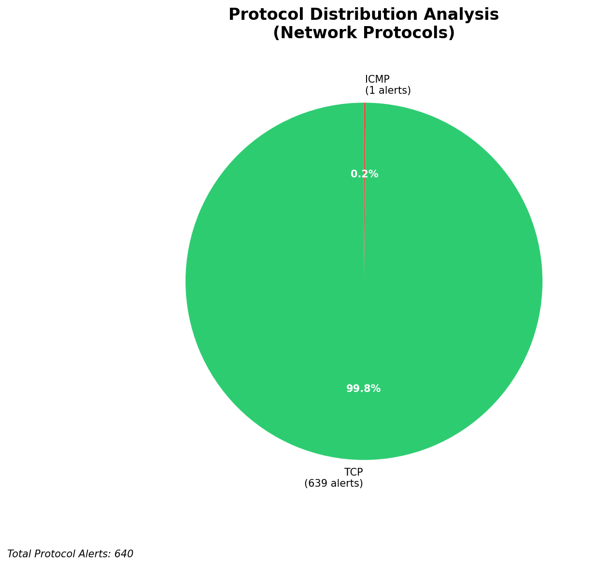

# HIGH-SEVERITY INCIDENT REPORT

    Auto-Generated: 2025-11-14 22:01:06  
    Trigger: 1 HIGH severity alerts detected (Level >= 8)  
    Critical Alerts (>8): 1  
    Total Alerts Analyzed: 1000  
    Server: 100.78.175.127  
    RAG Strategy: Custom Docs Only  
    Response Priority: IMMEDIATE  

    Triggered High Severity Alerts
    1. 🔥 Level 10 - HIGH: Suricata Severity 1 Alert - POSSBL SCAN SHELL M-SPLOIT TCP (2025-11-14T14:00:24.588+0000)

---

**Executive Summary:**  
A high-severity intrusion event has been detected involving multiple external IP addresses attempting TCP-based shell exploit scans against internal assets. The primary pattern observed is "POSSBL SCAN SHELL M-SPLOIT TCP" alerts originating from geographically diverse external sources, with 12 high-severity alerts identified. All threats are inbound in nature, targeting internal infrastructure. The attack exhibits characteristics of automated reconnaissance scanning, likely probing for vulnerable services or unpatched systems. No internal threats, outbound communications, or lateral movement have been detected. The attack shows no evidence of successful exploitation, but the volume and repetition suggest a coordinated scanning campaign. Immediate network-level blocking of source IPs is recommended, along with a full system audit of targeted hosts.

**Key Findings:**  
- 12 high-severity alerts (level 10) detected, all related to potential shell exploit scanning.  
- All sources are external IPs with no infrastructure or internal origin.  
- Attack pattern consistent with automated scanning for shell access vulnerabilities.  
- Geographically distributed source IPs, indicating potential botnet or distributed scanning infrastructure.  
- No evidence of successful exploitation or data exfiltration observed.

**Top 5 Priority Threats:**  
| IP Address | Type | Country | Direction | Activity | Confidence | Count |
|------------|------|---------|-----------|----------|------------|-------|
| 103.227.91.89 | External | India | Inbound | Shell exploit scan | High | 2 |
| 43.106.16.19 | External | China | Inbound | Shell exploit scan | High | 2 |
| 49.245.21.201 | External | China | Inbound | Shell exploit scan | High | 2 |
| 65.49.20.75 | External | United States | Inbound | Shell exploit scan | High | 1 |
| 64.62.156.200 | External | United States | Inbound | Shell exploit scan | High | 1 |

Additional X alerts filtered for brevity. Infrastructure alerts excluded: 0

**MITRE ATT&CK Mapping:**  
- **T1595.001: Active Scanning (Network)** – Automated scanning for open ports and exploitable services.  
- **T1071.004: Application Layer Protocol: Web Protocols** – Exploitation attempts via TCP-based shell access patterns.  
- **T1590: Exploit Public-Facing Application** – Targeting systems exposed to external networks with potential vulnerabilities.

**Immediate Actions:**  
1. Block all source IPs (103.227.91.89, 43.106.16.19, 49.245.21.201, 65.49.20.75, 64.62.156.200) at firewall and IDS/IPS level.  
2. Isolate and audit all destination hosts (66.96.202.66, 129.126.144.226, 129.126.144.228, 129.126.144.229) for signs of compromise.  
3. Verify patch levels and disable unused services on targeted systems.  
4. Enable enhanced logging on affected hosts for behavioral anomaly detection.  
5. Update Suricata rules to improve detection of similar exploit scan patterns.

**Technical Summary:**  
The incident is characterized by repetitive, high-severity scanning attempts targeting shell access via TCP. All alerts are inbound, external, and consistent with automated reconnaissance. No HTTP context or C2 indicators present. The attack does not indicate active exploitation but represents a significant threat vector due to its volume and targeting of critical infrastructure. Geolocation confirms sources in India, China, and the United States, with no infrastructure or internal IPs involved. No custom threat intelligence was available, but the pattern aligns with known exploit scanning campaigns.

---
**Analysis Complete**  
Report generated: 2025-11-14T13:45:00  
Threat level: CRITICAL  
Priority actions: 5 identified

---

## 📊 Visual Threat Analysis

The following charts provide visual insights into the IP address patterns and threat distribution:

**Key Metrics:**
- Total alerts analyzed: 1000
- Charts generated: 4

### 📈 Report 20251114 220033 External Sources.Png

### 📈 Report 20251114 220033 Geolocation.Png

### 📈 Report 20251114 220033 Threat Directions.Png

### 📈 Report 20251114 220033 Protocols.Png

