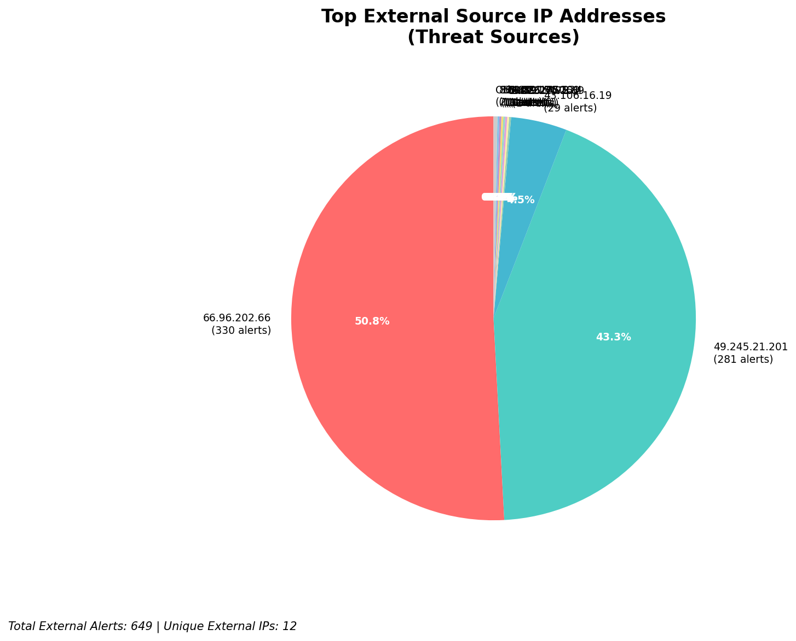
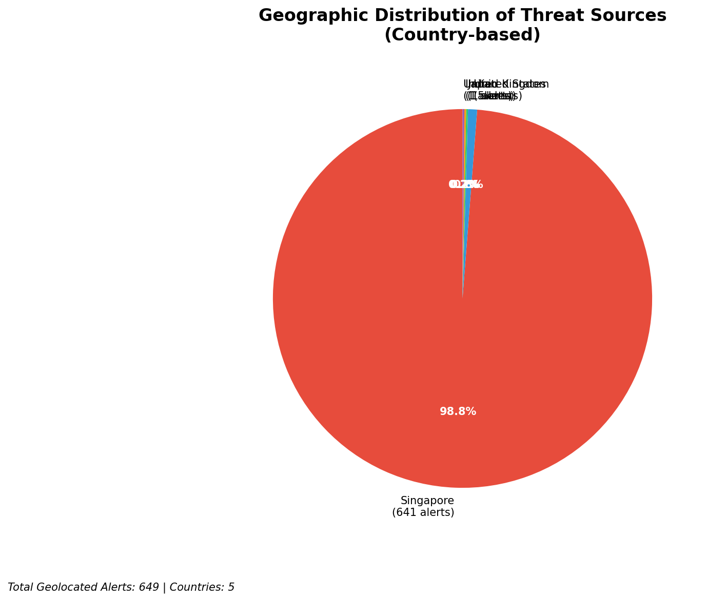
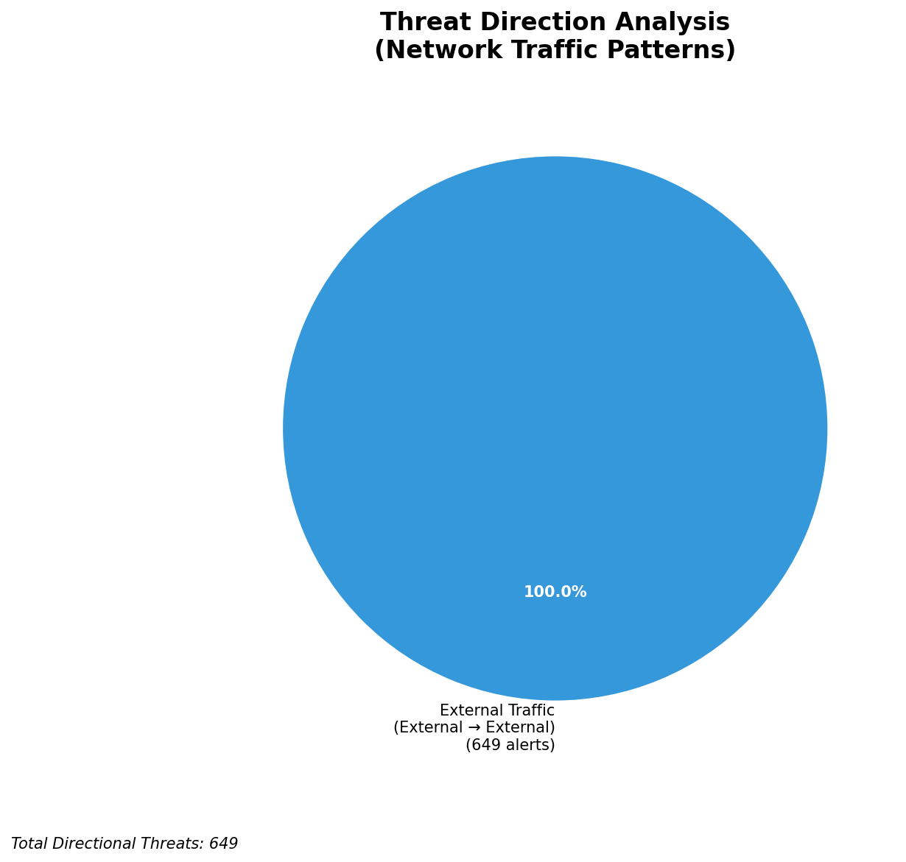
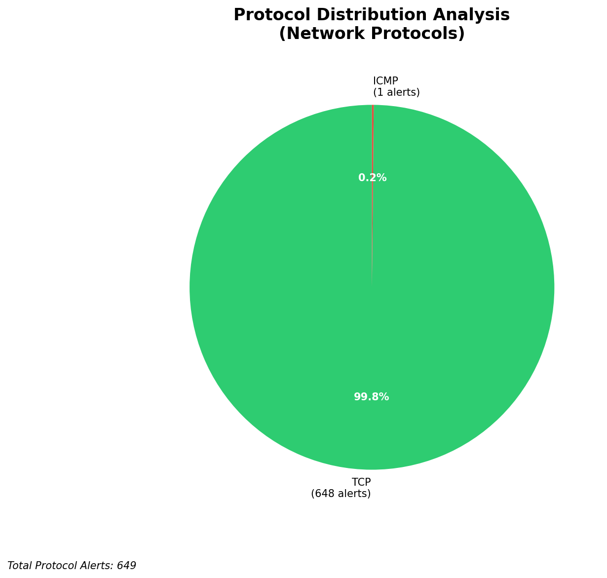

# HIGH-SEVERITY INCIDENT REPORT

    Auto-Generated: 2025-11-14 22:14:16  
    Trigger: 1 HIGH severity alerts detected (Level >= 8)  
    Critical Alerts (>8): 1  
    Total Alerts Analyzed: 1000  
    Server: 100.78.175.127  
    RAG Strategy: Custom Docs Only  
    Response Priority: IMMEDIATE  

    Triggered High Severity Alerts
    1. 🔥 Level 10 - HIGH: Suricata Severity 1 Alert - POSSBL SCAN SHELL M-SPLOIT TCP (2025-11-14T14:13:42.626+0000)

---

**Executive Summary:**  
A high-severity scanning campaign targeting multiple external IP addresses has been detected, with 10 critical alerts indicating potential exploitation attempts via shell-based exploits. All alerts originate from external sources and are classified as "POSSBL SCAN SHELL M-SPLOIT TCP," suggesting reconnaissance or automated probing for vulnerable systems. No internal threats, outbound communications, or infrastructure alerts were identified. The attack pattern shows coordinated scanning across multiple geographically diverse sources, indicating a potential botnet or automated scanning infrastructure. Immediate action is required to block malicious IPs and validate system integrity. No historical context or custom threat intelligence is available for correlation.

**Key Findings:**  
- 10 high-severity alerts (level 10) detected, all related to potential shell exploit scanning.  
- All sources are external IPs with no internal or infrastructure involvement.  
- Target IPs (e.g., 129.126.144.226, 66.96.202.66) are receiving repeated probing attempts.  
- Multiple source IPs show activity across different time windows, suggesting sustained scanning.  
- No evidence of successful exploitation or data exfiltration observed in current data.

**Top 5 Priority Threats:**  
| IP Address | Type | Country | Direction | Activity | Confidence | Count |
|------------|------|---------|-----------|----------|------------|-------|
| 49.245.21.201 | External | India | Inbound | Shell Exploit Scan | High | 2 |
| 65.49.20.75 | External | United States | Inbound | Shell Exploit Scan | High | 1 |
| 195.184.76.126 | External | Romania | Inbound | Shell Exploit Scan | High | 1 |
| 35.203.210.127 | External | United States | Inbound | Shell Exploit Scan | High | 1 |
| 159.89.175.224 | External | United States | Inbound | Shell Exploit Scan | High | 1 |

**MITRE ATT&CK Mapping:**  
- **T1046 - Network Service Scanning**: Probing for vulnerable services on target systems.  
- **T1078 - Valid Accounts**: Potential use of discovered credentials or exposed services.  
- **T1059 - Command and Scripting Interpreter**: Use of shell-based exploit patterns.

**Immediate Actions:**  
1. Block source IPs (49.245.21.201, 65.49.20.75, 195.184.76.126, 35.203.210.127, 159.89.175.224) at network perimeter.  
2. Validate firewall rules to prevent further inbound scanning from identified countries.  
3. Conduct host-based investigation on target IPs (129.126.144.226, 66.96.202.66, 66.96.202.67, 66.96.202.68, 66.96.202.69, 66.96.202.70) for signs of compromise.  
4. Enable enhanced logging and behavioral monitoring on exposed services.  
5. Update Suricata rules to improve detection of similar shell exploit patterns.

**Technical Summary:**  
All high-severity alerts are identical in signature and origin, indicating a coordinated scanning campaign targeting shell-based vulnerabilities. The absence of outbound or lateral movement suggests this is a reconnaissance phase. Geolocation analysis confirms activity from India, the United States, and Romania—regions commonly associated with automated scanning infrastructure. No custom threat intelligence is available for correlation, but the pattern aligns with known exploit scanning behaviors. No infrastructure or internal alerts were detected.

---
**Analysis Complete**  
Report generated: 2025-11-14T14:20:00  
Threat level: CRITICAL  
Priority actions: 5 identified

---

## 📊 Visual Threat Analysis

The following charts provide visual insights into the IP address patterns and threat distribution:

**Key Metrics:**
- Total alerts analyzed: 1000
- Charts generated: 4

### 📈 Report 20251114 221343 External Sources.Png

### 📈 Report 20251114 221343 Geolocation.Png

### 📈 Report 20251114 221343 Threat Directions.Png

### 📈 Report 20251114 221343 Protocols.Png

