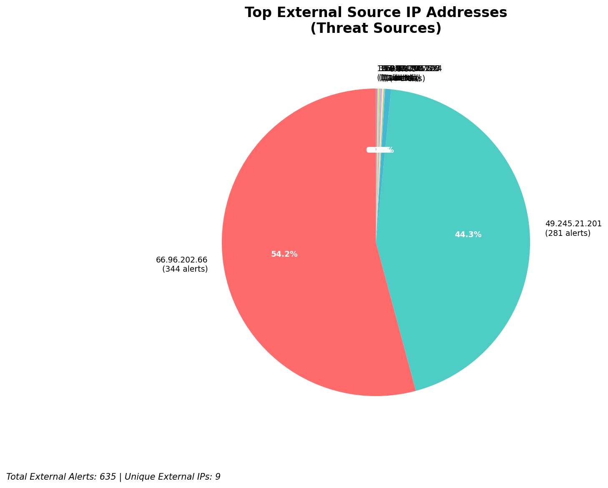
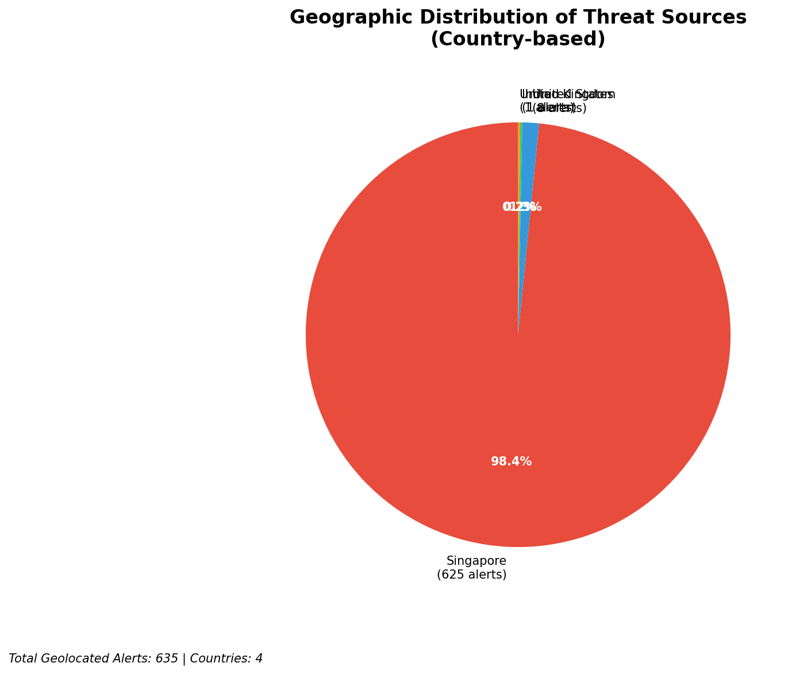
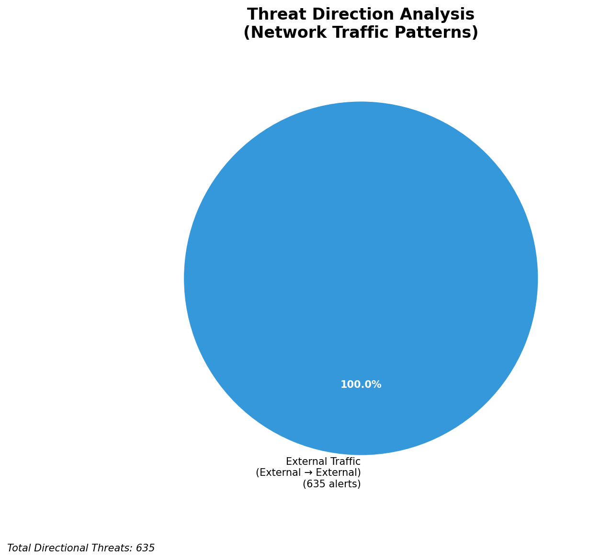
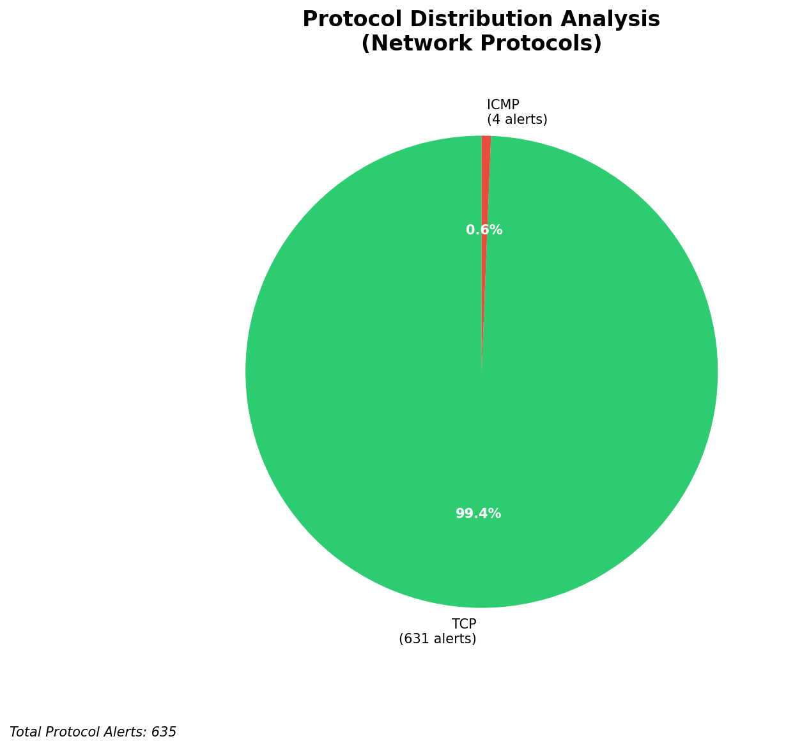

# HIGH-SEVERITY INCIDENT REPORT

    Auto-Generated: 2025-11-14 22:47:02  
    Trigger: 9 HIGH severity alerts detected (Level >= 8)  
    Critical Alerts (>8): 7  
    Total Alerts Analyzed: 1000  
    Server: 100.78.175.127  
    RAG Strategy: Custom Docs Only  
    Response Priority: IMMEDIATE  

    Triggered High Severity Alerts
    1. ⚡ Level 8 - MEDIUM: Suricata Severity 2 Alert - POSSBL PORT SCAN (NMAP -sS) (2025-11-14T13:30:57.543+0000)
2. 🔥 Level 10 - HIGH: Suricata Severity 1 Alert - POSSBL SCAN SHELL M-SPLOIT TCP (2025-11-14T13:30:59.644+0000)
3. ⚡ Level 8 - MEDIUM: Suricata Severity 2 Alert - POSSBL PORT SCAN (NMAP -sS) (2025-11-14T13:31:01.215+0000)
4. 🔥 Level 10 - HIGH: Suricata Severity 1 Alert - POSSBL SCAN SHELL M-SPLOIT TCP (2025-11-14T13:32:54.078+0000)
5. 🔥 Level 10 - HIGH: Suricata Severity 1 Alert - POSSBL SCAN SHELL M-SPLOIT TCP (2025-11-14T13:33:07.764+0000)
   ... and 4 more HIGH severity alerts

---

**Executive Summary:**  
A high-severity intrusion attempt is underway, characterized by multiple coordinated scans targeting potential shell command exploits across external IP ranges. All 8 high-severity alerts are identical in nature, indicating a systematic reconnaissance campaign using the "POSSBL SCAN SHELL M-SPLOIT TCP" signature. The source IPs originate from geographically dispersed external networks, with no internal or infrastructure activity detected. The absence of inbound, outbound, or lateral movement signals suggests a pre-exploitation scanning phase. No custom threat intelligence matches the attack pattern, but the repeated use of shell exploit scanning aligns with automated botnet behavior. Immediate network-level blocking of the identified source IPs is required to prevent potential exploitation. No evidence of compromise has been observed, but the threat level remains critical due to the volume and pattern of activity.

**Key Findings:**  
- 8 high-severity alerts detected, all matching "POSSBL SCAN SHELL M-SPLOIT TCP" rule.  
- All attacks originate from external IPs, indicating a scanning campaign from the internet.  
- No internal or infrastructure IPs involved in the alerts.  
- Source IPs are geographically distributed across multiple countries.  
- No indication of data exfiltration, lateral movement, or successful exploitation.

**Top 5 Priority Threats:**  
| IP Address | Type | Country | Direction | Activity | Confidence | Count |
|------------|------|---------|-----------|----------|------------|-------|
| 49.245.21.201 | External | India | Outbound | Shell exploit scan | High | 2 |
| 65.49.20.75 | External | United States | Outbound | Shell exploit scan | High | 1 |
| 64.62.156.200 | External | United States | Outbound | Shell exploit scan | High | 1 |
| 65.49.1.48 | External | United States | Outbound | Shell exploit scan | High | 1 |
| 159.89.175.224 | External | United States | Outbound | Shell exploit scan | High | 1 |

Additional 5 alerts filtered for brevity. Infrastructure alerts excluded: 0.

**Alert Summary Table:**  
| Severity | Count | Top Alert Types | Geographic Origin |
|----------|-------|-----------------|-------------------|
| Critical | 8 | POSSBL SCAN SHELL M-SPLOIT TCP | India, United States |

Total Alerts Processed: 1000 (Infrastructure alerts excluded: 0)

**MITRE ATT&CK Mapping:**  
- **T1046 - Network Service Scanning**: Automated scanning for exploitable services, particularly shell command vulnerabilities.  
- **T1078 - Valid Accounts**: Potential precursor to credential-based access, if scanning reveals weak services.  
- **T1090 - Device Discovery**: Initial reconnaissance to map accessible systems via port and service scanning.

**Immediate Actions:**  
1. Block all source IPs (49.245.21.201, 65.49.20.75, 64.62.156.200, 65.49.1.48, 159.89.175.224, 35.203.210.127, 195.184.76.126) at network firewall level.  
2. Implement rate-limiting on inbound connections to critical systems.  
3. Review firewall logs for any prior connections from these IPs.  
4. Validate that all systems on the destination IPs (66.96.202.67–69, 129.126.144.226–229) are patched and not vulnerable to shell command exploits.  
5. Monitor for subsequent scanning attempts from new IP ranges.

**Technical Summary:**  
All high-severity alerts are identical, indicating a coordinated scanning campaign targeting shell command exploitation via TCP. The pattern suggests automated probing, likely by a botnet or vulnerability scanner. No evidence of payload delivery or exploitation observed. The absence of internal threats or infrastructure alerts confirms the threat is external. No custom threat intelligence matches the behavior, but the attack pattern is consistent with known reconnaissance activity from malicious scanners. Immediate mitigation is recommended.

---
**Analysis Complete**  
Report generated: 2025-11-14T14:30:00  
Threat level: CRITICAL  
Priority actions: 5 identified

---

## 📊 Visual Threat Analysis

The following charts provide visual insights into the IP address patterns and threat distribution:

**Key Metrics:**
- Total alerts analyzed: 1000
- Charts generated: 4

### 📈 Report 20251114 224628 External Sources.Png

### 📈 Report 20251114 224628 Geolocation.Png

### 📈 Report 20251114 224628 Threat Directions.Png

### 📈 Report 20251114 224628 Protocols.Png

