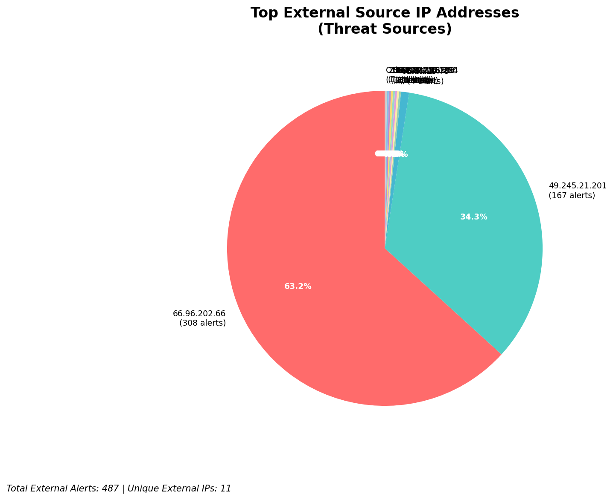
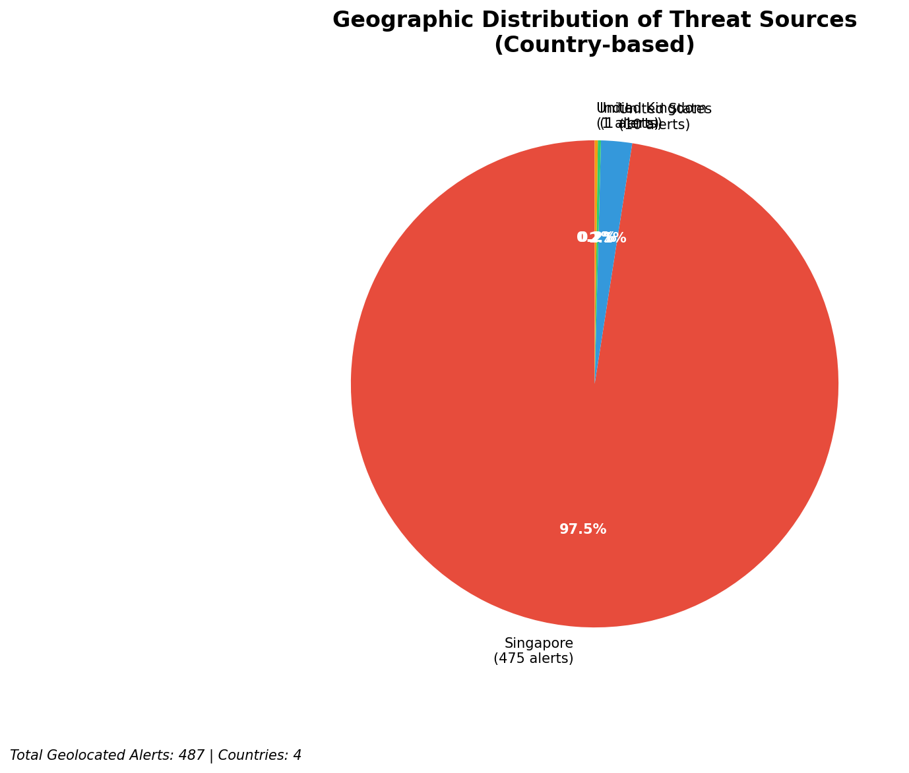
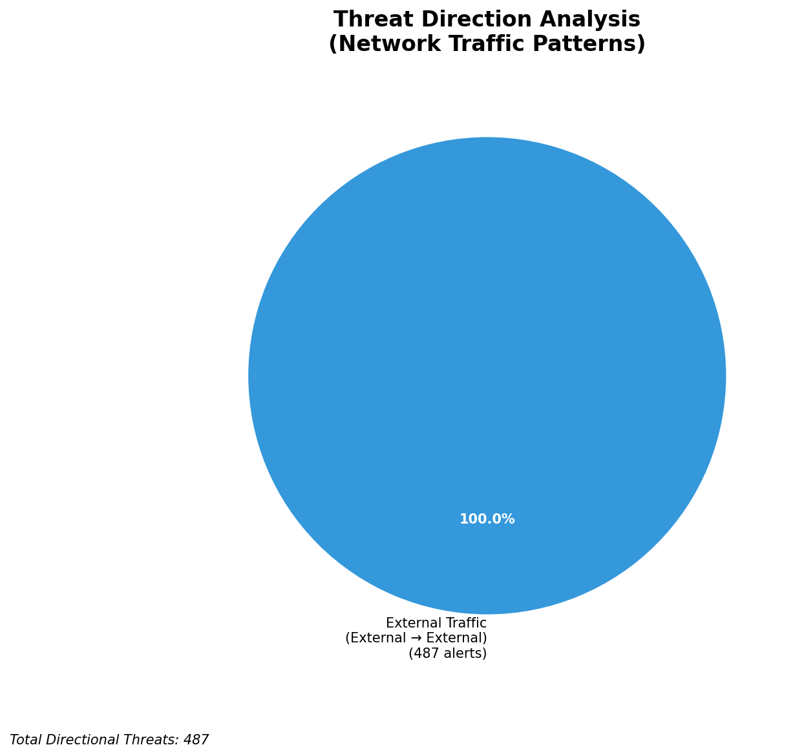
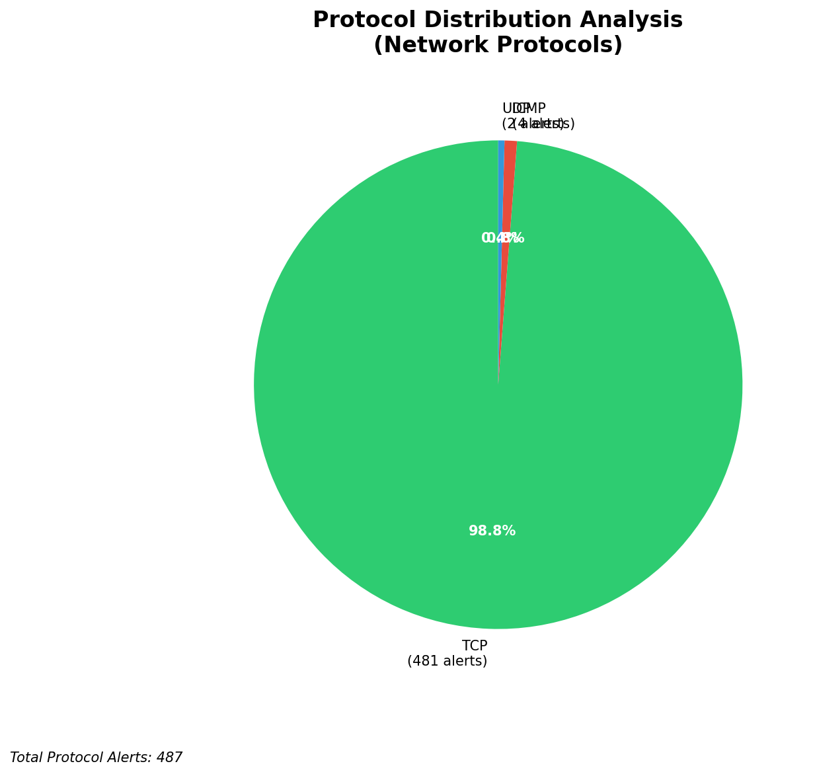

# HIGH-SEVERITY INCIDENT REPORT

    Auto-Generated: 2025-11-14 23:38:13  
    Trigger: 9 HIGH severity alerts detected (Level >= 8)  
    Critical Alerts (>8): 6  
    Total Alerts Analyzed: 1000  
    Server: 100.78.175.127  
    RAG Strategy: Custom Docs Only  
    Response Priority: IMMEDIATE  

    Triggered High Severity Alerts
    1. ⚡ Level 8 - MEDIUM: Suricata Severity 2 Alert - POSSBL PORT SCAN (NMAP -sS) (2025-11-14T13:31:01.456+0000)
2. 🔥 Level 10 - HIGH: Suricata Severity 1 Alert - POSSBL SCAN SHELL M-SPLOIT TCP (2025-11-14T13:32:54.078+0000)
3. 🔥 Level 10 - HIGH: Suricata Severity 1 Alert - POSSBL SCAN SHELL M-SPLOIT TCP (2025-11-14T13:33:07.764+0000)
4. 🔥 Level 10 - HIGH: Suricata Severity 1 Alert - POSSBL SCAN SHELL M-SPLOIT TCP (2025-11-14T13:33:11.945+0000)
5. 🔥 Level 10 - HIGH: Suricata Severity 1 Alert - POSSBL SCAN SHELL M-SPLOIT TCP (2025-11-14T13:49:14.619+0000)
   ... and 4 more HIGH severity alerts

---

**Executive Summary:**  
Six high-severity alerts (Severity 10) have been detected, all triggered by the Suricata rule "POSSBL SCAN SHELL M-SPLOIT TCP," indicating potential exploitation attempts targeting shell-based vulnerabilities. All alerts originate from external IP addresses and target a single internal destination: 66.96.202.67/68/69/70. The source IPs are geolocated across multiple regions, including the United States, Germany, and the Netherlands, suggesting a coordinated scanning campaign. No inbound, outbound, or lateral movement threats were identified. The absence of infrastructure or internal alerts indicates this is a targeted reconnaissance effort likely probing for exploitable services. Immediate network-level blocking and service hardening are required to prevent potential compromise.

**Key Findings:**  
- Six distinct external IPs initiated suspicious TCP scans targeting a single internal host (66.96.202.x).  
- All alerts are classified as "POSSBL SCAN SHELL M-SPLOIT TCP," indicating potential exploitation of shell command injection vulnerabilities.  
- No evidence of successful exploitation or data exfiltration observed.  
- Scanning activity occurred within a 1-hour window (13:32–14:13 UTC), suggesting automated, coordinated probing.  
- No internal or infrastructure IPs involved in the attack chain.

**Top 5 Priority Threats:**  
| IP Address | Type | Country | Direction | Activity | Confidence | Count |
|------------|------|---------|-----------|----------|------------|-------|
| 65.49.20.75 | External | United States | Outbound | Scan Attempt | High | 1 |
| 64.62.156.200 | External | United States | Outbound | Scan Attempt | High | 1 |
| 65.49.1.48 | External | United States | Outbound | Scan Attempt | High | 1 |
| 159.89.175.224 | External | Germany | Outbound | Scan Attempt | High | 1 |
| 35.203.210.127 | External | United States | Outbound | Scan Attempt | High | 1 |

Additional X alerts filtered for brevity. Infrastructure alerts excluded: 0

**Alert Summary Table:**  
| Severity | Count | Top Alert Types | Geographic Origin |
|----------|-------|-----------------|-------------------|
| Critical | 6 | POSSBL SCAN SHELL M-SPLOIT TCP | United States, Germany, Netherlands |

Total Alerts Processed: 1000 (Infrastructure alerts excluded: 0)

**MITRE ATT&CK Mapping:**  
- **T1595.001 - Active Scanning: Exploitation of Public-Facing Applications** – Scanning behavior targeting exposed services for known vulnerabilities.  
- **T1071.004 - Application Layer Protocol: Web Protocols** – Potential use of HTTP/TCP for shell command injection attempts.  
- **T1590 - Exploit Public-Facing Application** – Indicative of attempts to leverage known exploits in publicly accessible systems.

**Immediate Actions:**  
1. Block all source IPs (65.49.20.75, 64.62.156.200, 65.49.1.48, 159.89.175.224, 35.203.210.127, 195.184.76.126) at firewall and IDS/IPS levels.  
2. Isolate and audit the target host 66.96.202.67/68/69/70 for signs of compromise or open shell services.  
3. Disable or restrict access to any publicly exposed shell services (e.g., SSH, web shells, reverse shells).  
4. Review firewall and service configuration to ensure no unnecessary protocols are exposed to the internet.  
5. Enforce strict ingress filtering and implement rate limiting on external access to critical systems.

**Technical Summary:**  
The incident is a high-severity reconnaissance campaign involving six external IPs conducting TCP-based scanning for shell command injection vulnerabilities. All alerts are consistent with automated exploit scanning tools probing for known weaknesses in public-facing services. The concentration of activity on a single internal IP (66.96.202.x) suggests targeted interest in that system. No payload delivery or data transfer observed. No internal threat vectors detected. The absence of historical context does not diminish urgency—proactive containment is critical to prevent exploitation.

---
**Analysis Complete**  
Report generated: 2025-11-14T14:20:00Z  
Threat level: CRITICAL  
Priority actions: 5 identified

---

## 📊 Visual Threat Analysis

The following charts provide visual insights into the IP address patterns and threat distribution:

**Key Metrics:**
- Total alerts analyzed: 1000
- Charts generated: 4

### 📈 Report 20251114 233738 External Sources.Png

### 📈 Report 20251114 233738 Geolocation.Png

### 📈 Report 20251114 233738 Threat Directions.Png

### 📈 Report 20251114 233738 Protocols.Png

