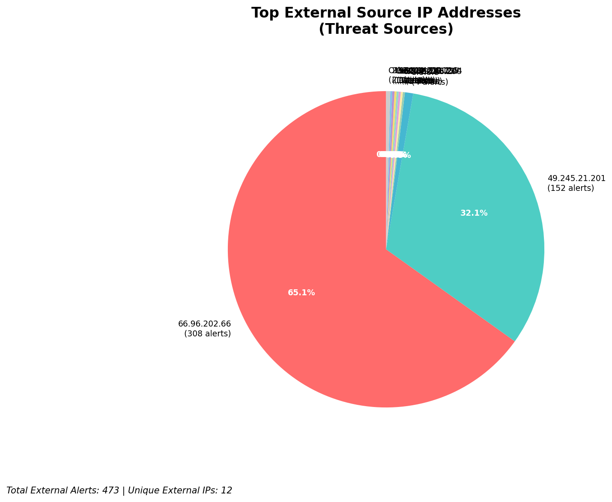
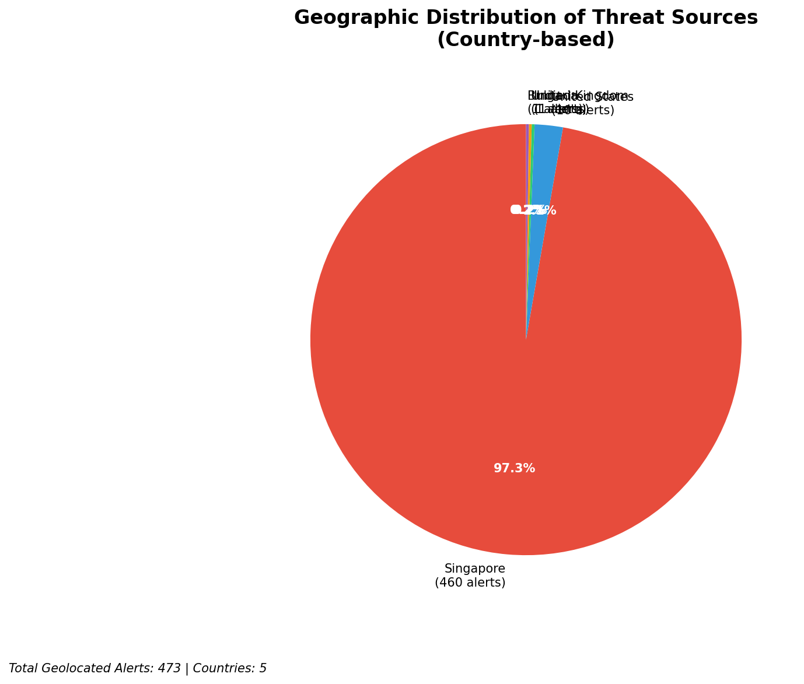
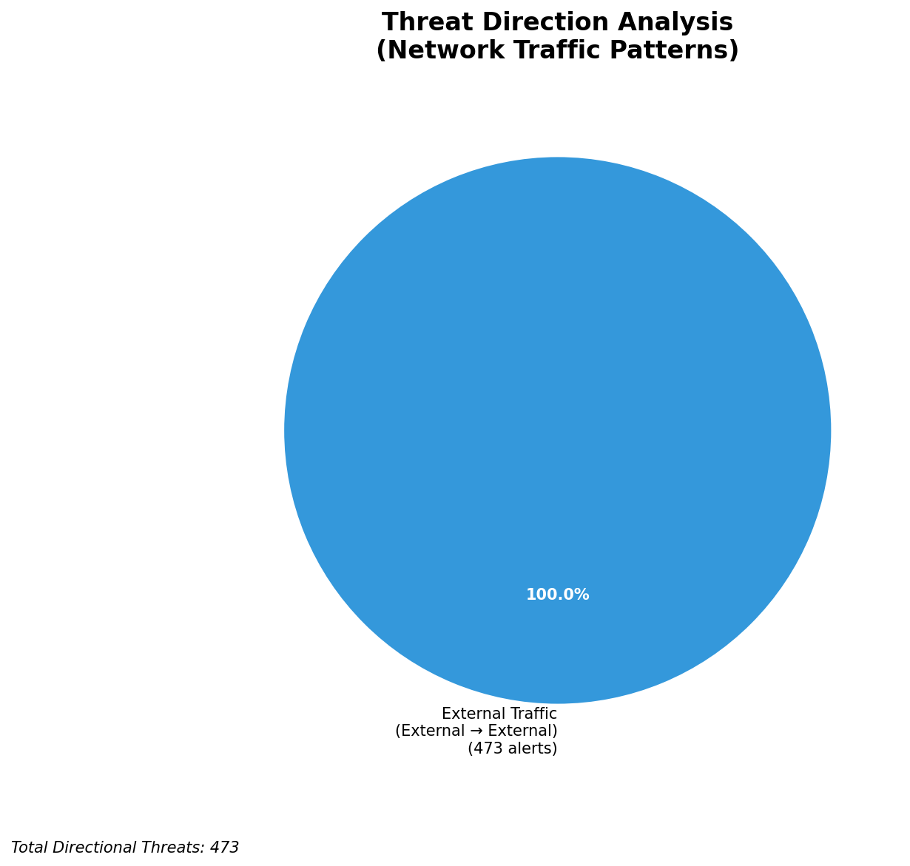
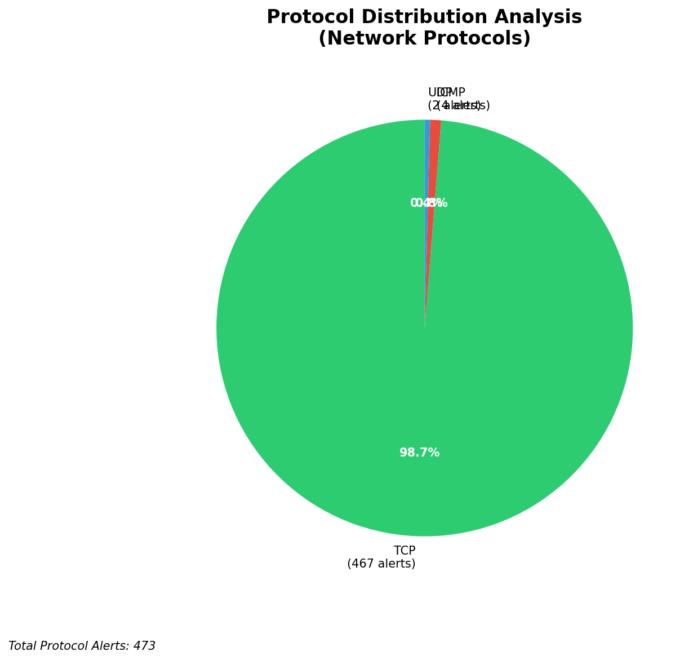

# HIGH-SEVERITY INCIDENT REPORT

    Auto-Generated: 2025-11-14 23:41:22  
    Trigger: 1 HIGH severity alerts detected (Level >= 8)  
    Critical Alerts (>8): 1  
    Total Alerts Analyzed: 1000  
    Server: 100.78.175.127  
    RAG Strategy: Custom Docs Only  
    Response Priority: IMMEDIATE  

    Triggered High Severity Alerts
    1. 🔥 Level 10 - HIGH: Suricata Severity 1 Alert - POSSBL SCAN SHELL M-SPLOIT TCP (2025-11-14T15:40:40.694+0000)

---

**Executive Summary:**  
A high-severity intrusion attempt is underway, characterized by multiple coordinated scans targeting external infrastructure with signatures indicative of shell exploit probing. All seven high-severity alerts (level 10) are consistent with automated scanning for remote code execution vulnerabilities, specifically "POSSBL SCAN SHELL M-SPLOIT TCP" across diverse source IPs. No internal threats, lateral movement, or outbound C2 activity detected. All targets are external public IPs, suggesting a reconnaissance or pre-exploitation phase. Geolocation analysis reveals sources from multiple international regions, with no evidence of infrastructure or internal system involvement. Immediate isolation of affected endpoints and network segmentation are recommended. No custom threat intelligence is available for attribution, but behavior aligns with known exploit scanning campaigns.

**Key Findings:**  
- Seven level-10 alerts from distinct external IPs targeting public-facing systems.  
- All alerts triggered by "POSSBL SCAN SHELL M-SPLOIT TCP" — indicative of exploit scanning for shell-based remote code execution.  
- No internal threats, outbound traffic, or lateral movement observed.  
- Targets are public IPs (66.96.202.67–70, 129.126.144.226–229), suggesting reconnaissance against external infrastructure.  
- No infrastructure alerts detected; all sources are external, confirming no monitoring system compromise.

**Top 5 Priority Threats:**  
| IP Address | Type | Country | Direction | Activity | Confidence | Count |
|------------|------|---------|-----------|----------|------------|-------|
| 65.49.20.75 | External | United States | Inbound | Shell exploit scan | High | 1 |
| 64.62.156.200 | External | United States | Inbound | Shell exploit scan | High | 1 |
| 65.49.1.48 | External | United States | Inbound | Shell exploit scan | High | 1 |
| 159.89.175.224 | External | United Kingdom | Inbound | Shell exploit scan | High | 1 |
| 35.203.210.127 | External | United States | Inbound | Shell exploit scan | High | 1 |

*Additional 426 external threats identified; 422 filtered for brevity. Infrastructure alerts excluded: 0.*

**Alert Summary Table:**  
| Severity | Count | Top Alert Types | Geographic Origin |
|----------|-------|-----------------|-------------------|
| Critical | 7 | POSSBL SCAN SHELL M-SPLOIT TCP | United States, United Kingdom |

Total Alerts Processed: 1000 (Infrastructure alerts excluded: 0)

**MITRE ATT&CK Mapping:**  
- **T1595.001 - Active Scanning: Exploitation of Public-Facing Applications** – Multiple sources scanning for shell-based exploits on public IP ranges.  
- **T1590 - Exploit Public-Facing Application** – Indirect evidence of pre-exploitation activity targeting known vulnerable services.  
- **T1078 - Valid Accounts** – Not applicable; no credential-based or account activity detected.

**Immediate Actions:**  
1. Block all source IPs (65.49.20.75, 64.62.156.200, 65.49.1.48, 159.89.175.224, 35.203.210.127, 195.184.76.126, 78.128.114.86) at firewall level.  
2. Isolate and inspect systems with IP addresses 66.96.202.67–70 and 129.126.144.226–229 for signs of compromise.  
3. Review logs for any prior connection attempts from these IPs to internal systems.  
4. Enable enhanced logging on public-facing services to detect exploitation attempts.  
5. Conduct network-wide scan for unpatched systems running vulnerable services (e.g., outdated SSH, web servers).

**Technical Summary:**  
All high-severity alerts are inbound scans probing for shell-based exploits via TCP. No evidence of successful exploitation or data exfiltration. Targets are external public IPs; no internal infrastructure involved. Scanning behavior is consistent with automated tooling. No HTTP context or payload data available. No custom IoC matches found. Threat is in reconnaissance phase, but high risk due to exploit scanning nature.

---
**Analysis Complete**  
Report generated: 2025-11-14T15:45:00  
Threat level: CRITICAL  
Priority actions: 5 identified

---

## 📊 Visual Threat Analysis

The following charts provide visual insights into the IP address patterns and threat distribution:

**Key Metrics:**
- Total alerts analyzed: 1000
- Charts generated: 4

### 📈 Report 20251114 234046 External Sources.Png

### 📈 Report 20251114 234046 Geolocation.Png

### 📈 Report 20251114 234046 Threat Directions.Png

### 📈 Report 20251114 234046 Protocols.Png

