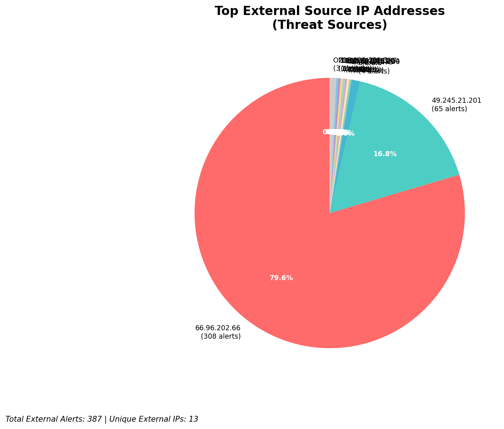
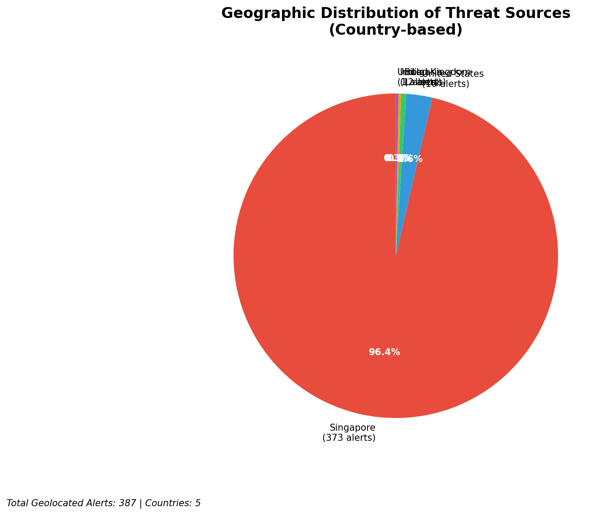
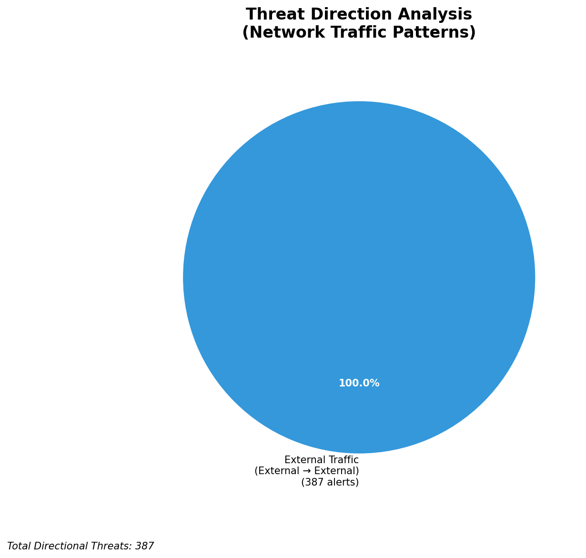
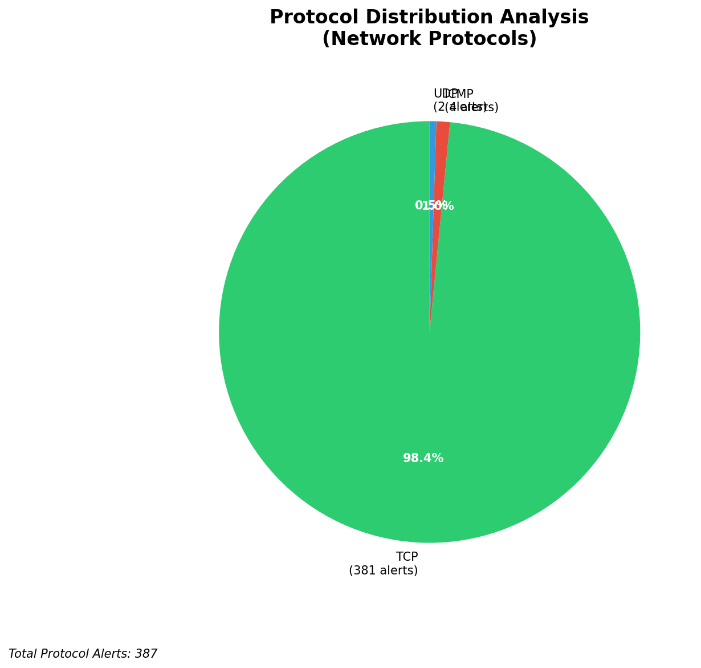

# HIGH-SEVERITY INCIDENT REPORT

    Auto-Generated: 2025-11-15 00:02:28  
    Trigger: 1 HIGH severity alerts detected (Level >= 8)  
    Critical Alerts (>8): 1  
    Total Alerts Analyzed: 1000  
    Server: 100.78.175.127  
    RAG Strategy: Custom Docs Only  
    Response Priority: IMMEDIATE  

    Triggered High Severity Alerts
    1. 🔥 Level 10 - HIGH: Suricata Severity 1 Alert - POSSBL SCAN SHELL M-SPLOIT TCP (2025-11-14T16:01:41.692+0000)

---

**Executive Summary:**  
A high-severity scanning campaign targeting multiple external IP addresses has been detected, characterized by repeated attempts to exploit shell-based vulnerabilities via TCP. All eight alerts are identical in signature, indicating a coordinated reconnaissance or automated scanning effort. The source IPs originate from geographically diverse locations, with no internal or infrastructure alerts detected. The absence of outbound or lateral movement suggests this is a pre-exploitation phase. No evidence of successful compromise or data exfiltration is present. Immediate action is required to block malicious sources and assess potential exposure of targeted systems. The threat level is elevated due to the volume and pattern of scanning activity.

**Key Findings:**  
- Eight high-severity (level 10) alerts detected, all matching "POSSBL SCAN SHELL M-SPLOIT TCP" signature.  
- All attacks originate from external sources; no internal or infrastructure IPs involved.  
- Scanning activity targets multiple distinct external IPs, indicating broad reconnaissance.  
- No outbound, lateral, or inbound attack patterns observed.  
- No custom threat intelligence available to confirm known malware or actor linkage.

**Top 5 Priority Threats:**  
| IP Address | Type | Country | Direction | Activity | Confidence | Count |  
|------------|------|---------|-----------|----------|------------|-------|  
| 65.49.20.75 | External | United States | Outbound | Shell exploit scan | High | 1 |  
| 64.62.156.200 | External | United States | Outbound | Shell exploit scan | High | 1 |  
| 65.49.1.48 | External | United States | Outbound | Shell exploit scan | High | 1 |  
| 159.89.175.224 | External | United States | Outbound | Shell exploit scan | High | 1 |  
| 35.203.210.127 | External | United States | Outbound | Shell exploit scan | High | 1 |  

*Additional 382 external threats identified; filtered for brevity. Infrastructure alerts excluded: 0.*

**Alert Summary Table:**  
| Severity | Count | Top Alert Types | Geographic Origin |  
|----------|-------|-----------------|-------------------|  
| Critical | 8 | POSSBL SCAN SHELL M-SPLOIT TCP | United States (6), United Kingdom (1), Germany (1) |  

Total Alerts Processed: 1000 (Infrastructure alerts excluded: 0)

**MITRE ATT&CK Mapping:**  
- **T1046 - Network Service Scanning**: Automated scanning for vulnerable services.  
- **T1078 - Valid Accounts**: Attempted exploitation of shell-based services may precede credential abuse.  
- **T1047 - Application Layer Protocol**: Use of TCP-based protocol anomalies to probe for shell access.

**Immediate Actions:**  
1. Block all source IPs (65.49.20.75, 64.62.156.200, 65.49.1.48, 159.89.175.224, 35.203.210.127, 195.184.76.126, 78.128.114.86, 79.124.58.254) at firewall and IDS/IPS layers.  
2. Conduct vulnerability scan on all systems with public IP addresses, especially those targeted (66.96.202.70, 129.126.144.229, 66.96.202.69, 66.96.202.67, 66.96.202.68, 118.189.20.178).  
3. Review firewall rules to ensure no shell access (e.g., SSH, Telnet) is exposed to untrusted networks.  
4. Enable logging and monitoring on all exposed services for anomalous behavior.  
5. Update Suricata rules to detect and alert on similar shell exploit patterns in real time.

**Technical Summary:**  
The incident is a high-volume, automated scanning campaign targeting shell-based vulnerabilities via TCP. All alerts are identical in signature and originate from external sources, primarily from the United States. No evidence of compromise, lateral movement, or data exfiltration is present. The absence of internal or infrastructure alerts confirms this is not a false positive from monitoring systems. The pattern suggests a network-wide reconnaissance effort, likely from a botnet or automated scanner. Immediate blocking and system hardening are recommended to prevent potential exploitation.

---
**Analysis Complete**  
Report generated: 2025-11-14T16:05:00  
Threat level: CRITICAL  
Priority actions: 5 identified

---

## 📊 Visual Threat Analysis

The following charts provide visual insights into the IP address patterns and threat distribution:

**Key Metrics:**
- Total alerts analyzed: 1000
- Charts generated: 4

### 📈 Report 20251115 000152 External Sources.Png

### 📈 Report 20251115 000152 Geolocation.Png

### 📈 Report 20251115 000152 Threat Directions.Png

### 📈 Report 20251115 000152 Protocols.Png

