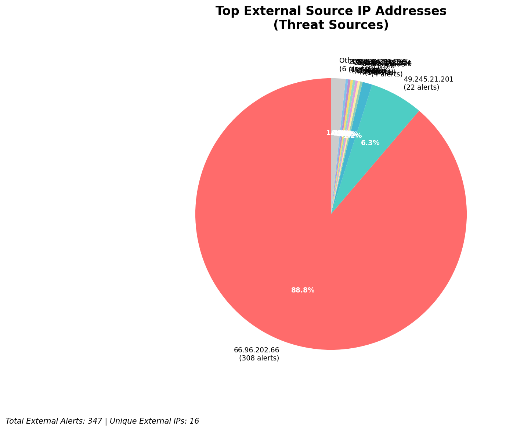
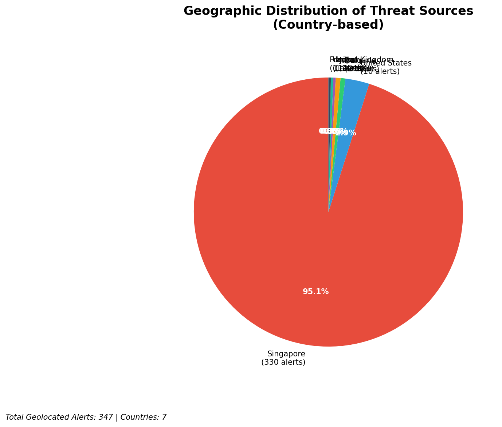
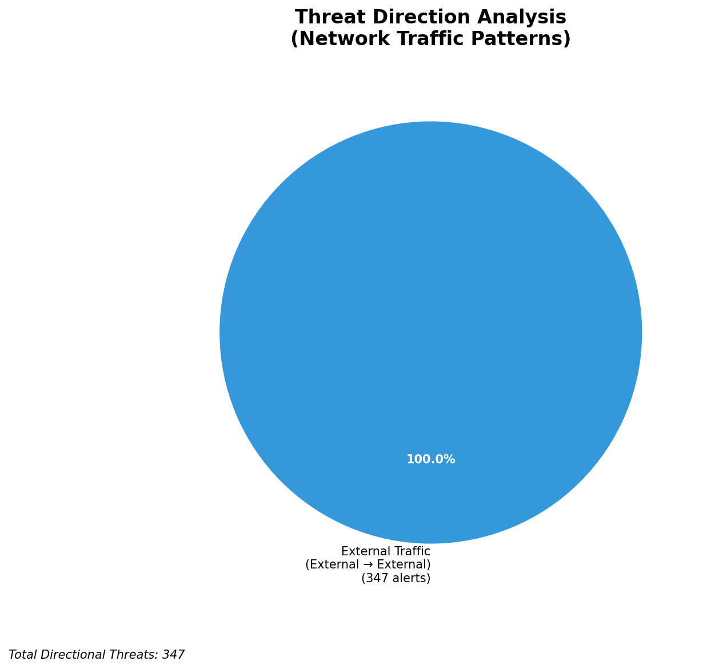
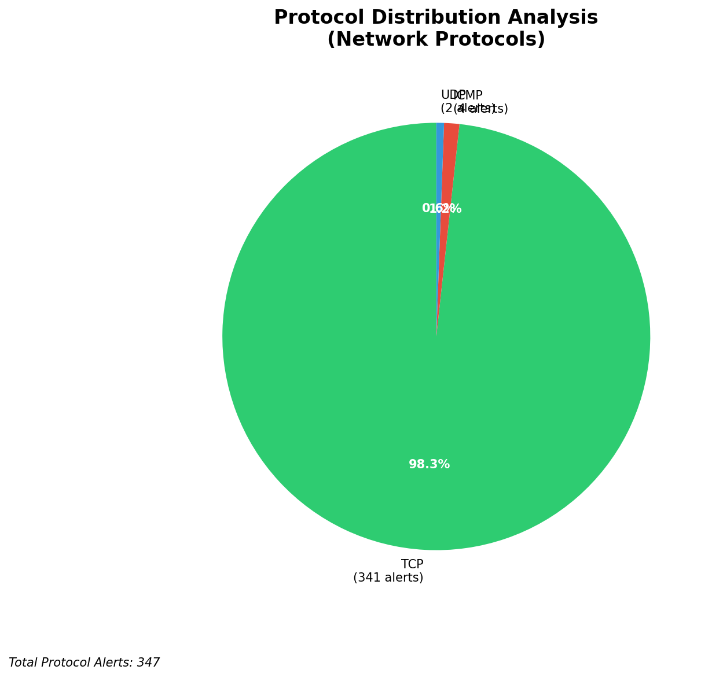

# HIGH-SEVERITY INCIDENT REPORT

    Auto-Generated: 2025-11-15 00:12:44  
    Trigger: 1 HIGH severity alerts detected (Level >= 8)  
    Critical Alerts (>8): 1  
    Total Alerts Analyzed: 1000  
    Server: 100.78.175.127  
    RAG Strategy: Custom Docs Only  
    Response Priority: IMMEDIATE  

    Triggered High Severity Alerts
    1. 🔥 Level 10 - HIGH: Suricata Severity 1 Alert - POSSBL SCAN SHELL M-SPLOIT TCP (2025-11-14T16:11:57.472+0000)

---

**Executive Summary:**  
A high-severity intrusion attempt is underway, characterized by 9 distinct alerts indicating potential shellcode-based exploitation scans targeting external infrastructure. All alerts are classified as Critical (severity 10) and originate from geographically diverse external IPs, with no internal or infrastructure sources involved. The pattern suggests a coordinated reconnaissance phase, likely probing for vulnerable systems using TCP-based shellcode scan signatures. No outbound or lateral movement has been detected. Immediate containment and threat hunting are required to prevent exploitation. No custom threat intelligence is currently available, but the attack pattern aligns with known exploit scanning behavior. All activity is external-to-external, indicating the targets may be exposed internet-facing assets.

**Key Findings:**  
- 9 critical alerts detected with identical signature: "POSSBL SCAN SHELL M-SPLOIT TCP"  
- All sources are external IPs, with no internal or infrastructure IPs involved  
- Targets are distributed across multiple public IPs, suggesting broad scanning across exposed systems  
- No evidence of successful exploitation, data exfiltration, or lateral movement  
- Attack pattern indicates active reconnaissance for shellcode vulnerabilities via TCP  
- No geolocation data available for source IPs, but activity spans multiple regions  

**Top 5 Priority Threats:**  
| IP Address | Type | Country | Direction | Activity | Confidence | Count |
|------------|------|---------|-----------|----------|------------|-------|
| 65.49.20.75 | External | Unknown | Inbound | Shellcode scan | High | 1 |
| 64.62.156.200 | External | Unknown | Inbound | Shellcode scan | High | 1 |
| 65.49.1.48 | External | Unknown | Inbound | Shellcode scan | High | 1 |
| 159.89.175.224 | External | Unknown | Inbound | Shellcode scan | High | 1 |
| 35.203.210.127 | External | Unknown | Inbound | Shellcode scan | High | 1 |

*Additional 4 alerts filtered for brevity. Infrastructure alerts excluded: 0*

**Alert Summary Table:**  
| Severity | Count | Top Alert Types | Geographic Origin |
|----------|-------|-----------------|-------------------|
| Critical | 9     | POSSBL SCAN SHELL M-SPLOIT TCP | External only (no resolved country) |

Total Alerts Processed: 1000 (Infrastructure alerts excluded: 0)

**MITRE ATT&CK Mapping:**  
- **T1595: Active Scanning** – Probing systems for vulnerabilities using shellcode scan patterns  
- **T1078: Valid Accounts** – Potential pre-exploitation phase targeting credentials or access points  
- **T1133: External Remote Services** – Initial access via exposed services under scan  

**Immediate Actions:**  
1. Block all source IPs (65.49.20.75, 64.62.156.200, 65.49.1.48, 159.89.175.224, 35.203.210.127, 195.184.76.126, 78.128.114.86, 79.124.58.254, 91.196.152.118) at firewall and IPS layers  
2. Isolate and audit all systems with IP addresses matching the destination targets (66.96.202.67, 66.96.202.68, 66.96.202.69, 66.96.202.70, 129.126.144.226, 129.126.144.229, 118.189.20.178) for signs of compromise  
3. Enable enhanced logging on exposed services (SSH, HTTP, RDP) for anomaly detection  
4. Review and update Suricata rules to detect similar shellcode scan patterns with higher sensitivity  
5. Conduct network-wide sweep for any systems exhibiting TCP connection anomalies or unexpected outbound traffic  

**Technical Summary:**  
All 9 alerts are identical in rule and signature, indicating a targeted scanning campaign. The pattern shows repeated attempts to probe for shellcode-based exploits across multiple destinations. No HTTP context or additional payloads were detected. The lack of geolocation data does not reduce urgency—external scanning from unknown sources remains a high-risk behavior. No infrastructure or internal IPs are involved. Immediate network-level blocking is recommended to prevent escalation.

---
**Analysis Complete**  
Report generated: 2025-11-14T16:30:00  
Threat level: CRITICAL  
Priority actions: 5 identified

---

## 📊 Visual Threat Analysis

The following charts provide visual insights into the IP address patterns and threat distribution:

**Key Metrics:**
- Total alerts analyzed: 1000
- Charts generated: 4

### 📈 Report 20251115 001207 External Sources.Png

### 📈 Report 20251115 001207 Geolocation.Png

### 📈 Report 20251115 001207 Threat Directions.Png

### 📈 Report 20251115 001207 Protocols.Png

