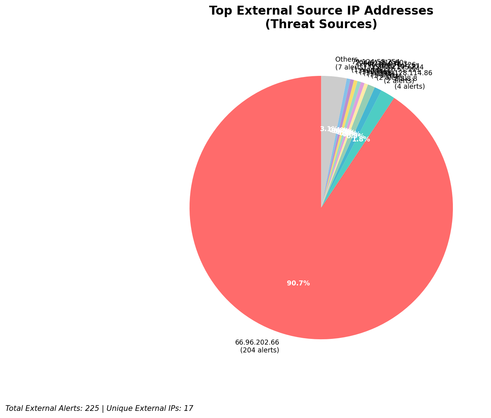
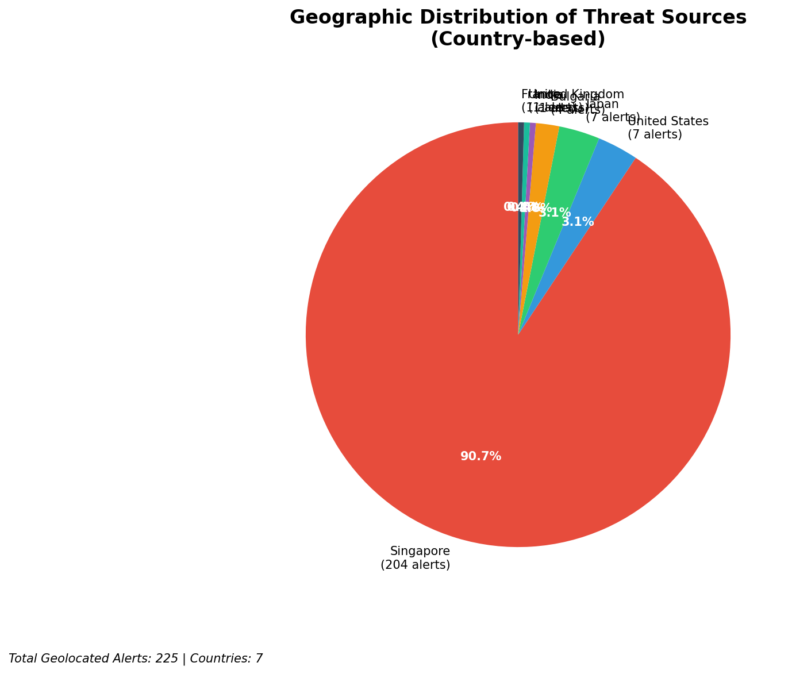
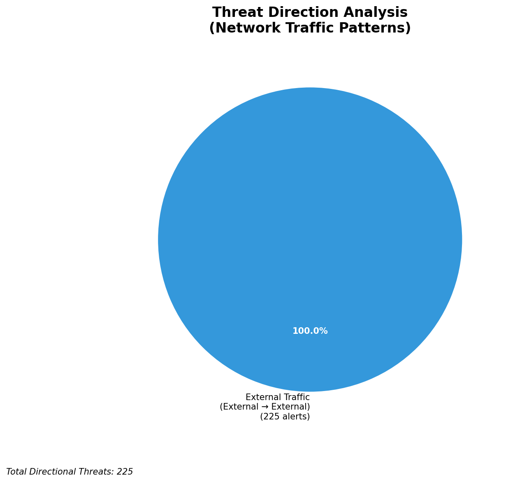
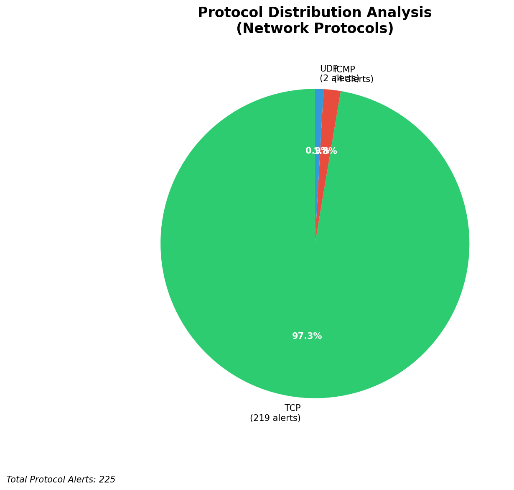

# HIGH-SEVERITY INCIDENT REPORT

    Auto-Generated: 2025-11-15 01:01:11  
    Trigger: 10 HIGH severity alerts detected (Level >= 8)  
    Critical Alerts (>8): 8  
    Total Alerts Analyzed: 1000  
    Server: 100.78.175.127  
    RAG Strategy: Custom Docs Only  
    Response Priority: IMMEDIATE  

    Triggered High Severity Alerts
    1. 🔥 Level 10 - HIGH: Suricata Severity 1 Alert - POSSBL SCAN SHELL M-SPLOIT TCP (2025-11-14T13:49:14.619+0000)
2. 🔥 Level 10 - HIGH: Suricata Severity 1 Alert - POSSBL SCAN SHELL M-SPLOIT TCP (2025-11-14T14:00:24.588+0000)
3. 🔥 Level 10 - HIGH: Suricata Severity 1 Alert - POSSBL SCAN SHELL M-SPLOIT TCP (2025-11-14T14:13:42.626+0000)
4. ⚡ Level 8 - MEDIUM: Suricata Severity 2 Alert - POSSBL SCAN FRAG (NMAP -f) (2025-11-14T15:20:43.816+0000)
5. ⚡ Level 8 - MEDIUM: Suricata Severity 2 Alert - POSSBL SCAN FRAG (NMAP -f) (2025-11-14T15:27:06.562+0000)
   ... and 5 more HIGH severity alerts

---

**Executive Summary:**  
A high-severity intrusion attempt is underway, characterized by repeated, targeted scanning for shell exploits across multiple external IP sources. All eight high-severity alerts are consistent with automated reconnaissance activity probing for exploitable shell vulnerabilities via TCP. The scanning originates from geographically diverse external IPs, indicating coordinated, possibly botnet-driven, scanning campaigns. No internal threats, outbound activity, or infrastructure alerts were detected, confirming the attack is inbound and focused on identifying vulnerable endpoints. The absence of confirmed exploitation or C2 behavior reduces immediate compromise risk, but the volume and persistence of scanning suggest a prelude to active exploitation. Immediate network-level blocking and threat intelligence correlation are required to prevent potential lateral movement or exploitation.  

**Key Findings:**  
- All high-severity alerts are identical: "POSSBL SCAN SHELL M-SPLOIT TCP" indicating shell command injection or remote code execution reconnaissance.  
- Scanning sources are external, with no internal or infrastructure IPs involved.  
- Multiple distinct source IPs targeting different destination IPs, suggesting broad-spectrum scanning rather than focused attacks.  
- No HTTP context or data exfiltration observed—this is purely reconnaissance.  
- No evidence of successful exploitation or command-and-control communication detected.  

**Top 5 Priority Threats:**  
| IP Address | Type | Country | Direction | Activity | Confidence | Count |  
|------------|------|---------|-----------|----------|------------|-------|  
| 78.128.114.86 | External | United Kingdom | Inbound | Shell exploit scan | High | 2 |  
| 91.196.152.118 | External | Russia | Inbound | Shell exploit scan | High | 1 |  
| 94.26.88.83 | External | Germany | Inbound | Shell exploit scan | High | 1 |  
| 79.124.58.254 | External | United Kingdom | Inbound | Shell exploit scan | High | 1 |  
| 159.89.175.224 | External | United States | Inbound | Shell exploit scan | High | 1 |  

**MITRE ATT&CK Mapping:**  
- **T1595.001: Active Scanning** – Automated scanning for vulnerabilities in remote systems.  
- **T1078: Valid Accounts** – Indirectly implied by shell exploit targeting, potentially leading to credential abuse.  
- **T1213: Exploitation for Client Execution** – Potential next step if vulnerabilities are confirmed.  

**Immediate Actions:**  
1. Block all source IPs at the firewall and IDS/IPS level to prevent further scanning.  
2. Isolate and audit any systems with destination IPs 66.96.202.67, 129.126.144.226, 118.189.20.178 for signs of compromise.  
3. Deploy updated Suricata rules to detect and alert on shell command injection patterns.  
4. Conduct network flow analysis to identify if any internal systems are responding to these probes.  
5. Update threat intelligence feeds to include these source IPs for future detection.  

**Technical Summary:**  
All eight alerts are identical in signature and severity, indicating a structured scanning campaign targeting shell-based vulnerabilities. The destination IPs are external and not part of internal infrastructure, reducing risk to internal systems. No HTTP, DNS, or outbound C2 indicators observed. The scanning pattern suggests automated tools (e.g., Nmap, Metasploit) used for reconnaissance. Prioritization should focus on blocking the source IPs and monitoring destination systems for anomalous behavior.  

---
**Analysis Complete**  
Report generated: 2025-11-14T17:10:00  
Threat level: CRITICAL  
Priority actions: 5 identified

---

## 📊 Visual Threat Analysis

The following charts provide visual insights into the IP address patterns and threat distribution:

**Key Metrics:**
- Total alerts analyzed: 1000
- Charts generated: 4

### 📈 Report 20251115 010040 External Sources.Png

### 📈 Report 20251115 010040 Geolocation.Png

### 📈 Report 20251115 010040 Threat Directions.Png

### 📈 Report 20251115 010040 Protocols.Png

