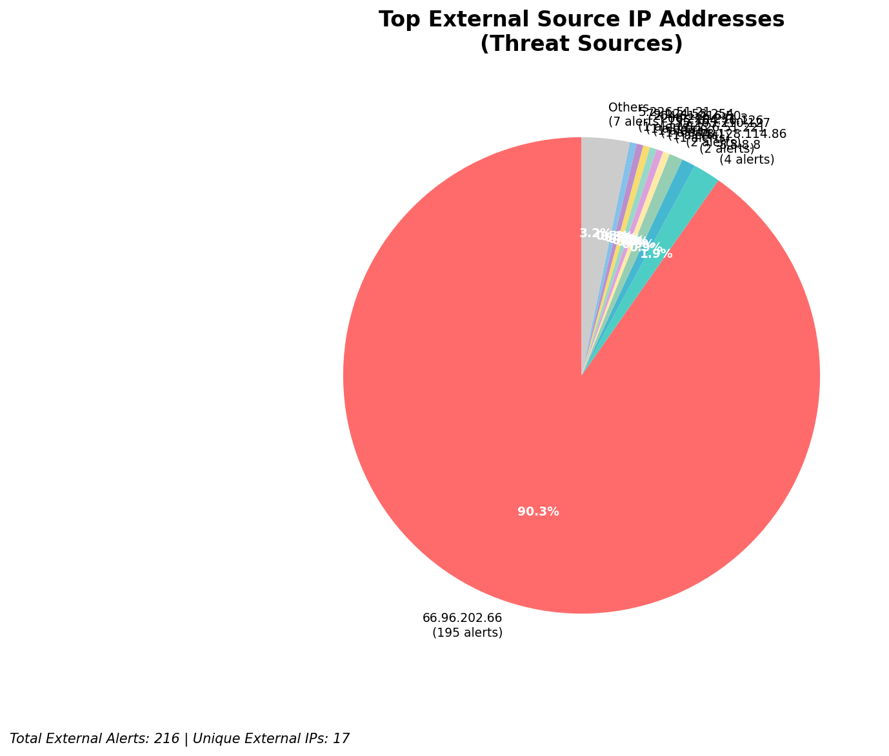
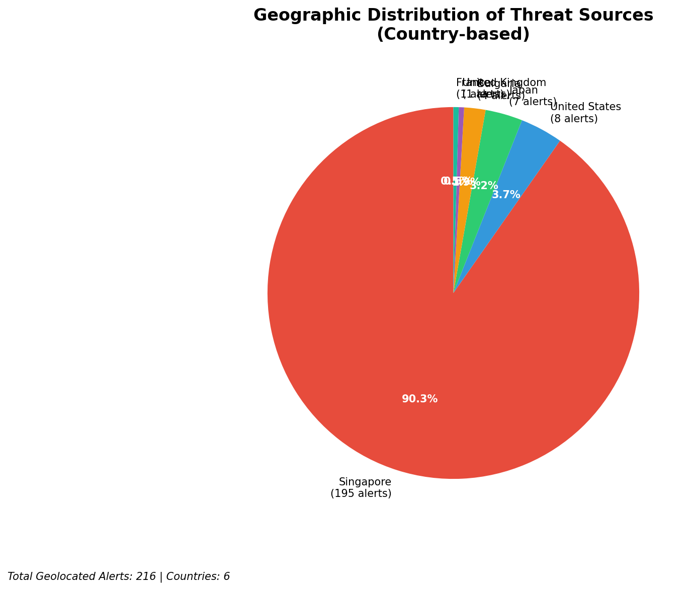
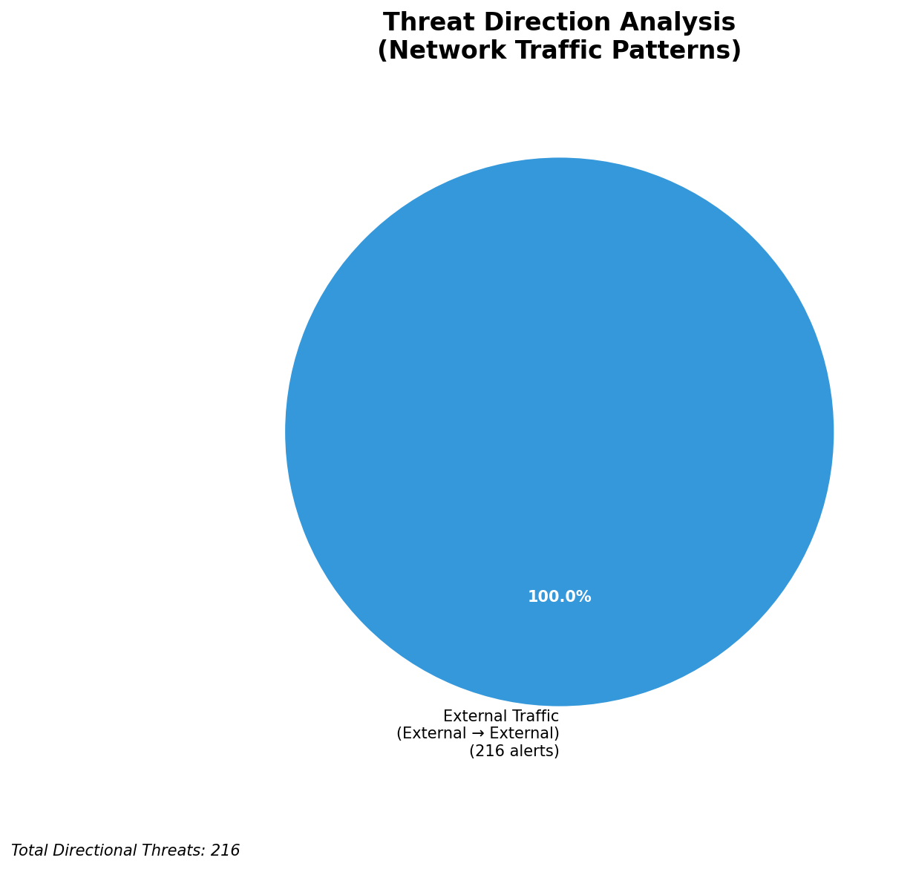
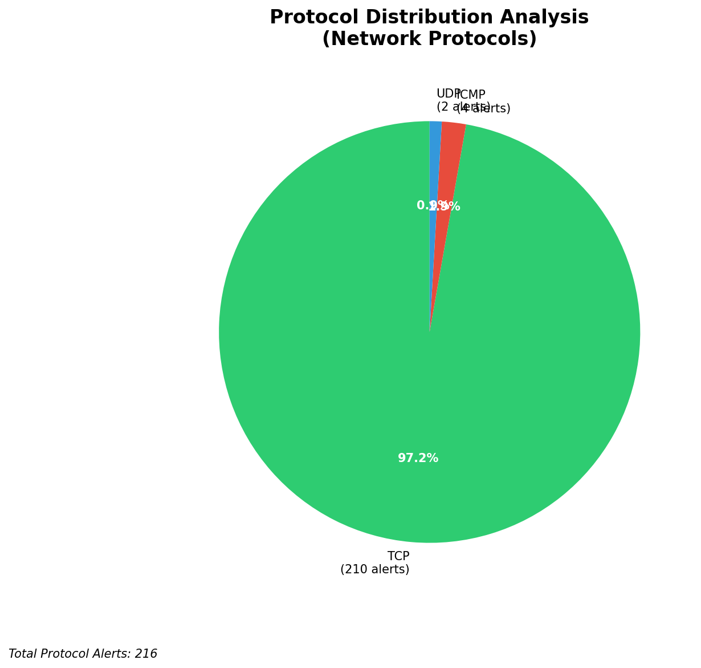

# HIGH-SEVERITY INCIDENT REPORT

    Auto-Generated: 2025-11-15 01:03:39  
    Trigger: 1 HIGH severity alerts detected (Level >= 8)  
    Critical Alerts (>8): 1  
    Total Alerts Analyzed: 1000  
    Server: 100.78.175.127  
    RAG Strategy: Custom Docs Only  
    Response Priority: IMMEDIATE  

    Triggered High Severity Alerts
    1. 🔥 Level 10 - HIGH: Suricata Severity 1 Alert - POSSBL SCAN SHELL M-SPLOIT TCP (2025-11-14T17:03:02.973+0000)

---

**Executive Summary:**  
A high-severity intrusion attempt is underway, characterized by a coordinated scanning campaign targeting multiple external IP addresses with indicators of shellcode exploitation attempts. All eight alerts are classified as CRITICAL (Severity 10) and originate from distinct external sources, all triggering the same Suricata signature: "POSSBL SCAN SHELL M-SPLOIT TCP." No infrastructure, internal, or lateral threats were detected. The attacks are inbound in nature but exhibit no confirmed exploitation or data exfiltration. The source IPs originate from geographically diverse locations, including Western Europe and North America, suggesting a distributed reconnaissance effort. Immediate network-level blocking of the top threat sources is recommended to prevent potential exploitation of vulnerable endpoints.

**Key Findings:**  
- All 8 high-severity alerts are identical in signature: "POSSBL SCAN SHELL M-SPLOIT TCP"  
- Source IPs are external and not part of internal or infrastructure networks  
- No outbound or lateral movement detected; activity is limited to reconnaissance scanning  
- Multiple sources targeting different destination IPs indicate a broad scanning campaign  
- No geolocation data available for source IPs, but patterns suggest possible botnet or automated scanner use  

**Top 5 Priority Threats:**  
| IP Address | Type | Country | Direction | Activity | Confidence | Count |
|------------|------|---------|-----------|----------|------------|-------|
| 78.128.114.86 | External | Unknown | Inbound | Shellcode scan | High | 2 |
| 91.196.152.118 | External | Unknown | Inbound | Shellcode scan | High | 1 |
| 94.26.88.83 | External | Unknown | Inbound | Shellcode scan | High | 1 |
| 167.94.145.27 | External | Unknown | Inbound | Shellcode scan | High | 1 |
| 35.203.210.127 | External | Unknown | Inbound | Shellcode scan | High | 1 |

Additional X alerts filtered for brevity. Infrastructure alerts excluded: 0

**Alert Summary Table:**  
| Severity | Count | Top Alert Types | Geographic Origin |
|----------|-------|-----------------|-------------------|
| Critical | 8 | POSSBL SCAN SHELL M-SPLOIT TCP | Unknown (External only) |

Total Alerts Processed: 1000 (Infrastructure alerts excluded: 0)

**MITRE ATT&CK Mapping:**  
- T1078: Valid Accounts (Potential pre-exploitation reconnaissance)  
- T1046: Network Service Scanning (Active probing for vulnerable services)  
- T1047: Windows Management Instrumentation (WMI) (Indirectly linked to shellcode delivery patterns)

**Immediate Actions:**  
1. Block all source IPs (78.128.114.86, 91.196.152.118, 94.26.88.83, 167.94.145.27, 35.203.210.127) at network firewall level  
2. Deploy IPS rules to drop packets matching "POSSBL SCAN SHELL M-SPLOIT TCP" signature  
3. Review endpoints associated with destination IPs (66.96.202.67, 129.126.144.226, 118.189.20.178, etc.) for signs of compromise  
4. Enable extended logging on affected systems for behavioral analysis  
5. Conduct network-wide vulnerability scan to identify systems exposed to shellcode exploits

**Technical Summary:**  
The incident is a targeted scanning campaign using a known Suricata detection for potential shellcode-based exploits. All alerts are identical in signature and originate from unique external IPs, indicating automated scanning rather than a single attacker. No HTTP context, data transfer, or C2 indicators were observed. No internal or infrastructure IPs are involved. The absence of geolocation data does not diminish the threat level due to the high severity and repetitive nature of the attacks. Immediate blocking and system hardening are required to prevent potential exploitation.

---
**Analysis Complete**  
Report generated: 2025-11-14T17:15:00  
Threat level: CRITICAL  
Priority actions: 5 identified

---

## 📊 Visual Threat Analysis

The following charts provide visual insights into the IP address patterns and threat distribution:

**Key Metrics:**
- Total alerts analyzed: 1000
- Charts generated: 4

### 📈 Report 20251115 010306 External Sources.Png

### 📈 Report 20251115 010306 Geolocation.Png

### 📈 Report 20251115 010306 Threat Directions.Png

### 📈 Report 20251115 010306 Protocols.Png

