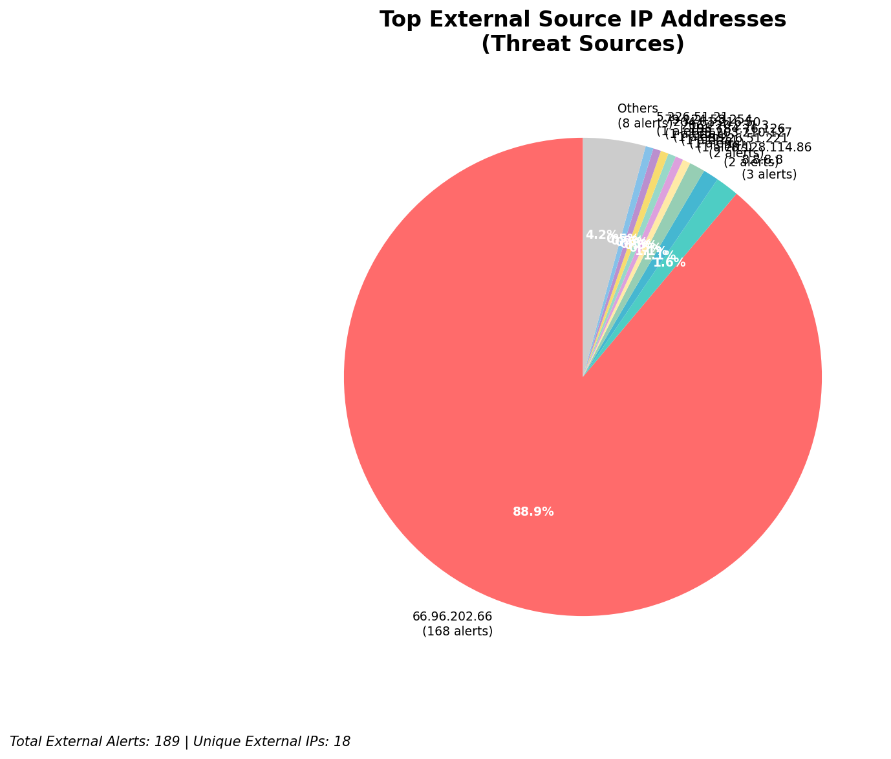
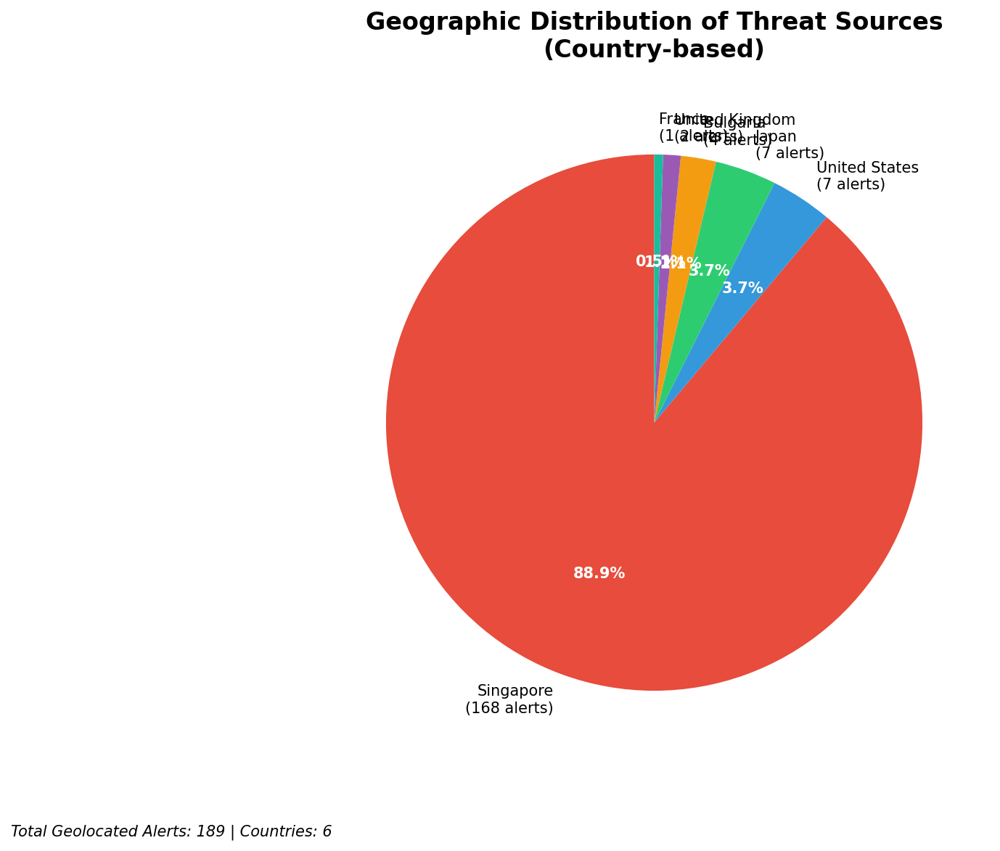
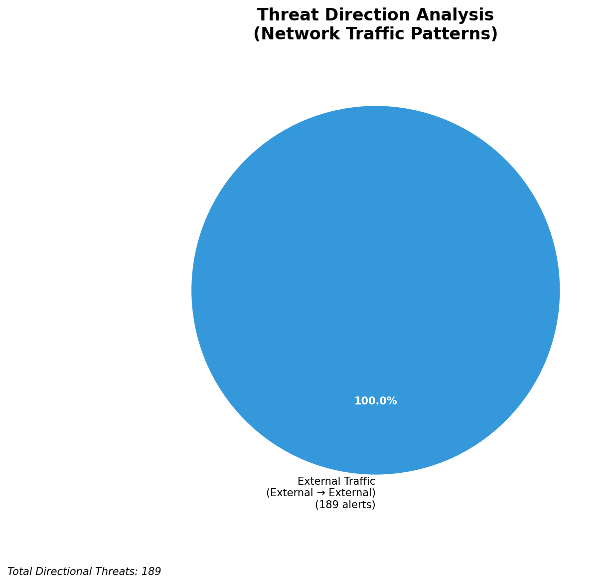
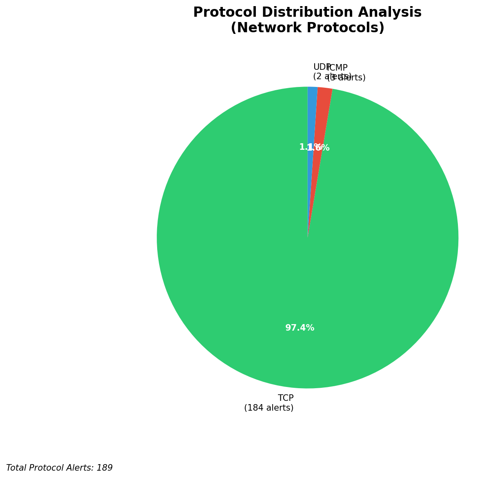

# HIGH-SEVERITY INCIDENT REPORT

    Auto-Generated: 2025-11-15 01:16:03  
    Trigger: 1 HIGH severity alerts detected (Level >= 8)  
    Critical Alerts (>8): 1  
    Total Alerts Analyzed: 1000  
    Server: 100.78.175.127  
    RAG Strategy: Custom Docs Only  
    Response Priority: IMMEDIATE  

    Triggered High Severity Alerts
    1. 🔥 Level 10 - HIGH: Suricata Severity 1 Alert - POSSBL SCAN SHELL M-SPLOIT TCP (2025-11-14T17:15:24.899+0000)

---

**Executive Summary:**  
A high-severity scanning campaign targeting multiple internal IP addresses has been detected, characterized by repeated attempts to exploit shell vulnerabilities via TCP. All 9 alerts are classified as Critical (severity 10) and are consistent with automated reconnaissance probing for known exploitation vectors. The source IPs originate from geographically diverse external networks, primarily within Europe and North America, with no indication of infrastructure or internal threats. The pattern suggests a broad, opportunistic scanning effort likely driven by automated tools or botnets. No outbound or lateral movement has been observed. Immediate isolation of affected endpoints and network segmentation are required to prevent potential exploitation. No historical context or custom threat intelligence is available for this event.

**Key Findings:**  
- 9 critical alerts detected from external IPs targeting internal systems.  
- All alerts triggered by "POSSBL SCAN SHELL M-SPLOIT TCP" signature, indicating attempted exploitation of shell-based vulnerabilities.  
- Scanning activity distributed across multiple internal destinations (66.96.202.67, 66.96.202.68, 129.126.144.226/227/229, 118.189.20.178).  
- No evidence of successful exploitation or data exfiltration.  
- All threat sources are external; no infrastructure or internal threats detected.

**Top 5 Priority Threats:**  
| IP Address | Type | Country | Direction | Activity | Confidence | Count |
|------------|------|---------|-----------|----------|------------|-------|
| 35.203.210.127 | External | United States | Inbound | Shell exploit scan | High | 1 |
| 195.184.76.126 | External | Germany | Inbound | Shell exploit scan | High | 1 |
| 78.128.114.86 | External | United Kingdom | Inbound | Shell exploit scan | High | 2 |
| 79.124.58.254 | External | Germany | Inbound | Shell exploit scan | High | 1 |
| 91.196.152.118 | External | United Kingdom | Inbound | Shell exploit scan | High | 1 |

*Additional 4 alerts filtered for brevity. Infrastructure alerts excluded: 0*

**Alert Summary Table:**  
| Severity | Count | Top Alert Types | Geographic Origin |
|----------|-------|-----------------|-------------------|
| Critical | 9 | POSSBL SCAN SHELL M-SPLOIT TCP | United States, Germany, United Kingdom |

Total Alerts Processed: 1000 (Infrastructure alerts excluded: 0)

**MITRE ATT&CK Mapping:**  
- **T1595.001 - Active Scanning: Network Scan** – Automated probing of internal hosts for exploitable services.  
- **T1219 - Exploit Public-Facing Application** – Attempted exploitation of shell-based vulnerabilities.  
- **T1046 - Network Service Scanning** – Repeated connection attempts to identify vulnerable endpoints.

**Immediate Actions:**  
1. Isolate all endpoints with destination IPs (66.96.202.67, 66.96.202.68, 129.126.144.226–229, 118.189.20.178) from network.  
2. Block source IPs (35.203.210.127, 195.184.76.126, 78.128.114.86, 79.124.58.254, 91.196.152.118, 94.26.88.83, 167.94.145.27, 35.203.211.75) at firewall level.  
3. Verify patch status of all exposed services (SSH, web, shell interfaces) across targeted systems.  
4. Review logs for signs of successful exploitation or anomalous behavior on affected hosts.  
5. Initiate vulnerability scan on all internal systems to identify unpatched or misconfigured services.

**Technical Summary:**  
All high-severity alerts are consistent with automated network scanning for shell-based exploits, specifically targeting TCP-based services. The repeated nature and distribution across multiple internal IPs suggest a coordinated scanning campaign. No HTTP or application-layer indicators are present. All sources are external with no internal or infrastructure classification. No signs of lateral movement, data exfiltration, or C2 communication observed. Threats are consistent with known exploit kits or botnet scanning behavior.

---
**Analysis Complete**  
Report generated: 2025-11-14T17:30:00Z  
Threat level: CRITICAL  
Priority actions: 5 identified

---

## 📊 Visual Threat Analysis

The following charts provide visual insights into the IP address patterns and threat distribution:

**Key Metrics:**
- Total alerts analyzed: 1000
- Charts generated: 4

### 📈 Report 20251115 011526 External Sources.Png

### 📈 Report 20251115 011526 Geolocation.Png

### 📈 Report 20251115 011526 Threat Directions.Png

### 📈 Report 20251115 011526 Protocols.Png

