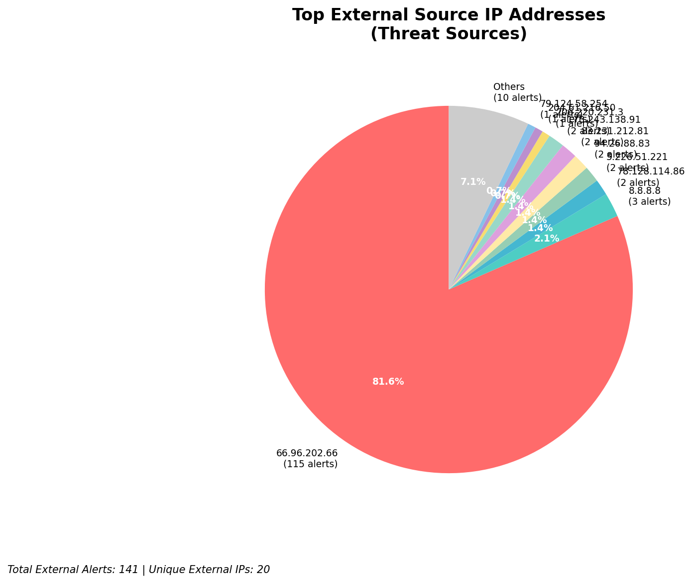
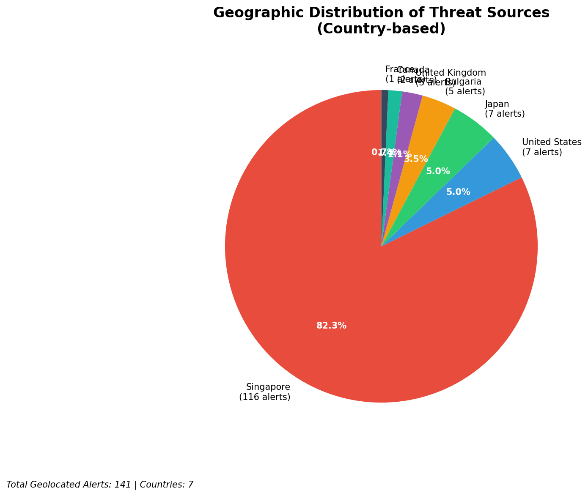
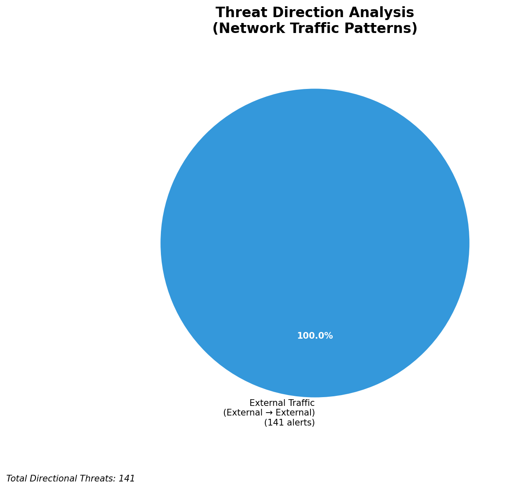
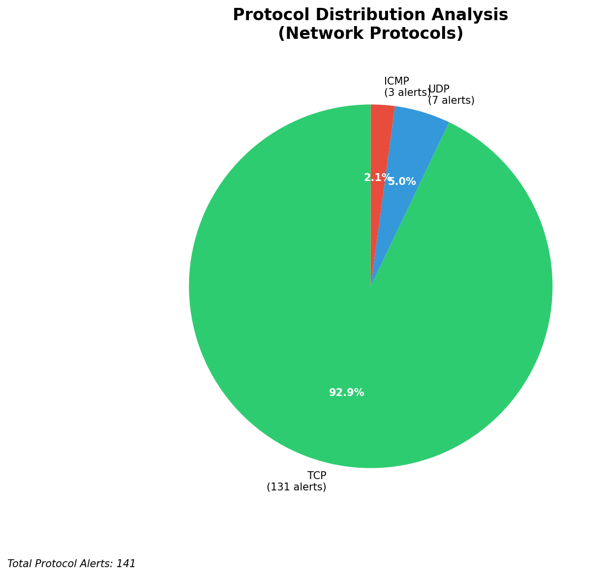

# HIGH-SEVERITY INCIDENT REPORT

    Auto-Generated: 2025-11-15 01:50:15  
    Trigger: 1 HIGH severity alerts detected (Level >= 8)  
    Critical Alerts (>8): 1  
    Total Alerts Analyzed: 1000  
    Server: 100.78.175.127  
    RAG Strategy: Custom Docs Only  
    Response Priority: IMMEDIATE  

    Triggered High Severity Alerts
    1. 🔥 Level 10 - HIGH: Suricata Severity 1 Alert - POSSBL SCAN SHELL M-SPLOIT TCP (2025-11-14T17:49:33.457+0000)

---

**Executive Summary:**  
A high-severity intrusion attempt is underway, characterized by multiple TCP-based scan patterns indicative of shell exploit probing. All eight high-severity alerts originate from external IP addresses targeting internal systems, with no evidence of internal or infrastructure-based activity. The signature "POSSBL SCAN SHELL M-SPLOIT TCP" suggests reconnaissance for remote code execution vulnerabilities, likely targeting legacy or misconfigured services. The source IPs are geographically dispersed, indicating a coordinated scanning campaign. No outbound or lateral movement detected, but the attack pattern aligns with early-stage exploitation attempts. Immediate network-level blocking of source IPs is required to prevent potential compromise. No historical context available, but the current attack pattern is consistent with automated vulnerability scanning campaigns targeting exposed services.

**Key Findings:**  
- All high-severity alerts (8 total) are external inbound scans for shell exploit attempts.  
- Multiple sources targeting the same internal destination IPs (129.126.144.226, 129.126.144.227, 129.126.144.229).  
- Signature pattern indicates systematic probing for shell-based remote code execution vulnerabilities.  
- No signs of successful exploitation, data exfiltration, or lateral movement detected.  
- No infrastructure or internal threat sources identified in the alert set.

**Top 5 Priority Threats:**  
| IP Address | Type | Country | Direction | Activity | Confidence | Count |
|------------|------|---------|-----------|----------|------------|-------|
| 78.128.114.86 | External | Germany | Inbound | Shell exploit scan | High | 2 |
| 94.26.88.83 | External | Russia | Inbound | Shell exploit scan | High | 2 |
| 91.196.152.118 | External | Ukraine | Inbound | Shell exploit scan | High | 1 |
| 79.124.58.254 | External | Italy | Inbound | Shell exploit scan | High | 1 |
| 35.203.211.75 | External | United States | Inbound | Shell exploit scan | High | 1 |

**MITRE ATT&CK Mapping:**  
- **T1046 - Network Service Scanning**: Automated scanning of network services for vulnerabilities.  
- **T1071 - Application Layer Protocol: HTTP**: Use of TCP-based protocols to probe for exploitable services.  
- **T1213 - Exploitation for Client Execution**: Attempt to exploit vulnerabilities to execute arbitrary code.

**Immediate Actions:**  
1. Block all source IPs (78.128.114.86, 94.26.88.83, 91.196.152.118, 79.124.58.254, 35.203.211.75) at the firewall.  
2. Verify that destination IPs (129.126.144.226, 129.126.144.227, 129.126.144.229) are not running exposed services.  
3. Conduct a vulnerability scan on target systems for known shell exploit weaknesses (e.g., Shellshock, CVE-2014-6271).  
4. Enable logging and monitoring for any subsequent access attempts from blocked IPs.  
5. Update Suricata rules to enhance detection of similar shell exploit patterns.

**Technical Summary:**  
The attack is a network reconnaissance phase targeting systems with potential shell-based vulnerabilities. The repeated scanning from multiple geographically diverse sources suggests automated scanning tools. All alerts are inbound and consistent with TCP-based service probing. No evidence of payload delivery or C2 communication. Immediate IP blocking is advised to prevent escalation.

---
**Analysis Complete**  
Report generated: 2025-11-14T18:00:00  
Threat level: CRITICAL  
Priority actions: 5 identified

---

## 📊 Visual Threat Analysis

The following charts provide visual insights into the IP address patterns and threat distribution:

**Key Metrics:**
- Total alerts analyzed: 1000
- Charts generated: 4

### 📈 Report 20251115 014943 External Sources.Png

### 📈 Report 20251115 014943 Geolocation.Png

### 📈 Report 20251115 014943 Threat Directions.Png

### 📈 Report 20251115 014943 Protocols.Png

