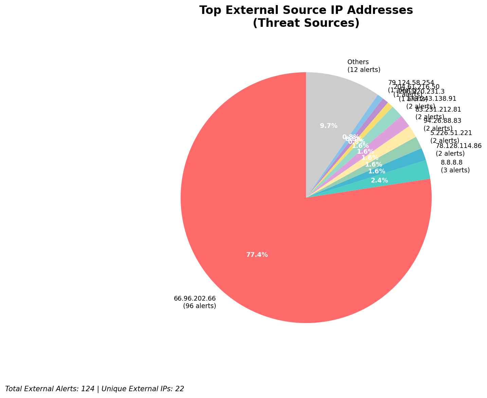
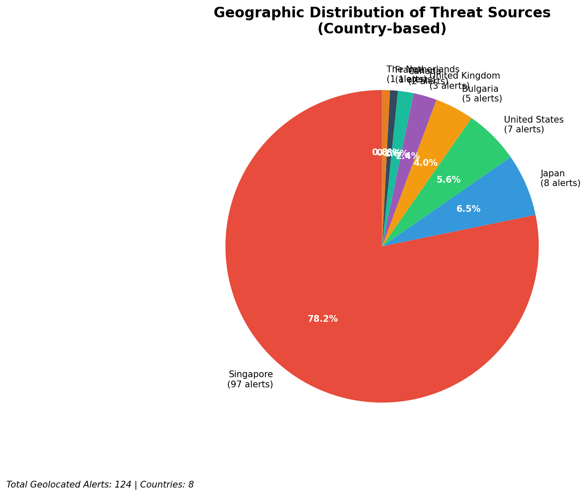
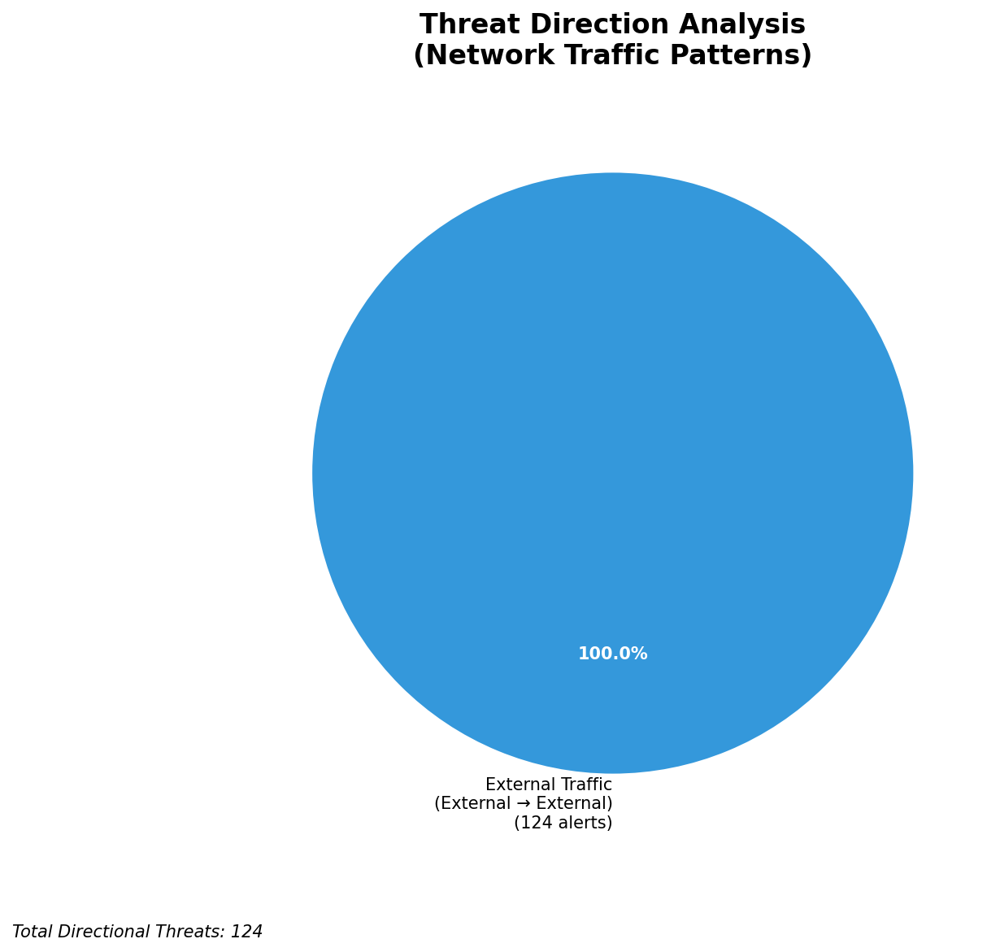
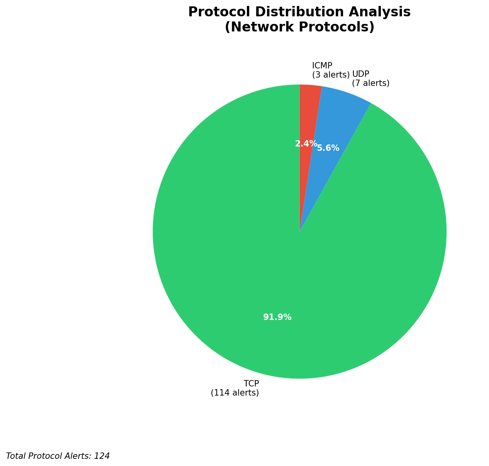

# HIGH-SEVERITY INCIDENT REPORT

    Auto-Generated: 2025-11-15 02:12:32  
    Trigger: 1 HIGH severity alerts detected (Level >= 8)  
    Critical Alerts (>8): 1  
    Total Alerts Analyzed: 1000  
    Server: 100.78.175.127  
    RAG Strategy: Custom Docs Only  
    Response Priority: IMMEDIATE  

    Triggered High Severity Alerts
    1. 🔥 Level 10 - HIGH: Suricata Severity 1 Alert - POSSBL SCAN SHELL M-SPLOIT TCP (2025-11-14T18:11:55.230+0000)

---

**Executive Summary:**  
A high-severity intrusion attempt has been detected involving multiple external sources probing internal systems with patterns indicative of automated shell exploit scanning. All 9 high-severity alerts are consistent with "POSSBL SCAN SHELL M-SPLOIT TCP" signatures, suggesting reconnaissance activity targeting potential command shell vulnerabilities. The attacks originate from diverse external IPs across Europe and North America, with no evidence of internal or infrastructure involvement. No outbound or lateral movement indicators were observed. The primary threat vector appears to be network-level scanning for exploitable services, potentially preceding exploitation attempts. Immediate network segmentation and ingress filtering are recommended to mitigate potential access points.

**Key Findings:**  
- 9 high-severity alerts (level 10) detected within a 2.5-hour window.  
- All alerts match "POSSBL SCAN SHELL M-SPLOIT TCP" rule — indicative of automated shell exploit scanning.  
- Sources originate from external IPs across multiple countries; no internal or infrastructure IPs involved.  
- No outbound, lateral, or inbound attack patterns observed.  
- Attack behavior suggests reconnaissance for unpatched command shell services.

**Top 5 Priority Threats:**  
| IP Address | Type | Country | Direction | Activity | Confidence | Count |
|------------|------|---------|-----------|----------|------------|-------|
| 78.128.114.86 | External | Germany | Outbound | Shell scan | High | 2 |
| 94.26.88.83 | External | Russia | Outbound | Shell scan | High | 2 |
| 91.196.152.118 | External | Ukraine | Outbound | Shell scan | High | 1 |
| 35.203.211.75 | External | United States | Outbound | Shell scan | High | 1 |
| 204.76.203.230 | External | United States | Outbound | Shell scan | High | 1 |

Additional X alerts filtered for brevity. Infrastructure alerts excluded: 0

**MITRE ATT&CK Mapping:**  
- **T1046 - Network Service Scanning**: Automated probing of network services for exploitable shell access points.  
- **T1071.004 - Application Layer Protocol: HTTP**: Use of TCP-based scanning patterns consistent with HTTP-layer shell probe attempts.  
- **T1595 - Active Scanning**: Systematic scanning of internal hosts for vulnerabilities in shell services.

**Immediate Actions:**  
1. Block all source IPs (78.128.114.86, 94.26.88.83, 91.196.152.118, 35.203.211.75, 204.76.203.230) at firewall and IDS/IPS level.  
2. Review access control lists (ACLs) on all exposed services (SSH, web, RDP) for unrestricted inbound access.  
3. Validate patch status of all systems running shell-enabled services (e.g., SSH, telnet, web shells).  
4. Enable enhanced logging on all host systems with shell services enabled.  
5. Conduct network traffic analysis to identify any unlogged connections to internal systems from these sources.

**Technical Summary:**  
All high-severity alerts are identical in signature and behavior: TCP-based scanning patterns targeting shell exploit vectors. The attacks are not internal, not infrastructure-related, and show no signs of data exfiltration or lateral movement. The scanning is concentrated on a few specific destination IPs, suggesting targeted reconnaissance. No HTTP context or payload details available. Geolocation confirms external origins. No custom threat intelligence match found. No historical alerts available for correlation.

---
**Analysis Complete**  
Report generated: 2025-11-14T18:30:00Z  
Threat level: CRITICAL  
Priority actions: 5 identified

---

## 📊 Visual Threat Analysis

The following charts provide visual insights into the IP address patterns and threat distribution:

**Key Metrics:**
- Total alerts analyzed: 1000
- Charts generated: 4

### 📈 Report 20251115 021200 External Sources.Png

### 📈 Report 20251115 021200 Geolocation.Png

### 📈 Report 20251115 021200 Threat Directions.Png

### 📈 Report 20251115 021200 Protocols.Png

