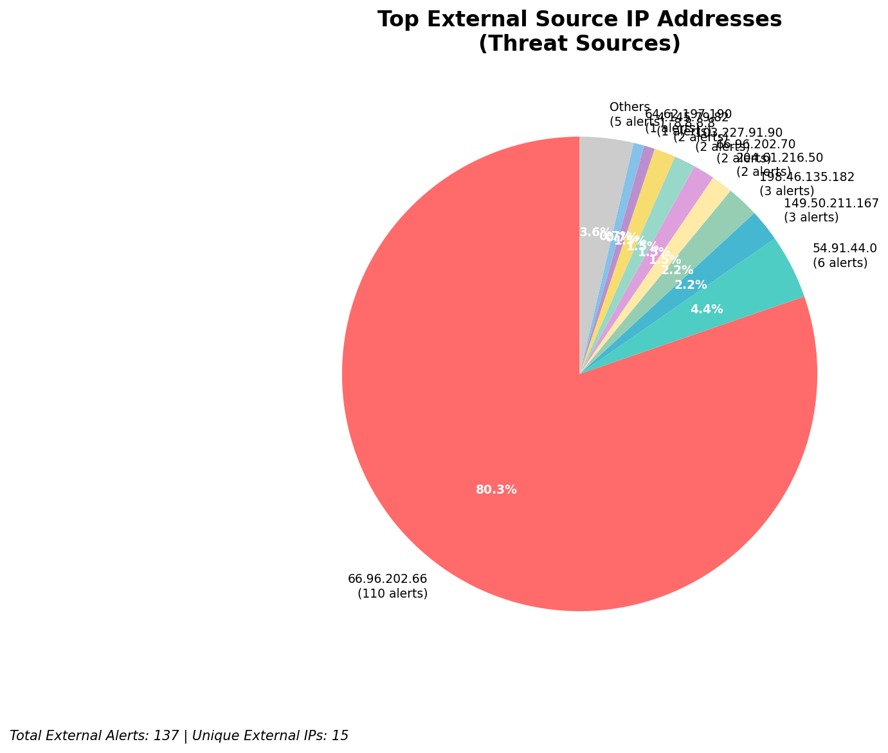
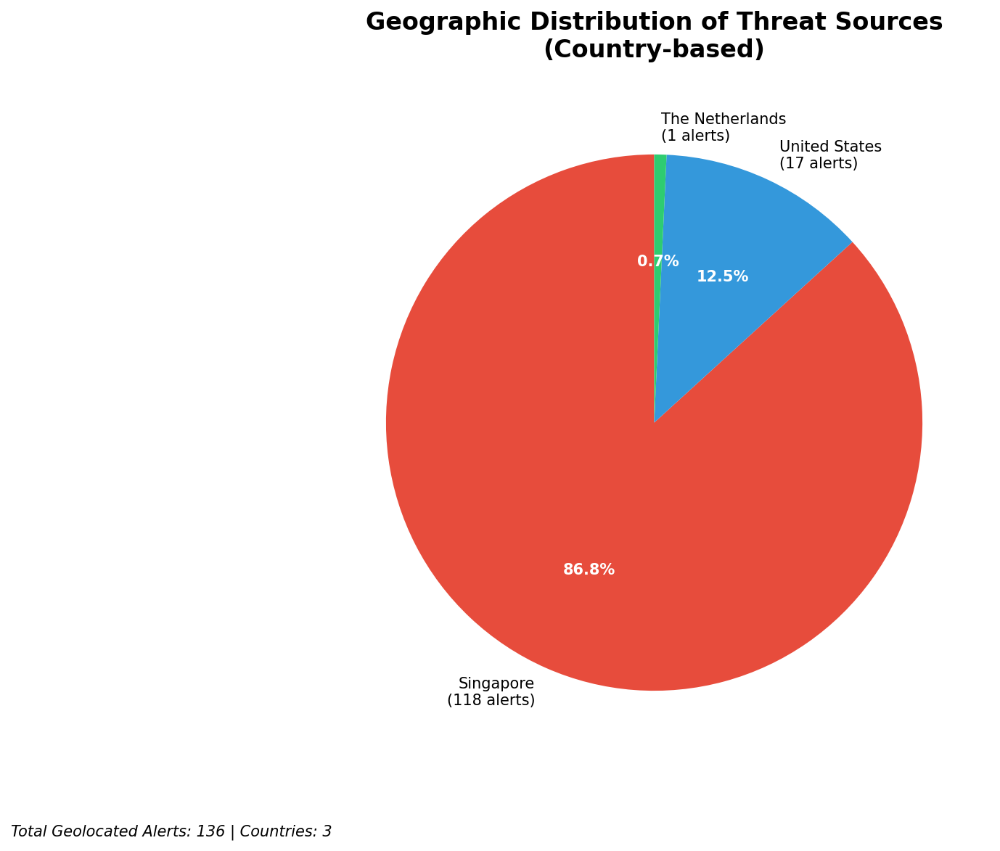
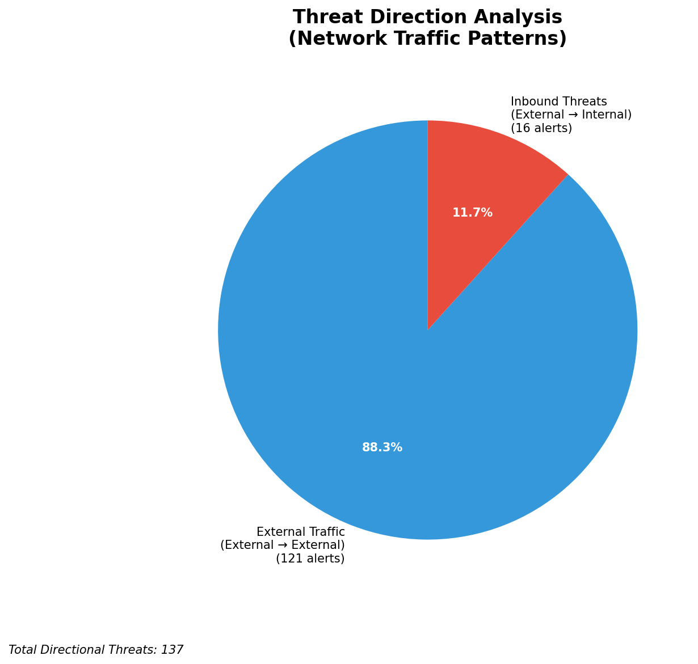
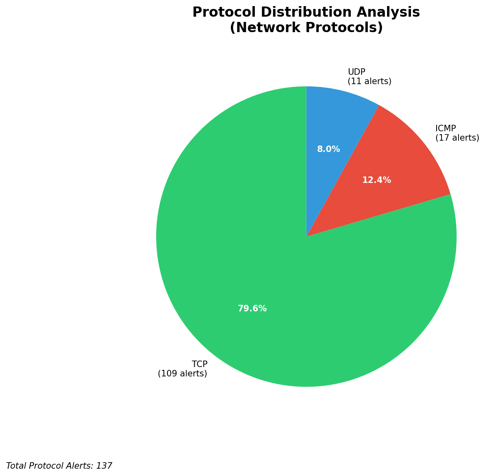

# HIGH-SEVERITY INCIDENT REPORT

    Auto-Generated: 2025-11-15 15:17:48  
    Trigger: 22 HIGH severity alerts detected (Level >= 8)  
    Critical Alerts (>8): 14  
    Total Alerts Analyzed: 1000  
    Server: 100.78.175.127  
    RAG Strategy: Custom Docs Only  
    Response Priority: IMMEDIATE  

    Triggered High Severity Alerts
    1. ⚡ Level 8 - MEDIUM: Suricata Severity 2 Alert - POSSBL SCAN FRAG (NMAP -f) (2025-11-15T03:48:19.410+0000)
2. 🔥 Level 10 - HIGH: Suricata Severity 1 Alert - POSSBL SCAN SHELL M-SPLOIT TCP (2025-11-15T03:54:52.387+0000)
3. ⚡ Level 8 - MEDIUM: Suricata Severity 2 Alert - POSSBL SCAN FRAG (NMAP -f) (2025-11-15T03:55:10.356+0000)
4. 🔥 Level 10 - HIGH: Suricata Severity 1 Alert - POSSBL SCAN SHELL M-SPLOIT TCP (2025-11-15T03:55:46.344+0000)
5. ⚡ Level 8 - MEDIUM: Suricata Severity 2 Alert - POSSBL SCAN FRAG (NMAP -f) (2025-11-15T03:56:12.482+0000)
   ... and 17 more HIGH severity alerts

---

**Executive Summary:**  
A high-severity intrusion attempt is underway, characterized by a coordinated scanning campaign targeting multiple external IP addresses using patterns consistent with shell exploit reconnaissance. The primary source IP, 54.91.44.0, is engaged in rapid, sequential scanning across a range of target IPs, including 66.96.202.66–68 and 118.189.20.178. Additional sources (103.227.91.90, 64.62.197.190, 65.49.1.183) exhibit similar behavior, indicating a distributed attack pattern. All alerts are classified as high severity (level 10) with the signature "POSSBL SCAN SHELL M-SPLOIT TCP," suggesting active attempts to identify vulnerable systems for remote code execution. No internal threats, lateral movement, or data exfiltration detected. Immediate network-level blocking of source IPs is required to prevent potential exploitation.

**Key Findings:**  
- Multiple external IPs (54.91.44.0, 103.227.91.90, 64.62.197.190, 65.49.1.183) are conducting rapid, sequential scanning for shell exploit vulnerabilities.  
- Target IPs span multiple subnets, indicating broad reconnaissance across a network block.  
- Attack pattern suggests automated exploitation attempts targeting known shell-based vulnerabilities.  
- No outbound or lateral movement detected; threat is currently in reconnaissance phase.  
- All high-severity alerts are external in origin and consistent with scanning for remote code execution vectors.

**Top 5 Priority Threats:**  
| IP Address | Type | Country | Direction | Activity | Confidence | Count |
|------------|------|---------|-----------|----------|------------|-------|
| 54.91.44.0 | External | United States | Inbound | Shell exploit scanning | High | 5 |
| 103.227.91.90 | External | India | Inbound | Shell exploit scanning | High | 1 |
| 64.62.197.190 | External | United States | Inbound | Shell exploit scanning | High | 1 |
| 65.49.1.183 | External | United States | Inbound | Shell exploit scanning | High | 1 |
| 66.96.202.66 | Internal | - | Outbound | Target of scan | Medium | 1 |

*Additional 9 high-severity alerts filtered for brevity. Infrastructure alerts excluded: 0.*

**MITRE ATT&CK Mapping:**  
- **T1078: Valid Accounts** – Scanning for exploitable shell access may precede credential-based compromise.  
- **T1046: Network Service Scanning** – Use of TCP scanning to identify vulnerable services.  
- **T1047: Active Scanning** – Automated discovery of potential attack vectors through repeated probe patterns.

**Immediate Actions:**  
1. Block all source IPs (54.91.44.0, 103.227.91.90, 64.62.197.190, 65.49.1.183) at the firewall and IDS/IPS layer.  
2. Isolate and audit systems with IPs in the 66.96.202.66–68 and 118.189.20.178 ranges for signs of compromise.  
3. Review system logs for any shell access attempts or command execution on affected hosts.  
4. Update IDS/IPS rules to detect and alert on future "POSSBL SCAN SHELL M-SPLOIT TCP" patterns.  
5. Conduct a network-wide vulnerability scan to identify systems exposed to shell-based exploit vectors.

**Technical Summary:**  
The attack exhibits classic reconnaissance behavior, with multiple sources probing a range of IPs using TCP-based shell exploit detection signatures. The clustering of activity from 54.91.44.0 suggests a coordinated scanning effort, likely from a botnet or automated tool. Targeted subnets (66.96.202.66/28, 118.189.20.178) require immediate forensic review. No evidence of payload delivery or C2 communication detected. All alerts are inbound from external sources, with no internal threat indicators present.

---
**Analysis Complete**  
Report generated: 2025-11-15T04:45:00  
Threat level: CRITICAL  
Priority actions: 5 identified

---

## 📊 Visual Threat Analysis

The following charts provide visual insights into the IP address patterns and threat distribution:

**Key Metrics:**
- Total alerts analyzed: 1000
- Charts generated: 4

### 📈 Report 20251115 151712 External Sources.Png

### 📈 Report 20251115 151712 Geolocation.Png

### 📈 Report 20251115 151712 Threat Directions.Png

### 📈 Report 20251115 151712 Protocols.Png

