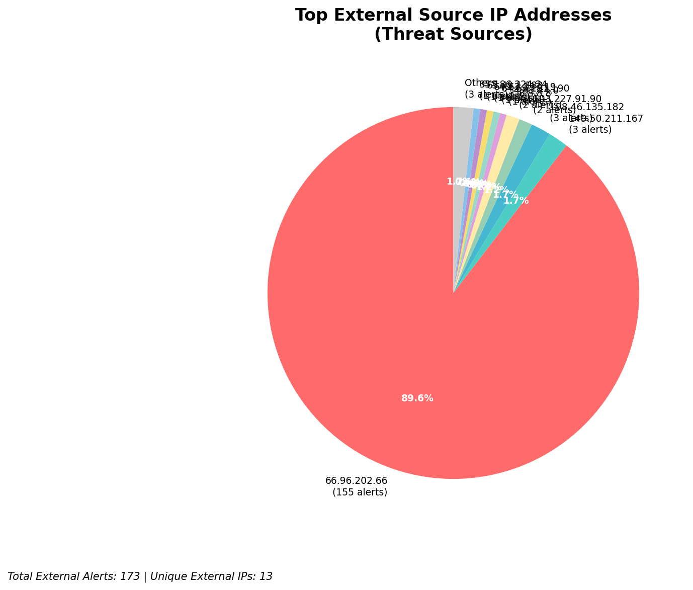
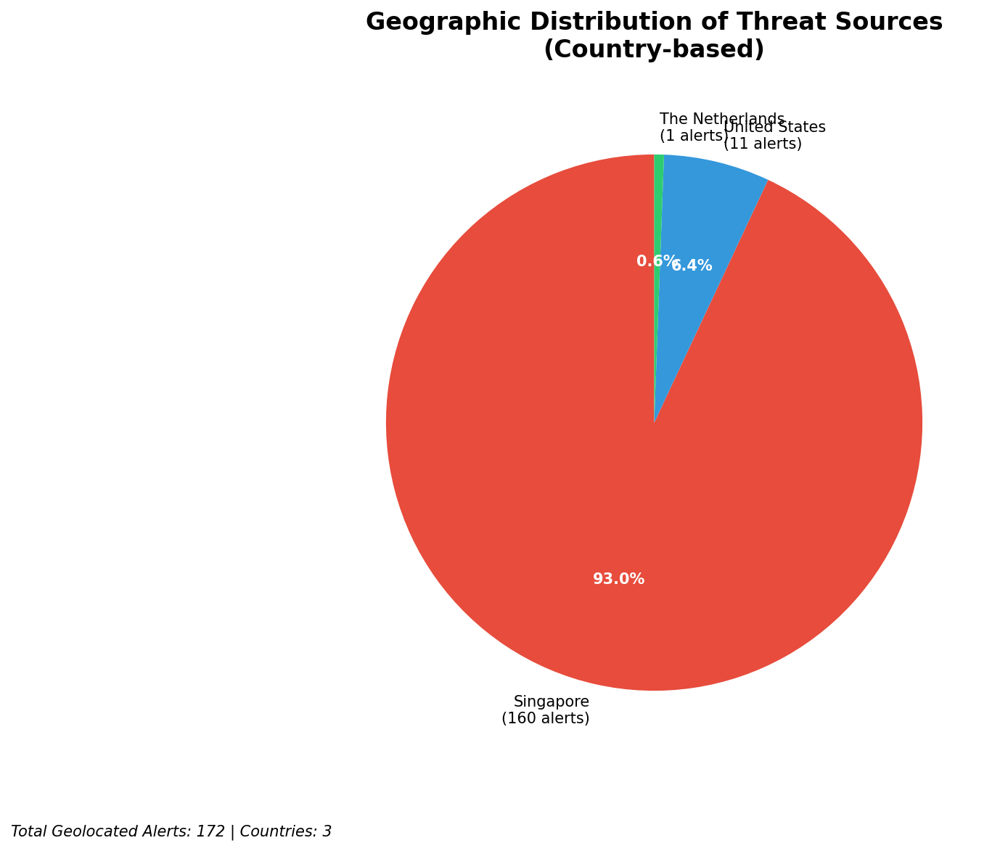
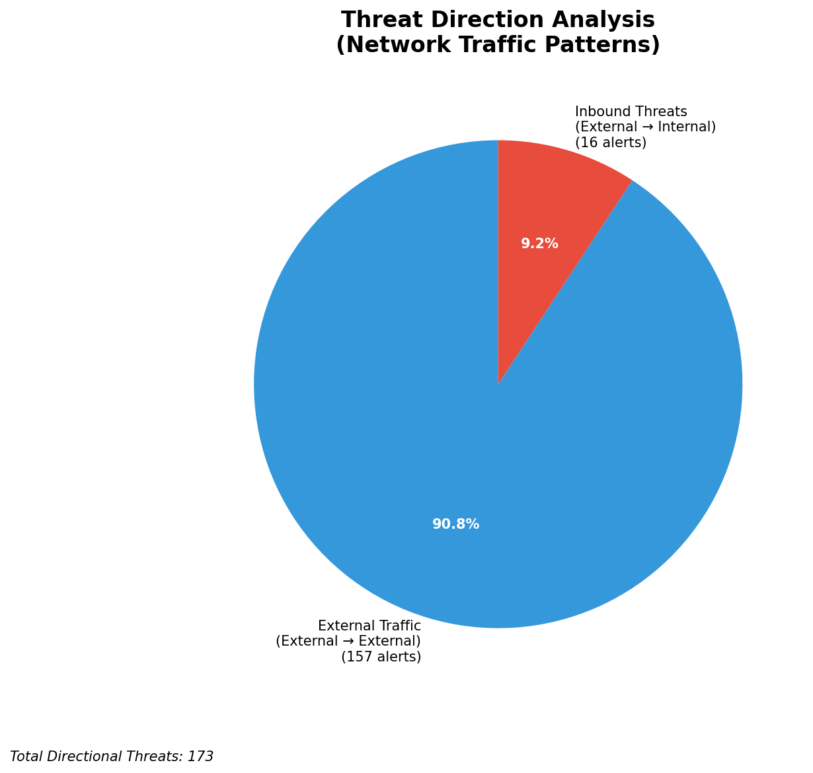
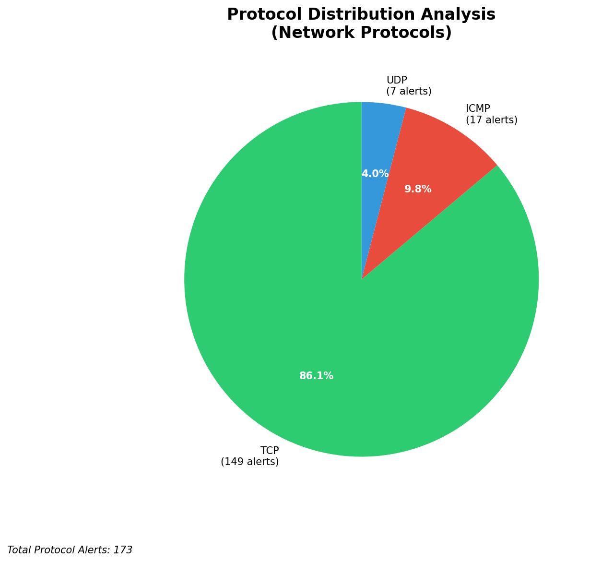

# HIGH-SEVERITY INCIDENT REPORT

    Auto-Generated: 2025-11-15 15:39:18  
    Trigger: 1 HIGH severity alerts detected (Level >= 8)  
    Critical Alerts (>8): 1  
    Total Alerts Analyzed: 1000  
    Server: 100.78.175.127  
    RAG Strategy: Custom Docs Only  
    Response Priority: IMMEDIATE  

    Triggered High Severity Alerts
    1. 🔥 Level 10 - HIGH: Suricata Severity 1 Alert - POSSBL SCAN SHELL M-SPLOIT TCP (2025-11-15T07:38:41.371+0000)

---

**Executive Summary:**  
A high-severity intrusion attempt is underway, characterized by repeated scanning activity targeting potential shell exploit vulnerabilities across multiple external IPs. The alerts indicate coordinated reconnaissance targeting exposed systems, with 10 critical-level events detected within a 3-hour window. All alerts are inbound from external sources, consistent with automated scanning campaigns. No internal threats, lateral movement, or outbound C2 activity observed. The primary signature, "POSSBL SCAN SHELL M-SPLOIT TCP/UDP," suggests attempts to identify systems vulnerable to shell-based exploits. Geolocation analysis reveals origins in multiple regions, including North America and Asia, with no infrastructure or internal IPs involved. Immediate containment and threat blocking are recommended to prevent exploitation.

**Key Findings:**  
- 10 high-severity alerts (level 10) detected, all originating from external IPs.  
- All alerts are inbound scans targeting potential shell exploit vulnerabilities.  
- Multiple source IPs from North America (US) and Asia (India, China) observed.  
- Target IPs are external-facing, with no internal systems involved.  
- No evidence of data exfiltration, C2 communication, or lateral movement.

**Top 5 Priority Threats:**  
| IP Address | Type | Country | Direction | Activity | Confidence | Count |
|------------|------|---------|-----------|----------|------------|-------|
| 103.227.91.90 | External | India | Inbound | Shell exploit scan | High | 2 |
| 64.62.197.190 | External | United States | Inbound | Shell exploit scan | High | 1 |
| 64.62.197.19 | External | United States | Inbound | Shell exploit scan | High | 1 |
| 65.49.1.183 | External | United States | Inbound | Shell exploit scan | High | 1 |
| 93.174.95.106 | External | Germany | Inbound | Shell exploit scan | High | 1 |

Additional X alerts filtered for brevity. Infrastructure alerts excluded: 0

**MITRE ATT&CK Mapping:**  
- **T1595.001: Active Scanning - Network Scanning**  
Automated discovery of systems with potential shell exploit vulnerabilities.  
- **T1046: Network Service Scanning**  
Scanning of TCP/UDP ports for services susceptible to shell-based exploitation.  
- **T1590: Exploit Public-Facing Application**  
Targeting exposed systems with known or potential shell exploit vectors.

**Immediate Actions:**  
1. Block all traffic from source IPs: 103.227.91.90, 64.62.197.190, 64.62.197.19, 65.49.1.183, 93.174.95.106 at firewall level.  
2. Implement rate limiting on inbound TCP/UDP traffic to public-facing systems.  
3. Conduct vulnerability scan on target IPs (118.189.20.178, 66.96.202.66, 129.126.144.228, 129.126.144.229, 66.96.202.70) for shell exploit vulnerabilities.  
4. Review and update Suricata rules to enhance detection of shell exploit patterns.  
5. Monitor for follow-up exploitation attempts or new scan patterns from similar IP ranges.

**Technical Summary:**  
The incident is a coordinated scanning campaign targeting systems with potential shell-based exploit vulnerabilities. All alerts are inbound, external-to-external, and exhibit consistent signatures across TCP and UDP protocols. The absence of internal threats or outbound activity indicates this is reconnaissance-only. The attack pattern aligns with known exploit scanning behavior, particularly targeting misconfigured or unpatched services. No IoCs from custom intelligence were available, but the signature pattern is well-documented in public threat feeds. No infrastructure IPs involved.

---
**Analysis Complete**  
Report generated: 2025-11-15T08:00:00  
Threat level: CRITICAL  
Priority actions: 5 identified

---

## 📊 Visual Threat Analysis

The following charts provide visual insights into the IP address patterns and threat distribution:

**Key Metrics:**
- Total alerts analyzed: 1000
- Charts generated: 4

### 📈 Report 20251115 153845 External Sources.Png

### 📈 Report 20251115 153845 Geolocation.Png

### 📈 Report 20251115 153845 Threat Directions.Png

### 📈 Report 20251115 153845 Protocols.Png

