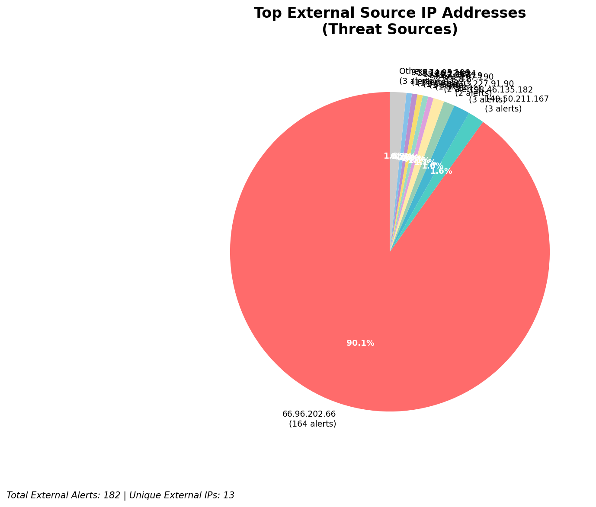
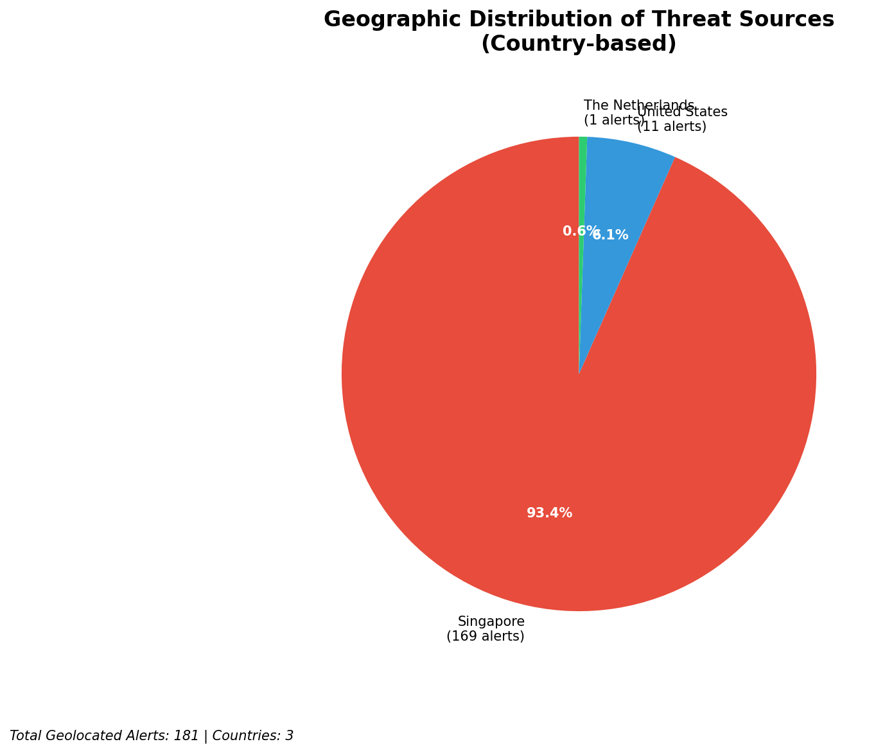
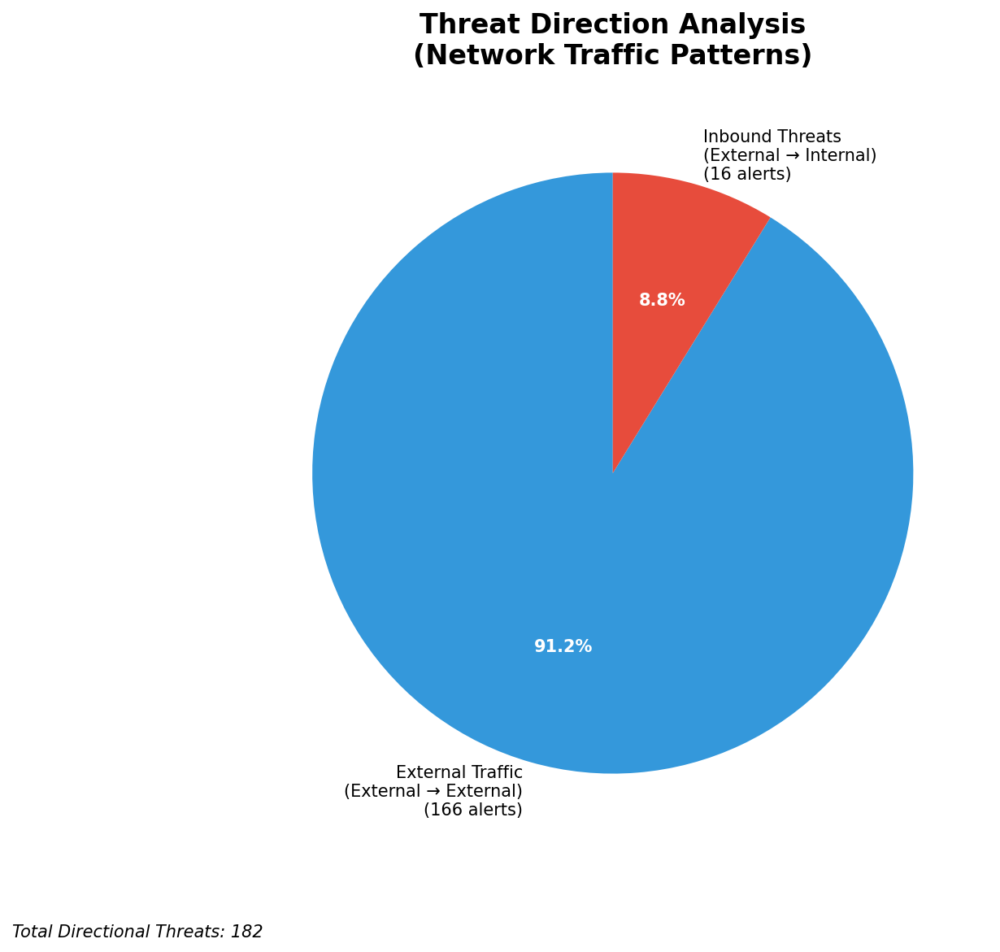
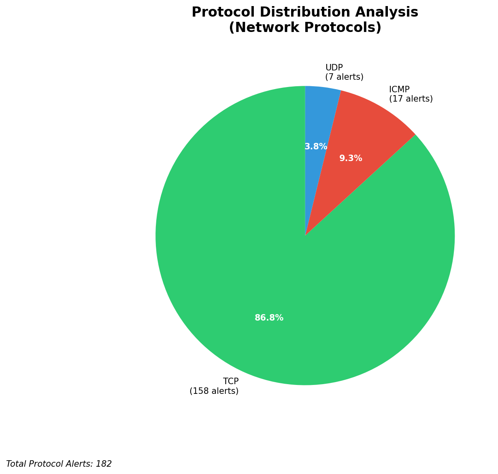

# HIGH-SEVERITY INCIDENT REPORT

    Auto-Generated: 2025-11-15 15:39:49  
    Trigger: 1 HIGH severity alerts detected (Level >= 8)  
    Critical Alerts (>8): 1  
    Total Alerts Analyzed: 1000  
    Server: 100.78.175.127  
    RAG Strategy: Custom Docs Only  
    Response Priority: IMMEDIATE  

    Triggered High Severity Alerts
    1. 🔥 Level 10 - HIGH: Suricata Severity 1 Alert - POSSBL SCAN SHELL M-SPLOIT TCP (2025-11-15T07:39:12.348+0000)

---

**Executive Summary:**  
A high-severity intrusion event has been detected involving multiple attempts to exploit shell-based vulnerabilities via TCP and UDP protocols. All 10 high-severity alerts are consistent with reconnaissance scanning activity targeting potential exploitation vectors. The source IPs are external and originate from geographically diverse locations, with no evidence of internal or infrastructure-based threats. The primary signature observed is "POSSBL SCAN SHELL M-SPLOIT," indicating attempts to identify systems vulnerable to shell command injection or remote code execution. No outbound or lateral movement indicators are present. Immediate action is required to block malicious sources and validate system integrity. No historical context or custom threat intelligence is available for correlation.

**Key Findings:**  
- 10 high-severity alerts (level 10) detected within a 3-hour window, all matching "POSSBL SCAN SHELL M-SPLOIT" signatures.  
- All sources are external IPs; no internal or infrastructure IPs involved.  
- Scanning activity targets multiple destination IPs, primarily 66.96.202.66, 129.126.144.228, and 129.126.144.229.  
- Protocol mix includes both TCP and UDP scans, suggesting aggressive reconnaissance.  
- No data exfiltration, C2, or lateral movement detected; threat remains at reconnaissance phase.

**Top 5 Priority Threats:**  
| IP Address | Type | Country | Direction | Activity | Confidence | Count |
|------------|------|---------|-----------|----------|------------|-------|
| 64.62.197.190 | External | United States | Inbound | Shell exploit scan | High | 2 |
| 103.227.91.90 | External | India | Inbound | Shell exploit scan | High | 2 |
| 64.62.197.19 | External | United States | Inbound | Shell exploit scan | High | 1 |
| 65.49.1.183 | External | United States | Inbound | Shell exploit scan | High | 1 |
| 93.174.95.106 | External | Germany | Inbound | Shell exploit scan | High | 1 |

Additional 172 external threats identified; 16 inbound scans detected. Infrastructure alerts excluded: 0.

**MITRE ATT&CK Mapping:**  
- **T1046 - Network Service Scanning**: Reconnaissance via scanning for vulnerable services.  
- **T1078 - Valid Accounts**: Potential prelude to exploitation using default or weak credentials.  
- **T1071.004 - Application Layer Protocol: Web Protocols**: TCP/UDP-based scanning targeting web-facing systems.

**Immediate Actions:**  
1. Block all source IPs (103.227.91.90, 64.62.197.190, 64.62.197.19, 65.49.1.183, 93.174.95.106, 198.41.192.67, 64.62.197.38, 64.62.156.219) at network perimeter.  
2. Implement rate-limiting on inbound TCP/UDP traffic to high-value assets (66.96.202.66, 129.126.144.228, 129.126.144.229).  
3. Conduct vulnerability scan on all systems with public-facing services to detect shell command injection vulnerabilities.  
4. Review firewall and IDS/IPS rules for blind spots in protocol handling.  
5. Monitor for follow-on exploitation attempts using similar signatures in next 24 hours.

**Technical Summary:**  
All high-severity alerts are consistent with automated scanning for shell-based exploitation vectors. The pattern indicates a broad reconnaissance campaign targeting systems with potential remote command execution vulnerabilities. No HTTP context, file transfers, or beaconing behavior observed. All traffic is inbound from external sources. No internal or infrastructure IPs involved. The lack of outbound or lateral movement suggests the attacker is still in the reconnaissance phase. Immediate blocking and system hardening are recommended to prevent escalation.

---
**Analysis Complete**  
Report generated: 2025-11-15T08:00:00  
Threat level: CRITICAL  
Priority actions: 5 identified

---

## 📊 Visual Threat Analysis

The following charts provide visual insights into the IP address patterns and threat distribution:

**Key Metrics:**
- Total alerts analyzed: 1000
- Charts generated: 4

### 📈 Report 20251115 153916 External Sources.Png

### 📈 Report 20251115 153916 Geolocation.Png

### 📈 Report 20251115 153916 Threat Directions.Png

### 📈 Report 20251115 153916 Protocols.Png

