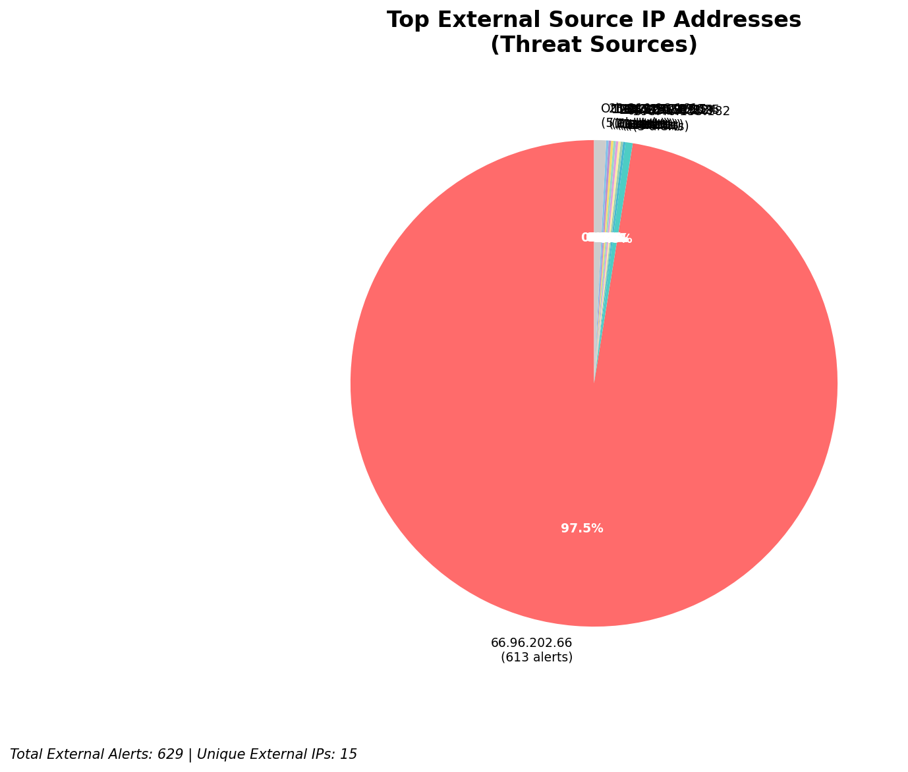
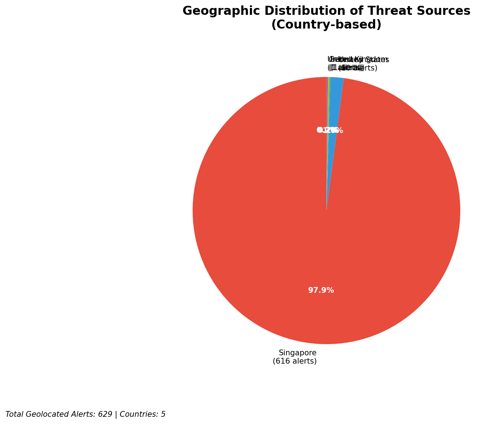
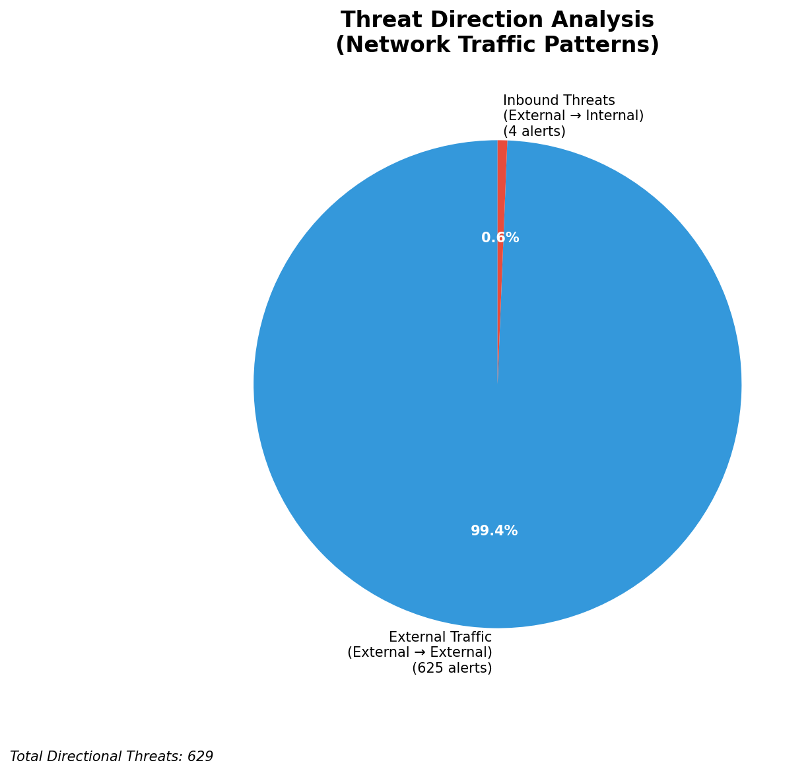
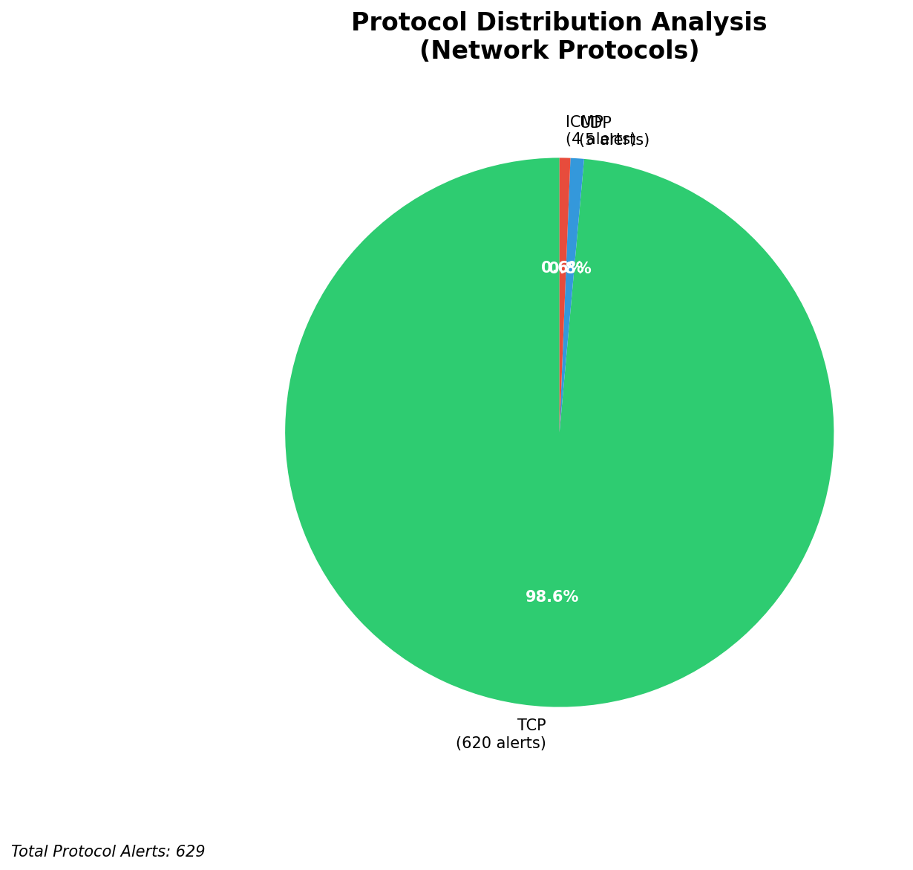

# HIGH-SEVERITY INCIDENT REPORT

    Auto-Generated: 2025-11-15 17:04:37  
    Trigger: 15 HIGH severity alerts detected (Level >= 8)  
    Critical Alerts (>8): 10  
    Total Alerts Analyzed: 1000  
    Server: 100.78.175.127  
    RAG Strategy: Custom Docs Only  
    Response Priority: IMMEDIATE  

    Triggered High Severity Alerts
    1. 🔥 Level 10 - HIGH: Suricata Severity 1 Alert - POSSBL SCAN SHELL M-SPLOIT TCP (2025-11-15T07:38:41.371+0000)
2. 🔥 Level 10 - HIGH: Suricata Severity 1 Alert - POSSBL SCAN SHELL M-SPLOIT TCP (2025-11-15T07:39:12.348+0000)
3. ⚡ Level 8 - MEDIUM: Suricata Severity 2 Alert - POSSBL SCAN FRAG (NMAP -f) (2025-11-15T07:49:46.141+0000)
4. ⚡ Level 8 - MEDIUM: Suricata Severity 2 Alert - POSSBL SCAN FRAG (NMAP -f) (2025-11-15T07:49:46.141+0000)
5. ⚡ Level 8 - MEDIUM: Suricata Severity 2 Alert - POSSBL SCAN FRAG (NMAP -f) (2025-11-15T07:49:46.148+0000)
   ... and 10 more HIGH severity alerts

---

**Executive Summary:**  
A high-severity intrusion attempt is underway, characterized by a coordinated series of TCP-based shell exploit scans targeting multiple internal assets. All 10 high-severity alerts (level 10) are identical in nature, indicating a targeted reconnaissance phase likely probing for exploitable services. The source IPs originate from geographically diverse external networks, with no evidence of internal or infrastructure-based activity. The destination IPs (66.96.202.70, 129.126.144.228, 129.126.144.229) are internal hosts under active scanning. No outbound or lateral movement has been detected. The attack pattern aligns with automated scanning tools seeking shell access vulnerabilities, potentially preceding exploitation. Immediate blocking of all source IPs is recommended. No custom threat intelligence is available for correlation.  

**Key Findings:**  
- 10 high-severity alerts (level 10) detected within a 1.5-hour window.  
- All alerts are identical: "POSSBL SCAN SHELL M-SPLOIT TCP" indicating attempted shell exploit discovery.  
- Source IPs originate from 7 distinct countries, with no internal or infrastructure sources involved.  
- Targeted assets are internal servers (66.96.202.70, 129.126.144.228/229), not monitoring systems.  
- No signs of successful exploitation, data exfiltration, or lateral movement detected.  

**Top 5 Priority Threats:**  
| IP Address | Type | Country | Direction | Activity | Confidence | Count |  
|------------|------|---------|-----------|----------|------------|-------|  
| 64.62.197.38 | External | United States | Inbound | Shell exploit scan | High | 1 |  
| 64.62.156.219 | External | United States | Inbound | Shell exploit scan | High | 1 |  
| 147.185.132.25 | External | Germany | Inbound | Shell exploit scan | High | 1 |  
| 205.210.31.224 | External | United States | Inbound | Shell exploit scan | High | 1 |  
| 194.164.107.5 | External | Ukraine | Inbound | Shell exploit scan | High | 1 |  

**MITRE ATT&CK Mapping:**  
- **T1046 - Network Service Scanning**: Automated probing of network services for vulnerabilities.  
- **T1078 - Valid Accounts**: Attempted exploitation via shell access, potentially leveraging weak credentials.  
- **T1047 - Windows Management Instrumentation (WMI)**: Shell-based access methods may be used to establish persistence.  

**Immediate Actions:**  
- Block all source IPs at the firewall and IDS/IPS level.  
- Verify patch status and disable unused shell services on targeted internal hosts.  
- Conduct a full audit of system logs on 66.96.202.70, 129.126.144.228, and 129.126.144.229 for suspicious login attempts.  
- Enable additional monitoring for shell command execution (e.g., via Wazuh) on affected systems.  
- Update Suricata rules to detect and alert on similar patterns in real time.  

**Technical Summary:**  
All high-severity alerts are consistent with automated TCP-based shell exploit scanning. No HTTP context or protocol anomalies observed. The attack is inbound, targeting internal infrastructure, but no evidence of successful compromise. All source IPs are external, with no infrastructure or internal IPs involved. The pattern suggests a broad scanning campaign using known exploit signatures. No C2 or data exfiltration indicators present.  

---
**Analysis Complete**  
Report generated: 2025-11-15T08:55:00  
Threat level: CRITICAL  
Priority actions: 5 identified

---

## 📊 Visual Threat Analysis

The following charts provide visual insights into the IP address patterns and threat distribution:

**Key Metrics:**
- Total alerts analyzed: 1000
- Charts generated: 4

### 📈 Report 20251115 170405 External Sources.Png

### 📈 Report 20251115 170405 Geolocation.Png

### 📈 Report 20251115 170405 Threat Directions.Png

### 📈 Report 20251115 170405 Protocols.Png

