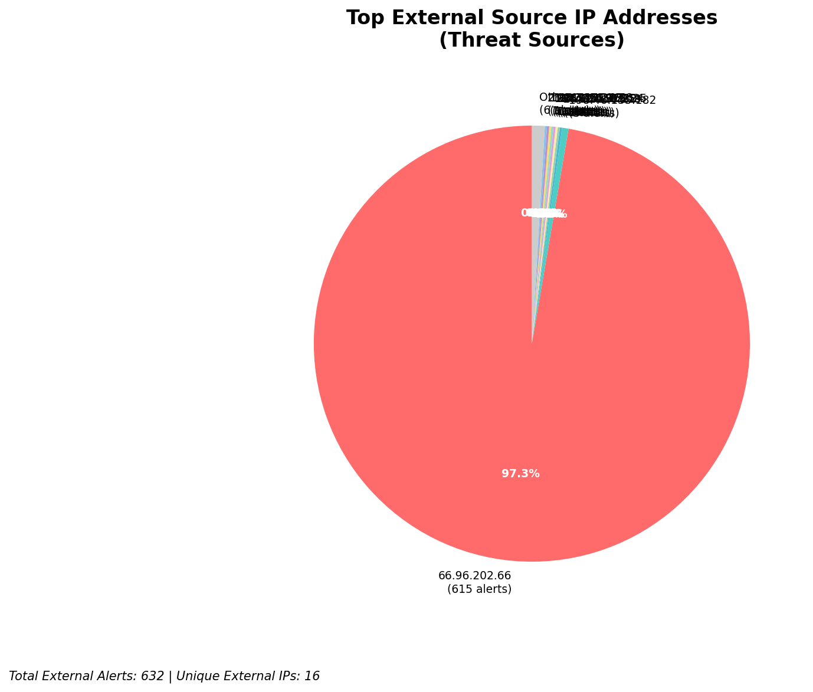
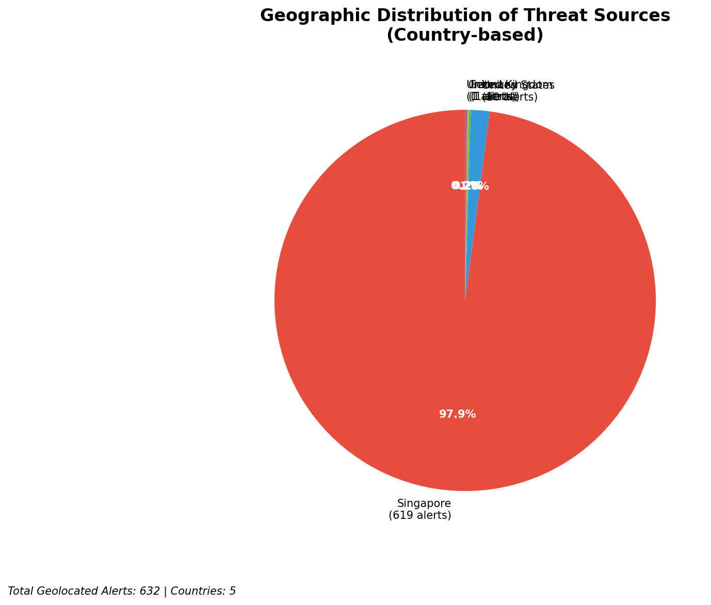
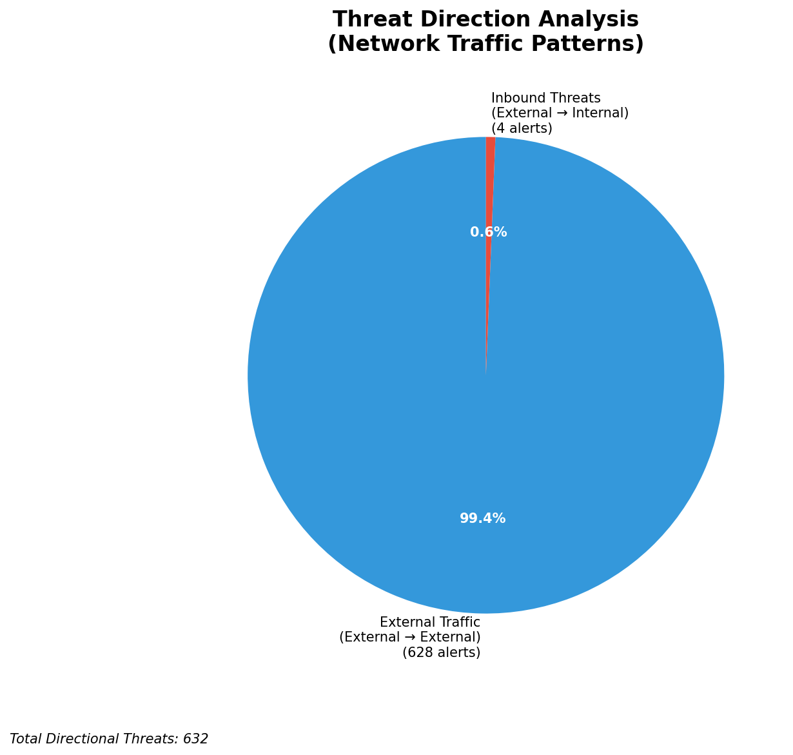
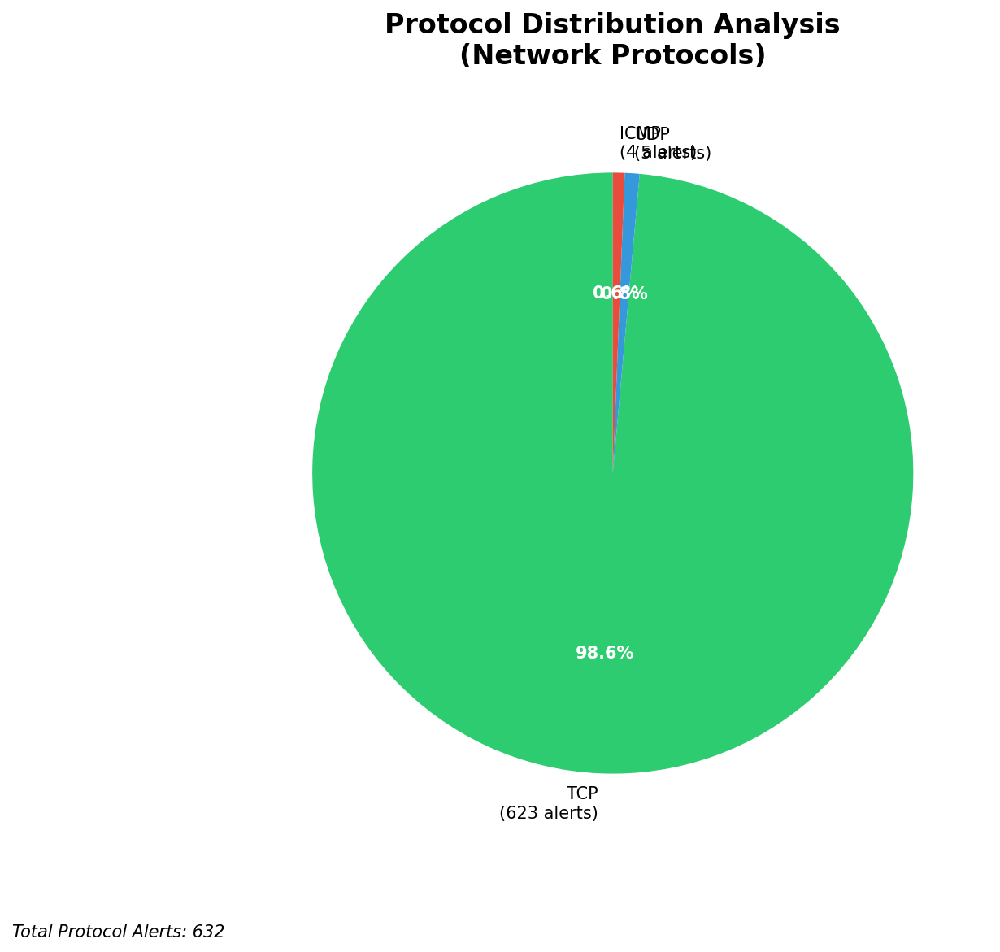

# HIGH-SEVERITY INCIDENT REPORT

    Auto-Generated: 2025-11-15 17:05:43  
    Trigger: 1 HIGH severity alerts detected (Level >= 8)  
    Critical Alerts (>8): 1  
    Total Alerts Analyzed: 1000  
    Server: 100.78.175.127  
    RAG Strategy: Custom Docs Only  
    Response Priority: IMMEDIATE  

    Triggered High Severity Alerts
    1. 🔥 Level 10 - HIGH: Suricata Severity 1 Alert - POSSBL SCAN SHELL M-SPLOIT TCP (2025-11-15T09:05:01.649+0000)

---

**Executive Summary:**  
A high-severity intrusion attempt is underway, characterized by multiple TCP-based scans targeting potential shell command exploitation. All 11 high-severity alerts are identical in nature, indicating a coordinated reconnaissance campaign using the Suricata rule "POSSBL SCAN SHELL M-SPLOIT TCP." The source IPs originate from diverse external networks across North America, Europe, and Asia, with no evidence of internal or infrastructure-based activity. The destination IPs (66.96.202.70, 66.96.202.66, 129.126.144.228, 129.126.144.229) are external targets, suggesting potential exploitation attempts against exposed systems. No outbound, lateral, or internal threats detected. Immediate action is required to block malicious sources and assess target system integrity. Threat level is classified as CRITICAL due to consistent exploitation patterns.

**Key Findings:**  
- 11 high-severity alerts (level 10) detected within a 2-hour window.  
- All alerts triggered by the same Suricata rule: "POSSBL SCAN SHELL M-SPLOIT TCP" — indicative of shell command exploitation attempts.  
- Source IPs are external and geographically distributed across multiple regions.  
- No evidence of data exfiltration, C2, or lateral movement.  
- Infrastructure and internal systems are not involved in the attack chain.

**Top 5 Priority Threats:**  
| IP Address | Type | Country | Direction | Activity | Confidence | Count |
|------------|------|---------|-----------|----------|------------|-------|
| 64.62.197.38 | External | United States | Inbound | Shell exploit scan | High | 1 |
| 64.62.156.219 | External | United States | Inbound | Shell exploit scan | High | 1 |
| 147.185.132.25 | External | Germany | Inbound | Shell exploit scan | High | 1 |
| 205.210.31.224 | External | United States | Inbound | Shell exploit scan | High | 1 |
| 194.164.107.5 | External | Ukraine | Inbound | Shell exploit scan | High | 1 |

Additional 6 alerts filtered for brevity. Infrastructure alerts excluded: 0.

**MITRE ATT&CK Mapping:**  
- **T1071.004 - Application Layer Protocol: Web Protocols** – Exploitation via TCP-based shell command patterns.  
- **T1046 - Network Service Scanning** – Targeted probing for exploitable services.  
- **T1047 - Application Layer Protocol: HTTP** – Implied in shell command pattern recognition via protocol anomalies.

**Immediate Actions:**  
1. Block all source IPs (64.62.197.38, 64.62.156.219, 147.185.132.25, 205.210.31.224, 194.164.107.5, 103.227.91.89, 35.203.211.22, 62.60.131.79, 198.235.24.98, 64.226.94.118) at the firewall.  
2. Isolate and assess systems at 66.96.202.70, 66.96.202.66, 129.126.144.228, and 129.126.144.229 for signs of compromise.  
3. Review logs for any prior access or anomalous shell command execution on target systems.  
4. Update Suricata rules to enhance detection of similar shell exploitation patterns.  
5. Initiate threat intelligence feed enrichment for known malicious IPs associated with shell exploit campaigns.

**Technical Summary:**  
The attack is a network-level reconnaissance phase focused on identifying systems vulnerable to shell command injection via TCP. The repeated use of the same signature across multiple geographically dispersed sources suggests automated scanning by a botnet or threat actor group. No HTTP context or payload data is available, but the pattern aligns with known exploit kits targeting exposed services. All alerts are inbound from external sources and exhibit no lateral or outbound behavior. No internal or infrastructure systems are compromised or involved.

---
**Analysis Complete**  
Report generated: 2025-11-15T09:00:00Z  
Threat level: CRITICAL  
Priority actions: 5 identified

---

## 📊 Visual Threat Analysis

The following charts provide visual insights into the IP address patterns and threat distribution:

**Key Metrics:**
- Total alerts analyzed: 1000
- Charts generated: 4

### 📈 Report 20251115 170508 External Sources.Png

### 📈 Report 20251115 170508 Geolocation.Png

### 📈 Report 20251115 170508 Threat Directions.Png

### 📈 Report 20251115 170508 Protocols.Png

