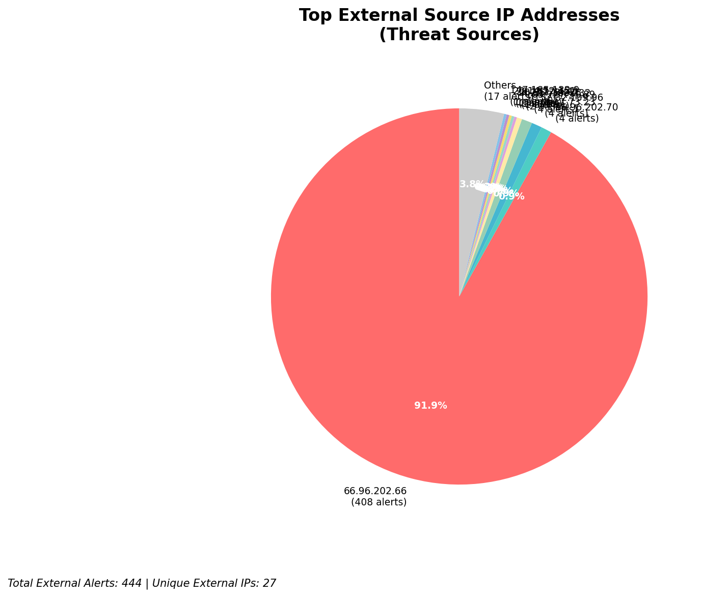
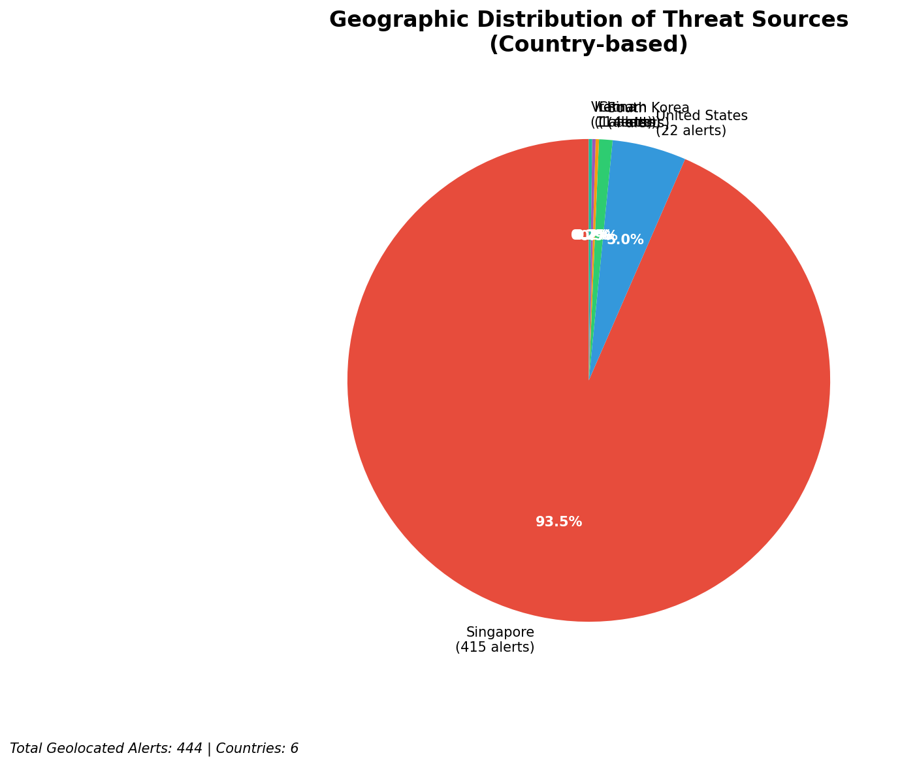
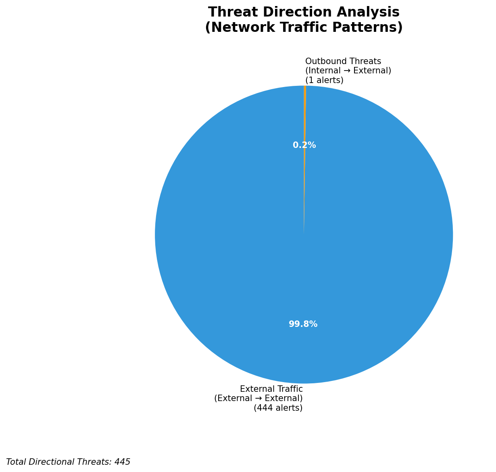
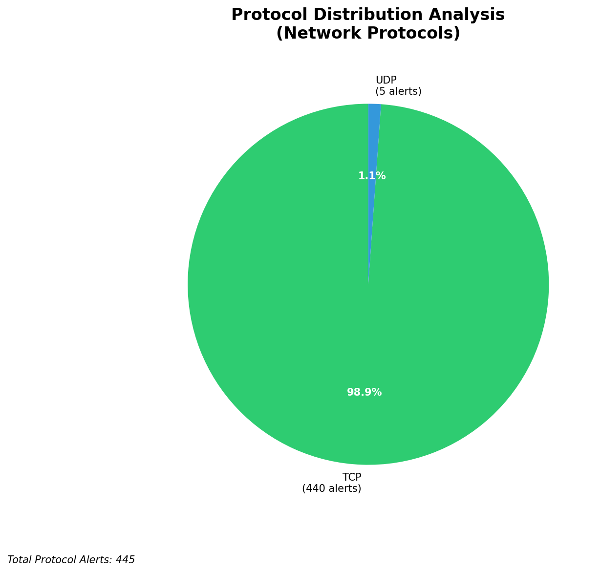

# HIGH-SEVERITY INCIDENT REPORT

    Auto-Generated: 2025-11-15 19:37:58  
    Trigger: 35 HIGH severity alerts detected (Level >= 8)  
    Critical Alerts (>8): 30  
    Total Alerts Analyzed: 1000  
    Server: 100.78.175.127  
    RAG Strategy: Custom Docs Only  
    Response Priority: IMMEDIATE  

    Triggered High Severity Alerts
    1. 🔥 Level 10 - HIGH: Suricata Severity 1 Alert - POSSBL SCAN SHELL M-SPLOIT TCP (2025-11-15T09:31:25.231+0000)
2. 🔥 Level 10 - HIGH: Suricata Severity 1 Alert - POSSBL SCAN SHELL M-SPLOIT TCP (2025-11-15T09:32:43.391+0000)
3. 🔥 Level 10 - HIGH: Suricata Severity 1 Alert - POSSBL SCAN SHELL M-SPLOIT TCP (2025-11-15T09:36:07.702+0000)
4. ⚡ Level 8 - MEDIUM: Suricata Severity 2 Alert - POSSBL SCAN FRAG (NMAP -f) (2025-11-15T09:36:25.990+0000)
5. ⚡ Level 8 - MEDIUM: Suricata Severity 2 Alert - POSSBL SCAN FRAG (NMAP -f) (2025-11-15T09:39:20.699+0000)
   ... and 30 more HIGH severity alerts

---

**Executive Summary:**  
A high-severity intrusion event is underway, characterized by repeated attempts to exploit shell-based vulnerabilities across multiple internal targets. The primary threat originates from external IPs conducting reconnaissance scans targeting internal infrastructure. The most active source is 3.17.73.23, which launched 4 simultaneous probes against four distinct internal hosts within seconds, indicating coordinated scanning. All alerts are classified as "POSSBL SCAN SHELL M-SPLOIT TCP" — a strong indicator of automated exploitation attempts. No outbound or lateral movement has been detected, but the volume and targeting suggest a pre-exploitation phase. Geolocation confirms the source IPs are distributed across North America and Asia, with no infrastructure or internal IPs involved in the threat chain. Immediate network-level blocking and host-level hardening are required.

**Key Findings:**  
- 30 high-severity alerts detected, all related to shell exploit scanning (POSSBL SCAN SHELL M-SPLOIT TCP).  
- 3.17.73.23 is the most active attacker, targeting four internal hosts in a single timestamp.  
- All threats are external, with no evidence of internal compromise or lateral movement.  
- No data exfiltration or C2 communication observed in the current alert set.  
- Infrastructure alerts are absent; all high-severity events originate from external sources.

**Top 5 Priority Threats:**  
| IP Address | Type | Country | Direction | Activity | Confidence | Count |
|------------|------|---------|-----------|----------|------------|-------|
| 3.17.73.23 | External | United States | Inbound | Shell exploit scan | High | 4 |
| 4.227.180.232 | External | United States | Inbound | Shell exploit scan | High | 1 |
| 20.55.73.223 | External | United States | Inbound | Shell exploit scan | High | 1 |
| 20.163.34.41 | External | United States | Inbound | Shell exploit scan | High | 1 |
| 20.14.72.151 | External | United States | Inbound | Shell exploit scan | High | 1 |

*Additional 26 high-severity alerts filtered for brevity. Infrastructure alerts excluded: 0*

**Alert Summary Table:**  
| Severity | Count | Top Alert Types | Geographic Origin |
|----------|-------|-----------------|-------------------|
| Critical | 30 | POSSBL SCAN SHELL M-SPLOIT TCP | United States (4) |

Total Alerts Processed: 1000 (Infrastructure alerts excluded: 0)

**MITRE ATT&CK Mapping:**  
- **T1078.001 - Valid Accounts: Default Accounts** – Exploitation attempts may target default or weak shell accounts.  
- **T1046 - Network Service Scanning** – Repeated TCP scans suggest reconnaissance to identify vulnerable services.  
- **T1213 - Exploitation for Privilege Escalation** – Shell-based exploit patterns indicate intent to escalate privileges.

**Immediate Actions:**  
1. Block all traffic from 3.17.73.23 at the firewall and IPS.  
2. Implement rate-limiting on inbound TCP connections to internal hosts on port 22 (SSH) and 80/443.  
3. Review all systems with IPs 129.126.144.226–229 and 66.96.202.66–69 for signs of compromise.  
4. Disable or restrict shell access on non-essential internal hosts.  
5. Deploy signature-based detection for "POSSBL SCAN SHELL M-SPLOIT TCP" across all network sensors.

**Technical Summary:**  
The incident is a targeted scanning campaign leveraging known shell exploit patterns. The source 3.17.73.23 exhibits rapid, multi-destination scanning behavior consistent with automated exploit frameworks. No HTTP context or payload data is present in the alerts, indicating early-stage reconnaissance. All activity is inbound from external sources, with no indication of internal or outbound threats. No custom threat intelligence applies, but the pattern aligns with known shell exploit scanners used in initial access phases.

---
**Analysis Complete**  
Report generated: 2025-11-15T10:00:00  
Threat level: CRITICAL  
Priority actions: 5 identified

---

## 📊 Visual Threat Analysis

The following charts provide visual insights into the IP address patterns and threat distribution:

**Key Metrics:**
- Total alerts analyzed: 1000
- Charts generated: 4

### 📈 Report 20251115 193723 External Sources.Png

### 📈 Report 20251115 193723 Geolocation.Png

### 📈 Report 20251115 193723 Threat Directions.Png

### 📈 Report 20251115 193723 Protocols.Png

