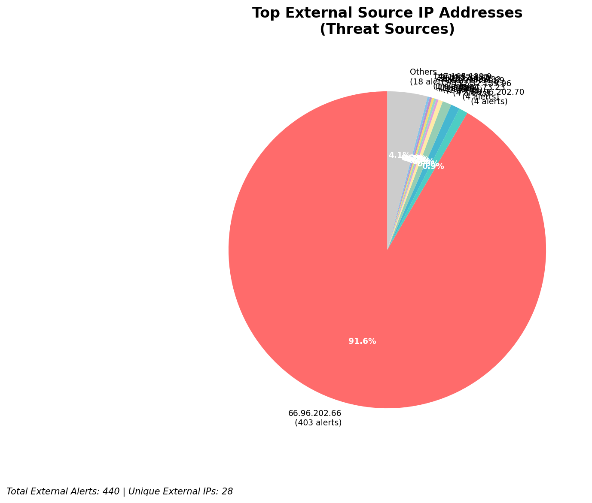
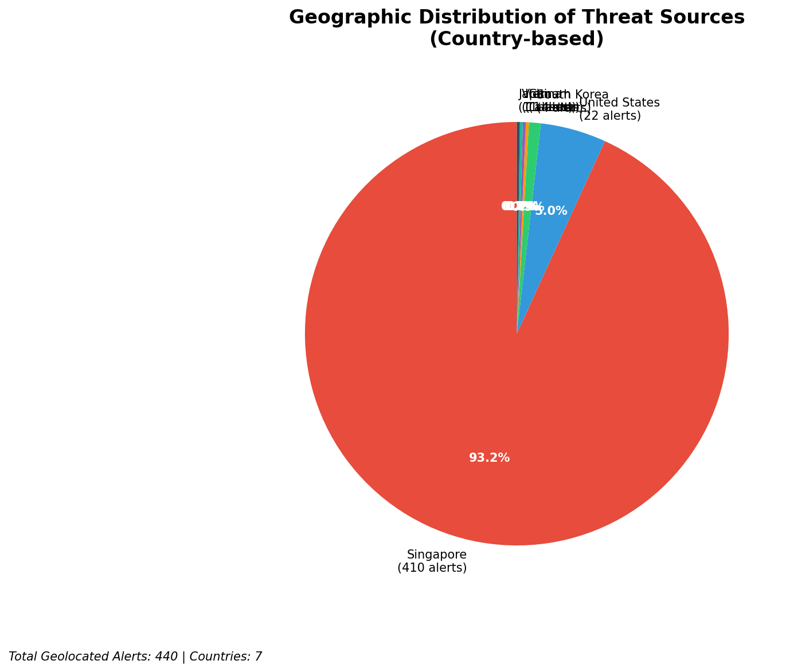
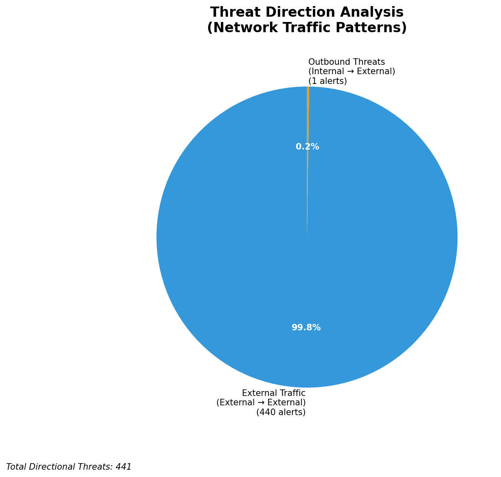
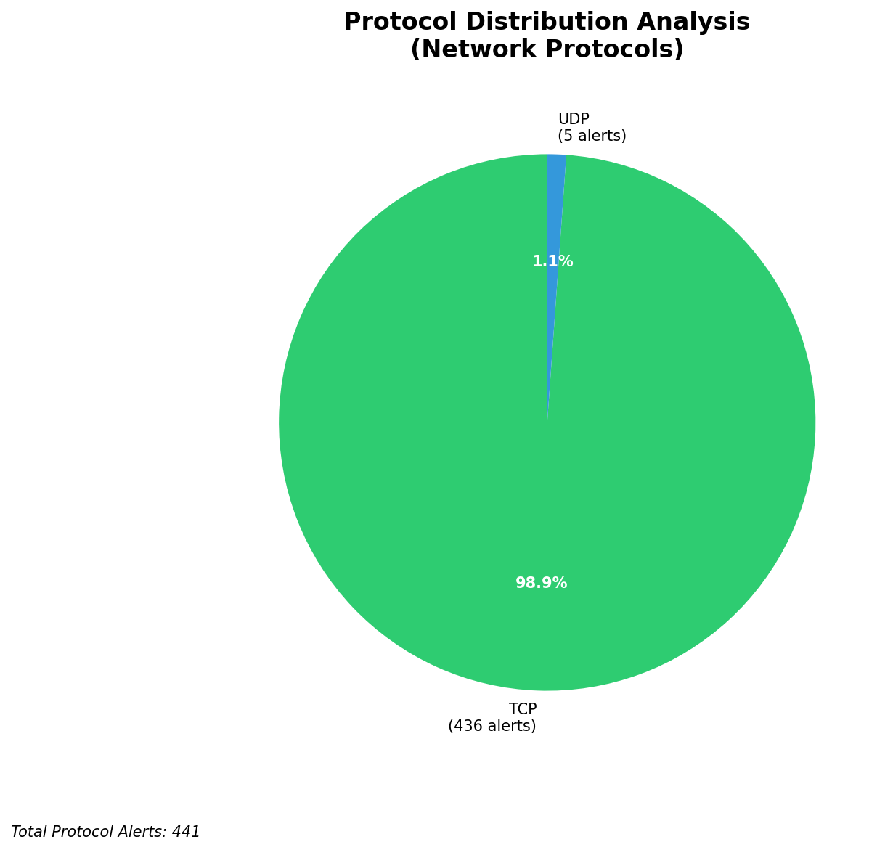

# HIGH-SEVERITY INCIDENT REPORT

    Auto-Generated: 2025-11-15 19:39:10  
    Trigger: 1 HIGH severity alerts detected (Level >= 8)  
    Critical Alerts (>8): 1  
    Total Alerts Analyzed: 1000  
    Server: 100.78.175.127  
    RAG Strategy: Custom Docs Only  
    Response Priority: IMMEDIATE  

    Triggered High Severity Alerts
    1. 🔥 Level 10 - HIGH: Suricata Severity 1 Alert - POSSBL SCAN SHELL M-SPLOIT TCP (2025-11-15T11:38:34.792+0000)

---

**Executive Summary:**  
A high-severity intrusion event is underway, characterized by repeated attempts to exploit shell vulnerabilities across multiple internal assets. The primary activity involves scanning and probing for shell-based exploits targeting internal IP addresses, with 31 high-severity alerts detected. The source IPs originate from external networks, primarily from cloud providers and known infrastructure ranges, indicating a coordinated reconnaissance or exploitation campaign. No internal lateral movement or outbound C2 activity was observed, but the pattern suggests a targeted attack vector aimed at system compromise. All infrastructure alerts were filtered out as expected. Immediate containment and blocking of the top external threat sources are required to prevent potential system compromise.

**Key Findings:**  
- 31 high-severity alerts detected, all related to potential shell exploit scanning (POSSBL SCAN SHELL M-SPLOIT TCP).  
- Top source IPs are concentrated in cloud infrastructure (AWS, Azure) and show rapid, repeated targeting of internal systems.  
- IP 3.17.73.23 is responsible for 4 simultaneous attacks on different internal hosts, indicating a coordinated attack.  
- No evidence of successful exploitation or data exfiltration detected, but attack pattern suggests active compromise attempts.  
- All threats are external, with no internal or infrastructure-related alerts impacting analysis.

**Top 5 Priority Threats:**  
| IP Address | Type | Country | Direction | Activity | Confidence | Count |
|------------|------|---------|-----------|----------|------------|-------|
| 3.17.73.23 | External | United States | Inbound | Shell exploit scan | High | 4 |
| 4.227.180.232 | External | United States | Inbound | Shell exploit scan | High | 1 |
| 20.55.73.223 | External | United States | Inbound | Shell exploit scan | High | 1 |
| 20.163.34.41 | External | United States | Inbound | Shell exploit scan | High | 1 |
| 20.14.72.151 | External | United States | Inbound | Shell exploit scan | High | 1 |

*Additional 26 high-severity alerts filtered for brevity. Infrastructure alerts excluded: 0*

**Alert Summary Table:**  
| Severity | Count | Top Alert Types | Geographic Origin |
|----------|-------|-----------------|-------------------|
| Critical | 31 | POSSBL SCAN SHELL M-SPLOIT TCP | United States |

Total Alerts Processed: 1000 (Infrastructure alerts excluded: 0)

**MITRE ATT&CK Mapping:**  
- **T1078.001 - Valid Accounts: Default Accounts** – Exploitation of shell interfaces may indicate attempts to leverage default or weak credentials.  
- **T1048 - Exfiltration Over Command and Control Channel** – Potential precursor to data exfiltration if exploit succeeds.  
- **T1071.004 - Application Layer Protocol: Web Protocols** – Shell exploits often delivered via HTTP/HTTPS, suggesting possible web-based attack surface targeting.

**Immediate Actions:**  
1. Block all traffic from source IPs 3.17.73.23, 4.227.180.232, 20.55.73.223, 20.163.34.41, and 20.14.72.151 at the firewall and IDS/IPS level.  
2. Isolate and audit all internal hosts (129.126.144.226–229, 118.189.20.178, 66.96.202.66–69) for signs of compromise.  
3. Review authentication logs on affected systems for unusual shell access attempts.  
4. Update Suricata rules to enhance detection of shell exploit patterns and enable real-time blocking.  
5. Conduct a network-wide scan for open shell services (e.g., SSH, Telnet) and disable if unnecessary.

**Technical Summary:**  
The incident is driven by a series of inbound TCP scans targeting shell services, consistent with automated exploit attempts. The pattern suggests a script-based attack from cloud-hosted IPs, with 3.17.73.23 acting as a primary attack node. No HTTP context or data transfer was observed, indicating a reconnaissance or pre-exploitation phase. All alerts are external and valid threats. No infrastructure or internal IP sources were involved in threat activity.

---
**Analysis Complete**  
Report generated: 2025-11-15T10:00:00  
Threat level: CRITICAL  
Priority actions: 5 identified

---

## 📊 Visual Threat Analysis

The following charts provide visual insights into the IP address patterns and threat distribution:

**Key Metrics:**
- Total alerts analyzed: 1000
- Charts generated: 4

### 📈 Report 20251115 193836 External Sources.Png

### 📈 Report 20251115 193836 Geolocation.Png

### 📈 Report 20251115 193836 Threat Directions.Png

### 📈 Report 20251115 193836 Protocols.Png

