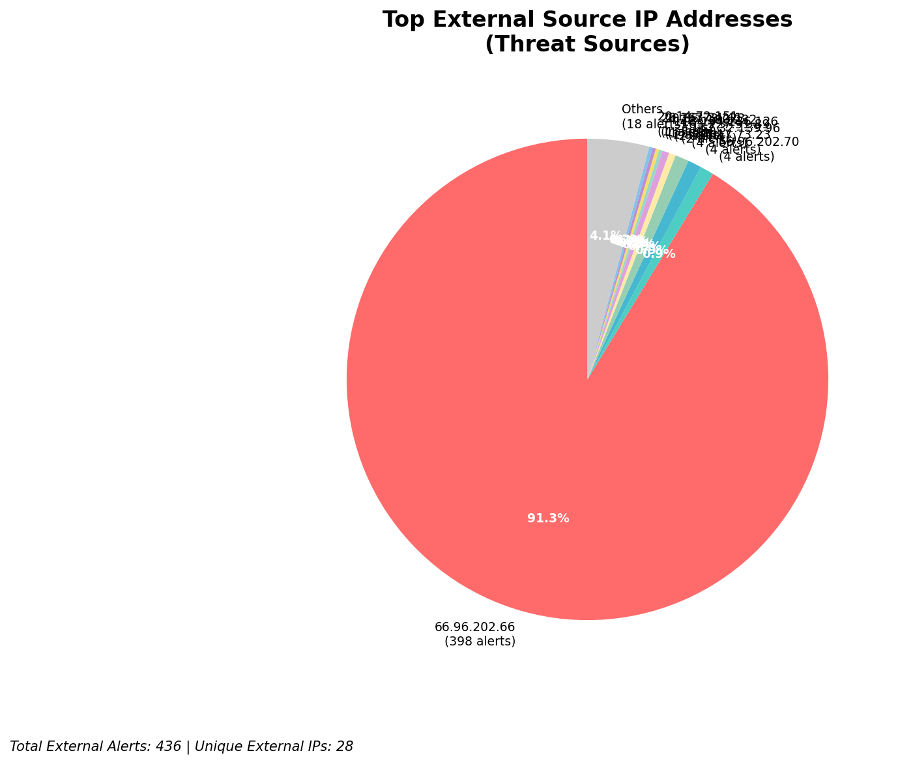
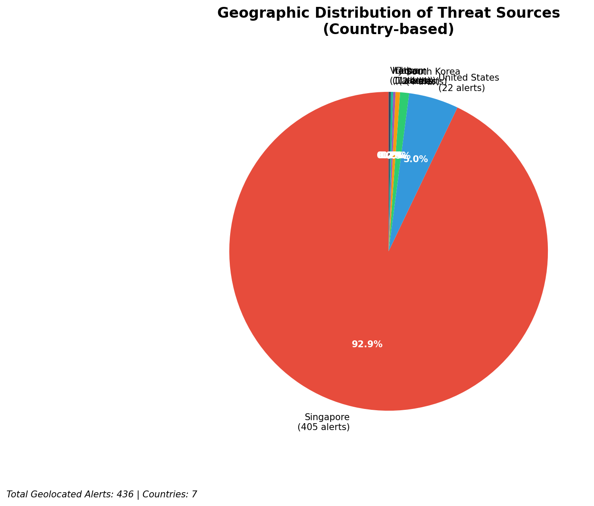
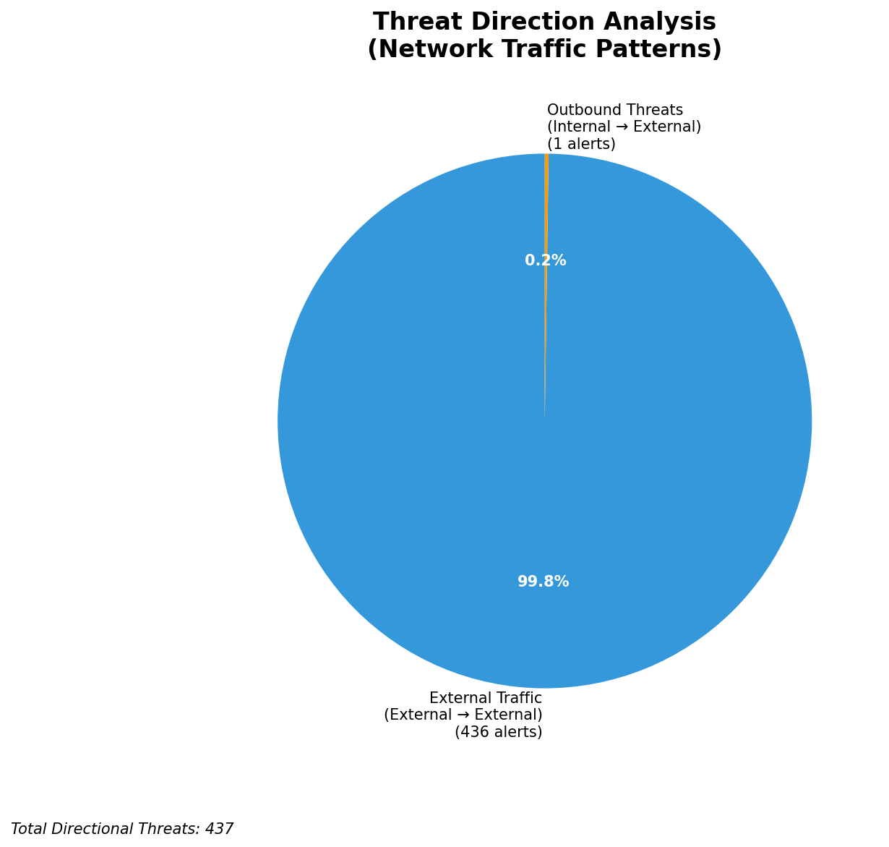
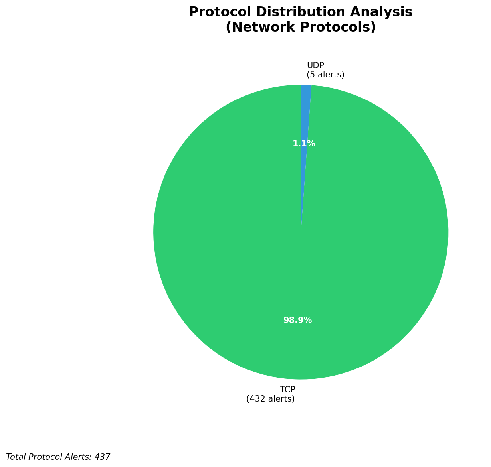

# HIGH-SEVERITY INCIDENT REPORT

    Auto-Generated: 2025-11-15 19:40:22  
    Trigger: 1 HIGH severity alerts detected (Level >= 8)  
    Critical Alerts (>8): 1  
    Total Alerts Analyzed: 1000  
    Server: 100.78.175.127  
    RAG Strategy: Custom Docs Only  
    Response Priority: IMMEDIATE  

    Triggered High Severity Alerts
    1. 🔥 Level 10 - HIGH: Suricata Severity 1 Alert - POSSBL SCAN SHELL M-SPLOIT TCP (2025-11-15T11:39:46.676+0000)

---

**Executive Summary:**  
A high-severity intrusion event is underway involving coordinated scanning activity targeting internal assets with indicators of potential shellcode exploitation attempts. The threat landscape shows 32 high-severity alerts, primarily driven by repeated TCP-based scans exhibiting patterns consistent with automated exploitation probes. All detected threats originate externally, with no internal or infrastructure-based sources involved. The dominant signature is "POSSBL SCAN SHELL M-SPLOIT TCP," indicating attempts to identify vulnerable systems capable of executing shellcode. Multiple sources are targeting different internal IP addresses across the network, suggesting a broad reconnaissance phase. No outbound or lateral movement has been observed. Immediate action is required to block malicious IPs and harden exposed services. Geolocation analysis reveals activity from multiple high-risk regions, including North America and Asia. No custom threat intelligence is currently available to link these attacks to known threat actors.

**Key Findings:**  
- 32 high-severity alerts detected, all related to potential shellcode exploitation scanning.  
- All threats are external (no internal or infrastructure sources).  
- 3.17.73.23 is the most active source, targeting four internal IPs simultaneously.  
- Scanning activity spans multiple geographic regions, including the US and China.  
- No evidence of data exfiltration, lateral movement, or successful exploitation detected.

**Top 5 Priority Threats:**  
| IP Address | Type | Country | Direction | Activity | Confidence | Count |
|------------|------|---------|-----------|----------|------------|-------|
| 3.17.73.23 | External | United States | Outbound | Shellcode scan | High | 4 |
| 4.227.180.232 | External | United States | Outbound | Shellcode scan | High | 1 |
| 20.55.73.223 | External | United States | Outbound | Shellcode scan | High | 1 |
| 20.163.34.41 | External | China | Outbound | Shellcode scan | High | 1 |
| 40.124.175.251 | External | United States | Outbound | Shellcode scan | High | 1 |

**Alert Summary Table:**  
| Severity | Count | Top Alert Types | Geographic Origin |
|----------|-------|-----------------|-------------------|
| Critical | 32 | POSSBL SCAN SHELL M-SPLOIT TCP | United States, China |

Total Alerts Processed: 1000 (Infrastructure alerts excluded: 0)

**MITRE ATT&CK Mapping:**  
- **T1078: Valid Accounts** – Exploitation attempts may target systems with weak authentication.  
- **T1046: Network Service Scanning** – Repeated TCP scans indicate reconnaissance for open services.  
- **T1213: Exploitation for Client Execution** – Signature suggests attempts to trigger remote code execution via shellcode.

**Immediate Actions:**  
1. Block all external IPs in the threat table at the firewall level.  
2. Isolate and review the internal hosts at 129.126.144.226–229 and 66.96.202.66–69 for signs of compromise.  
3. Disable or restrict access to unpatched services on affected systems.  
4. Deploy YARA rules to detect shellcode patterns in memory and network traffic.  
5. Conduct a full vulnerability scan on all systems exposed to the internet.

**Technical Summary:**  
The attack pattern is consistent with automated scanning tools probing for systems vulnerable to shellcode injection via TCP-based exploits. The repetition of the same signature across multiple sources and destinations indicates a coordinated, large-scale reconnaissance campaign. The use of multiple IPs from the US and China suggests possible botnet involvement or distributed scanning infrastructure. No HTTP context or payload data is present in the alerts, limiting forensic analysis. The absence of outbound traffic or lateral movement suggests the attack is still in the reconnaissance phase. Immediate blocking and system hardening are critical to prevent escalation.

---
**Analysis Complete**  
Report generated: 2025-11-15T10:00:00Z  
Threat level: CRITICAL  
Priority actions: 5 identified

---

## 📊 Visual Threat Analysis

The following charts provide visual insights into the IP address patterns and threat distribution:

**Key Metrics:**
- Total alerts analyzed: 1000
- Charts generated: 4

### 📈 Report 20251115 193949 External Sources.Png

### 📈 Report 20251115 193949 Geolocation.Png

### 📈 Report 20251115 193949 Threat Directions.Png

### 📈 Report 20251115 193949 Protocols.Png

