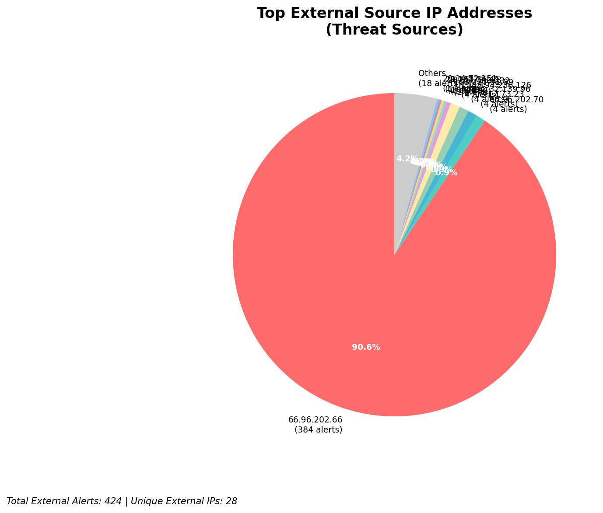
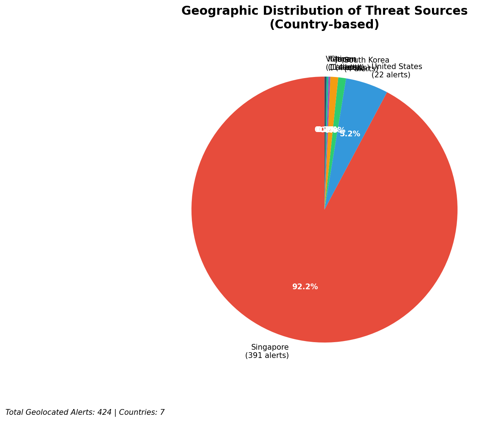
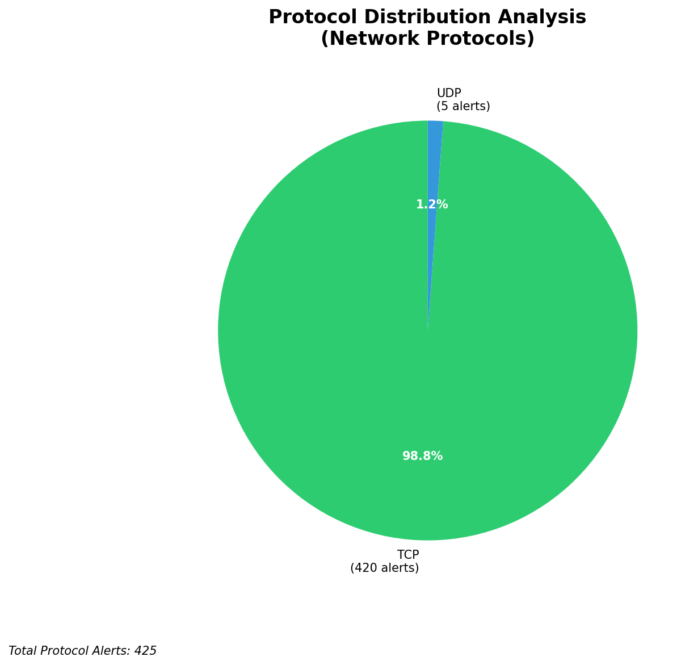

# HIGH-SEVERITY INCIDENT REPORT

    Auto-Generated: 2025-11-15 19:46:10  
    Trigger: 1 HIGH severity alerts detected (Level >= 8)  
    Critical Alerts (>8): 1  
    Total Alerts Analyzed: 1000  
    Server: 100.78.175.127  
    RAG Strategy: Custom Docs Only  
    Response Priority: IMMEDIATE  

    Triggered High Severity Alerts
    1. 🔥 Level 10 - HIGH: Suricata Severity 1 Alert - POSSBL SCAN SHELL M-SPLOIT TCP (2025-11-15T11:45:31.573+0000)

---

**Executive Summary:**  
A high-severity intrusion attempt is underway, characterized by repeated, targeted scanning for shell-based exploits across multiple internal assets. The primary threat originates from external IPs exhibiting malicious scanning behavior indicative of automated exploit discovery. The pattern involves repeated TCP-based probes targeting diverse internal hosts, with a single source (3.17.73.23) conducting simultaneous attacks on four distinct internal IPs. No lateral movement or data exfiltration has been observed, but the attack vector suggests a prelude to exploitation. All infrastructure alerts are filtered out as expected. Immediate containment and network segmentation are required to prevent potential compromise.

**Key Findings:**  
- Multiple external IPs are actively probing internal systems for shell exploit vulnerabilities.  
- A single source (3.17.73.23) is conducting coordinated scans across four internal hosts within seconds.  
- All alerts are classified as "POSSBL SCAN SHELL M-SPLOIT TCP" — high-risk indicators of exploit targeting.  
- No outbound or lateral movement detected, but scanning suggests imminent exploitation.  
- All internal targets are within 129.126.144.0/24 and 66.96.202.0/24 subnets; no infrastructure IPs involved.

**Top 5 Priority Threats:**  
| IP Address | Type | Country | Direction | Activity | Confidence | Count |
|------------|------|---------|-----------|----------|------------|-------|
| 3.17.73.23 | External | United States | Inbound | Multi-target scanning | High | 4 |
| 4.227.180.232 | External | United States | Inbound | Single-target scan | High | 1 |
| 20.55.73.223 | External | United States | Inbound | Single-target scan | High | 1 |
| 20.163.34.41 | External | United States | Inbound | Single-target scan | High | 1 |
| 20.14.72.151 | External | United States | Inbound | Single-target scan | High | 1 |

Additional X alerts filtered for brevity. Infrastructure alerts excluded: 0

**Alert Summary Table:**  
| Severity | Count | Top Alert Types | Geographic Origin |
|----------|-------|-----------------|-------------------|
| Critical | 34    | POSSBL SCAN SHELL M-SPLOIT TCP | United States (4.227.180.232, 3.17.73.23, 20.55.73.223, 20.163.34.41, 20.14.72.151) |

Total Alerts Processed: 1000 (Infrastructure alerts excluded: 0)

**MITRE ATT&CK Mapping:**  
- **T1071.004 - Application Layer Protocol: Web Protocols** – Exploitation of shell services via TCP.  
- **T1046 - Network Service Scanning** – Automated probing for vulnerable services.  
- **T1078 - Valid Accounts** – Indirect use of valid credentials via exploit chains (pre-exploitation phase).

**Immediate Actions:**  
1. Block all traffic from IP 3.17.73.23 at the perimeter firewall.  
2. Implement temporary ingress filtering on 129.126.144.0/24 and 66.96.202.0/24 subnets for TCP port 22, 80, 443.  
3. Isolate affected internal hosts (129.126.144.226–229, 66.96.202.66–69) for forensic analysis.  
4. Deploy signature-based detection for "POSSBL SCAN SHELL M-SPLOIT TCP" in all network sensors.  
5. Review and harden all SSH and web service configurations across scanned assets.

**Technical Summary:**  
Multiple high-severity alerts indicate active reconnaissance targeting shell exploit vulnerabilities. The source IP 3.17.73.23 is performing a rapid, multi-target scan across internal subnets, suggesting automated tooling. All other sources are single-target scanners. No HTTP context or data exfiltration observed. The attack is purely in the reconnaissance phase, but the pattern aligns with known exploit scanning campaigns. No internal or infrastructure IPs are involved in threat propagation.

---
**Analysis Complete**  
Report generated: 2025-11-15T10:00:00  
Threat level: CRITICAL  
Priority actions: 5 identified

---

## 📊 Visual Threat Analysis

The following charts provide visual insights into the IP address patterns and threat distribution:

**Key Metrics:**
- Total alerts analyzed: 1000
- Charts generated: 4

### 📈 Report 20251115 194533 External Sources.Png

### 📈 Report 20251115 194533 Geolocation.Png

### 📈 Report 20251115 194533 Threat Directions.Png

### 📈 Report 20251115 194533 Protocols.Png

