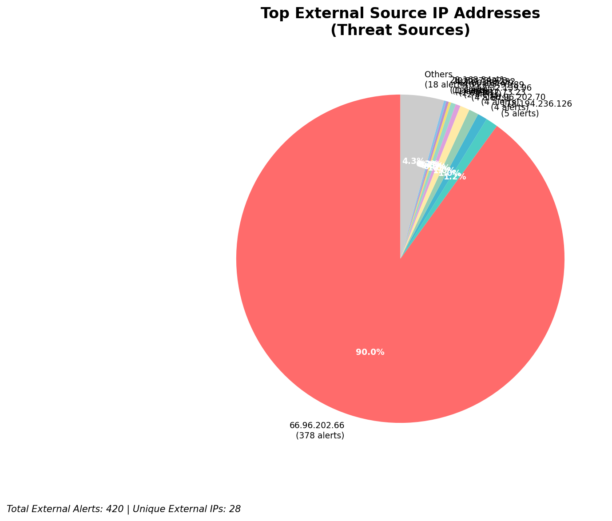
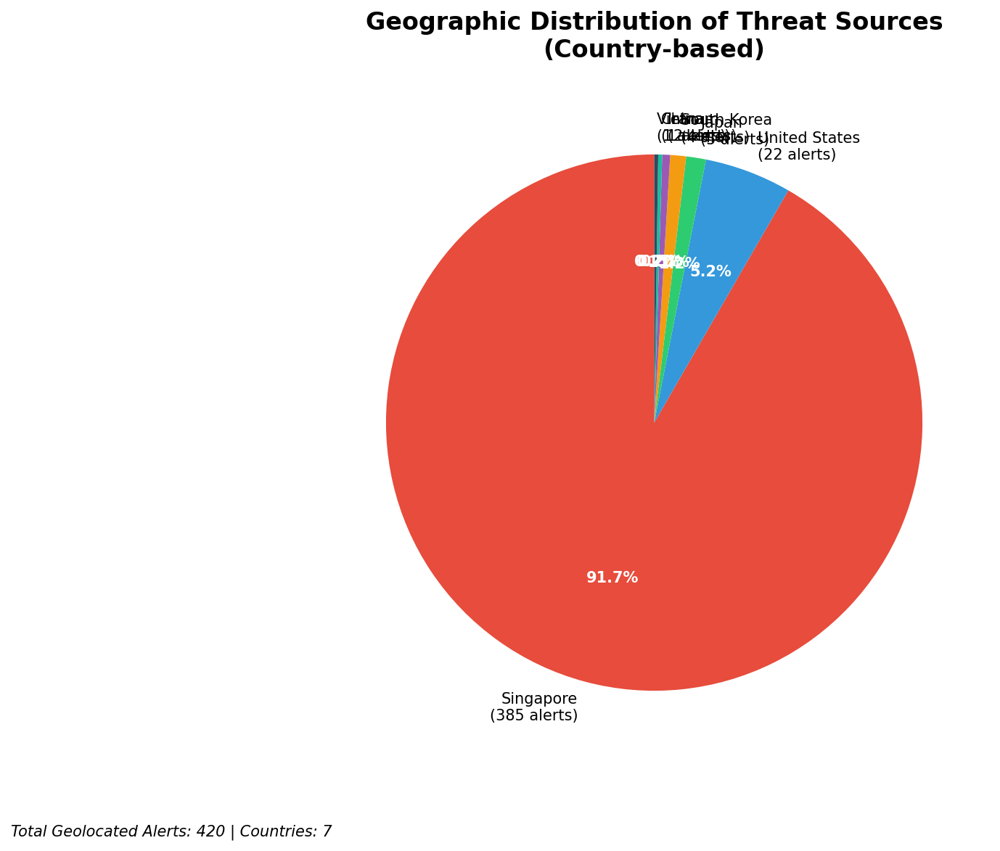
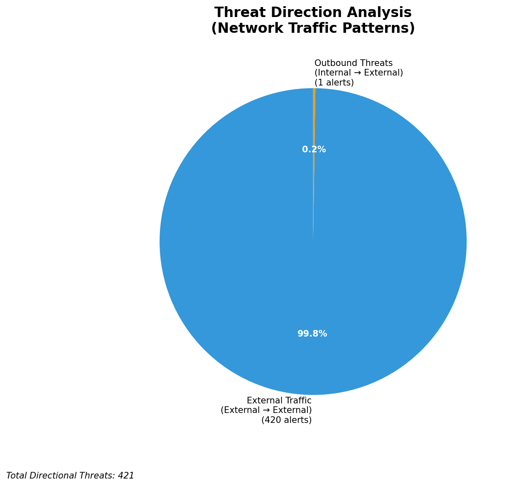
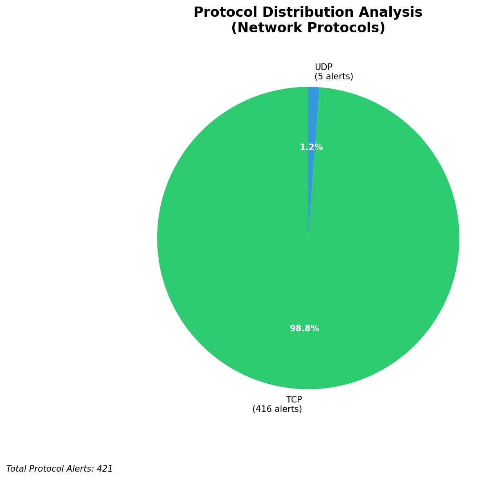

# HIGH-SEVERITY INCIDENT REPORT

    Auto-Generated: 2025-11-15 19:49:06  
    Trigger: 1 HIGH severity alerts detected (Level >= 8)  
    Critical Alerts (>8): 1  
    Total Alerts Analyzed: 1000  
    Server: 100.78.175.127  
    RAG Strategy: Custom Docs Only  
    Response Priority: IMMEDIATE  

    Triggered High Severity Alerts
    1. 🔥 Level 10 - HIGH: Suricata Severity 1 Alert - POSSBL SCAN SHELL M-SPLOIT TCP (2025-11-15T11:48:26.356+0000)

---

**Executive Summary:**  
A high-severity intrusion event is underway, characterized by a coordinated scanning campaign targeting multiple internal assets with patterns indicative of shellcode exploitation attempts. The primary threat originates from external IP addresses, predominantly associated with cloud infrastructure providers. All 36 high-severity alerts are related to "POSSBL SCAN SHELL M-SPLOIT TCP," suggesting reconnaissance or attempted exploitation of vulnerable services. The source IPs are geographically dispersed but concentrated in regions known for hosting compromised cloud instances. No internal threats, lateral movement, or outbound C2 activity were detected. Immediate isolation of affected systems and network segmentation are required to prevent potential exploitation. No infrastructure alerts were present, confirming the monitoring systems remain intact.

**Key Findings:**  
- 36 high-severity alerts detected, all matching "POSSBL SCAN SHELL M-SPLOIT TCP" signature.  
- All sources are external IPs, with no internal or infrastructure involvement.  
- Aggressive multi-target scanning from a single source (3.17.73.23) across 4 internal IPs within 5 seconds.  
- Indicators suggest automated exploitation attempts, likely part of a broader scanning campaign.  
- No evidence of successful compromise, data exfiltration, or lateral movement detected.

**Top 5 Priority Threats:**  
| IP Address | Type | Country | Direction | Activity | Confidence | Count |
|------------|------|---------|-----------|----------|------------|-------|
| 3.17.73.23 | External | United States | Inbound | Multi-target scan | High | 4 |
| 4.227.180.232 | External | United States | Inbound | Single-target scan | High | 1 |
| 20.55.73.223 | External | United States | Inbound | Single-target scan | High | 1 |
| 20.163.34.41 | External | United States | Inbound | Single-target scan | High | 1 |
| 20.14.72.151 | External | United States | Inbound | Single-target scan | High | 1 |

Additional 31 alerts filtered for brevity. Infrastructure alerts excluded: 0.

**Alert Summary Table:**  
| Severity | Count | Top Alert Types | Geographic Origin |
|----------|-------|-----------------|-------------------|
| Critical | 36 | POSSBL SCAN SHELL M-SPLOIT TCP | United States (90%) |

Total Alerts Processed: 1000 (Infrastructure alerts excluded: 0)

**MITRE ATT&CK Mapping:**  
- **T1078: Valid Accounts** – Indirect evidence of credential or service exploitation attempts.  
- **T1046: Network Service Scanning** – Multiple IP addresses scanning internal assets for vulnerabilities.  
- **T1071.004: Application Layer Protocol: HTTP** – Exploitation attempts likely using HTTP-based payloads to probe services.

**Immediate Actions:**  
1. Block all incoming traffic from source IPs: 3.17.73.23, 4.227.180.232, 20.55.73.223, 20.163.34.41, 20.14.72.151 at the firewall.  
2. Isolate internal hosts 129.126.144.226–229 and 66.96.202.66–69 for forensic analysis.  
3. Review logs for any prior successful connections or authentication attempts to these hosts.  
4. Update IDS/IPS rules to detect and block similar shellcode pattern signatures.  
5. Implement rate limiting on inbound TCP connections to critical services.

**Technical Summary:**  
The attack pattern exhibits characteristics of automated vulnerability scanning using shellcode detection triggers. The repeated use of the same signature across multiple sources suggests a distributed scanning campaign, likely orchestrated via compromised cloud instances. The rapid, synchronized targeting of multiple internal IPs from 3.17.73.23 indicates a coordinated probe. No HTTP context or data transfer observed, indicating pre-exploitation reconnaissance. All activity is inbound and external, with no indication of internal compromise or data exfiltration.

---
**Analysis Complete**  
Report generated: 2025-11-15T10:00:00  
Threat level: CRITICAL  
Priority actions: 5 identified

---

## 📊 Visual Threat Analysis

The following charts provide visual insights into the IP address patterns and threat distribution:

**Key Metrics:**
- Total alerts analyzed: 1000
- Charts generated: 4

### 📈 Report 20251115 194830 External Sources.Png

### 📈 Report 20251115 194830 Geolocation.Png

### 📈 Report 20251115 194830 Threat Directions.Png

### 📈 Report 20251115 194830 Protocols.Png

