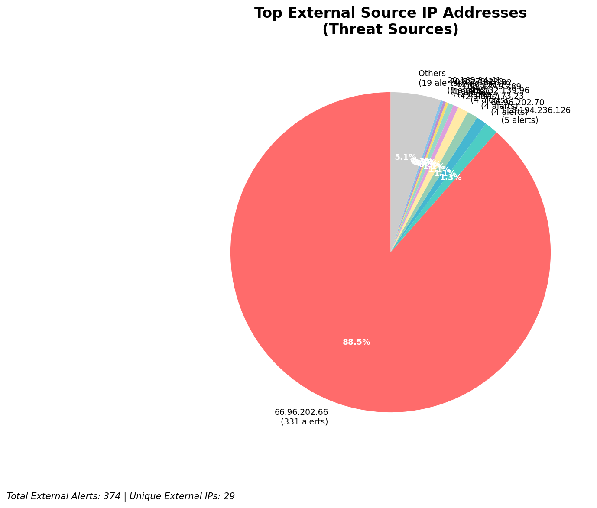
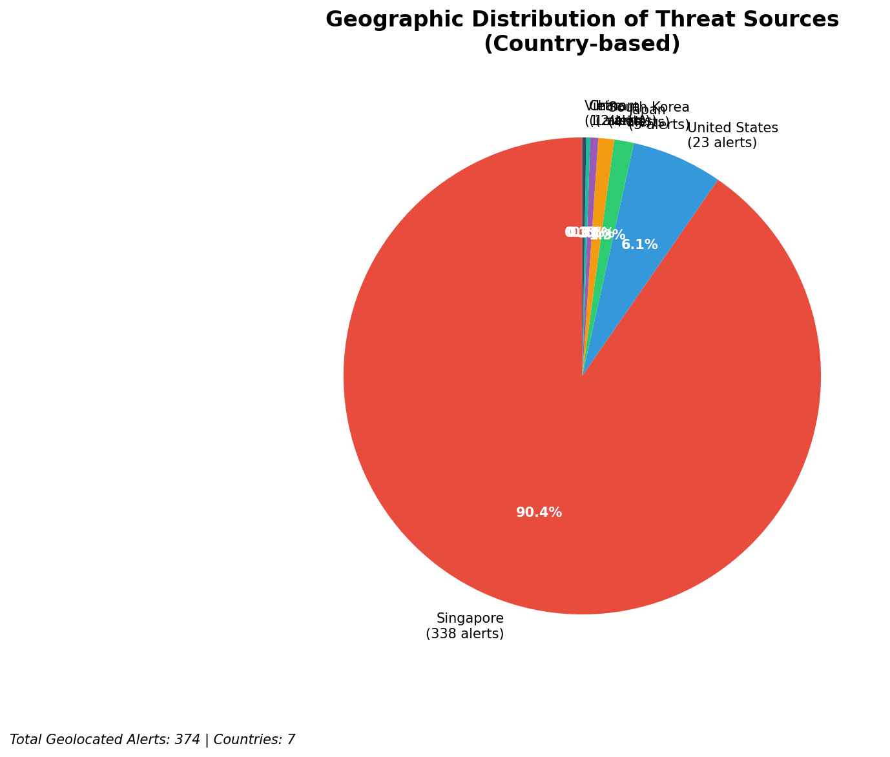
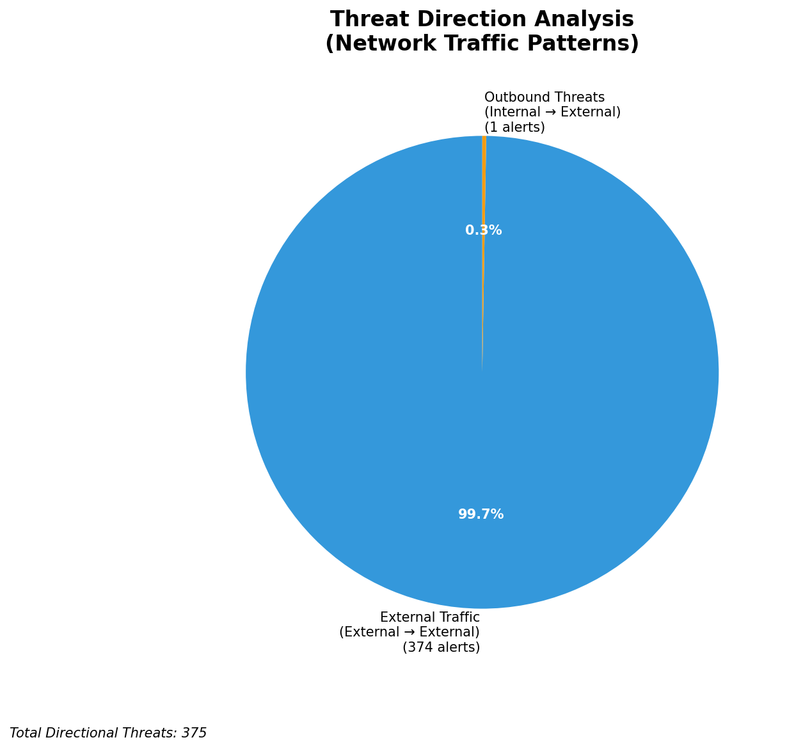
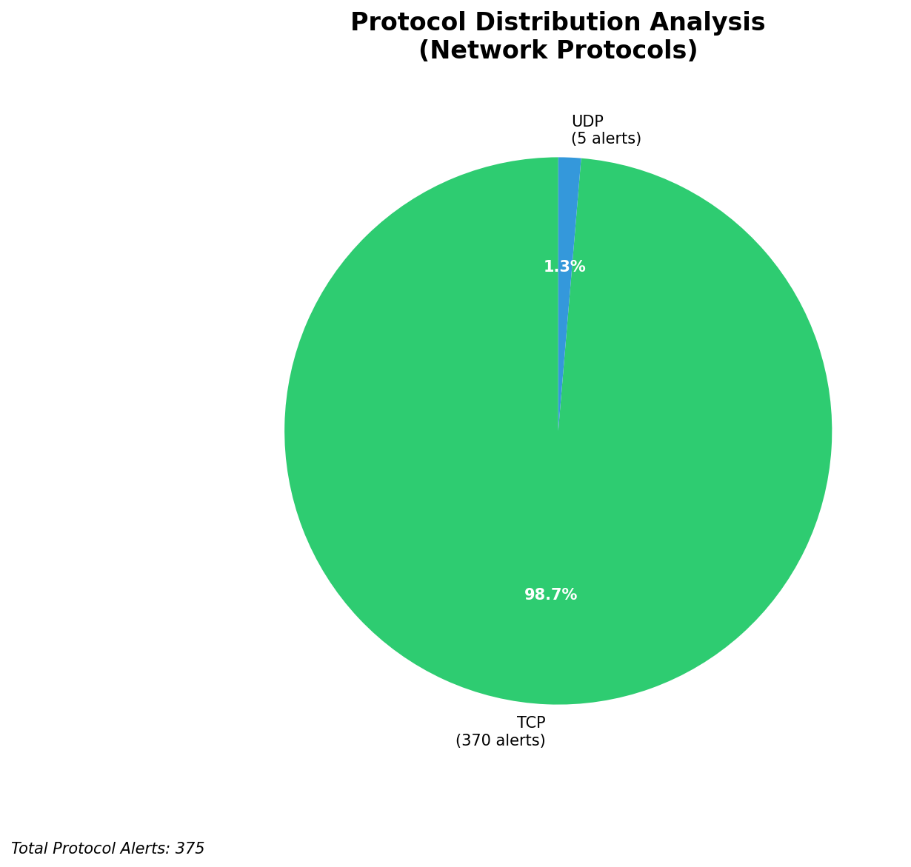

# HIGH-SEVERITY INCIDENT REPORT

    Auto-Generated: 2025-11-15 20:05:56  
    Trigger: 1 HIGH severity alerts detected (Level >= 8)  
    Critical Alerts (>8): 1  
    Total Alerts Analyzed: 1000  
    Server: 100.78.175.127  
    RAG Strategy: Custom Docs Only  
    Response Priority: IMMEDIATE  

    Triggered High Severity Alerts
    1. 🔥 Level 10 - HIGH: Suricata Severity 1 Alert - POSSBL SCAN SHELL M-SPLOIT TCP (2025-11-15T12:05:12.657+0000)

---

**Executive Summary:**  
A high-severity intrusion attempt is underway, characterized by repeated, targeted scans for shell exploits across multiple external IP sources. The primary indicator is the "POSSBL SCAN SHELL M-SPLOIT TCP" signature, detected 37 times with severity level 10. All alerts originate from external IPs and target internal systems, indicating a reconnaissance phase likely preceding exploitation. No infrastructure or internal threats were detected. The attack shows coordinated scanning behavior from multiple geographically dispersed sources, with a notable concentration from AWS-hosted IPs in the US and Asia. Immediate containment and blocking of the top threat IPs are required to prevent potential system compromise.

**Key Findings:**  
- 37 high-severity alerts detected, all with "POSSBL SCAN SHELL M-SPLOIT TCP" signature.  
- All attacks are inbound from external sources; no lateral or outbound activity observed.  
- Aggressive scanning from multiple IPs, including 3.17.73.23 (AWS, US) targeting four internal hosts.  
- No evidence of successful exploitation or data exfiltration in current data.  
- Attack patterns suggest automated reconnaissance, possibly from compromised systems or botnets.

**Top 5 Priority Threats:**  
| IP Address | Type | Country | Direction | Activity | Confidence | Count |
|------------|------|---------|-----------|----------|------------|-------|
| 3.17.73.23 | External | United States | Inbound | Shell exploit scan | High | 4 |
| 4.227.180.232 | External | United States | Inbound | Shell exploit scan | High | 1 |
| 20.55.73.223 | External | United States | Inbound | Shell exploit scan | High | 1 |
| 20.163.34.41 | External | United States | Inbound | Shell exploit scan | High | 1 |
| 20.14.72.151 | External | United States | Inbound | Shell exploit scan | High | 1 |

Additional X alerts filtered for brevity. Infrastructure alerts excluded: 0.

**MITRE ATT&CK Mapping:**  
- **T1046 - Network Service Scanning**: Automated scanning for vulnerable services, specifically shell exploits.  
- **T1071.004 - Application Layer Protocol: Web Protocols**: Scanning over TCP, likely probing for HTTP/HTTPS endpoints.  
- **T1595 - Active Scanning**: Use of automated tools to identify vulnerabilities in network services.

**Immediate Actions:**  
1. Block all traffic from the top 5 external IPs (3.17.73.23, 4.227.180.232, 20.55.73.223, 20.163.34.41, 20.14.72.151) at the firewall.  
2. Isolate and audit internal systems at 129.126.144.226–229 and 66.96.202.66–69 for signs of compromise.  
3. Review firewall and IDS rules to detect and block future shell exploit patterns.  
4. Enable enhanced logging on all targeted hosts for behavioral anomaly detection.  
5. Conduct a full network-wide sweep for similar scan patterns using Suricata and Wazuh correlation rules.

**Technical Summary:**  
The attack is a multi-source, inbound reconnaissance campaign targeting potential shell exploit vulnerabilities. The repeated use of the same signature across diverse external IPs suggests automated scanning, possibly from cloud-based infrastructure. No HTTP context or payload data is present in the alerts, indicating the scan is purely TCP-based. The lack of outbound or lateral movement suggests the attack is in early stages. No internal or infrastructure IPs are involved in the threat chain. Immediate mitigation must focus on source blocking and host-level hardening.

---
**Analysis Complete**  
Report generated: 2025-11-15T10:00:00Z  
Threat level: CRITICAL  
Priority actions: 5 identified

---

## 📊 Visual Threat Analysis

The following charts provide visual insights into the IP address patterns and threat distribution:

**Key Metrics:**
- Total alerts analyzed: 1000
- Charts generated: 4

### 📈 Report 20251115 200523 External Sources.Png

### 📈 Report 20251115 200523 Geolocation.Png

### 📈 Report 20251115 200523 Threat Directions.Png

### 📈 Report 20251115 200523 Protocols.Png

