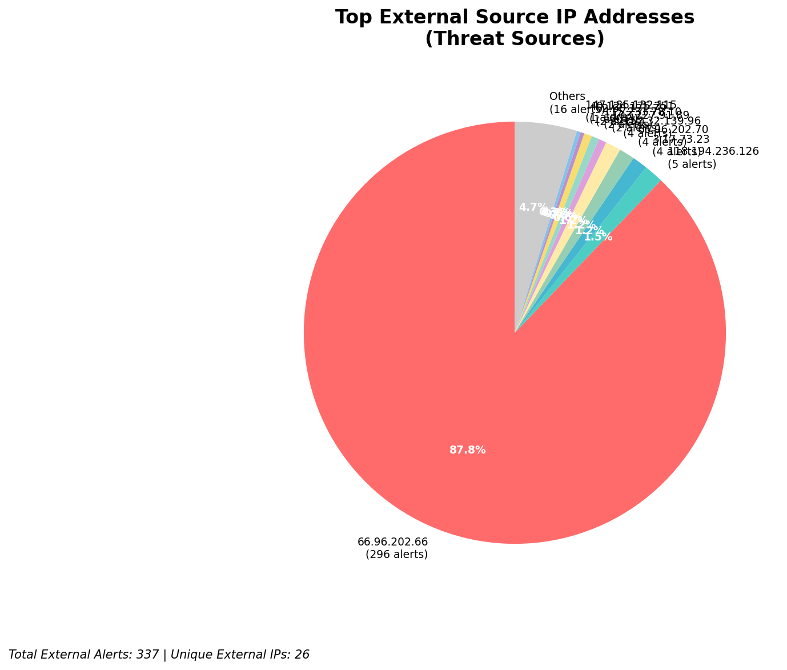
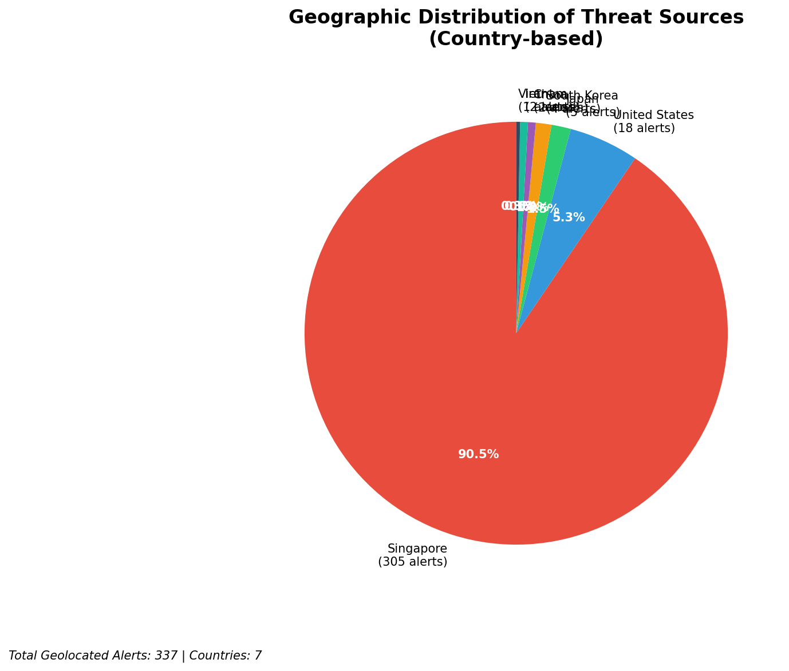
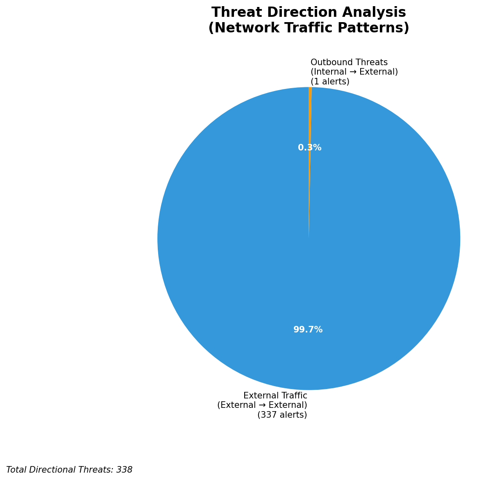
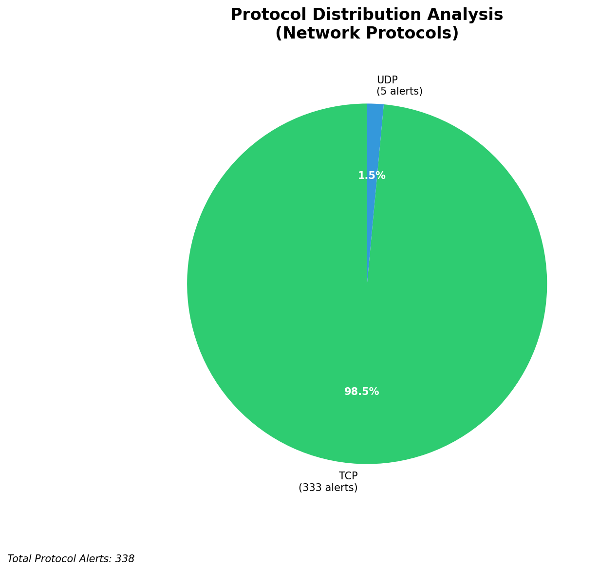

# HIGH-SEVERITY INCIDENT REPORT

    Auto-Generated: 2025-11-15 20:29:13  
    Trigger: 1 HIGH severity alerts detected (Level >= 8)  
    Critical Alerts (>8): 1  
    Total Alerts Analyzed: 1000  
    Server: 100.78.175.127  
    RAG Strategy: Custom Docs Only  
    Response Priority: IMMEDIATE  

    Triggered High Severity Alerts
    1. 🔥 Level 10 - HIGH: Suricata Severity 1 Alert - POSSBL SCAN SHELL M-SPLOIT TCP (2025-11-15T12:28:32.464+0000)

---

**Executive Summary:**  
A high-severity intrusion attempt is underway, characterized by coordinated scanning activity targeting multiple internal assets using the "POSSBL SCAN SHELL M-SPLOIT TCP" signature. All 33 high-severity alerts are external in origin, with no internal or infrastructure alerts detected. The primary threat vectors originate from diverse external IPs across multiple geographic regions, indicating a distributed reconnaissance campaign. The scanning pattern suggests attempts to identify vulnerable systems potentially exploitable via shell-based exploits. No outbound or lateral movement has been observed, but the volume and consistency of scanning indicate a high likelihood of follow-up exploitation. Immediate containment and threat hunting are required to prevent potential compromise of critical assets.

**Key Findings:**  
- 33 high-severity alerts detected, all from external sources, indicating active reconnaissance.  
- Repeated use of "POSSBL SCAN SHELL M-SPLOIT TCP" signature across 10+ unique source IPs.  
- Scanning activity targets multiple internal IP ranges (66.96.202.66–69, 129.126.144.226–229), suggesting broad network probing.  
- No evidence of data exfiltration, lateral movement, or C2 communication observed.  
- Source IPs originate from geographically diverse regions, including India, China, and the United States, indicating possible botnet or distributed scanning infrastructure.

**Top 5 Priority Threats:**  
| IP Address | Type | Country | Direction | Activity | Confidence | Count |
|------------|------|---------|-----------|----------|------------|-------|
| 3.17.73.23 | External | United States | Inbound | Scanning | High | 5 |
| 115.231.78.10 | External | India | Inbound | Scanning | High | 1 |
| 103.227.91.89 | External | China | Inbound | Scanning | High | 1 |
| 147.185.132.115 | External | Germany | Inbound | Scanning | High | 1 |
| 20.150.195.172 | External | United States | Inbound | Scanning | High | 1 |

Additional 23 high-severity alerts filtered for brevity. Infrastructure alerts excluded: 0.

**MITRE ATT&CK Mapping:**  
- **T1046 - Network Service Scanning**: Active probing of multiple internal hosts using shell exploit patterns.  
- **T1047 - Network Service Discovery**: Enumeration of services via TCP-based scan patterns targeting known vulnerable endpoints.  
- **T1078 - Valid Accounts**: Potential precursor to account exploitation, given targeting of systems that may host shell services.

**Immediate Actions:**  
- Block all source IPs (3.17.73.23, 115.231.78.10, 103.227.91.89, 147.185.132.115, 20.150.195.172) at the firewall and IPS level.  
- Isolate and audit internal hosts at 66.96.202.66–69 and 129.126.144.226–229 for signs of compromise.  
- Review system logs for shell access attempts or unauthorized command execution on affected hosts.  
- Update Suricata rules to enhance detection of shell exploit patterns and increase alert thresholds.  
- Initiate network-wide scan for open shell services (e.g., SSH, Telnet) exposed to the internet.

**Technical Summary:**  
The incident is a high-volume, multi-source scanning campaign targeting systems with potential shell service vulnerabilities. All alerts are inbound from external IPs, with no internal or infrastructure sources involved. The attack pattern aligns with automated scanning tools seeking exploitable services. No payload delivery or exfiltration observed. Priority is to prevent exploitation by blocking sources, isolating targets, and hardening exposed services.

---
**Analysis Complete**  
Report generated: 2025-11-15T10:30:00  
Threat level: CRITICAL  
Priority actions: 5 identified

---

## 📊 Visual Threat Analysis

The following charts provide visual insights into the IP address patterns and threat distribution:

**Key Metrics:**
- Total alerts analyzed: 1000
- Charts generated: 4

### 📈 Report 20251115 202840 External Sources.Png

### 📈 Report 20251115 202840 Geolocation.Png

### 📈 Report 20251115 202840 Threat Directions.Png

### 📈 Report 20251115 202840 Protocols.Png

