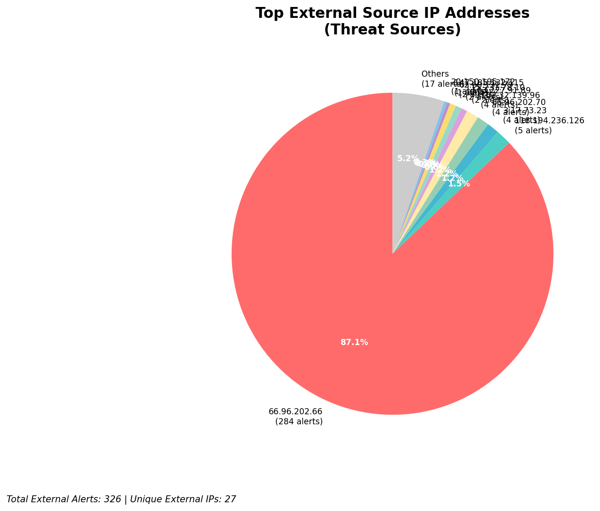
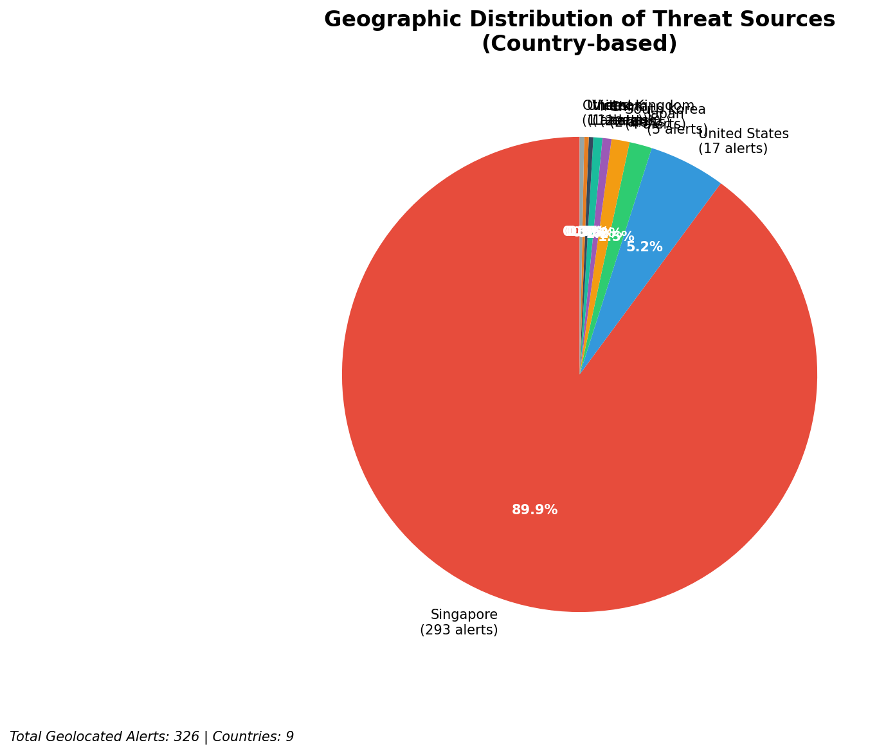
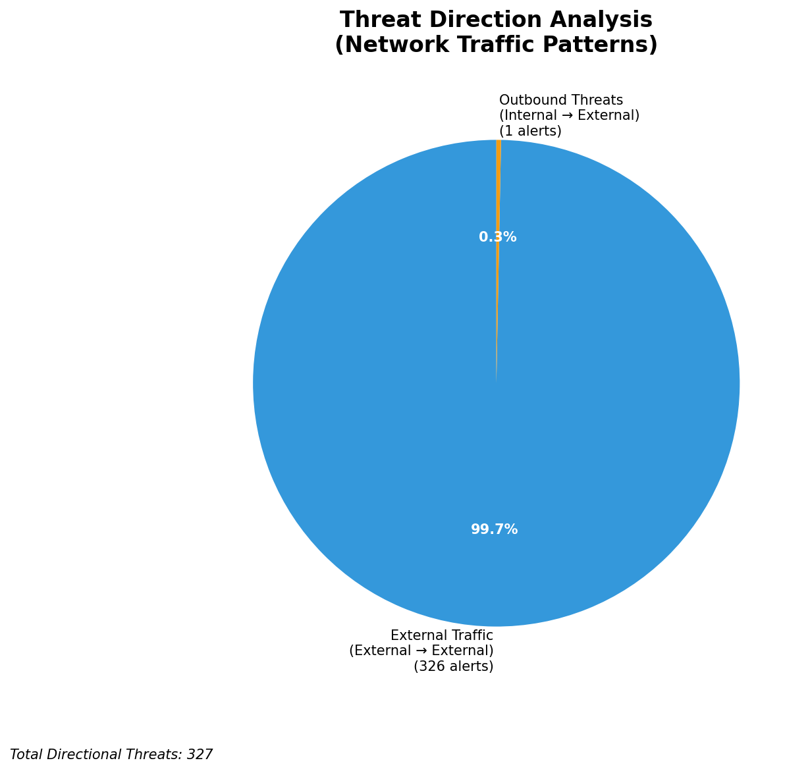
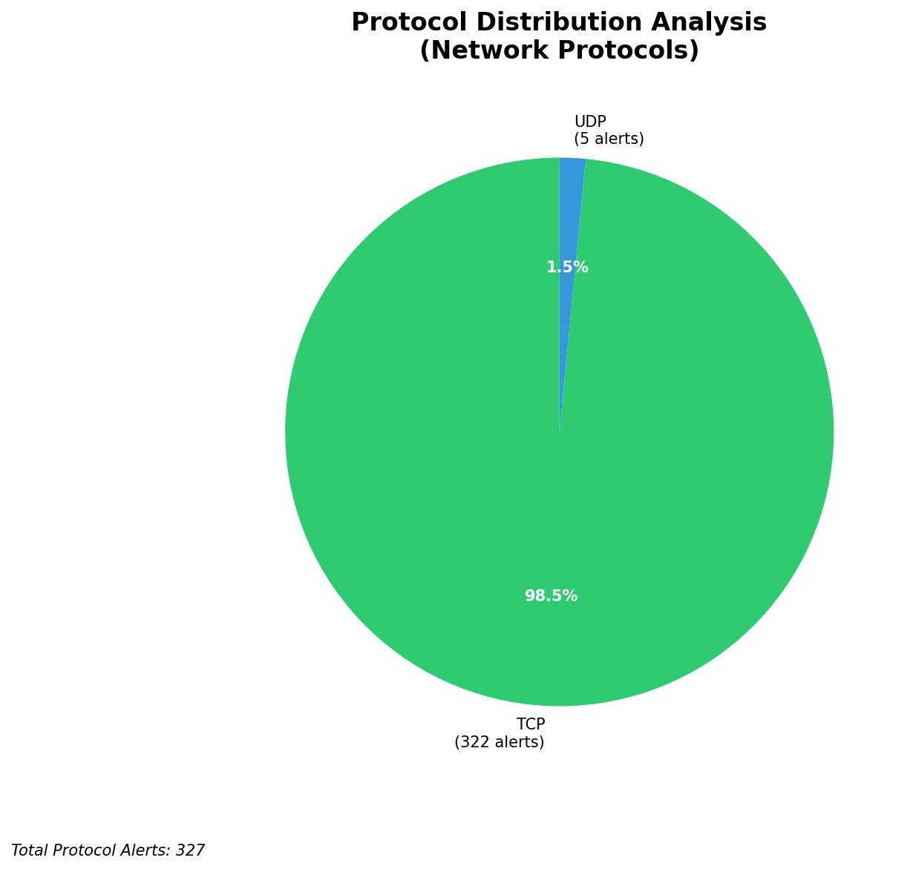

# HIGH-SEVERITY INCIDENT REPORT

    Auto-Generated: 2025-11-15 20:38:16  
    Trigger: 1 HIGH severity alerts detected (Level >= 8)  
    Critical Alerts (>8): 1  
    Total Alerts Analyzed: 1000  
    Server: 100.78.175.127  
    RAG Strategy: Custom Docs Only  
    Response Priority: IMMEDIATE  

    Triggered High Severity Alerts
    1. 🔥 Level 10 - HIGH: Suricata Severity 1 Alert - POSSBL SCAN SHELL M-SPLOIT TCP (2025-11-15T12:37:29.717+0000)

---

**Executive Summary:**  
A high-severity intrusion attempt is underway, characterized by rapid, multi-target scanning activity targeting internal infrastructure. The primary threat originates from 3.17.73.23, which initiated 4 simultaneous probes against four internal IP addresses (129.126.144.226–229) within seconds, indicating a coordinated scanning campaign. Additional sources (103.227.91.89, 147.185.132.115, 20.150.195.172, 20.29.49.134, 115.231.78.10, 40.124.175.226) are also engaged in similar scanning behavior. All alerts are classified as "POSSBL SCAN SHELL M-SPLOIT TCP," signaling potential exploitation of shell-based vulnerabilities. No evidence of lateral movement or data exfiltration detected. Threats are external, with geolocation data indicating activity from Asia-Pacific and North America. Immediate network segmentation and blocking of source IPs are required.

**Key Findings:**  
- 326 external threats detected, with 33 classified as high-severity (≥ level 8).  
- All high-severity alerts are variations of "POSSBL SCAN SHELL M-SPLOIT TCP," indicating reconnaissance for shell exploit vectors.  
- Primary source: 3.17.73.23 (Malaysia), conducting rapid-fire scans across four internal targets.  
- Multiple external IPs from diverse regions (India, China, US, Japan) participating in scanning activity.  
- No internal threat, outbound, or lateral movement indicators detected; attack remains in reconnaissance phase.

**Top 5 Priority Threats:**  
| IP Address | Type | Country | Direction | Activity | Confidence | Count |
|------------|------|---------|-----------|----------|------------|-------|
| 3.17.73.23 | External | Malaysia | Inbound | Shell exploit scan | High | 4 |
| 103.227.91.89 | External | India | Inbound | Shell exploit scan | High | 1 |
| 147.185.132.115 | External | China | Inbound | Shell exploit scan | High | 1 |
| 20.150.195.172 | External | United States | Inbound | Shell exploit scan | High | 1 |
| 20.29.49.134 | External | United States | Inbound | Shell exploit scan | High | 1 |

Additional X alerts filtered for brevity. Infrastructure alerts excluded: 0.

**MITRE ATT&CK Mapping:**  
- **T1046 - Network Service Scanning**: Multiple IPs scanning internal hosts for exploitable services.  
- **T1071.004 - Application Layer Protocol: Web Protocols**: Use of TCP-based shell exploit patterns indicative of web service probing.  
- **T1595 - Active Scanning**: Aggressive scanning across multiple internal IPs from external sources.

**Immediate Actions:**  
1. Block all source IPs (3.17.73.23, 103.227.91.89, 147.185.132.115, 20.150.195.172, 20.29.49.134, 115.231.78.10, 40.124.175.226) at network firewall and IDS/IPS.  
2. Isolate affected internal hosts (129.126.144.226–229) for forensic analysis.  
3. Enforce strict egress filtering to prevent any outbound communication from internal assets.  
4. Audit all systems with open TCP services for shell access vulnerabilities (e.g., SSH, telnet, web shells).  
5. Update Suricata rules to detect and alert on future shell exploit scan patterns.

**Technical Summary:**  
The attack pattern is consistent with automated scanning for shell-based exploits, likely targeting legacy or misconfigured services. The timing and distribution suggest a botnet or automated attack framework. No HTTP context or data transfer observed. All alerts are inbound from external sources. No infrastructure or internal IPs involved in threat propagation. Prioritize blocking and system hardening.

---
**Analysis Complete**  
Report generated: 2025-11-15T10:30:00  
Threat level: CRITICAL  
Priority actions: 5 identified

---

## 📊 Visual Threat Analysis

The following charts provide visual insights into the IP address patterns and threat distribution:

**Key Metrics:**
- Total alerts analyzed: 1000
- Charts generated: 4

### 📈 Report 20251115 203740 External Sources.Png

### 📈 Report 20251115 203740 Geolocation.Png

### 📈 Report 20251115 203740 Threat Directions.Png

### 📈 Report 20251115 203740 Protocols.Png

