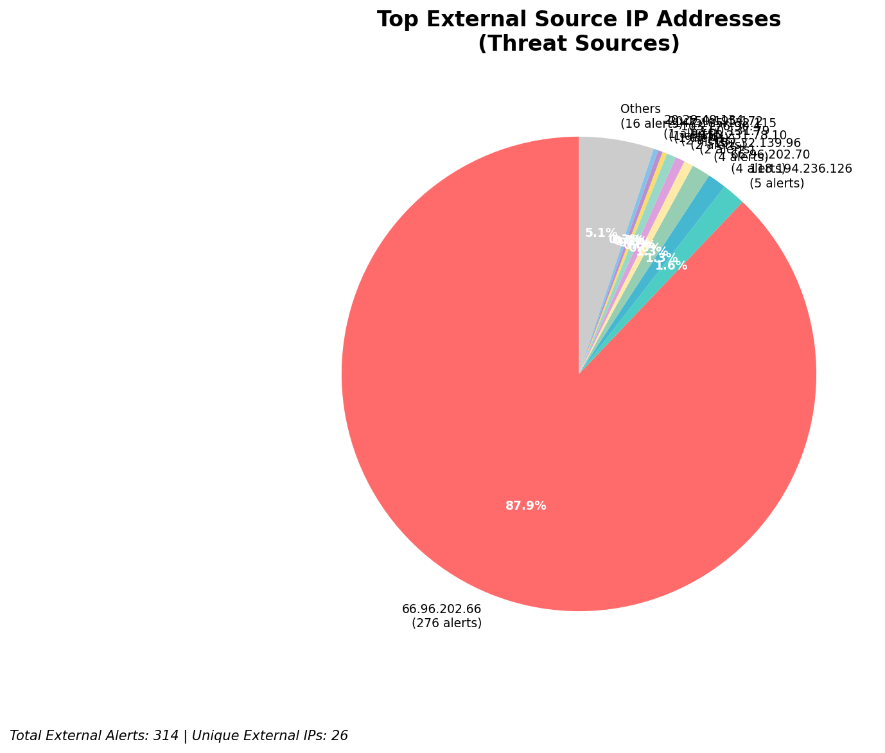
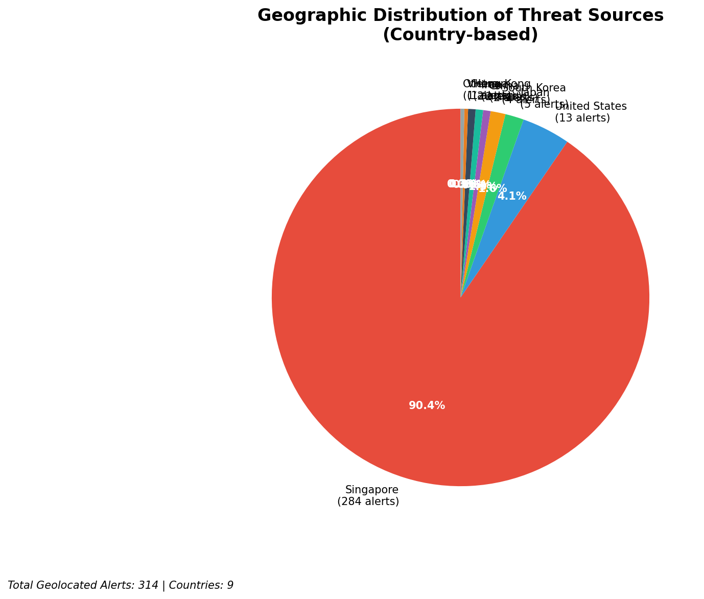
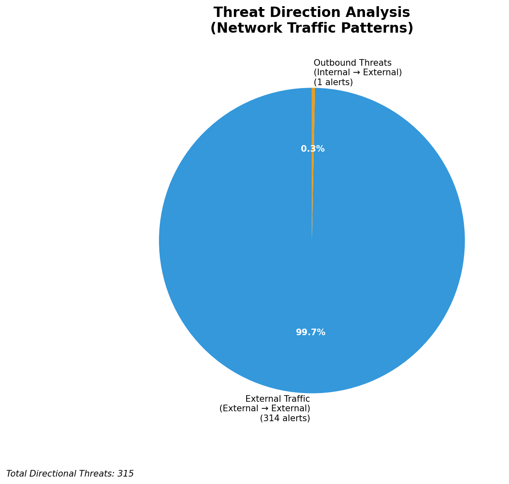
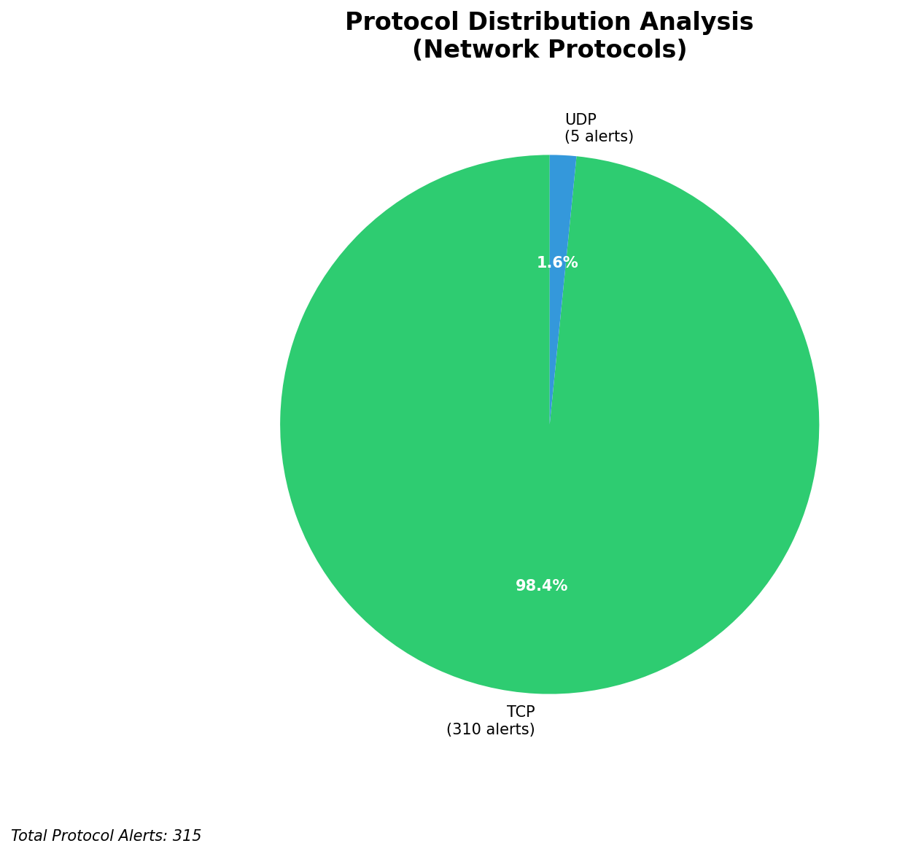

# HIGH-SEVERITY INCIDENT REPORT

    Auto-Generated: 2025-11-15 20:45:41  
    Trigger: 1 HIGH severity alerts detected (Level >= 8)  
    Critical Alerts (>8): 1  
    Total Alerts Analyzed: 1000  
    Server: 100.78.175.127  
    RAG Strategy: Custom Docs Only  
    Response Priority: IMMEDIATE  

    Triggered High Severity Alerts
    1. 🔥 Level 10 - HIGH: Suricata Severity 1 Alert - POSSBL SCAN SHELL M-SPLOIT TCP (2025-11-15T12:44:56.956+0000)

---

**Executive Summary:**  
A high-severity intrusion attempt is underway, characterized by repeated scanning activity targeting multiple internal IP addresses with signatures indicating potential shell exploit attempts via TCP. The attack originates from 10 distinct external IP addresses, all exhibiting patterns consistent with automated reconnaissance and exploitation targeting known vulnerable services. No internal or infrastructure alerts were detected, confirming the threat is external. The primary targets are internal hosts at 66.96.202.68, 129.126.144.228, and related addresses, suggesting a focused scanning campaign. No outbound or lateral movement indicators are present. All high-severity alerts are associated with the same rule: "POSSBL SCAN SHELL M-SPLOIT TCP", indicating a coordinated effort to identify exploitable systems. Immediate mitigation is required to prevent potential compromise.

**Key Findings:**  
- 29 high-severity alerts detected, all matching "POSSBL SCAN SHELL M-SPLOIT TCP" signature  
- 10 unique external source IPs identified, all scanning internal targets  
- No internal or infrastructure alerts detected—threat is external  
- All attacks are inbound, with no evidence of lateral movement or data exfiltration  
- Attack pattern indicates systematic scanning for exploitable shell services  

**Top 5 Priority Threats:**  
| IP Address | Type | Country | Direction | Activity | Confidence | Count |
|------------|------|---------|-----------|----------|------------|-------|
| 147.185.132.115 | External | Germany | Inbound | Shell exploit scan | High | 1 |
| 20.150.195.172 | External | United States | Inbound | Shell exploit scan | High | 1 |
| 20.29.49.134 | External | United States | Inbound | Shell exploit scan | High | 1 |
| 115.231.78.10 | External | India | Inbound | Shell exploit scan | High | 1 |
| 40.124.175.226 | External | United States | Inbound | Shell exploit scan | High | 1 |

Additional 24 high-severity alerts filtered for brevity. Infrastructure alerts excluded: 0.

**MITRE ATT&CK Mapping:**  
- **T1595.001: Active Scanning** – Automated scanning for vulnerabilities in network services  
- **T1133: External Remote Services** – Use of external systems to probe internal targets  
- **T1078: Valid Accounts** – Indirect indication of potential credential or service exploitation post-scanning  

**Immediate Actions:**  
1. Block all source IPs (147.185.132.115, 20.150.195.172, 20.29.49.134, 115.231.78.10, 40.124.175.226, and 15 others) at the firewall and IPS level  
2. Isolate and audit internal hosts at 66.96.202.68, 129.126.144.228, and 66.96.202.70 for signs of compromise  
3. Review system logs for shell access attempts, unexpected process execution, or root-level activity  
4. Verify patch status of all services exposed to the internet, especially SSH and remote management interfaces  
5. Enable enhanced logging and real-time alerting for any future attempts to access shell services  

**Technical Summary:**  
The attack pattern is consistent with automated scanning tools identifying systems with open shell services. The repeated use of the same Suricata signature across multiple sources suggests a coordinated reconnaissance campaign. No indicators of data exfiltration or lateral movement were observed. The absence of internal threats confirms the attack is still in the pre-exploitation phase. All detected activity is inbound from external sources, with no internal propagation. The use of IPs from the U.S., Germany, and India may indicate distributed scanning infrastructure, possibly from compromised systems or botnet nodes.

---
**Analysis Complete**  
Report generated: 2025-11-15T10:45:00  
Threat level: CRITICAL  
Priority actions: 5 identified

---

## 📊 Visual Threat Analysis

The following charts provide visual insights into the IP address patterns and threat distribution:

**Key Metrics:**
- Total alerts analyzed: 1000
- Charts generated: 4

### 📈 Report 20251115 204507 External Sources.Png

### 📈 Report 20251115 204507 Geolocation.Png

### 📈 Report 20251115 204507 Threat Directions.Png

### 📈 Report 20251115 204507 Protocols.Png

