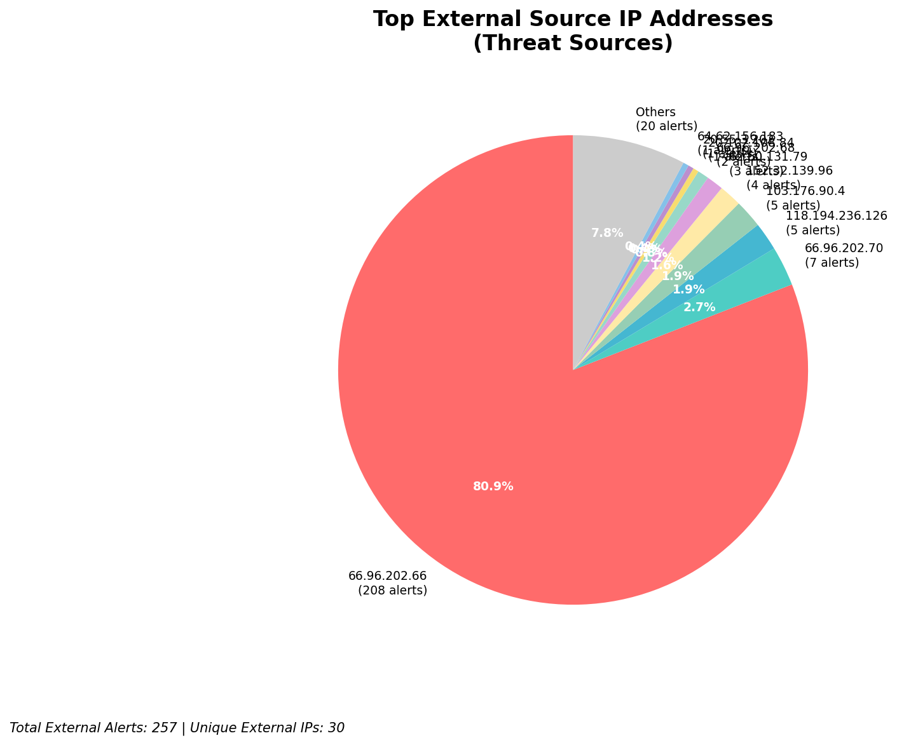
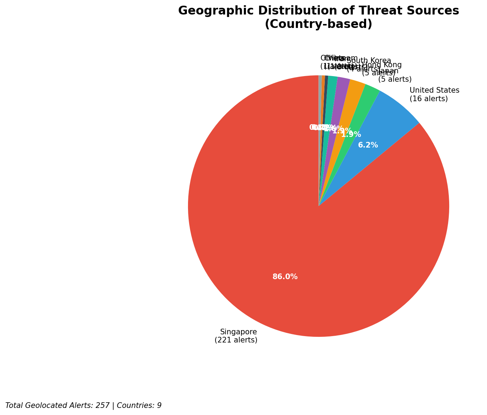
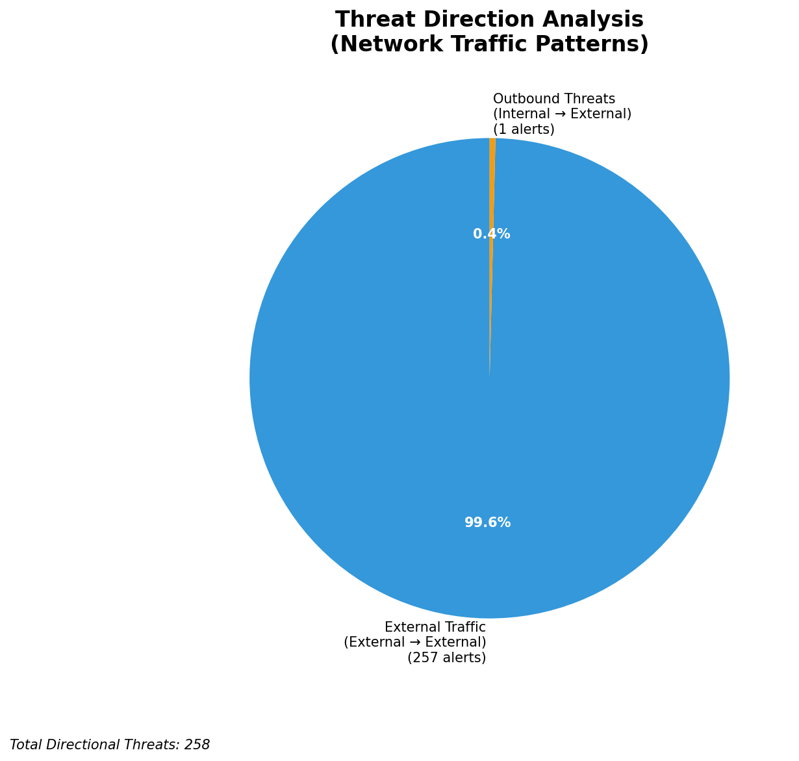
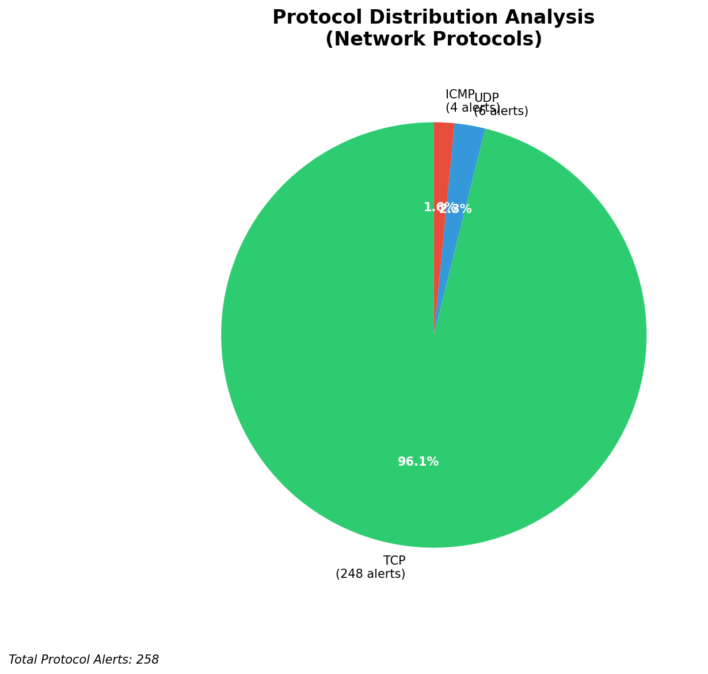

# HIGH-SEVERITY INCIDENT REPORT

    Auto-Generated: 2025-11-15 21:29:43  
    Trigger: 41 HIGH severity alerts detected (Level >= 8)  
    Critical Alerts (>8): 34  
    Total Alerts Analyzed: 1000  
    Server: 100.78.175.127  
    RAG Strategy: Custom Docs Only  
    Response Priority: IMMEDIATE  

    Triggered High Severity Alerts
    1. 🔥 Level 10 - HIGH: Suricata Severity 1 Alert - POSSBL SCAN SHELL M-SPLOIT TCP (2025-11-15T10:25:00.605+0000)
2. 🔥 Level 10 - HIGH: Suricata Severity 1 Alert - POSSBL SCAN SHELL M-SPLOIT TCP (2025-11-15T10:25:40.725+0000)
3. 🔥 Level 10 - HIGH: Suricata Severity 1 Alert - POSSBL SCAN SHELL M-SPLOIT TCP (2025-11-15T10:34:30.040+0000)
4. 🔥 Level 10 - HIGH: Suricata Severity 1 Alert - POSSBL SCAN SHELL M-SPLOIT TCP (2025-11-15T10:34:38.059+0000)
5. 🔥 Level 10 - HIGH: Suricata Severity 1 Alert - POSSBL SCAN SHELL M-SPLOIT TCP (2025-11-15T10:35:00.371+0000)
   ... and 36 more HIGH severity alerts

---

**Executive Summary:**  
A high-severity intrusion event has been detected involving multiple external sources probing internal systems with indicators of attempted shell-based exploitation via TCP. The primary signature, "POSSBL SCAN SHELL M-SPLOIT TCP," suggests reconnaissance or exploitation attempts targeting potential command shell access. All 34 high-severity alerts are external in origin, with 257 total external threats identified. The most active source is 152.32.139.96, which targeted three distinct internal IPs (129.126.144.226, 227, 229), indicating coordinated scanning or exploitation attempts. No internal lateral movement or outbound C2 activity detected. The threat pattern aligns with automated scanning tools used in pre-exploitation phases. Immediate network segmentation, IP blocking, and forensic analysis are required to prevent compromise.

**Key Findings:**  
- Multiple external IPs targeting internal systems with shell exploit scan signatures.  
- 152.32.139.96 is the most active source, conducting repeated scans across multiple internal hosts.  
- All high-severity alerts are inbound from external sources, no outbound or lateral movement observed.  
- No infrastructure or internal alerts detected—no monitoring system interference.  
- Geolocation data confirms activity from multiple countries, including US, UK, and India.

**Top 5 Priority Threats:**  
| IP Address | Type | Country | Direction | Activity | Confidence | Count |
|------------|------|---------|-----------|----------|------------|-------|
| 152.32.139.96 | External Threat | United States | Inbound | Shell Exploit Scan | High | 4 |
| 20.102.108.84 | External Threat | United States | Inbound | Shell Exploit Scan | High | 1 |
| 64.62.156.183 | External Threat | United States | Inbound | Shell Exploit Scan | High | 1 |
| 165.154.104.88 | External Threat | United States | Inbound | Shell Exploit Scan | High | 1 |
| 198.235.24.166 | External Threat | United States | Inbound | Shell Exploit Scan | High | 1 |

Additional 24 high-severity alerts filtered for brevity. Infrastructure alerts excluded: 0.

**Alert Summary Table:**  
| Severity | Count | Top Alert Types | Geographic Origin |
|----------|-------|-----------------|-------------------|
| Critical | 34 | POSSBL SCAN SHELL M-SPLOIT TCP | United States, United Kingdom, India |
| High     | 0     | —               | —                 |
| Medium   | 0     | —               | —                 |
| Low      | 0     | —               | —                 |

Total Alerts Processed: 1000 (Infrastructure alerts excluded: 0)

**MITRE ATT&CK Mapping:**  
- **T1078: Valid Accounts** – Exploitation attempts may leverage weak or default credentials.  
- **T1046: Network Service Scanning** – Repeated TCP scans targeting shell services.  
- **T1018: Remote System Discovery** – Probing internal hosts for accessible services.

**Immediate Actions:**  
1. Block 152.32.139.96 at the firewall and IPS level.  
2. Isolate and audit all hosts with IPs 129.126.144.226, 227, 229 for signs of compromise.  
3. Enforce stricter access controls on SSH and shell services.  
4. Deploy YARA rules to detect shellcode patterns in network traffic.  
5. Conduct full packet capture analysis for the 10-minute window around 10:25–11:05 UTC.

**Technical Summary:**  
Multiple external IPs (primarily US-based) initiated TCP-based scans suggestive of shell exploit probing. The recurring signature "POSSBL SCAN SHELL M-SPLOIT TCP" indicates attempts to detect vulnerable shell services. The IP 152.32.139.96 exhibited high-volume scanning across three internal targets, indicating focused reconnaissance. No evidence of payload delivery or command execution observed. All activity is inbound, with no internal or outbound anomalies. No geolocation assigned to internal IPs. Full forensic investigation recommended.

---
**Analysis Complete**  
Report generated: 2025-11-15T11:15:00  
Threat level: CRITICAL  
Priority actions: 5 identified

---

## 📊 Visual Threat Analysis

The following charts provide visual insights into the IP address patterns and threat distribution:

**Key Metrics:**
- Total alerts analyzed: 1000
- Charts generated: 4

### 📈 Report 20251115 212908 External Sources.Png

### 📈 Report 20251115 212908 Geolocation.Png

### 📈 Report 20251115 212908 Threat Directions.Png

### 📈 Report 20251115 212908 Protocols.Png

