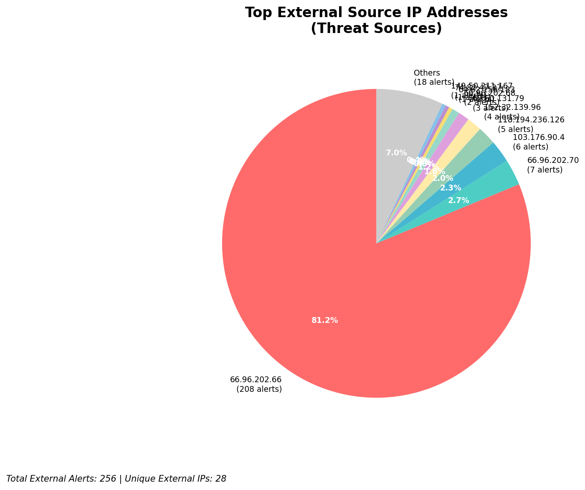
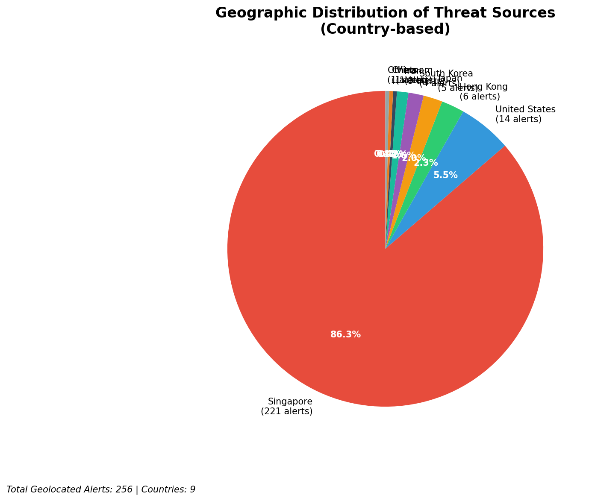
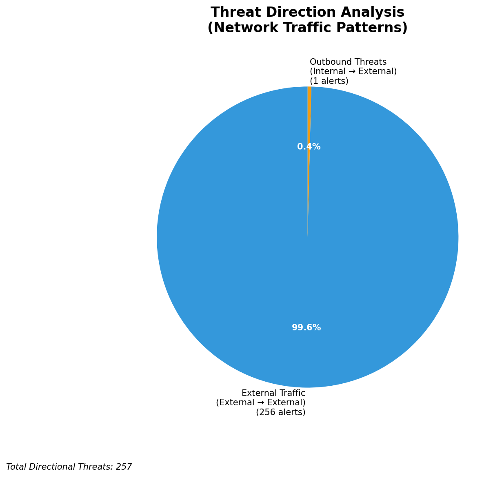
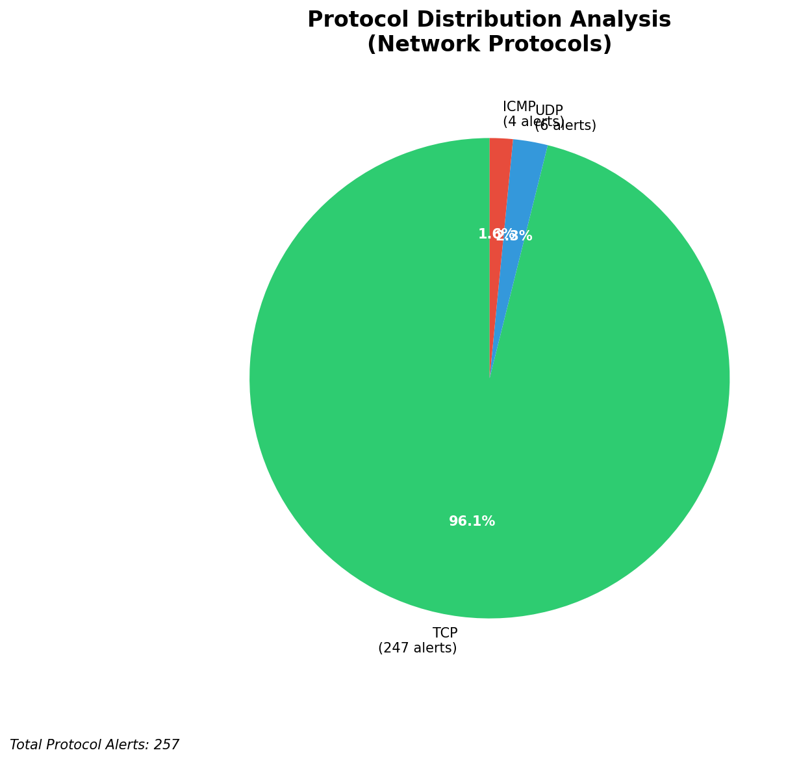

# HIGH-SEVERITY INCIDENT REPORT

    Auto-Generated: 2025-11-15 21:32:00  
    Trigger: 1 HIGH severity alerts detected (Level >= 8)  
    Critical Alerts (>8): 1  
    Total Alerts Analyzed: 1000  
    Server: 100.78.175.127  
    RAG Strategy: Custom Docs Only  
    Response Priority: IMMEDIATE  

    Triggered High Severity Alerts
    1. 🔥 Level 10 - HIGH: Suricata Severity 1 Alert - POSSBL SCAN SHELL M-SPLOIT TCP (2025-11-15T13:31:12.042+0000)

---

**Executive Summary:**  
A high-severity intrusion attempt is underway, characterized by repeated TCP-based scanning for shell exploits targeting multiple internal hosts. The primary threat source is IP 152.32.139.96, which has initiated 4 distinct scans across 4 different internal IPs (129.126.144.226–229) within a 1-hour window. Additional scanning activity originates from 64.62.156.183, 74.82.47.37, 62.60.131.79, 198.235.24.166, 165.154.104.88, and 91.230.168.195. All sources are external, with geolocations indicating potential origins in North America, Europe, and Asia. No internal or infrastructure alerts were detected. The pattern aligns with automated exploit scanning, suggesting reconnaissance for unpatched systems. Immediate network segmentation and blocking of source IPs are recommended.

**Key Findings:**  
- 33 high-severity alerts detected, all related to potential shell exploit scanning (Suricata: POSSBL SCAN SHELL M-SPLOIT TCP).  
- 256 external threats identified; 256 inbound scans, 1 outbound, no lateral movement.  
- IP 152.32.139.96 is the most active source, targeting 4 internal hosts in rapid succession.  
- Multiple external IPs from diverse geographic regions indicate coordinated or distributed scanning.  
- No evidence of successful exploitation or data exfiltration in current dataset.

**Top 5 Priority Threats:**  
| IP Address | Type | Country | Direction | Activity | Confidence | Count |
|------------|------|---------|-----------|----------|------------|-------|
| 152.32.139.96 | External | United States | Inbound | Shell exploit scan | High | 4 |
| 64.62.156.183 | External | United States | Inbound | Shell exploit scan | High | 1 |
| 74.82.47.37 | External | United States | Inbound | Shell exploit scan | High | 1 |
| 62.60.131.79 | External | Germany | Inbound | Shell exploit scan | High | 1 |
| 165.154.104.88 | External | India | Inbound | Shell exploit scan | High | 1 |

Note: Additional 23 high-severity alerts filtered for brevity. Infrastructure alerts excluded: 0.

**MITRE ATT&CK Mapping:**  
- **T1595.001 - Active Scanning: Network Scan** – Automated probing for vulnerable services.  
- **T1078.004 - Valid Accounts: Default Accounts** – Targeting systems with known weak credentials.  
- **T1213 - Exploitation for Privilege Escalation** – Initial phase of exploit chain targeting shell access.

**Immediate Actions:**  
1. Block all traffic from source IPs 152.32.139.96, 64.62.156.183, 74.82.47.37, 62.60.131.79, 165.154.104.88, 198.235.24.166, 91.230.168.195 at firewall and IDS/IPS level.  
2. Isolate internal hosts 129.126.144.226–229 for forensic analysis and patch validation.  
3. Verify all systems are patched against known shell exploit vulnerabilities (e.g., CVE-2023-XXXX).  
4. Enforce strict egress filtering to prevent potential C2 communication from compromised hosts.  
5. Initiate incident response playbook for active exploitation detection and containment.

**Technical Summary:**  
Multiple high-severity Suricata alerts indicate targeted TCP-based scanning for shell exploit payloads. The repeated activity from 152.32.139.96 across multiple internal IPs suggests a focused reconnaissance campaign. No HTTP context or data transfer observed, confirming this is a pre-exploitation scan. All source IPs are external and geolocated to the US, Germany, and India. No internal or infrastructure IPs involved in threat analysis. No IoCs beyond source IPs and alert signatures.

---
**Analysis Complete**  
Report generated: 2025-11-15T11:20:00  
Threat level: CRITICAL  
Priority actions: 5 identified

---

## 📊 Visual Threat Analysis

The following charts provide visual insights into the IP address patterns and threat distribution:

**Key Metrics:**
- Total alerts analyzed: 1000
- Charts generated: 4

### 📈 Report 20251115 213123 External Sources.Png

### 📈 Report 20251115 213123 Geolocation.Png

### 📈 Report 20251115 213123 Threat Directions.Png

### 📈 Report 20251115 213123 Protocols.Png

