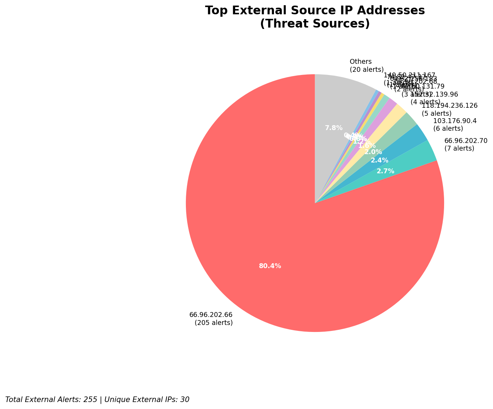
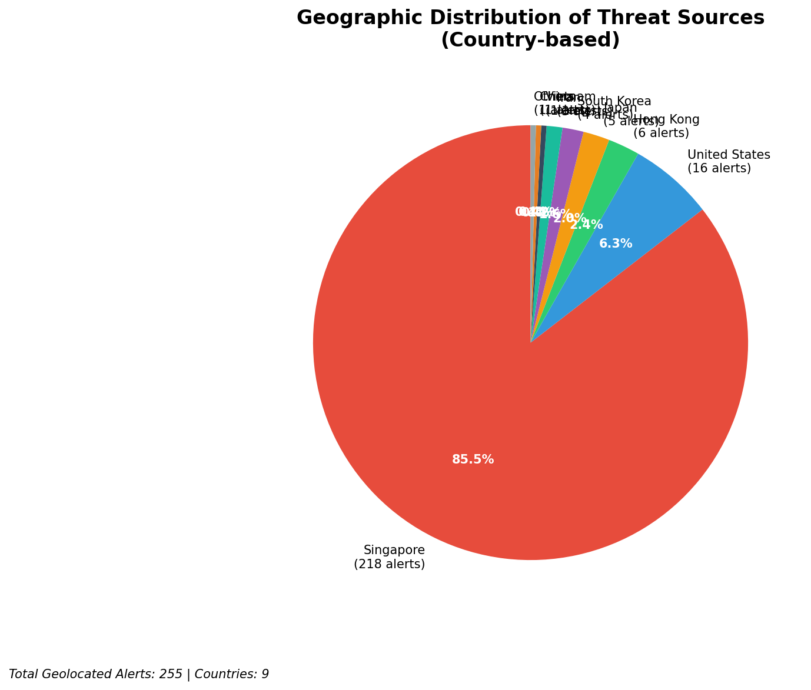

# HIGH-SEVERITY INCIDENT REPORT

    Auto-Generated: 2025-11-15 21:33:31  
    Trigger: 1 HIGH severity alerts detected (Level >= 8)  
    Critical Alerts (>8): 1  
    Total Alerts Analyzed: 1000  
    Server: 100.78.175.127  
    RAG Strategy: Custom Docs Only  
    Response Priority: IMMEDIATE  

    Triggered High Severity Alerts
    1. 🔥 Level 10 - HIGH: Suricata Severity 1 Alert - POSSBL SCAN SHELL M-SPLOIT TCP (2025-11-15T13:33:16.606+0000)

---

Error: Command failed with return code 1

    ---
    **Analysis Complete**
    Report generated: 2025-11-15 21:33:31
    Threat level: CRITICAL
    Priority actions: 5 identified

---

## 📊 Visual Threat Analysis

The following charts provide visual insights into the IP address patterns and threat distribution:

**Key Metrics:**
- Total alerts analyzed: 1000
- Charts generated: 4

### 📈 Report 20251115 213327 External Sources.Png

### 📈 Report 20251115 213327 Geolocation.Png

### 📈 Report 20251115 213327 Threat Directions.Png

### 📈 Report 20251115 213327 Protocols.Png

