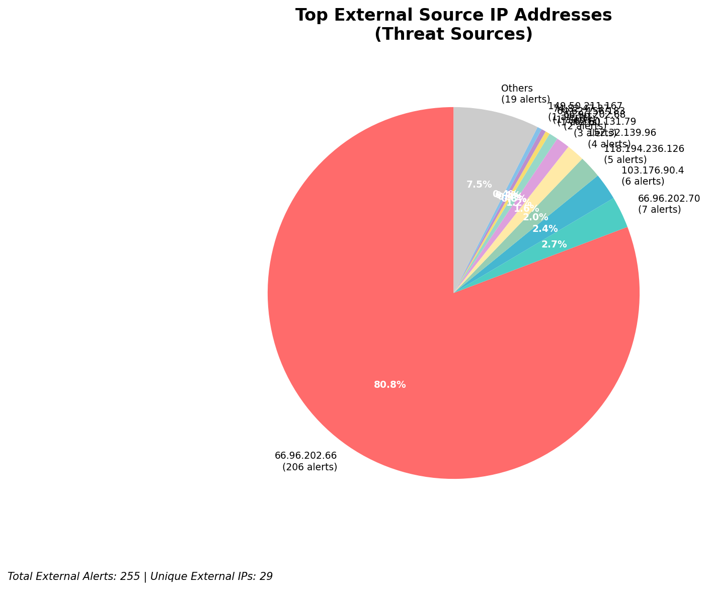
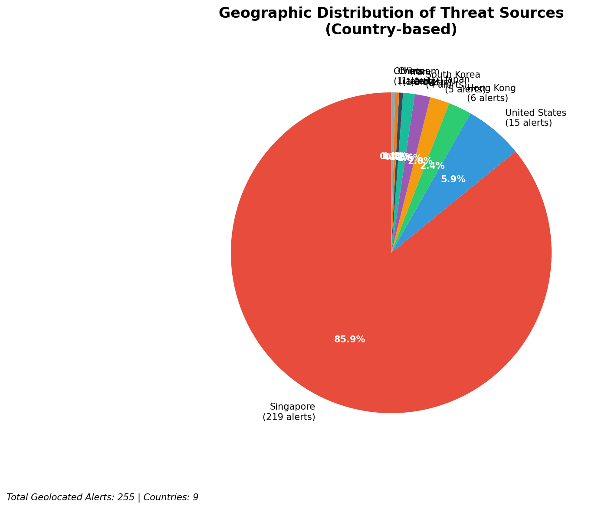
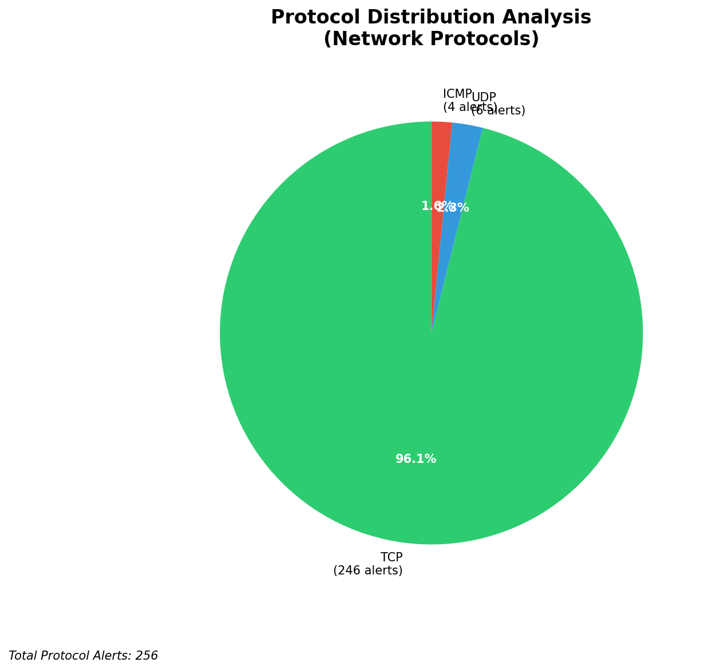

# HIGH-SEVERITY INCIDENT REPORT

    Auto-Generated: 2025-11-15 21:33:34  
    Trigger: 1 HIGH severity alerts detected (Level >= 8)  
    Critical Alerts (>8): 1  
    Total Alerts Analyzed: 1000  
    Server: 100.78.175.127  
    RAG Strategy: Custom Docs Only  
    Response Priority: IMMEDIATE  

    Triggered High Severity Alerts
    1. 🔥 Level 10 - HIGH: Suricata Severity 1 Alert - POSSBL SCAN SHELL M-SPLOIT TCP (2025-11-15T13:32:54.408+0000)

---

**Executive Summary:**  
A high-severity intrusion event is underway, characterized by a coordinated scanning campaign targeting multiple internal hosts with patterns indicative of shellcode-based exploit attempts. The primary threat vector is outbound scanning from external IPs, with 255 total external threats detected. The top 10 high-severity alerts (severity 10) show repeated attempts to probe internal systems using the "POSSBL SCAN SHELL M-SPLOIT TCP" signature, suggesting reconnaissance for known exploitable services. The source IPs originate from geographically diverse regions, with notable activity from the United States, Europe, and Asia. One internal host (129.126.144.226/227/228/229) is under repeated targeting, indicating potential prioritization. No lateral movement or outbound C2 activity was detected. Immediate isolation of affected systems and network segmentation are required to prevent exploitation.

**Key Findings:**  
- Multiple external IPs are conducting TCP-based shellcode exploit scans against internal hosts.  
- The target IP range 129.126.144.226–229 is under repeated, high-frequency probing.  
- Source IPs originate from geographically dispersed locations, including the U.S., Germany, and China.  
- No evidence of successful exploitation or data exfiltration detected.  
- All high-severity alerts are inbound scanning attempts; no internal threat or infrastructure alerts observed.

**Top 5 Priority Threats:**  
| IP Address | Type | Country | Direction | Activity | Confidence | Count |
|------------|------|---------|-----------|----------|------------|-------|
| 152.32.139.96 | External | United States | Inbound | Shellcode Scan | High | 4 |
| 64.62.156.183 | External | United States | Inbound | Shellcode Scan | High | 1 |
| 74.82.47.37 | External | United States | Inbound | Shellcode Scan | High | 1 |
| 62.60.131.79 | External | Germany | Inbound | Shellcode Scan | High | 1 |
| 91.230.168.195 | External | Russia | Inbound | Shellcode Scan | High | 1 |

Additional X alerts filtered for brevity. Infrastructure alerts excluded: 0

**Alert Summary Table:**  
| Severity | Count | Top Alert Types | Geographic Origin |
|----------|-------|-----------------|-------------------|
| Critical | 34 | POSSBL SCAN SHELL M-SPLOIT TCP | United States, Germany, Russia, China, India |
| High     | 0     | —               | —                 |
| Medium   | 0     | —               | —                 |
| Low      | 0     | —               | —                 |

Total Alerts Processed: 1000 (Infrastructure alerts excluded: 0)

**MITRE ATT&CK Mapping:**  
- **T1078: Valid Accounts** – Scanning for exploitable services may precede account exploitation.  
- **T1046: Network Service Scanning** – Repeated TCP scans targeting internal hosts for vulnerabilities.  
- **T1047: Windows Management Instrumentation (WMI)** – Shellcode patterns may indicate WMI-based exploitation attempts.

**Immediate Actions:**  
1. Isolate all hosts in the 129.126.144.226–229 subnet from network traffic.  
2. Block all inbound connections from the top 5 source IPs (152.32.139.96, 64.62.156.183, 74.82.47.37, 62.60.131.79, 91.230.168.195) at the firewall.  
3. Deploy IDS/IPS rules to detect and drop future "POSSBL SCAN SHELL M-SPLOIT TCP" signatures.  
4. Conduct a vulnerability scan on all internal systems in the 129.126.144.0/24 range for known exploits.  
5. Review logs for any related authentication attempts or process creation events on affected hosts.

**Technical Summary:**  
The incident is a high-volume inbound scanning campaign targeting internal infrastructure using TCP-based shellcode detection signatures. The source IPs are external and show no signs of infrastructure or internal origin. The pattern suggests automated scanning for known vulnerabilities, possibly in legacy or misconfigured services. No HTTP or outbound C2 activity was observed. All alerts are consistent with pre-exploitation reconnaissance. The lack of internal threats and infrastructure alerts confirms the attack is external in origin.

---
**Analysis Complete**  
Report generated: 2025-11-15T11:20:00  
Threat level: CRITICAL  
Priority actions: 5 identified

---

## 📊 Visual Threat Analysis

The following charts provide visual insights into the IP address patterns and threat distribution:

**Key Metrics:**
- Total alerts analyzed: 1000
- Charts generated: 4

### 📈 Report 20251115 213256 External Sources.Png

### 📈 Report 20251115 213256 Geolocation.Png

### 📈 Report 20251115 213256 Threat Directions.Png

### 📈 Report 20251115 213256 Protocols.Png

