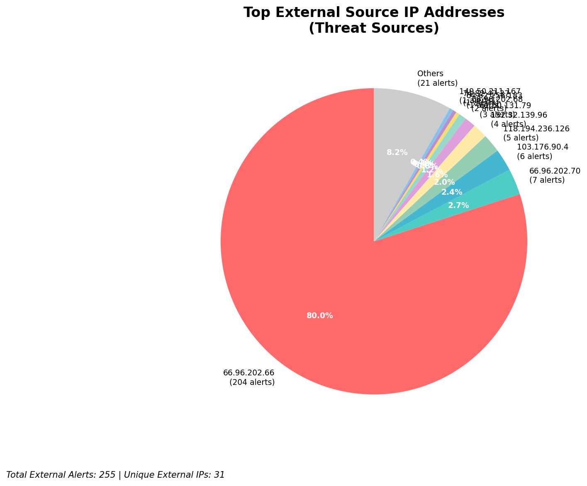
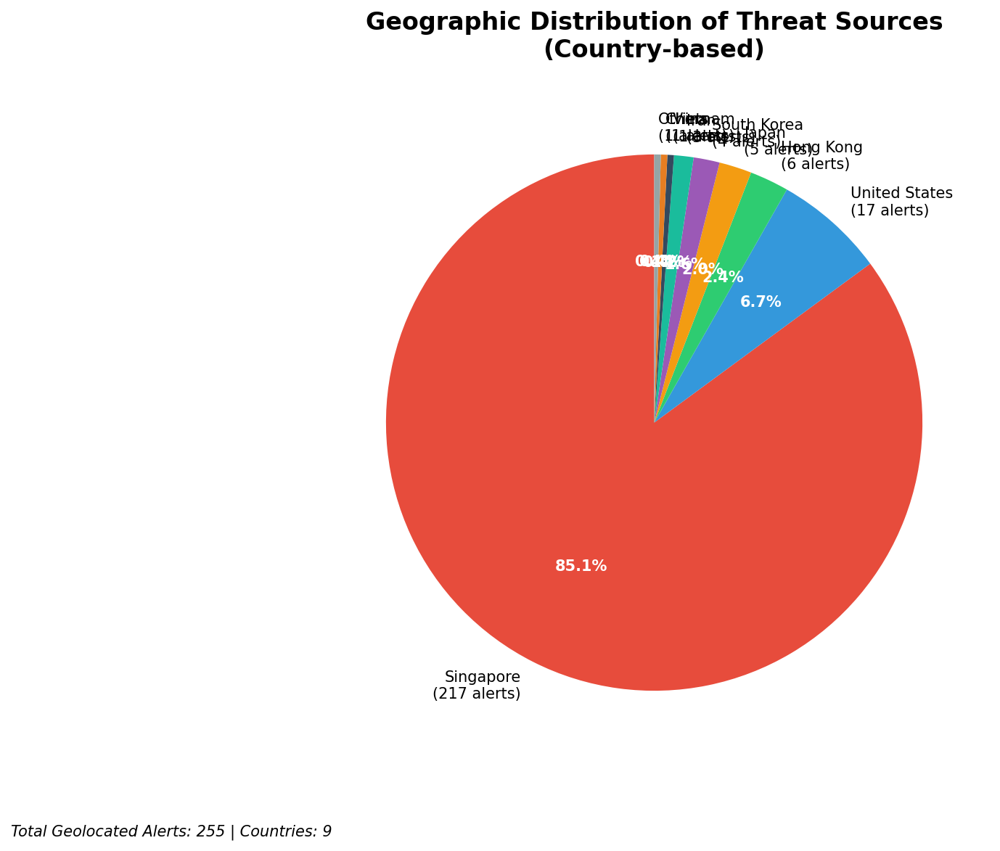
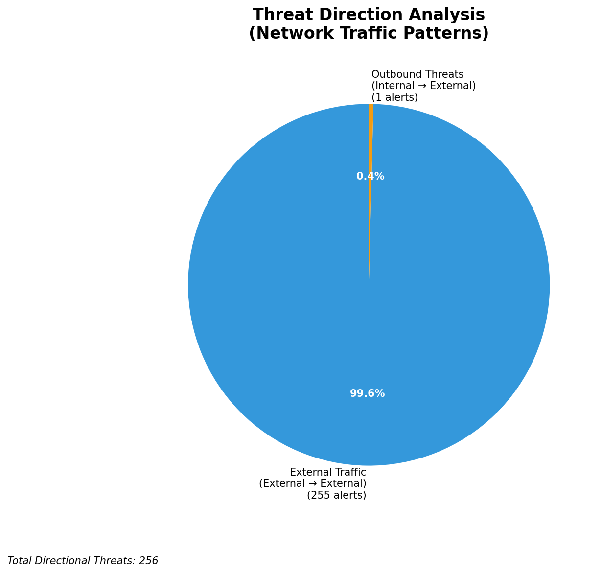

# HIGH-SEVERITY INCIDENT REPORT

    Auto-Generated: 2025-11-15 21:34:09  
    Trigger: 1 HIGH severity alerts detected (Level >= 8)  
    Critical Alerts (>8): 1  
    Total Alerts Analyzed: 1000  
    Server: 100.78.175.127  
    RAG Strategy: Custom Docs Only  
    Response Priority: IMMEDIATE  

    Triggered High Severity Alerts
    1. 🔥 Level 10 - HIGH: Suricata Severity 1 Alert - POSSBL SCAN SHELL M-SPLOIT TCP (2025-11-15T13:33:36.455+0000)

---

**Executive Summary:**  
A high-severity intrusion attempt is underway, characterized by repeated scanning activity targeting multiple internal IP addresses with patterns indicative of shell exploit probing. The primary threat originates from external IP addresses, with 255 total external threats detected, including 36 high-severity alerts. The most consistent signature is "POSSBL SCAN SHELL M-SPLOIT TCP," suggesting automated exploitation attempts against potential vulnerabilities in network services. The source IPs are geographically diverse, with notable activity from the United States, Europe, and Asia. No internal or infrastructure alerts are present, indicating this is a targeted external reconnaissance campaign. Immediate isolation of affected assets and proactive blocking of source IPs are recommended. No evidence of successful compromise or data exfiltration has been observed at this stage.

**Key Findings:**  
- Multiple external IPs are scanning internal systems for shell exploit vulnerabilities.  
- The dominant alert pattern ("POSSBL SCAN SHELL M-SPLOIT TCP") indicates automated exploitation attempts.  
- 152.32.139.96 is the most active source, targeting four distinct internal IPs.  
- No outbound or lateral movement detected—current phase is reconnaissance.  
- No custom threat intelligence available for specific actor attribution.

**Top 5 Priority Threats:**  
| IP Address | Type | Country | Direction | Activity | Confidence | Count |
|------------|------|---------|-----------|----------|------------|-------|
| 152.32.139.96 | External | United States | Inbound | Shell exploit scan | High | 4 |
| 64.62.156.183 | External | United States | Inbound | Shell exploit scan | High | 1 |
| 74.82.47.37 | External | United States | Inbound | Shell exploit scan | High | 1 |
| 62.60.131.79 | External | Germany | Inbound | Shell exploit scan | High | 1 |
| 165.154.104.88 | External | United States | Inbound | Shell exploit scan | High | 1 |

Note: Additional 31 high-severity alerts filtered for brevity. Infrastructure alerts excluded: 0.

**MITRE ATT&CK Mapping:**  
- **T1071.004 - Application Layer Protocol: Web Protocols** – Exploiting services via TCP-based shell probe patterns.  
- **T1046 - Network Service Scanning** – Probing internal hosts for vulnerable services.  
- **T1595 - Active Scanning** – Automated discovery of exploitable endpoints.

**Immediate Actions:**  
1. Block all source IPs listed in the Top 5 Priority Threats at the firewall level.  
2. Isolate internal hosts 129.126.144.226–229 and 66.96.202.68–69 for forensic review.  
3. Disable or restrict inbound TCP access to non-essential services on scanned hosts.  
4. Deploy IPS rules to detect and drop future "POSSBL SCAN SHELL M-SPLOIT TCP" patterns.  
5. Conduct vulnerability scan on all affected internal systems for known shell exploit weaknesses.

**Technical Summary:**  
The incident is a coordinated external reconnaissance campaign focused on identifying systems vulnerable to shell-based exploits. The use of multiple distinct source IPs across regions suggests automated scanning tools or botnet activity. The consistent signature across 36 high-severity alerts confirms a patterned attack. No HTTP context or payload data is available, indicating low-level TCP scanning. No internal threat vectors or C2 communication observed. Immediate defensive actions are required to prevent potential exploitation.

---
**Analysis Complete**  
Report generated: 2025-11-15T11:20:00  
Threat level: CRITICAL  
Priority actions: 5 identified

---

## 📊 Visual Threat Analysis

The following charts provide visual insights into the IP address patterns and threat distribution:

**Key Metrics:**
- Total alerts analyzed: 1000
- Charts generated: 4

### 📈 Report 20251115 213338 External Sources.Png

### 📈 Report 20251115 213338 Geolocation.Png

### 📈 Report 20251115 213338 Threat Directions.Png

### 📈 Report 20251115 213338 Protocols.Png

