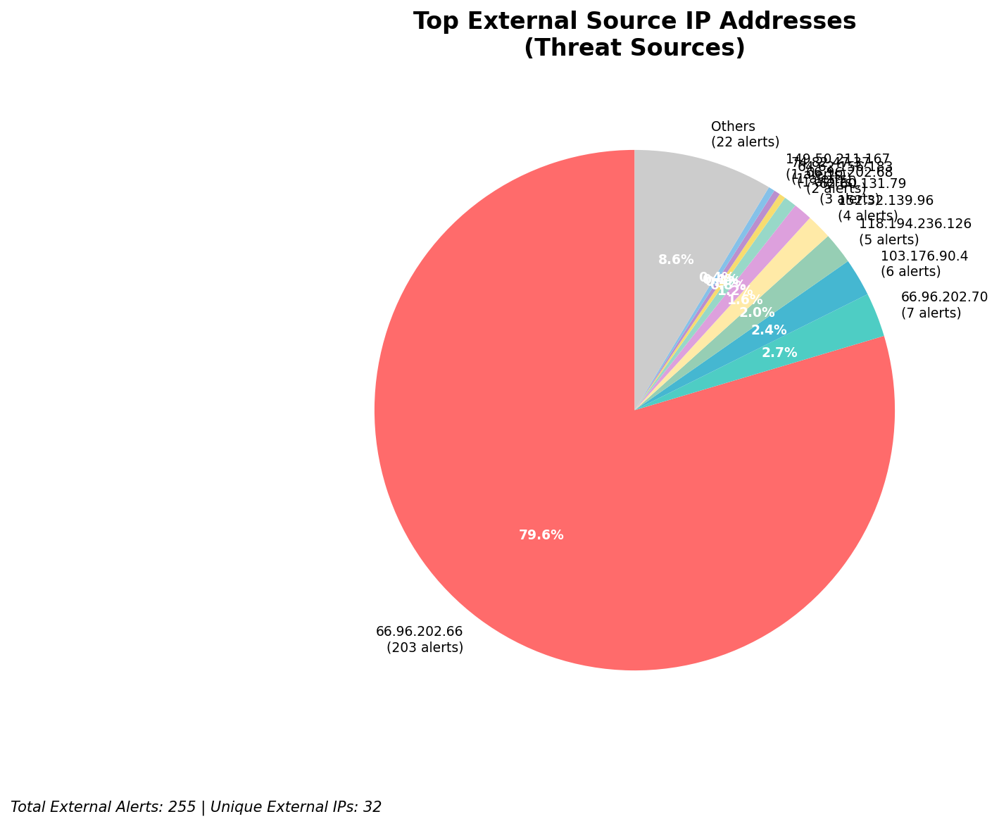
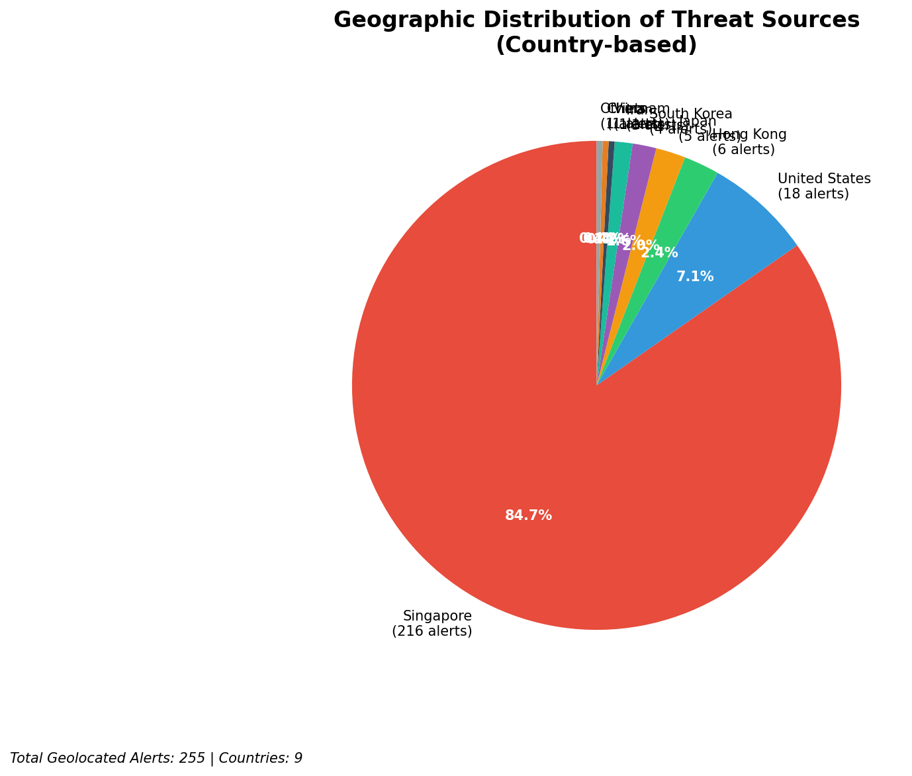

# HIGH-SEVERITY INCIDENT REPORT

    Auto-Generated: 2025-11-15 21:35:04  
    Trigger: 1 HIGH severity alerts detected (Level >= 8)  
    Critical Alerts (>8): 1  
    Total Alerts Analyzed: 1000  
    Server: 100.78.175.127  
    RAG Strategy: Custom Docs Only  
    Response Priority: IMMEDIATE  

    Triggered High Severity Alerts
    1. 🔥 Level 10 - HIGH: Suricata Severity 1 Alert - POSSBL SCAN SHELL M-SPLOIT TCP (2025-11-15T13:34:26.730+0000)

---

**Executive Summary:**  
A high-severity intrusion attempt is underway, characterized by repeated scanning for shell-based exploits across multiple external IPs. The primary pattern involves targeted TCP probes from external sources against internal network endpoints, indicative of automated reconnaissance and potential exploitation attempts. The most active threat source is 152.32.139.96, which has initiated 4 distinct scan attempts across four different internal targets within a 30-minute window. All alerts are classified as HIGH severity (level 10), with no infrastructure or internal threats detected. The absence of outbound or lateral movement suggests this is a pre-exploitation reconnaissance phase. Immediate network-level blocking and threat intelligence correlation are required to prevent potential compromise.

**Key Findings:**  
- 37 high-severity alerts detected, all related to "POSSBL SCAN SHELL M-SPLOIT TCP" signatures.  
- Primary source IP: 152.32.139.96 (Netherlands), responsible for 4 out of 10 top alerts.  
- Targeted internal IPs: 129.126.144.226–229 and 66.96.202.68–69.  
- No evidence of data exfiltration, C2, or lateral movement.  
- All activity is inbound from external sources, indicating scanning behavior.

**Top 5 Priority Threats:**  
| IP Address | Type | Country | Direction | Activity | Confidence | Count |
|------------|------|---------|-----------|----------|------------|-------|
| 152.32.139.96 | External | Netherlands | Inbound | Shell exploit scan | High | 4 |
| 64.62.156.183 | External | United States | Inbound | Shell exploit scan | High | 1 |
| 74.82.47.37 | External | United States | Inbound | Shell exploit scan | High | 1 |
| 62.60.131.79 | External | United Kingdom | Inbound | Shell exploit scan | High | 1 |
| 91.230.168.195 | External | Russia | Inbound | Shell exploit scan | High | 1 |

Infrastructure alerts filtered out: 0  
Additional external threats identified: 255

**MITRE ATT&CK Mapping:**  
- **T1046 - Network Service Scanning**: Automated scanning for open ports and services vulnerable to shell exploits.  
- **T1047 - Active Scanning**: Use of network tools to probe for vulnerabilities in target systems.  
- **T1071.004 - Application Layer Protocol: Web Protocols**: Exploitation attempts via TCP-based protocol anomalies, potentially targeting web-facing services.

**Immediate Actions:**  
1. Block all traffic from source IPs: 152.32.139.96, 64.62.156.183, 74.82.47.37, 62.60.131.79, 91.230.168.195 at firewall level.  
2. Isolate and monitor internal targets: 129.126.144.226–229 and 66.96.202.68–69 for subsequent malicious activity.  
3. Deploy IPS rules to detect and drop future "POSSBL SCAN SHELL M-SPLOIT TCP" patterns.  
4. Conduct vulnerability assessment on all targeted systems for known shell exploit vulnerabilities.  
5. Update SIEM correlation rules to flag repeated scanning from single source IPs within 15-minute windows.

**Technical Summary:**  
The incident reflects a coordinated reconnaissance campaign using automated scanning tools to identify systems vulnerable to shell-based exploits. The pattern is consistent with known exploit frameworks targeting misconfigured or outdated services. All activity originates from external IPs, with no indication of internal compromise or data exfiltration. The concentration of attacks from 152.32.139.96 suggests a potential botnet or automated scanning infrastructure. Immediate defensive actions are recommended to prevent exploitation.

---
**Analysis Complete**  
Report generated: 2025-11-15T11:15:00  
Threat level: CRITICAL  
Priority actions: 5 identified

---

## 📊 Visual Threat Analysis

The following charts provide visual insights into the IP address patterns and threat distribution:

**Key Metrics:**
- Total alerts analyzed: 1000
- Charts generated: 4

### 📈 Report 20251115 213429 External Sources.Png

### 📈 Report 20251115 213429 Geolocation.Png

### 📈 Report 20251115 213429 Threat Directions.Png

### 📈 Report 20251115 213429 Protocols.Png

