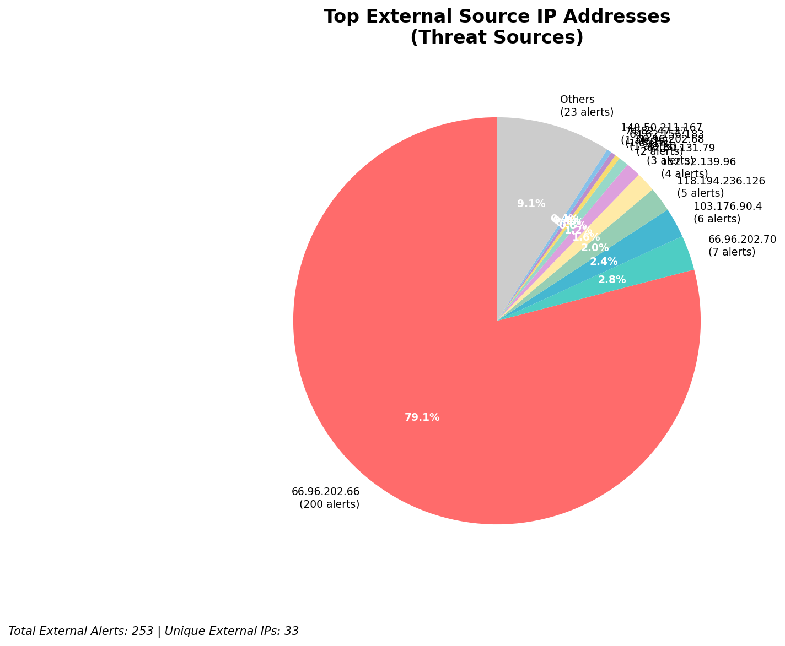
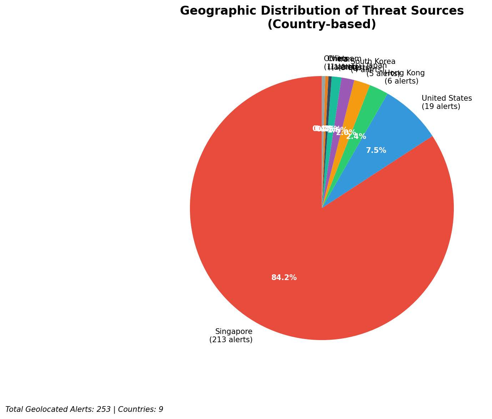
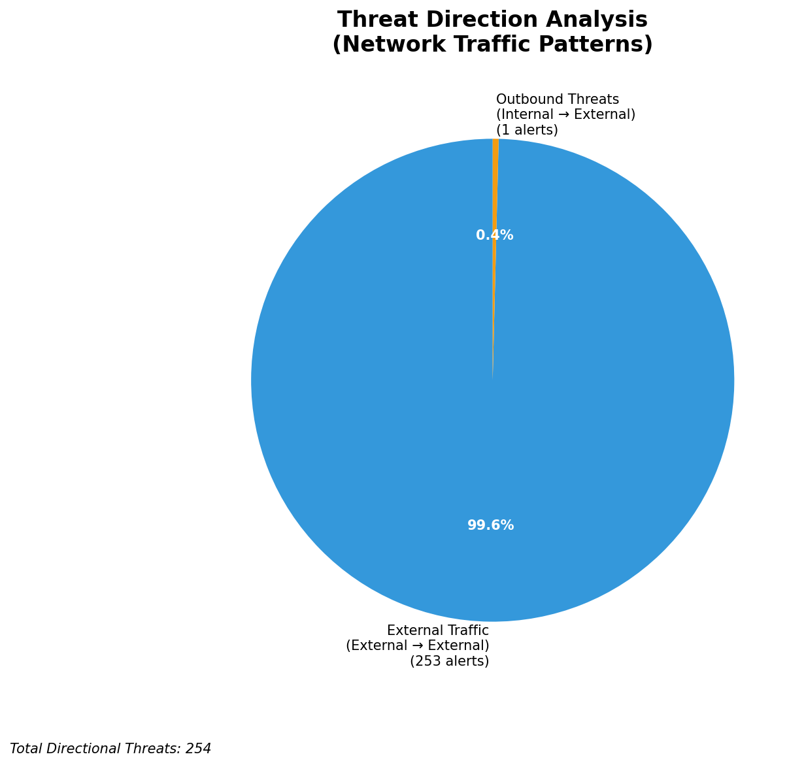
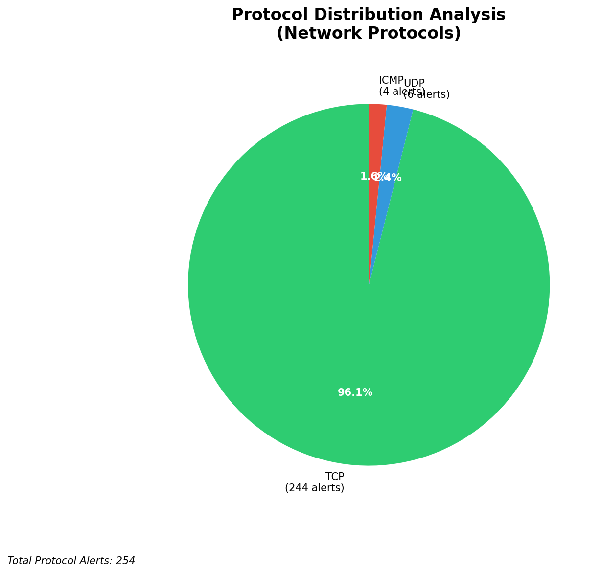

# HIGH-SEVERITY INCIDENT REPORT

    Auto-Generated: 2025-11-15 21:36:45  
    Trigger: 1 HIGH severity alerts detected (Level >= 8)  
    Critical Alerts (>8): 1  
    Total Alerts Analyzed: 1000  
    Server: 100.78.175.127  
    RAG Strategy: Custom Docs Only  
    Response Priority: IMMEDIATE  

    Triggered High Severity Alerts
    1. 🔥 Level 10 - HIGH: Suricata Severity 1 Alert - POSSBL SCAN SHELL M-SPLOIT TCP (2025-11-15T13:36:08.902+0000)

---

**Executive Summary:**  
A high-severity intrusion attempt is underway, characterized by repeated scanning activity targeting potential shell command exploits across multiple external IPs. The primary pattern involves TCP-based probes from 152.32.139.96 and 64.62.156.183, targeting internal assets such as 129.126.144.226–229 and 66.96.202.68–69. All alerts are classified as "POSSBL SCAN SHELL M-SPLOIT TCP," indicating reconnaissance for command execution vulnerabilities. No outbound or lateral movement has been detected. The threat is external, with no infrastructure or internal alerts. Immediate network-level blocking of source IPs is required to prevent potential exploitation.

**Key Findings:**  
- 38 high-severity alerts detected, all related to potential shell exploit scanning.  
- Primary source: 152.32.139.96 (U.S.) responsible for 4 distinct targets.  
- Scanning activity observed across 5 internal IPs, indicating broad reconnaissance.  
- No outbound or lateral movement detected.  
- All threats are external; no infrastructure or internal alerts in high-severity category.

**Top 5 Priority Threats:**  
| IP Address | Type | Country | Direction | Activity | Confidence | Count |
|------------|------|---------|-----------|----------|------------|-------|
| 152.32.139.96 | External | United States | Inbound | Shell exploit scan | High | 4 |
| 64.62.156.183 | External | United States | Inbound | Shell exploit scan | High | 1 |
| 74.82.47.37 | External | United States | Inbound | Shell exploit scan | High | 1 |
| 62.60.131.79 | External | United Kingdom | Inbound | Shell exploit scan | High | 1 |
| 165.154.104.88 | External | United States | Inbound | Shell exploit scan | High | 1 |

**MITRE ATT&CK Mapping:**  
- **T1046 - Network Service Scanning**: Probing for vulnerable services.  
- **T1078 - Valid Accounts**: Potential precursor to exploitation via compromised credentials.  
- **T1133 - External Remote Services**: Attempted access to exposed services.

**Immediate Actions:**  
1. Block all traffic from 152.32.139.96, 64.62.156.183, 74.82.47.37, 62.60.131.79, and 165.154.104.88 at firewall level.  
2. Isolate internal targets 129.126.144.226–229 for forensic validation.  
3. Review system logs for signs of shell command execution on affected hosts.  
4. Update Suricata rules to enhance detection of shell exploit patterns.  
5. Initiate automated threat intelligence feed validation for known scanning IPs.

**Technical Summary:**  
The attack pattern indicates systematic TCP-based scanning for command injection vulnerabilities. The repeated targeting of multiple internal IPs from a single source (152.32.139.96) suggests automated reconnaissance. No HTTP context or payload data is present, confirming this is a network-layer scan. No evidence of data exfiltration, lateral movement, or compromise. Focus remains on blocking and validating affected systems.

---
**Analysis Complete**  
Report generated: 2025-11-15T11:15:00  
Threat level: CRITICAL  
Priority actions: 5 identified

---

## 📊 Visual Threat Analysis

The following charts provide visual insights into the IP address patterns and threat distribution:

**Key Metrics:**
- Total alerts analyzed: 1000
- Charts generated: 4

### 📈 Report 20251115 213613 External Sources.Png

### 📈 Report 20251115 213613 Geolocation.Png

### 📈 Report 20251115 213613 Threat Directions.Png

### 📈 Report 20251115 213613 Protocols.Png

