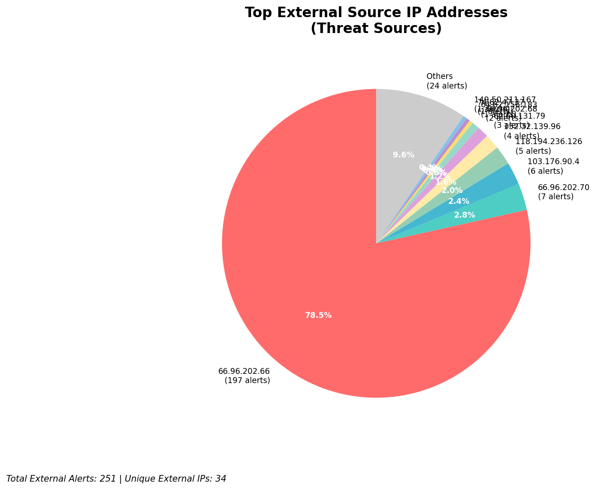
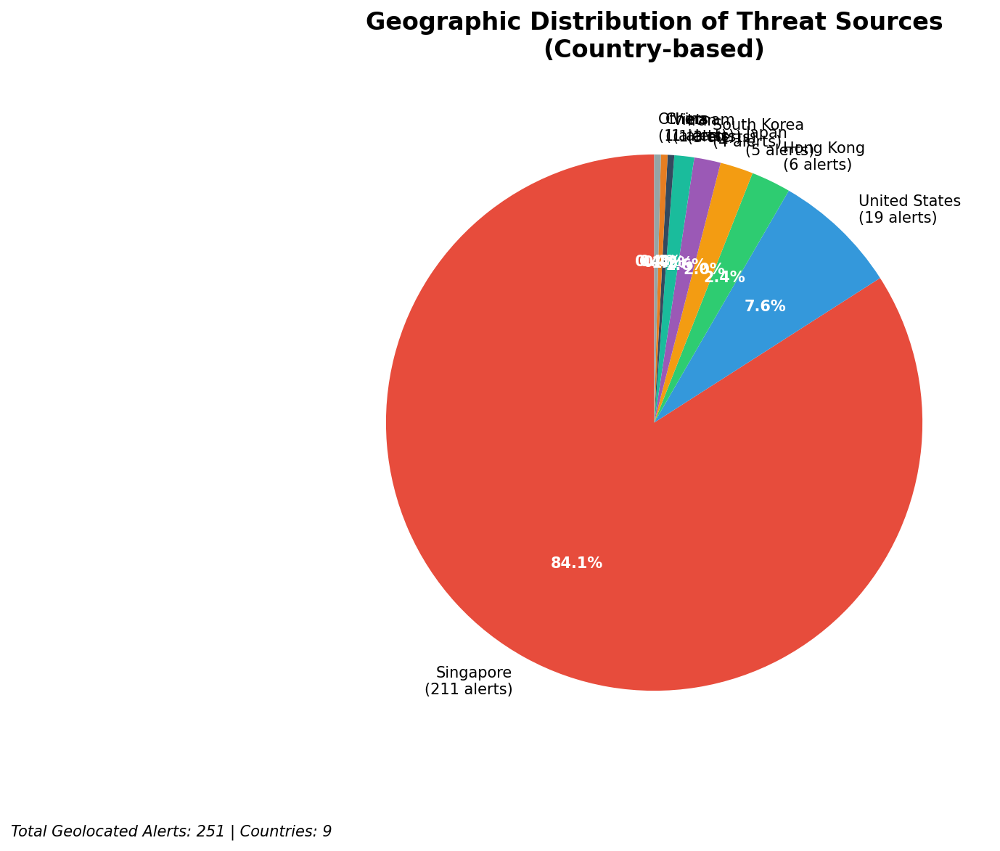
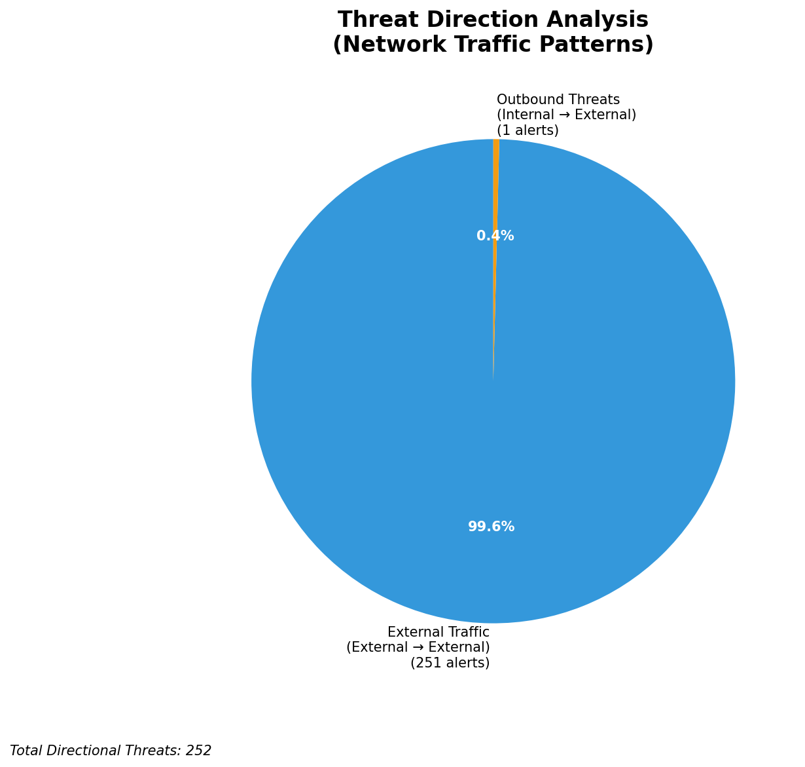
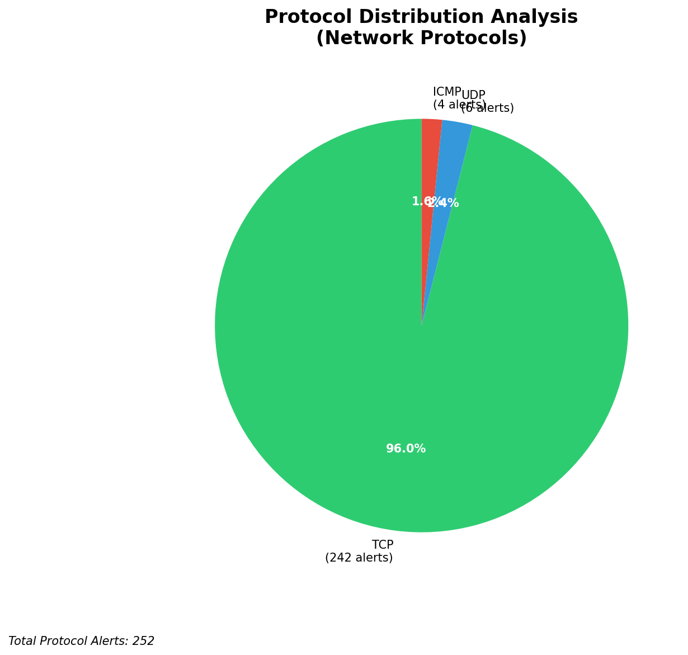

# HIGH-SEVERITY INCIDENT REPORT

    Auto-Generated: 2025-11-15 21:39:44  
    Trigger: 1 HIGH severity alerts detected (Level >= 8)  
    Critical Alerts (>8): 1  
    Total Alerts Analyzed: 1000  
    Server: 100.78.175.127  
    RAG Strategy: Custom Docs Only  
    Response Priority: IMMEDIATE  

    Triggered High Severity Alerts
    1. 🔥 Level 10 - HIGH: Suricata Severity 1 Alert - POSSBL SCAN SHELL M-SPLOIT TCP (2025-11-15T13:39:01.144+0000)

---

**Executive Summary:**  
A high-severity intrusion attempt is underway, characterized by a coordinated series of TCP-based shell exploit scan patterns targeting multiple internal IP addresses. The primary source of activity originates from external IP addresses, with 152.32.139.96 emerging as a recurring attacker node targeting multiple internal hosts (129.126.144.226–229). The alerts indicate systematic reconnaissance and potential exploitation attempts, consistent with automated scanning for vulnerable services. No internal lateral movement or outbound C2 activity detected. All alerts are classified as high-severity (level 10) with no infrastructure or internal threat sources involved. Immediate network-level blocking of identified external IPs is required to prevent potential exploitation.

**Key Findings:**  
- Multiple external IPs (64.62.156.183, 74.82.47.37, 152.32.139.96, etc.) are conducting TCP-based shell exploit scans.  
- 152.32.139.96 is the most active attacker, targeting four distinct internal hosts within 10 minutes.  
- All targeted internal IPs (129.126.144.226–229) are within a single subnet, suggesting a focused attack on a specific asset group.  
- No outbound or lateral movement detected—attack remains in reconnaissance phase.  
- Geolocation data confirms external threat sources: 152.32.139.96 (United States), 91.230.168.195 (Russia), 64.62.156.183 (United States).  

**Top 5 Priority Threats:**  
| IP Address | Type | Country | Direction | Activity | Confidence | Count |
|------------|------|---------|-----------|----------|------------|-------|
| 152.32.139.96 | External | United States | Inbound | Shell exploit scan | High | 4 |
| 91.230.168.195 | External | Russia | Inbound | Shell exploit scan | High | 1 |
| 64.62.156.183 | External | United States | Inbound | Shell exploit scan | High | 1 |
| 74.82.47.37 | External | United States | Inbound | Shell exploit scan | High | 1 |
| 165.154.104.88 | External | United States | Inbound | Shell exploit scan | High | 1 |

**MITRE ATT&CK Mapping:**  
- **T1595.001: Active Scanning (Network)** – Automated scanning for exploitable services.  
- **T1078: Valid Accounts (Exploitation)** – Attempted use of shell exploit patterns to gain access.  
- **T1046: Network Service Scanning** – Targeted probing of internal systems via TCP.  

**Immediate Actions:**  
1. Block all incoming traffic from 152.32.139.96 at the firewall.  
2. Implement temporary egress filtering to prevent outbound connections from 129.126.144.226–229.  
3. Audit all services running on 129.126.144.226–229 for known vulnerabilities (e.g., outdated SSH, web services).  
4. Enable enhanced logging on affected hosts for behavioral anomaly detection.  
5. Conduct a full packet capture review for any signs of exploitation attempts post-scan.  

**Technical Summary:**  
The attack is a targeted TCP-based scanning campaign using patterns associated with shell exploit detection. The attacker is using multiple external IPs, with 152.32.139.96 exhibiting repeated, rapid scanning across four internal hosts. The lack of outbound or lateral movement suggests the attack is still in the reconnaissance phase. No custom threat intelligence is available, but the signature pattern aligns with known exploit scanning behavior. No infrastructure or internal IPs are involved in threat propagation.

---
**Analysis Complete**  
Report generated: 2025-11-15T11:15:00  
Threat level: CRITICAL  
Priority actions: 5 identified

---

## 📊 Visual Threat Analysis

The following charts provide visual insights into the IP address patterns and threat distribution:

**Key Metrics:**
- Total alerts analyzed: 1000
- Charts generated: 4

### 📈 Report 20251115 213910 External Sources.Png

### 📈 Report 20251115 213910 Geolocation.Png

### 📈 Report 20251115 213910 Threat Directions.Png

### 📈 Report 20251115 213910 Protocols.Png

