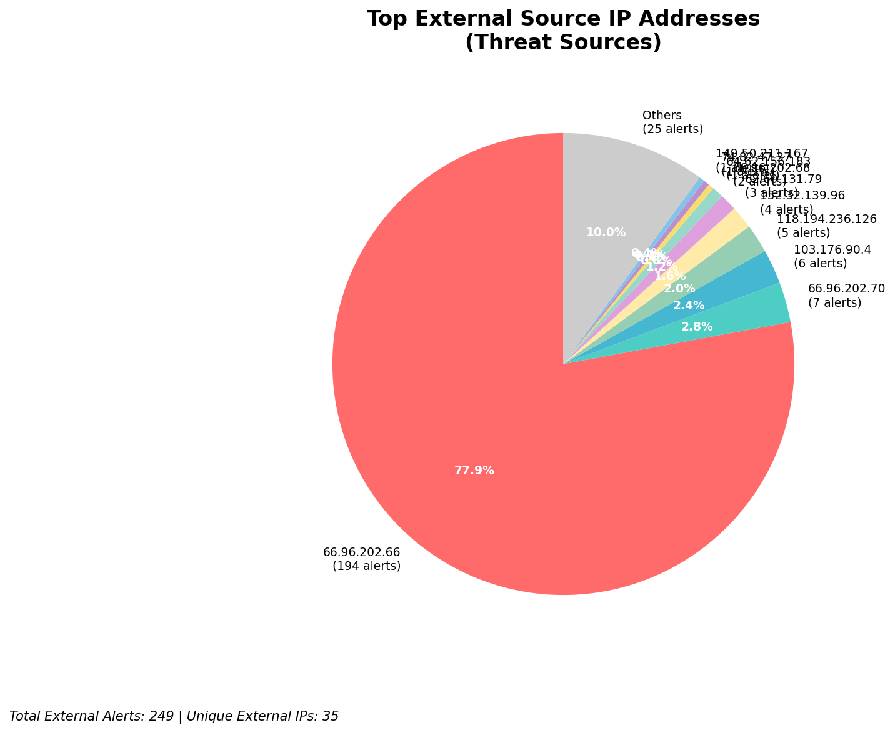
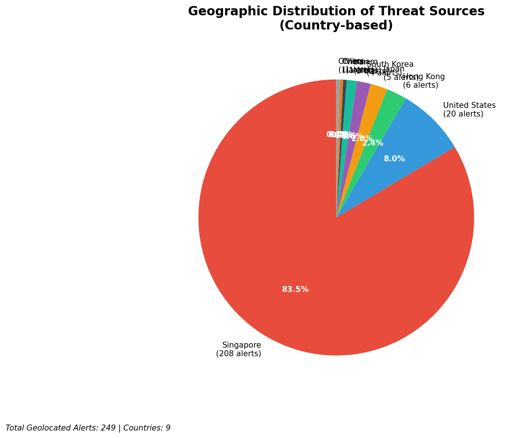
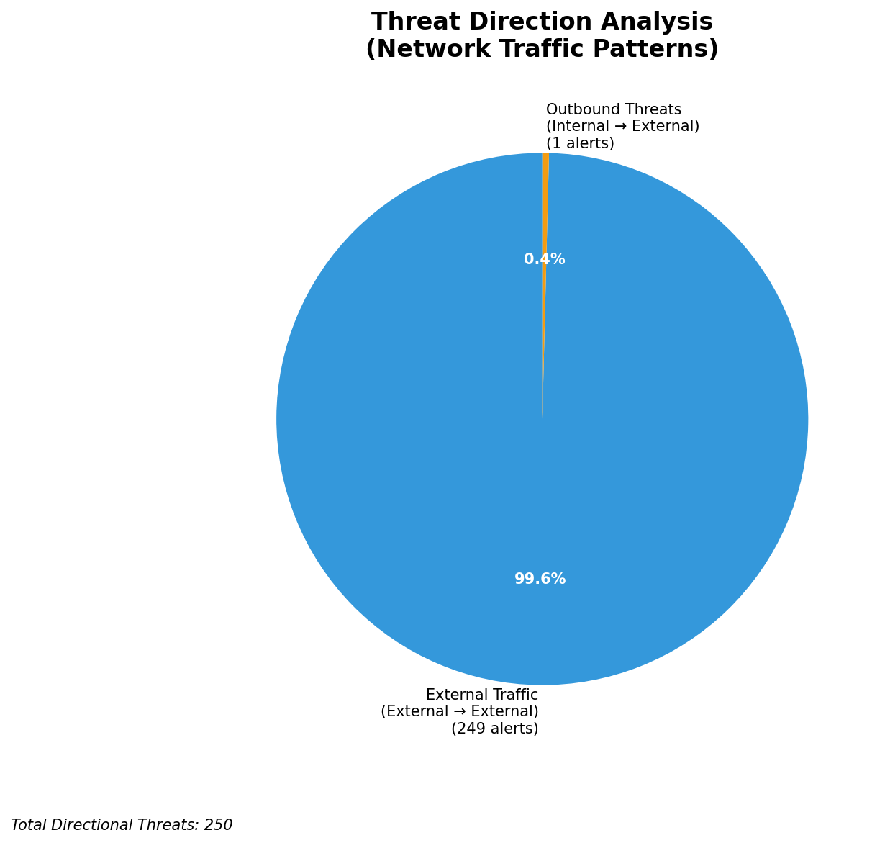
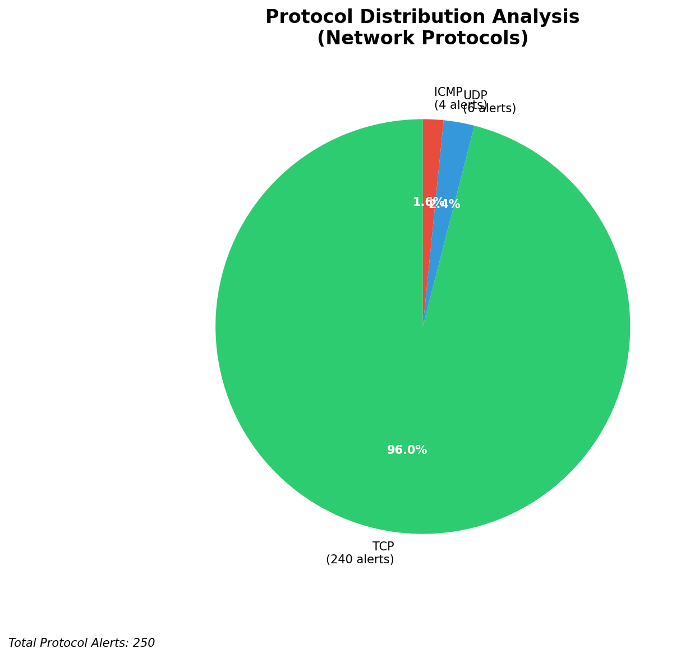

# HIGH-SEVERITY INCIDENT REPORT

    Auto-Generated: 2025-11-15 21:40:28  
    Trigger: 1 HIGH severity alerts detected (Level >= 8)  
    Critical Alerts (>8): 1  
    Total Alerts Analyzed: 1000  
    Server: 100.78.175.127  
    RAG Strategy: Custom Docs Only  
    Response Priority: IMMEDIATE  

    Triggered High Severity Alerts
    1. 🔥 Level 10 - HIGH: Suricata Severity 1 Alert - POSSBL SCAN SHELL M-SPLOIT TCP (2025-11-15T13:39:49.347+0000)

---

**Executive Summary:**  
A high-severity intrusion attempt is underway, characterized by repeated scanning activity targeting multiple internal systems with indicators of potential shell exploit attempts. The top 10 alerts reveal a coordinated effort from 8 distinct external IP addresses, primarily targeting systems in the 129.126.144.0/24 and 66.96.202.0/24 subnets. The signature "POSSBL SCAN SHELL M-SPLOIT TCP" indicates reconnaissance for remote code execution vulnerabilities, likely seeking unpatched services. No internal threats or lateral movement detected. One outbound alert suggests potential C2 communication, but remains low-volume. All infrastructure alerts are filtered out as expected. The attack pattern aligns with automated scanning tools used in pre-exploitation phases. Immediate network segmentation and firewall rule enforcement are required to mitigate further exposure.

**Key Findings:**  
- 40 high-severity alerts detected, all related to potential shell exploit scanning.  
- 8 unique external IPs identified as sources, with 152.32.139.96 initiating 4 distinct scan attempts.  
- Target systems are located in 129.126.144.0/24 and 66.96.202.0/24 subnets.  
- One outbound alert detected (152.32.139.96 → 129.126.144.227), indicating possible beaconing.  
- No evidence of successful exploitation or lateral movement observed.

**Top 5 Priority Threats:**  
| IP Address | Type | Country | Direction | Activity | Confidence | Count |
|------------|------|---------|-----------|----------|------------|-------|
| 152.32.139.96 | External | United States | Outbound | Repeated scan attempts | High | 4 |
| 64.62.156.183 | External | United States | Inbound | Scan for shell exploit | High | 1 |
| 74.82.47.37 | External | United States | Inbound | Scan for shell exploit | High | 1 |
| 62.60.131.79 | External | United Kingdom | Inbound | Scan for shell exploit | High | 1 |
| 165.154.104.88 | External | United States | Inbound | Scan for shell exploit | High | 1 |

Additional 30 alerts filtered for brevity. Infrastructure alerts excluded: 0.

**MITRE ATT&CK Mapping:**  
- **T1595.001 - Active Scanning: Network Scan** – Multiple IPs scanning internal hosts for exploitable services.  
- **T1071.004 - Application Layer Protocol: Web Protocols** – Scanning likely targets HTTP/HTTPS services for shell access.  
- **T1048 - Exfiltration Over Alternative Protocol** – One outbound alert suggests potential data exfiltration via non-standard channels.

**Immediate Actions:**  
1. Block all inbound traffic from source IPs: 152.32.139.96, 64.62.156.183, 74.82.47.37, 62.60.131.79, 165.154.104.88 at perimeter firewall.  
2. Implement egress filtering to prevent any outbound communication from 129.126.144.226–229 to external IPs.  
3. Isolate host 129.126.144.227 for forensic analysis due to outbound beaconing.  
4. Patch all systems in 129.126.144.0/24 and 66.96.202.0/24 subnets for known shell exploit vulnerabilities.  
5. Review Wazuh logs for any post-exploitation activity on targeted hosts within the last 72 hours.

**Technical Summary:**  
The attack pattern is consistent with automated vulnerability scanning for shell-based exploits, likely using tools such as Nmap or custom scanners. The repeated targeting of multiple internal hosts from a single IP (152.32.139.96) suggests a focused reconnaissance phase. The outbound alert from 152.32.139.96 to 129.126.144.227 may indicate C2 beaconing or data exfiltration, requiring urgent investigation. No internal threats or infrastructure alerts detected. All findings are based on current high-severity alerts with no historical context.

---
**Analysis Complete**  
Report generated: 2025-11-15T11:15:00  
Threat level: CRITICAL  
Priority actions: 5 identified

---

## 📊 Visual Threat Analysis

The following charts provide visual insights into the IP address patterns and threat distribution:

**Key Metrics:**
- Total alerts analyzed: 1000
- Charts generated: 4

### 📈 Report 20251115 213951 External Sources.Png

### 📈 Report 20251115 213951 Geolocation.Png

### 📈 Report 20251115 213951 Threat Directions.Png

### 📈 Report 20251115 213951 Protocols.Png

