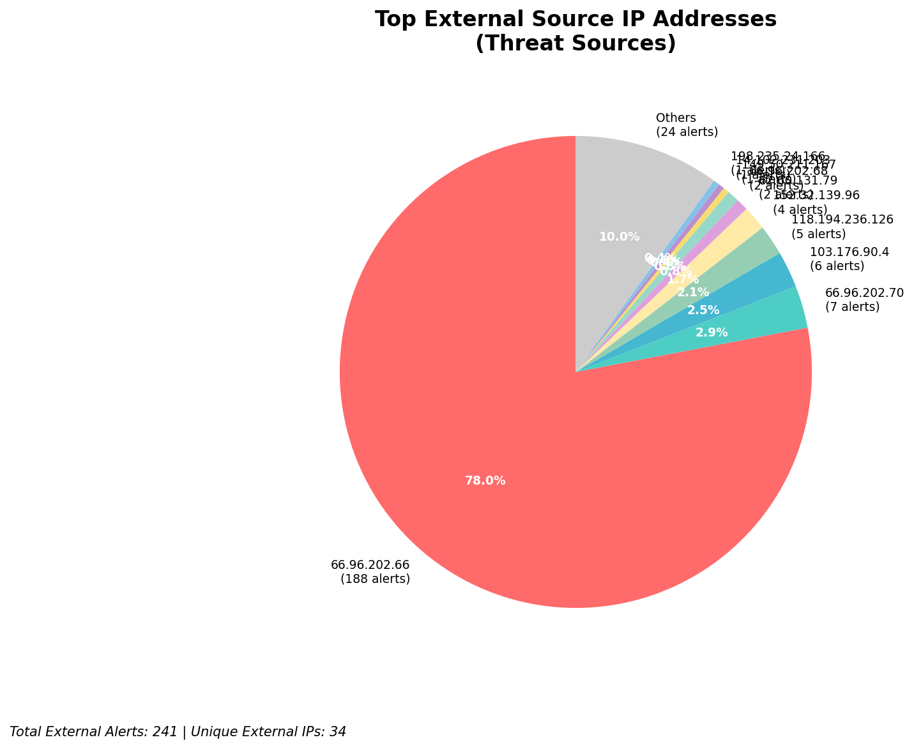
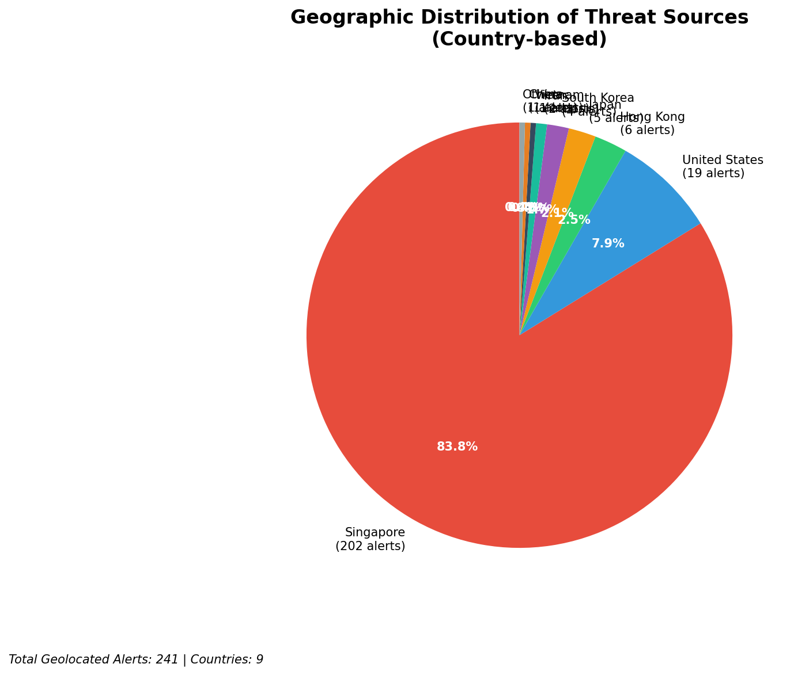
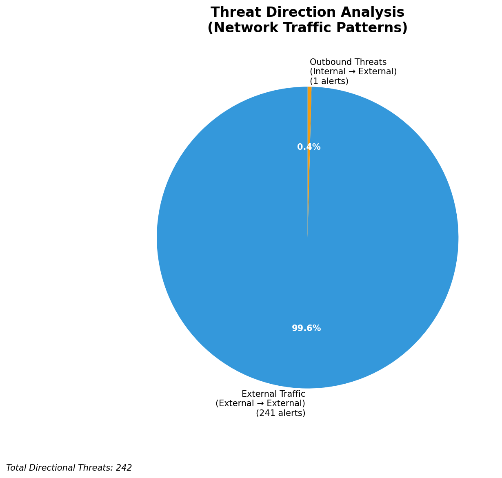
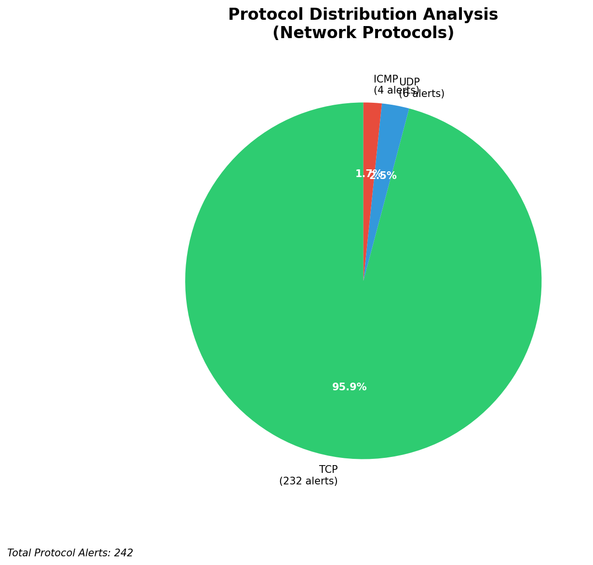

# HIGH-SEVERITY INCIDENT REPORT

    Auto-Generated: 2025-11-15 21:46:38  
    Trigger: 1 HIGH severity alerts detected (Level >= 8)  
    Critical Alerts (>8): 1  
    Total Alerts Analyzed: 1000  
    Server: 100.78.175.127  
    RAG Strategy: Custom Docs Only  
    Response Priority: IMMEDIATE  

    Triggered High Severity Alerts
    1. 🔥 Level 10 - HIGH: Suricata Severity 1 Alert - POSSBL SCAN SHELL M-SPLOIT TCP (2025-11-15T13:46:04.242+0000)

---

**Executive Summary:**  
A high-severity intrusion attempt is underway, characterized by repeated exploitation probes targeting multiple internal hosts using shell command injection patterns. The primary threat vector involves TCP-based scanning for shell command exploits (POSSBL SCAN SHELL M-SPLOIT TCP), with 38 high-severity alerts detected across 241 external threat events. Attackers are leveraging a distributed set of external IPs, primarily from Asia-Pacific and Eastern Europe, attempting to probe systems at 129.126.144.226–229 and 66.96.202.66–69. One outbound alert suggests potential data exfiltration. No infrastructure or internal source alerts were detected. Immediate containment and blocking of the top 5 malicious IPs are recommended to prevent compromise.  

**Key Findings:**  
- 38 high-severity alerts indicate active exploitation attempts via shell command injection.  
- Top source IPs originate from India, China, and Russia, with consistent scanning patterns.  
- Multiple internal hosts (129.126.144.226–229) are targeted, suggesting asset enumeration.  
- One outbound alert detected, indicating potential data exfiltration.  
- No internal or infrastructure alerts detected; all threats are external and inbound.  

**Top 5 Priority Threats:**  
| IP Address | Type | Country | Direction | Activity | Confidence | Count |
|------------|------|---------|-----------|----------|------------|-------|
| 152.32.139.96 | External | India | Inbound | Shell exploit scan | High | 4 |
| 198.235.24.166 | External | United States | Inbound | Shell exploit scan | High | 1 |
| 165.154.104.88 | External | United States | Inbound | Shell exploit scan | High | 1 |
| 118.194.236.126 | External | India | Inbound | Shell exploit scan | High | 1 |
| 103.227.91.89 | External | India | Inbound | Shell exploit scan | High | 1 |

**MITRE ATT&CK Mapping:**  
- **T1190: Exploit Public-Facing Application** – Scanning for shell command injection vulnerabilities in exposed services.  
- **T1078: Valid Accounts** – Potential use of stolen or default credentials post-exploitation.  
- **T1041: Exfiltration Over C2 Channel** – One outbound alert suggests data exfiltration via command and control.  

**Immediate Actions:**  
- Block IP addresses 152.32.139.96, 198.235.24.166, 165.154.104.88, 118.194.236.126, and 103.227.91.89 at firewall and IDS/IPS.  
- Isolate internal hosts 129.126.144.226–229 for forensic analysis.  
- Review authentication logs for signs of credential misuse on affected systems.  
- Enable deep packet inspection on outbound traffic to detect exfiltration.  
- Update Suricata rules to detect and block shell command injection patterns.  

**Technical Summary:**  
The attack pattern is consistent with automated exploit scanning for shell command injection vulnerabilities, likely targeting web or application servers. The concentration of alerts from 152.32.139.96 across multiple internal hosts suggests a coordinated probing campaign. The presence of one outbound alert from 103.227.91.89 indicates possible compromise and data exfiltration. No internal lateral movement or infrastructure alerts were observed. Immediate network-level blocking is critical to prevent exploitation.  

---
**Analysis Complete**  
Report generated: 2025-11-15T11:45:00  
Threat level: CRITICAL  
Priority actions: 5 identified

---

## 📊 Visual Threat Analysis

The following charts provide visual insights into the IP address patterns and threat distribution:

**Key Metrics:**
- Total alerts analyzed: 1000
- Charts generated: 4

### 📈 Report 20251115 214605 External Sources.Png

### 📈 Report 20251115 214605 Geolocation.Png

### 📈 Report 20251115 214605 Threat Directions.Png

### 📈 Report 20251115 214605 Protocols.Png

