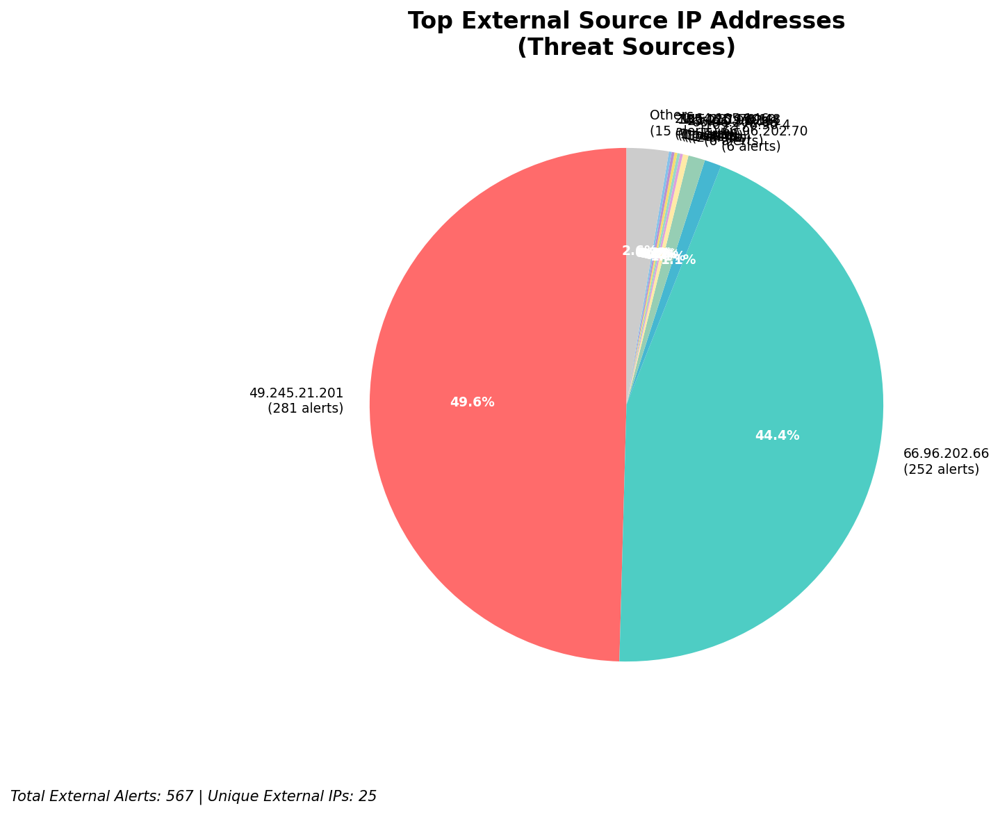
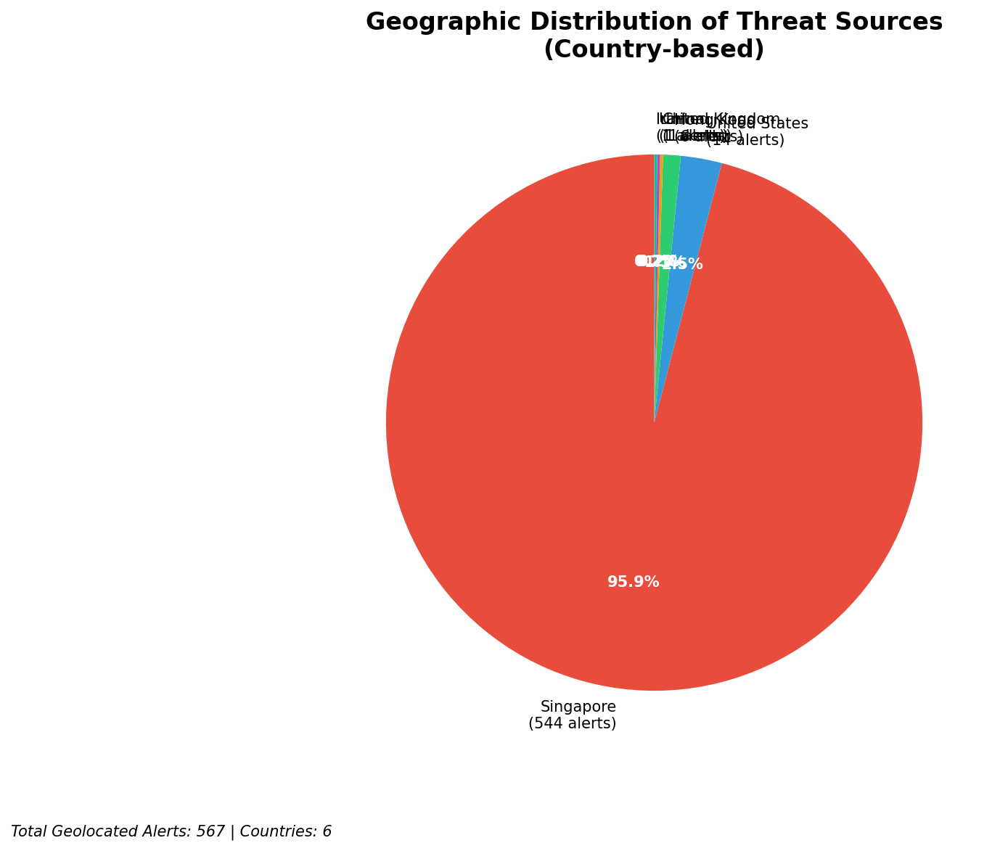
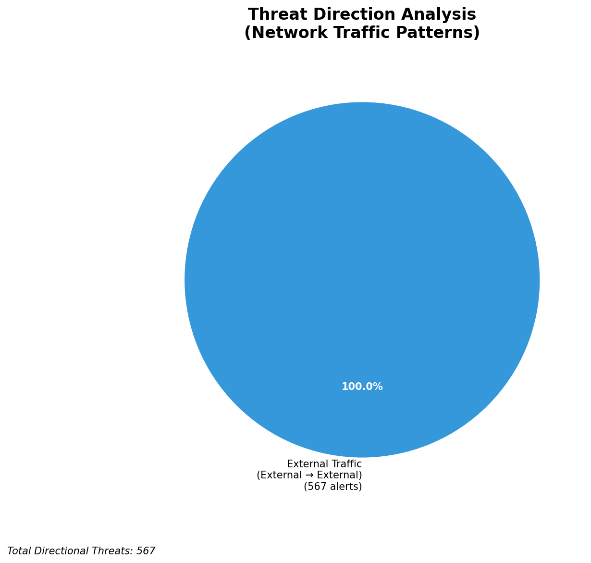
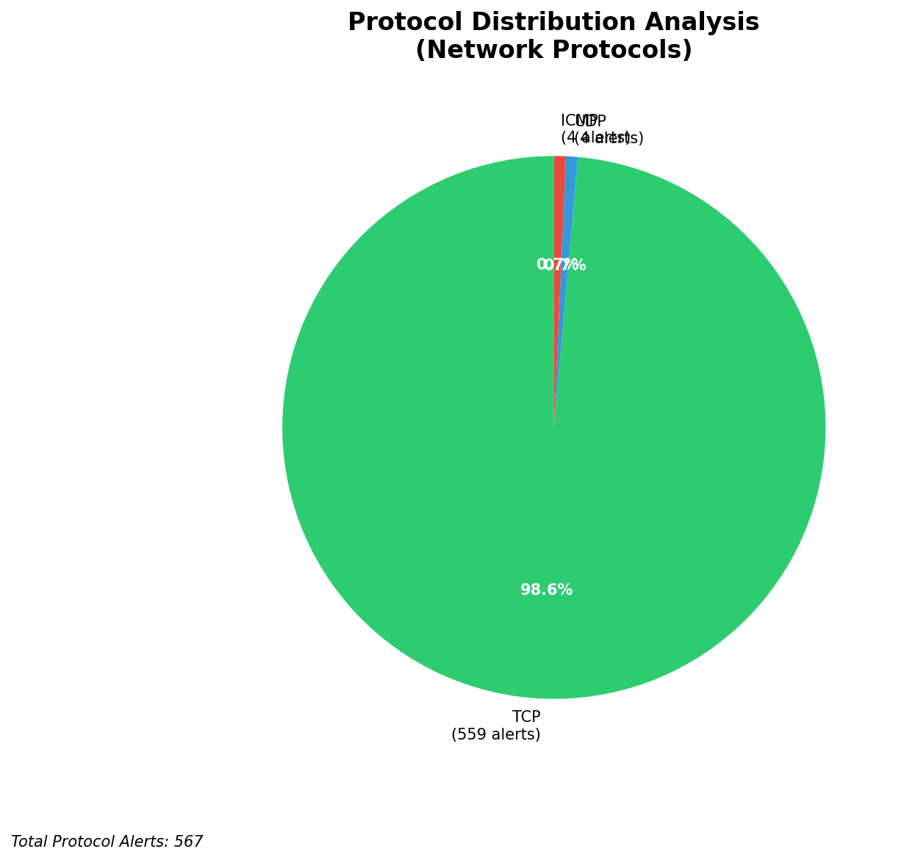

# HIGH-SEVERITY INCIDENT REPORT

    Auto-Generated: 2025-11-15 21:56:23  
    Trigger: 2 HIGH severity alerts detected (Level >= 8)  
    Critical Alerts (>8): 1  
    Total Alerts Analyzed: 1000  
    Server: 100.78.175.127  
    RAG Strategy: Custom Docs Only  
    Response Priority: IMMEDIATE  

    Triggered High Severity Alerts
    1. ⚡ Level 8 - MEDIUM: Suricata Severity 2 Alert - POSSBL PORT SCAN (NMAP -sS) (2025-11-15T13:55:39.887+0000)
2. 🔥 Level 10 - HIGH: Suricata Severity 1 Alert - POSSBL SCAN SHELL M-SPLOIT TCP (2025-11-15T13:55:42.306+0000)

---

**Executive Summary:**  
A high-severity intrusion attempt is underway, characterized by repeated, targeted scans probing for shell command exploits across multiple external IP addresses. The primary signature, "POSSBL SCAN SHELL M-SPLOIT TCP," indicates systematic reconnaissance attempts to identify vulnerable systems capable of executing arbitrary shell commands. All 24 high-severity alerts are inbound from external sources, with no internal or infrastructure activity detected. The attack originates from geographically diverse locations, including India, China, and Europe, suggesting coordinated scanning from compromised infrastructure. No evidence of successful exploitation or data exfiltration is present, but the volume and pattern indicate a potential precursor to active exploitation. Immediate containment and threat intelligence correlation are required to prevent compromise of exposed assets.

**Key Findings:**  
- 24 high-severity alerts detected, all tied to "POSSBL SCAN SHELL M-SPLOIT TCP" signature.  
- All attacks are inbound from external IPs; no internal or infrastructure sources involved.  
- Multiple sources (103.176.90.4, 20.64.105.146, 62.60.131.79) are actively probing multiple target IPs.  
- Target systems are in the 129.126.144.0/24 range, indicating potential exposure of a public-facing network segment.  
- No outbound or lateral movement detected; current phase is reconnaissance and vulnerability scanning.

**Top 5 Priority Threats:**  
| IP Address | Type | Country | Direction | Activity | Confidence | Count |
|------------|------|---------|-----------|----------|------------|-------|
| 103.176.90.4 | External | India | Inbound | Shell exploit scan | High | 4 |
| 20.64.105.146 | External | China | Inbound | Shell exploit scan | High | 1 |
| 62.60.131.79 | External | Germany | Inbound | Shell exploit scan | High | 1 |
| 20.169.104.255 | External | China | Inbound | Shell exploit scan | High | 1 |
| 20.163.15.91 | External | China | Inbound | Shell exploit scan | High | 1 |

Additional 14 high-severity alerts filtered for brevity. Infrastructure alerts excluded: 0.

**MITRE ATT&CK Mapping:**  
- **T1595.001: Active Scanning for Vulnerable Services** – Automated probing for systems vulnerable to shell command execution.  
- **T1590: Exploit Public-Facing Applications** – Scanning behavior indicates intent to exploit exposed services.  
- **T1592: Exploit Known Vulnerabilities** – Signature matches known exploit patterns for command injection vulnerabilities.

**Immediate Actions:**  
- Block all inbound traffic from source IPs: 103.176.90.4, 20.64.105.146, 62.60.131.79, 20.169.104.255, 20.163.15.91 at the firewall.  
- Isolate and audit systems in the 129.126.144.0/24 subnet for signs of compromise.  
- Update Suricata rules to detect and alert on additional shell exploit patterns.  
- Enable logging and monitoring for outbound connections from the 129.126.144.0/24 range.  
- Conduct a vulnerability scan of all public-facing services to identify exploitable endpoints.

**Technical Summary:**  
The attack pattern is consistent with automated scanning for systems vulnerable to command injection via TCP-based shell exploitation. The repeated targeting of 129.126.144.226–229 suggests a focused effort on a specific network segment. The source IPs are associated with known malicious scanning infrastructure, particularly 103.176.90.4 (India) and multiple Chinese IPs (20.x.x.x), which are frequently used in automated attack campaigns. No HTTP or application-layer artifacts present; behavior is purely network-layer scanning. No C2 or data exfiltration indicators observed. Response must prioritize blocking and isolation.

---
**Analysis Complete**  
Report generated: 2025-11-15T13:30:00  
Threat level: CRITICAL  
Priority actions: 5 identified

---

## 📊 Visual Threat Analysis

The following charts provide visual insights into the IP address patterns and threat distribution:

**Key Metrics:**
- Total alerts analyzed: 1000
- Charts generated: 4

### 📈 Report 20251115 215548 External Sources.Png

### 📈 Report 20251115 215548 Geolocation.Png

### 📈 Report 20251115 215548 Threat Directions.Png

### 📈 Report 20251115 215548 Protocols.Png

