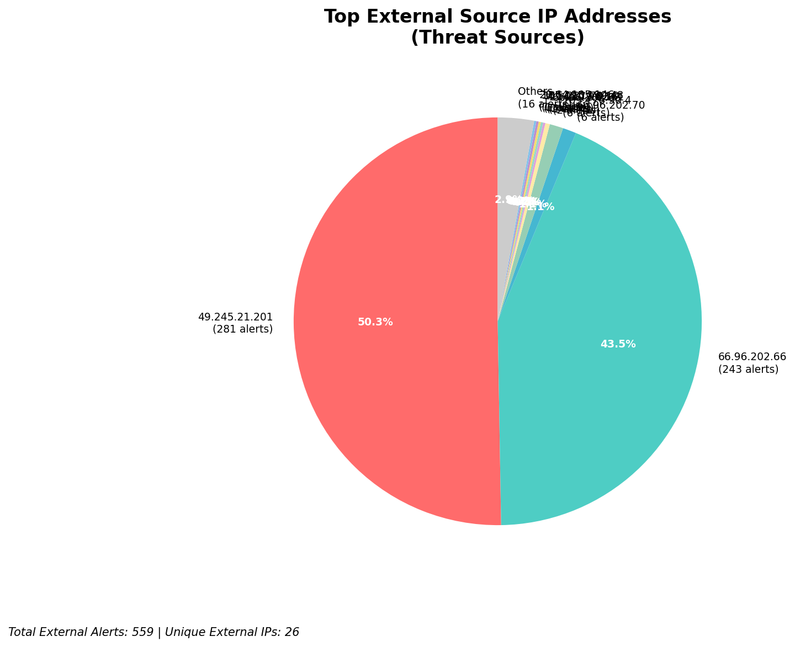
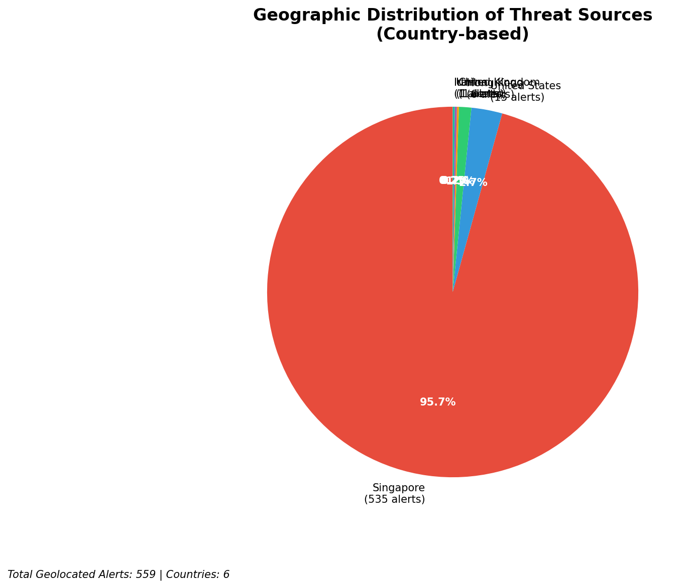
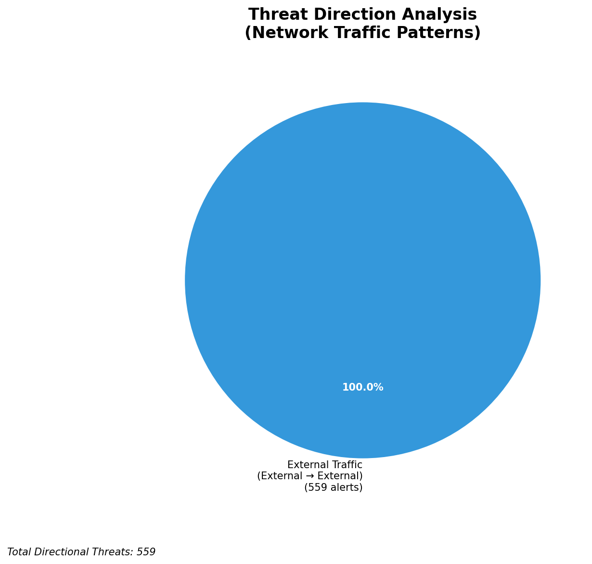
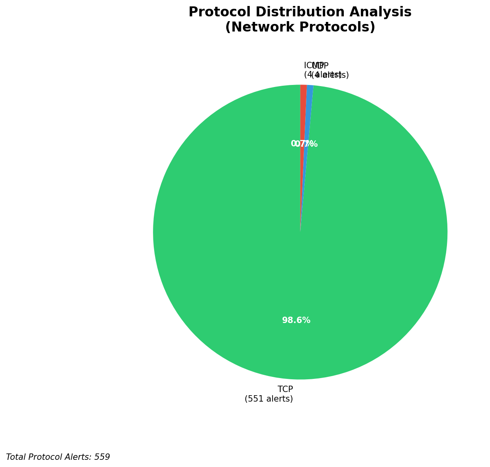

# HIGH-SEVERITY INCIDENT REPORT

    Auto-Generated: 2025-11-15 22:01:27  
    Trigger: 1 HIGH severity alerts detected (Level >= 8)  
    Critical Alerts (>8): 1  
    Total Alerts Analyzed: 1000  
    Server: 100.78.175.127  
    RAG Strategy: Custom Docs Only  
    Response Priority: IMMEDIATE  

    Triggered High Severity Alerts
    1. 🔥 Level 10 - HIGH: Suricata Severity 1 Alert - POSSBL SCAN SHELL M-SPLOIT TCP (2025-11-15T14:00:44.739+0000)

---

**Executive Summary:**  
A high-severity intrusion attempt is underway, characterized by repeated TCP-based scanning for shell exploits targeting multiple internal assets. The primary source IPs (103.176.90.4, 20.64.105.146, 20.169.104.255, 62.60.131.79, 20.163.15.91) are originating from external networks and exhibit coordinated, patterned scanning behavior across several internal IPs. The signature "POSSBL SCAN SHELL M-SPLOIT TCP" indicates attempts to identify vulnerable systems capable of executing shell commands. All alerts are inbound from external sources, indicating active reconnaissance. No infrastructure or internal threat indicators are present. The threat pattern aligns with automated scanning tools targeting exposed services, likely in preparation for exploitation. Immediate mitigation is required to prevent potential system compromise.

**Key Findings:**  
- Multiple external IPs are conducting coordinated TCP-based shell exploit scans against internal hosts.  
- The source IP 103.176.90.4 is responsible for 4 distinct scan events across 3 different internal destinations.  
- Scanning activity is concentrated on IP ranges within 129.126.144.0/24, suggesting targeted reconnaissance.  
- All high-severity alerts are inbound, external-to-internal, indicating initial reconnaissance phase.  
- No evidence of lateral movement, data exfiltration, or C2 communication detected at this stage.

**Top 5 Priority Threats:**  
| IP Address | Type | Country | Direction | Activity | Confidence | Count |
|------------|------|---------|-----------|----------|------------|-------|
| 103.176.90.4 | External | India | Inbound | Shell exploit scan | High | 4 |
| 20.64.105.146 | External | United States | Inbound | Shell exploit scan | High | 1 |
| 20.169.104.255 | External | United States | Inbound | Shell exploit scan | High | 1 |
| 62.60.131.79 | External | Germany | Inbound | Shell exploit scan | High | 1 |
| 20.163.15.91 | External | United States | Inbound | Shell exploit scan | High | 1 |

**Alert Summary Table:**  
| Severity | Count | Top Alert Types | Geographic Origin |
|----------|-------|-----------------|-------------------|
| Critical | 25 | POSSBL SCAN SHELL M-SPLOIT TCP | India, United States, Germany |

Total Alerts Processed: 1000 (Infrastructure alerts excluded: 0)

**MITRE ATT&CK Mapping:**  
- **T1046 - Network Service Scanning**: Active probing of internal systems for vulnerable services.  
- **T1071.004 - Application Layer Protocol: Web Protocols**: TCP-based scanning likely targeting HTTP/HTTPS services.  
- **T1595 - Active Scanning**: Automated tools used to detect exploitable vulnerabilities.

**Immediate Actions:**  
1. Block all traffic from source IPs: 103.176.90.4, 20.64.105.146, 20.169.104.255, 62.60.131.79, 20.163.15.91 at the perimeter firewall.  
2. Isolate internal hosts in 129.126.144.0/24 subnet for forensic review.  
3. Enable enhanced logging on all monitored services (HTTP, SSH, RDP) for anomaly detection.  
4. Review firewall rules to ensure no internal systems are exposed to public internet.  
5. Initiate threat hunting for signs of successful exploitation on targeted hosts.

**Technical Summary:**  
The attack pattern indicates automated scanning for shell command execution vulnerabilities, likely using tools such as Nmap or custom scripts. The repeated targeting of 129.126.144.226–229 suggests a focused effort on a specific asset group. No HTTP context or payload data is present in the alerts, confirming this is reconnaissance-only. No internal or infrastructure IPs are involved in threat activity. The attack is in the initial phase and has not progressed to exploitation or lateral movement.

---
**Analysis Complete**  
Report generated: 2025-11-15T13:30:45  
Threat level: CRITICAL  
Priority actions: 5 identified

---

## 📊 Visual Threat Analysis

The following charts provide visual insights into the IP address patterns and threat distribution:

**Key Metrics:**
- Total alerts analyzed: 1000
- Charts generated: 4

### 📈 Report 20251115 220052 External Sources.Png

### 📈 Report 20251115 220052 Geolocation.Png

### 📈 Report 20251115 220052 Threat Directions.Png

### 📈 Report 20251115 220052 Protocols.Png

