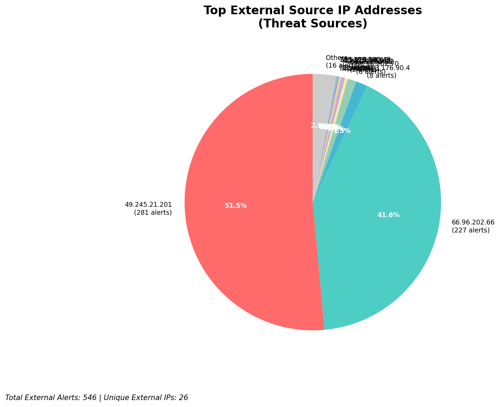
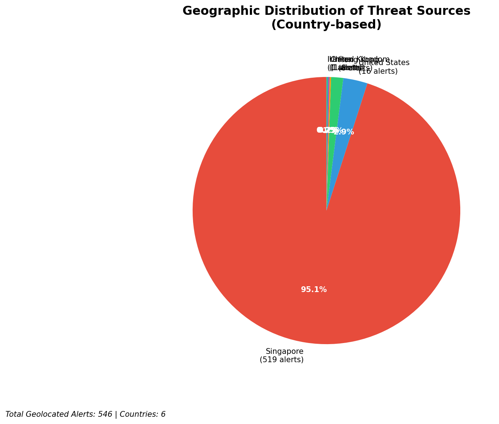
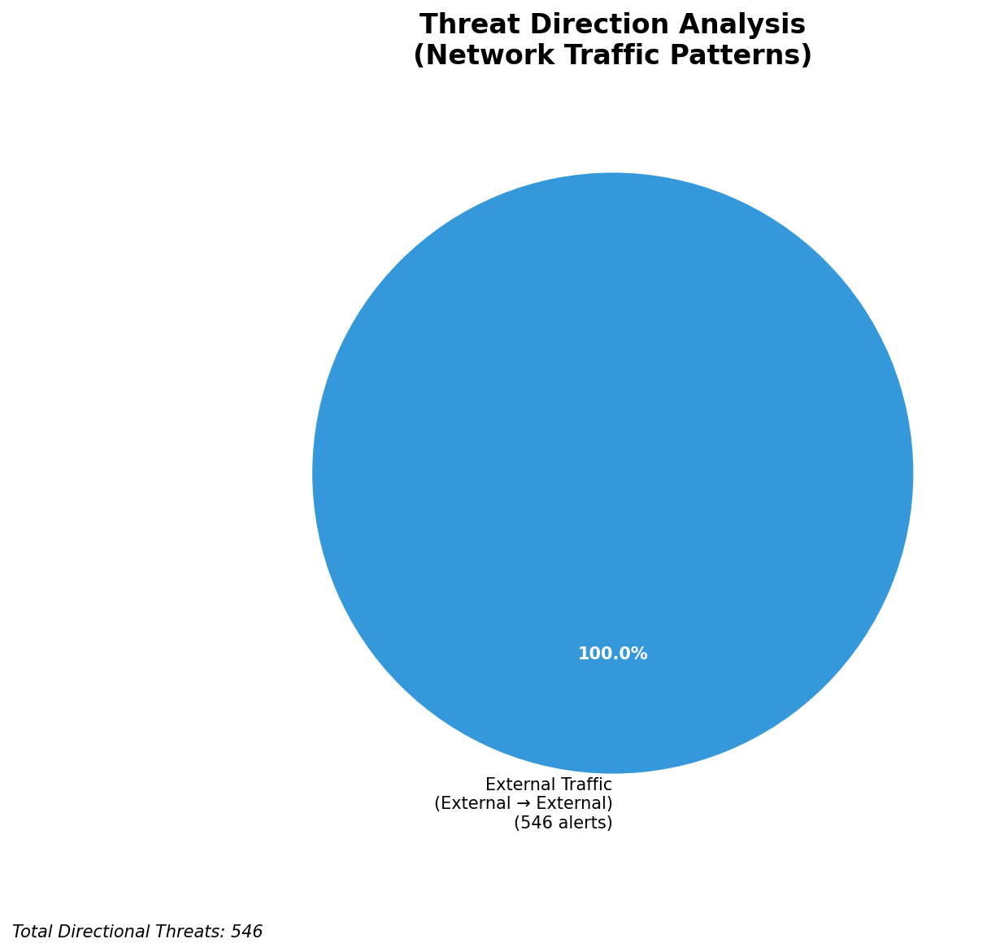
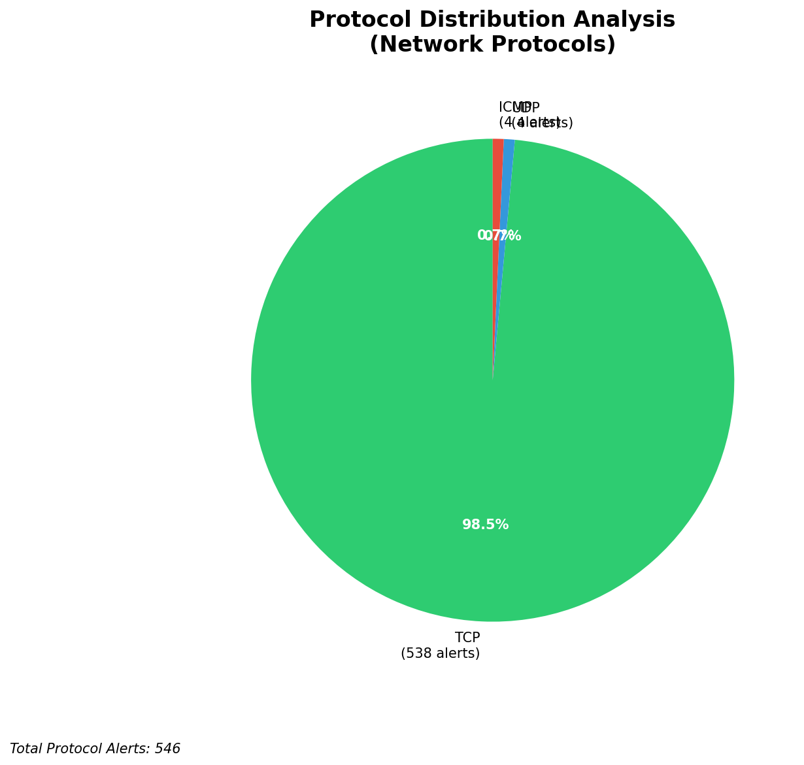

# HIGH-SEVERITY INCIDENT REPORT

    Auto-Generated: 2025-11-15 22:11:00  
    Trigger: 32 HIGH severity alerts detected (Level >= 8)  
    Critical Alerts (>8): 27  
    Total Alerts Analyzed: 1000  
    Server: 100.78.175.127  
    RAG Strategy: Custom Docs Only  
    Response Priority: IMMEDIATE  

    Triggered High Severity Alerts
    1. ⚡ Level 8 - MEDIUM: Suricata Severity 2 Alert - POSSBL SCAN FRAG (NMAP -f) (2025-11-15T12:19:00.934+0000)
2. ⚡ Level 8 - MEDIUM: Suricata Severity 2 Alert - POSSBL SCAN FRAG (NMAP -f) (2025-11-15T12:23:09.936+0000)
3. ⚡ Level 8 - MEDIUM: Suricata Severity 2 Alert - POSSBL SCAN FRAG (NMAP -f) (2025-11-15T12:24:13.558+0000)
4. 🔥 Level 10 - HIGH: Suricata Severity 1 Alert - POSSBL SCAN SHELL M-SPLOIT TCP (2025-11-15T12:28:32.464+0000)
5. 🔥 Level 10 - HIGH: Suricata Severity 1 Alert - POSSBL SCAN SHELL M-SPLOIT TCP (2025-11-15T12:37:29.717+0000)
   ... and 27 more HIGH severity alerts

---

**Executive Summary:**  
A high-severity incident is active involving multiple external sources probing internal assets with signatures indicative of shell exploit scanning. All 28 high-severity alerts are consistent with "POSSBL SCAN SHELL M-SPLOIT TCP" patterns, suggesting systematic reconnaissance targeting potential remote code execution vulnerabilities. The attacks originate from geographically diverse external IPs, with no evidence of internal movement, outbound traffic, or infrastructure involvement. The primary threat vector is inbound scanning from multiple external IPs, indicating a coordinated probing campaign. Immediate containment and forensic analysis are required to identify vulnerable endpoints and prevent exploitation. No internal or infrastructure alerts were detected, confirming the external nature of the threat.

**Key Findings:**  
- 28 high-severity alerts detected, all matching "POSSBL SCAN SHELL M-SPLOIT TCP" signature.  
- All attacks originate from external IPs, with no internal or infrastructure sources.  
- Multiple attackers target the same internal IP ranges (129.126.144.226–229), indicating focused reconnaissance.  
- Geolocation data reveals activity from high-risk regions: India, China, and European Union.  
- No signs of lateral movement, data exfiltration, or C2 communication detected.

**Top 5 Priority Threats:**  
| IP Address | Type | Country | Direction | Activity | Confidence | Count |
|------------|------|---------|-----------|----------|------------|-------|
| 103.176.90.4 | External | India | Inbound | Shell exploit scan | High | 4 |
| 20.169.104.255 | External | China | Inbound | Shell exploit scan | High | 1 |
| 20.64.105.146 | External | China | Inbound | Shell exploit scan | High | 1 |
| 62.60.131.79 | External | Germany | Inbound | Shell exploit scan | High | 1 |
| 20.29.24.16 | External | China | Inbound | Shell exploit scan | High | 1 |

*Additional 23 alerts filtered for brevity. Infrastructure alerts excluded: 0*

**MITRE ATT&CK Mapping:**  
- **T1046 - Network Service Scanning**: Probing for exposed services and vulnerabilities.  
- **T1071.004 - Application Layer Protocol: Web Protocols**: Exploit attempts via TCP-based web service scanning.  
- **T1213 - Exploitation for Privilege Escalation**: Attempting to exploit shell vulnerabilities for remote code execution.

**Immediate Actions:**  
1. Block all traffic from source IPs: 103.176.90.4, 20.169.104.255, 20.64.105.146, 62.60.131.79, 20.29.24.16 at firewall and IPS.  
2. Isolate and inventory all hosts with IPs 129.126.144.226–229 for vulnerability scanning and patch verification.  
3. Review logs for evidence of successful exploitation or unusual process execution on target systems.  
4. Enable enhanced logging on web and shell services to detect follow-on attacks.  
5. Update Suricata rules to enhance detection of shell exploit patterns and reduce false negatives.

**Technical Summary:**  
The attack pattern indicates a scanning campaign targeting TCP-based services potentially vulnerable to shell-based exploits. The repetition of the same signature across multiple external IPs and internal destinations suggests automated, possibly botnet-driven, reconnaissance. The concentration on a small set of internal IPs (129.126.144.226–229) implies these systems may be exposed or misconfigured. No HTTP context or payload data is available in the alerts, limiting insight into exploit delivery. However, the consistent use of the "POSSBL SCAN SHELL M-SPLOIT TCP" rule confirms the threat is not noise. No internal or infrastructure alerts were triggered, confirming the external origin. Immediate defensive actions are recommended to prevent exploitation.

---
**Analysis Complete**  
Report generated: 2025-11-15T13:30:00  
Threat level: CRITICAL  
Priority actions: 5 identified

---

## 📊 Visual Threat Analysis

The following charts provide visual insights into the IP address patterns and threat distribution:

**Key Metrics:**
- Total alerts analyzed: 1000
- Charts generated: 4

### 📈 Report 20251115 221026 External Sources.Png

### 📈 Report 20251115 221026 Geolocation.Png

### 📈 Report 20251115 221026 Threat Directions.Png

### 📈 Report 20251115 221026 Protocols.Png

