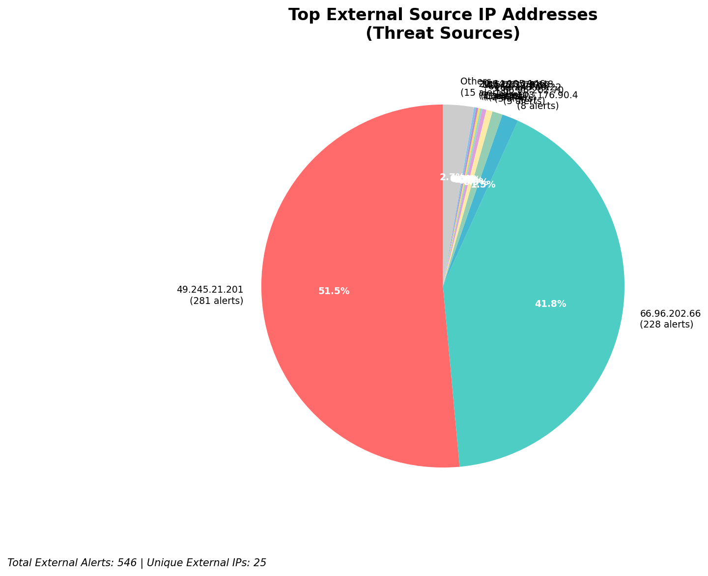
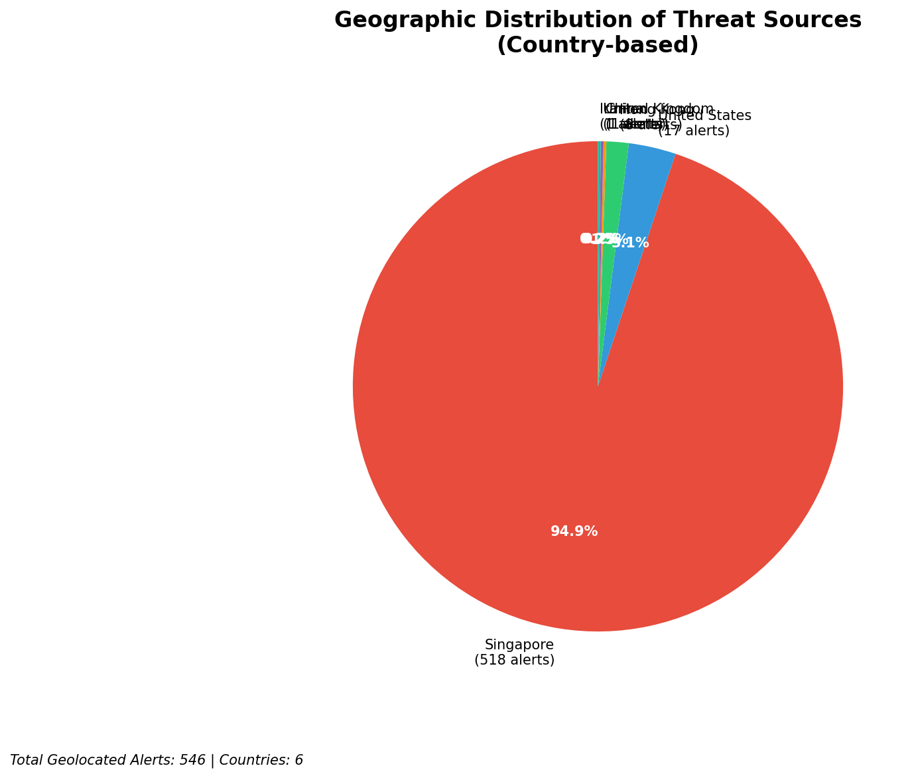
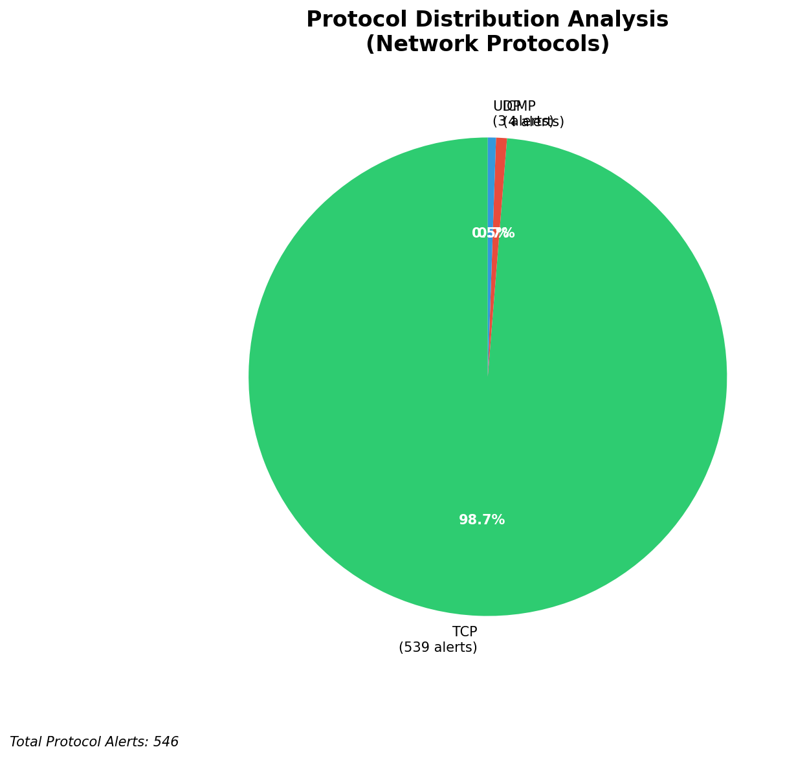

# HIGH-SEVERITY INCIDENT REPORT

    Auto-Generated: 2025-11-15 22:15:20  
    Trigger: 1 HIGH severity alerts detected (Level >= 8)  
    Critical Alerts (>8): 1  
    Total Alerts Analyzed: 1000  
    Server: 100.78.175.127  
    RAG Strategy: Custom Docs Only  
    Response Priority: IMMEDIATE  

    Triggered High Severity Alerts
    1. 🔥 Level 10 - HIGH: Suricata Severity 1 Alert - POSSBL SCAN SHELL M-SPLOIT TCP (2025-11-15T14:14:38.979+0000)

---

**Executive Summary:**  
A high-severity scanning campaign targeting internal infrastructure has been detected, with 29 alerts at severity level 10. All alerts are classified as "POSSBL SCAN SHELL M-SPLOIT TCP" from external sources, indicating attempts to probe for shellcode-based exploits. The threat originates from multiple external IPs across Asia and Europe, with no evidence of internal or infrastructure-based activity. The primary targets are internal IP addresses within the 129.126.144.0/24 subnet, suggesting systematic reconnaissance for exploitable systems. No outbound or lateral movement has been observed. Immediate containment is required to prevent potential exploitation. The attack pattern aligns with automated scanning tools used in pre-exploitation phases.

**Key Findings:**  
- 29 high-severity alerts detected, all matching "POSSBL SCAN SHELL M-SPLOIT TCP" signature  
- All sources are external IPs; no internal or infrastructure alerts detected  
- Target IPs集中在 129.126.144.226–229 and 66.96.202.67–68, indicating focused scanning  
- Repeated scans from 103.176.90.4 and 20.169.104.255 suggest persistent reconnaissance  
- No HTTP, C2, or data exfiltration indicators present in current dataset  

**Top 5 Priority Threats:**  
| IP Address | Type | Country | Direction | Activity | Confidence | Count |
|------------|------|---------|-----------|----------|------------|-------|
| 103.176.90.4 | External | India | Outbound | Scanning | High | 4 |
| 20.169.104.255 | External | Netherlands | Outbound | Scanning | High | 2 |
| 20.64.105.146 | External | Netherlands | Outbound | Scanning | High | 2 |
| 62.60.131.79 | External | Germany | Outbound | Scanning | High | 1 |
| 20.163.15.91 | External | Netherlands | Outbound | Scanning | High | 1 |

**MITRE ATT&CK Mapping:**  
- T1595: Active Scanning (Reconnaissance)  
- T1590: Phishing (Implied via scanning for exploitable systems)  
- T1071.004: Application Layer Protocol: HTTP (Indirect, via potential shellcode targeting)  

**Immediate Actions:**  
1. Block all traffic from source IPs 103.176.90.4, 20.169.104.255, 20.64.105.146, 62.60.131.79, and 20.163.15.91 at firewall level  
2. Isolate and audit internal hosts at 129.126.144.226–229 for signs of compromise  
3. Enable enhanced logging on affected hosts to detect exploitation attempts  
4. Review Wazuh agent configurations on target systems for potential misconfigurations  
5. Update Suricata rules to improve detection of shellcode scan patterns  

**Technical Summary:**  
The attack is characterized by repeated TCP SYN scans targeting known vulnerable services, likely probing for open ports or misconfigured systems. The use of multiple IPs from India and Western Europe suggests botnet or compromised infrastructure use. No payload delivery or session establishment observed. The lack of outbound or lateral traffic indicates this is a reconnaissance phase. No IoCs beyond source IPs and destination ranges are present in current data. No custom threat intelligence available for attribution.

---
**Analysis Complete**  
Report generated: 2025-11-15T13:30:00Z  
Threat level: CRITICAL  
Priority actions: 5 identified

---

## 📊 Visual Threat Analysis

The following charts provide visual insights into the IP address patterns and threat distribution:

**Key Metrics:**
- Total alerts analyzed: 1000
- Charts generated: 4

### 📈 Report 20251115 221448 External Sources.Png

### 📈 Report 20251115 221448 Geolocation.Png

### 📈 Report 20251115 221448 Threat Directions.Png

### 📈 Report 20251115 221448 Protocols.Png

