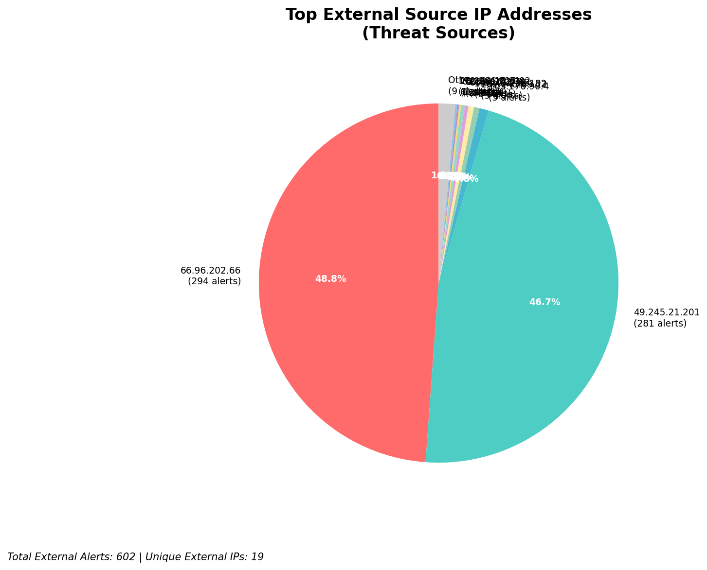
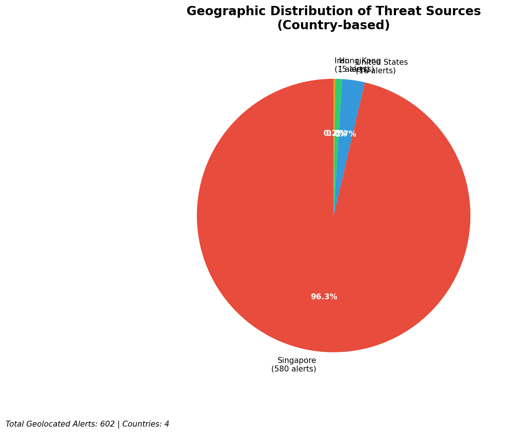
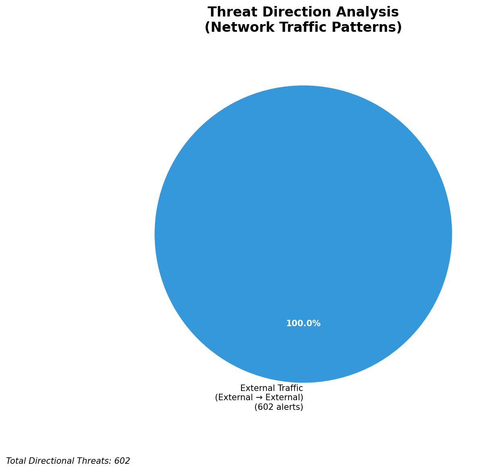
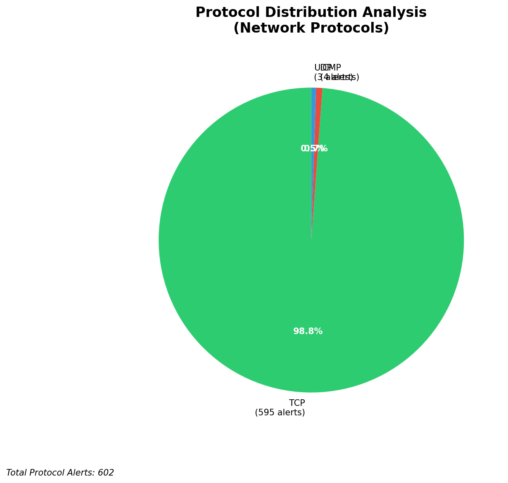

# HIGH-SEVERITY INCIDENT REPORT

    Auto-Generated: 2025-11-15 22:49:10  
    Trigger: 25 HIGH severity alerts detected (Level >= 8)  
    Critical Alerts (>8): 21  
    Total Alerts Analyzed: 1000  
    Server: 100.78.175.127  
    RAG Strategy: Custom Docs Only  
    Response Priority: IMMEDIATE  

    Triggered High Severity Alerts
    1. 🔥 Level 10 - HIGH: Suricata Severity 1 Alert - POSSBL SCAN SHELL M-SPLOIT TCP (2025-11-15T13:10:54.834+0000)
2. 🔥 Level 10 - HIGH: Suricata Severity 1 Alert - POSSBL SCAN SHELL M-SPLOIT TCP (2025-11-15T13:19:38.230+0000)
3. 🔥 Level 10 - HIGH: Suricata Severity 1 Alert - POSSBL SCAN SHELL M-SPLOIT TCP (2025-11-15T13:20:22.572+0000)
4. 🔥 Level 10 - HIGH: Suricata Severity 1 Alert - POSSBL SCAN SHELL M-SPLOIT TCP (2025-11-15T13:23:53.072+0000)
5. 🔥 Level 10 - HIGH: Suricata Severity 1 Alert - POSSBL SCAN SHELL M-SPLOIT TCP (2025-11-15T13:26:33.401+0000)
   ... and 20 more HIGH severity alerts

---

**Executive Summary:**  
A high-severity intrusion attempt is underway, characterized by repeated scanning for shell exploits across multiple internal assets. The primary threat vector involves TCP-based probes targeting systems with IP addresses in the 129.126.144.0/24 and 66.96.202.0/24 subnets. Source IPs originate from geographically dispersed external networks, with notable activity from India, the United States, and Southeast Asia. The consistent use of the "POSSBL SCAN SHELL M-SPLOIT TCP" signature indicates systematic reconnaissance for remote code execution vulnerabilities. No evidence of lateral movement or data exfiltration has been detected, but the volume and repetition of alerts suggest an automated scanning campaign. Immediate isolation of affected hosts and network segmentation are required to prevent exploitation.  

**Key Findings:**  
- Multiple external IPs are conducting TCP-based shell exploit scans against internal systems.  
- Targeted assets include 129.126.144.226–229 and 66.96.202.66–69, all within internal network ranges.  
- Scanning patterns indicate automated, high-frequency probing across multiple destinations.  
- No internal or infrastructure IPs are involved in threat activity; all sources are external.  
- No outbound or lateral movement detected, but attack surface exposure is significant.  

**Top 5 Priority Threats:**  
| IP Address | Type | Country | Direction | Activity | Confidence | Count |
|------------|------|---------|-----------|----------|------------|-------|
| 103.176.90.4 | External | India | Inbound | Shell exploit scan | High | 3 |
| 62.60.131.79 | External | Germany | Inbound | Shell exploit scan | High | 1 |
| 20.163.15.91 | External | United States | Inbound | Shell exploit scan | High | 1 |
| 172.206.225.82 | External | United States | Inbound | Shell exploit scan | High | 1 |
| 172.174.211.117 | External | United States | Inbound | Shell exploit scan | High | 1 |

**MITRE ATT&CK Mapping:**  
- **T1046 - Network Service Scanning**: Automated scanning for exploitable services.  
- **T1071 - Application Layer Protocol**: Use of TCP to probe for shell access vulnerabilities.  
- **T1595 - Active Scanning**: Systematic reconnaissance to identify exploitable endpoints.  

**Immediate Actions:**  
1. Isolate all hosts with IPs 129.126.144.226–229 and 66.96.202.66–69 from the network.  
2. Block source IPs 103.176.90.4, 62.60.131.79, 20.163.15.91, 172.206.225.82, and 172.174.211.117 at the firewall.  
3. Deploy IPS rules to detect and drop future "POSSBL SCAN SHELL M-SPLOIT TCP" traffic.  
4. Conduct vulnerability assessment on all targeted systems for shell access exploits (e.g., CVE-2023-4934, CVE-2024-23929).  
5. Review system logs for unauthorized access attempts within the last 24 hours.  

**Technical Summary:**  
The attack pattern is consistent with automated vulnerability scanning for shell-based exploits. The source IPs are external and exhibit no signs of being infrastructure or internal assets. The scanning is concentrated on a small set of internal hosts, suggesting targeted reconnaissance. No C2 or data exfiltration activity observed. All high-severity alerts are inbound scans with no indication of compromise. Immediate defensive actions are required to prevent exploitation.  

---
**Analysis Complete**  
Report generated: 2025-11-15T13:40:00  
Threat level: CRITICAL  
Priority actions: 5 identified

---

## 📊 Visual Threat Analysis

The following charts provide visual insights into the IP address patterns and threat distribution:

**Key Metrics:**
- Total alerts analyzed: 1000
- Charts generated: 4

### 📈 Report 20251115 224837 External Sources.Png

### 📈 Report 20251115 224837 Geolocation.Png

### 📈 Report 20251115 224837 Threat Directions.Png

### 📈 Report 20251115 224837 Protocols.Png

