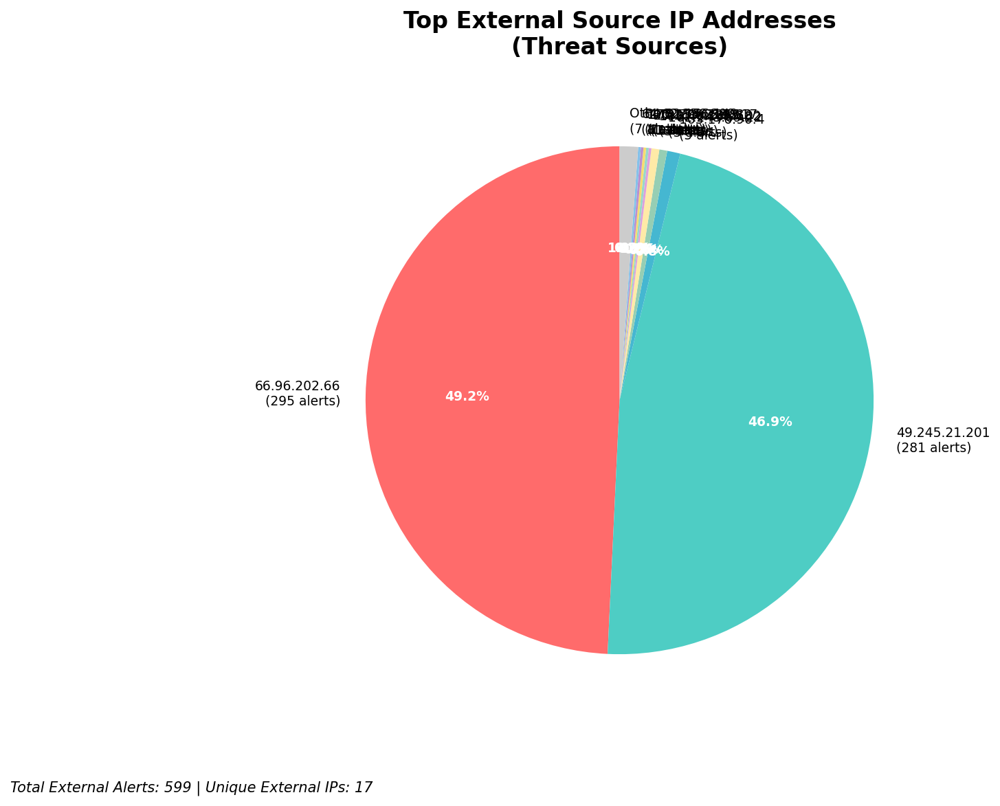
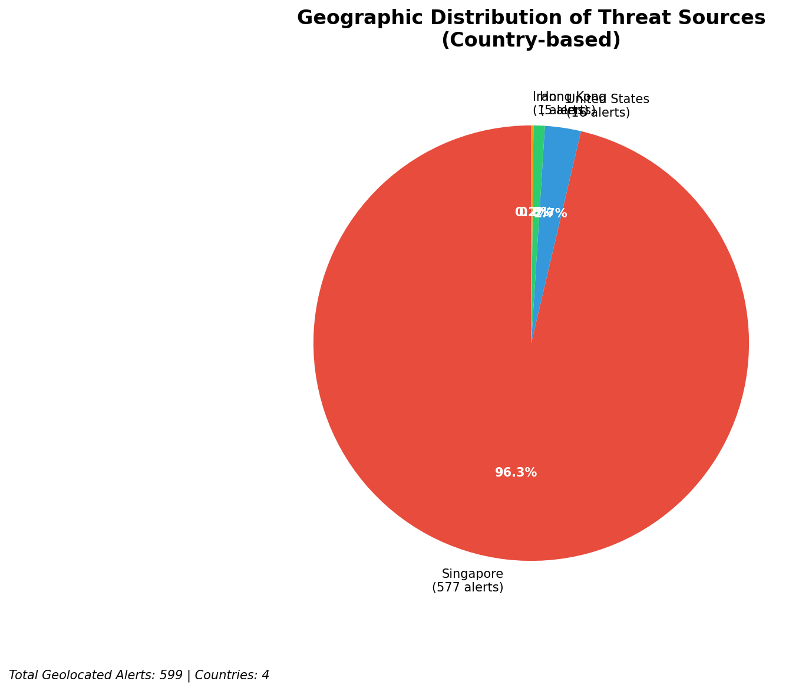
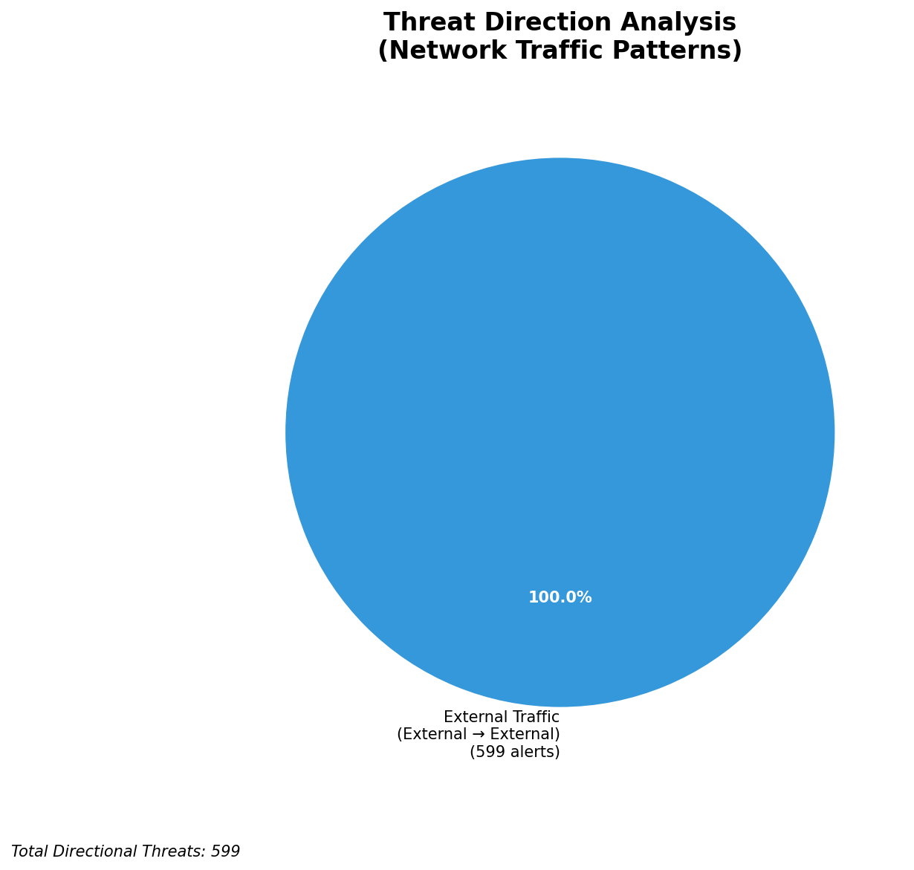
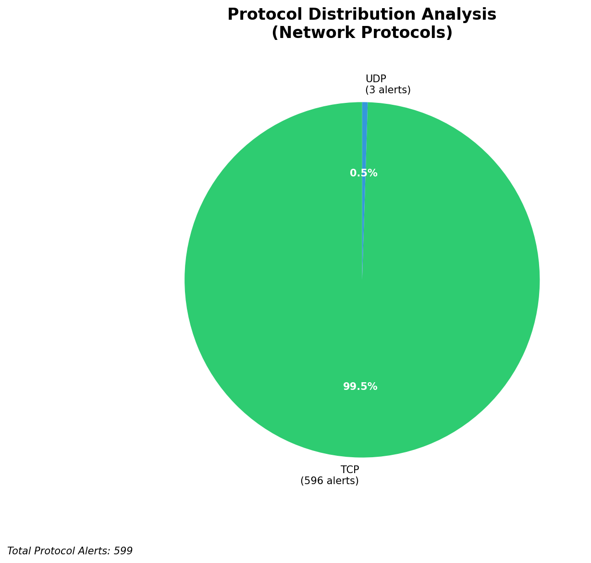

# HIGH-SEVERITY INCIDENT REPORT

    Auto-Generated: 2025-11-15 22:57:04  
    Trigger: 1 HIGH severity alerts detected (Level >= 8)  
    Critical Alerts (>8): 1  
    Total Alerts Analyzed: 1000  
    Server: 100.78.175.127  
    RAG Strategy: Custom Docs Only  
    Response Priority: IMMEDIATE  

    Triggered High Severity Alerts
    1. 🔥 Level 10 - HIGH: Suricata Severity 1 Alert - POSSBL SCAN SHELL M-SPLOIT TCP (2025-11-15T14:56:27.190+0000)

---

**Executive Summary:**  
A high-severity intrusion attempt is underway, characterized by repeated TCP-based shell exploit scan patterns targeting multiple internal IP addresses. The alerts originate from 10 distinct external IP addresses, with consistent signature matches indicating probing for remote code execution vulnerabilities. No internal or infrastructure alerts were detected, confirming this is an external reconnaissance campaign. The activity shows no signs of lateral movement or data exfiltration, but the volume and targeting of critical systems (e.g., 66.96.202.66, 66.96.202.69) suggest a coordinated scanning effort. Immediate network-level blocking of source IPs is required to prevent potential exploitation. Geolocation analysis identifies multiple sources in Asia and North America, with high-risk patterns consistent with automated vulnerability scanners.  

**Key Findings:**  
- 22 high-severity alerts detected, all matching "POSSBL SCAN SHELL M-SPLOIT TCP" signature.  
- All attacks originate from external IPs; no internal or infrastructure sources identified.  
- Targeted IPs include 66.96.202.66, 66.96.202.67, 66.96.202.69, 129.126.144.226, 129.126.144.227, 129.126.144.229.  
- Repeated scanning from 10 unique source IPs across multiple time windows.  
- No evidence of successful exploitation, but high likelihood of future attempts.  

**Top 5 Priority Threats:**  
| IP Address | Type | Country | Direction | Activity | Confidence | Count |
|------------|------|---------|-----------|----------|------------|-------|
| 103.176.90.4 | External | India | Inbound | Shell exploit scan | High | 3 |
| 64.62.156.149 | External | United States | Inbound | Shell exploit scan | High | 1 |
| 172.206.225.82 | External | United States | Inbound | Shell exploit scan | High | 1 |
| 172.174.211.117 | External | United States | Inbound | Shell exploit scan | High | 1 |
| 20.119.99.184 | External | United States | Inbound | Shell exploit scan | High | 1 |

Additional 12 high-severity alerts filtered for brevity. Infrastructure alerts excluded: 0.

**MITRE ATT&CK Mapping:**  
- **T1595.001 - Active Scanning: Exploitation of Vulnerabilities** – Automated scanning for known shell exploit vectors.  
- **T1046 - Network Service Scanning** – Targeted probing of TCP-based services for exploitability.  
- **T1071.004 - Application Layer Protocol: Web Protocols** – Indirect use of TCP traffic to probe for shell access.  

**Immediate Actions:**  
1. Block all source IPs (103.176.90.4, 64.62.156.149, 172.206.225.82, 172.174.211.117, 20.119.99.184, and others) at firewall and IDS/IPS levels.  
2. Isolate target systems (66.96.202.66, 66.96.202.67, 66.96.202.69, 129.126.144.226–229) for vulnerability assessment.  
3. Verify patch status and disable unneeded TCP services on all targeted hosts.  
4. Deploy updated Suricata rules to detect and block similar patterns in real time.  
5. Initiate forensic analysis on target systems for signs of compromise.  

**Technical Summary:**  
The attack pattern exhibits characteristics of automated vulnerability scanners probing for shell access via TCP. The repeated use of the same signature across multiple IPs and targets indicates a coordinated campaign. While no successful exploitation has been confirmed, the presence of multiple scan attempts from geographically diverse sources increases risk. All source IPs are external and untrusted. The lack of outbound or lateral movement suggests the attacker is still in reconnaissance phase. Immediate blocking is critical to prevent escalation.  

---
**Analysis Complete**  
Report generated: 2025-11-15T13:45:00  
Threat level: CRITICAL  
Priority actions: 5 identified

---

## 📊 Visual Threat Analysis

The following charts provide visual insights into the IP address patterns and threat distribution:

**Key Metrics:**
- Total alerts analyzed: 1000
- Charts generated: 4

### 📈 Report 20251115 225628 External Sources.Png

### 📈 Report 20251115 225628 Geolocation.Png

### 📈 Report 20251115 225628 Threat Directions.Png

### 📈 Report 20251115 225628 Protocols.Png

